# Тахь — Дэлгэцийн спекүүд (S1–S33)

> **Нэгтгэсэн эх баримт.** Эх файлууд: `docs/design/screens/00-style.md`,
> `01-onboarding-home.md`, `02-passenger.md`, `03-active-trip.md`, `04-driver.md`,
> `05-taximeter.md`, `06-call-safety-settings.md`, `07-dialog-splash.md`.
> Бүрэн эсэхийг `docs/design/UI_SURFACES.md`-тэй тулгаж шалгасан (доод талын «ДУТУУ» хэсэг).
> Код унших огноо: 2026-07-25, branch `fix/navigation-back`.

---

## 1. Оршил

**Энэ баримтыг юунд ашиглах вэ.** Дэлгэц бүрийн доор `Stitch prompt` гэсэн код-блок байгаа.
Түүнийг **бүтнээр нь хуулж Google Stitch-д тавихад** тухайн дэлгэцийн дизайн гарна.
Prompt бүр өөрөө бие даасан: хажуугийн тайлбарыг уншаагүй ч ажиллана, учир нь §2-ын
STYLE PREAMBLE prompt тус бүрийн эхэнд аль хэдийн бүтнээр орсон байгаа. Нэмж юу ч бичих
шаардлагагүй.

**Хэмжээ.**

| Юу | Тоо |
|---|---|
| Дугаарлагдсан дэлгэц | **33** (S1–S33) |
| Нэмэлт давхарга (тусдаа route биш) | **1** (S14a — үнийн санал илгээх цонх) |
| Нийт спек нэгж | **34** |
| Stitch prompt-ын нийт тоо | **45** (зарим дэлгэц үүрэг/төлөв бүрээр 2–5 prompt-той: S10, S12, S13 — зорчигч/жолооч; S23 — A–E таван төлөв; S32 — A–D дөрөв; S33 — гэрэл/харанхуй хоёр) |

> **S32 ба S33 тухай.** S32 (модал баталгаажуулах диалог) бол route **биш** — долоон өөр
> дэлгэц дээр давхарлагдах **дундын давхарга**; S33 (эхлэлийн дэлгэц) нь эхний жинхэнэ дэлгэц
> гартал барих **эхлэлийн гадаргуу**. Хоёулаа өөрийн `### S…` хэсэг, өөрийн prompt-той тул
> дугаарлагдсан дэлгэцэд тоологдов — §4.7 үз.

**Хэрхэн унших вэ.**

1. Хамгийн ард байгаа **Хавсралт А**-гийн хүснэгтээс хайж буй дэлгэцээ ол (S дугаар + нэр + нэг мөрийн тайлбар).
2. §3-ын **навигацийн зураглал**-аас тэр дэлгэц рүү хаанаас ордог, хаашаа гардгийг хар.
3. Тухайн `### S<дугаар>` хэсэг рүү оч. Бүтэц нь үргэлж ижил:
   **Файл → Зорилго → Хаанаас ирнэ → Агуулга → Үйлдэл ба шилжилтийн хүснэгт → Төлөвүүд → Stitch prompt.**
4. Prompt-ыг хуулж Stitch-д тавь. Дизайн гармагц §2-ын §9 «Хориотой зүйлс»-ийн жагсаалтаар шалга.

**Хэлний дүрэм.** Хэрэглэгчид харагдах монгол текст бүрийг `app/lib/l10n/app_mn.arb`-аас
**яг байгаагаар нь** авсан бөгөөд l10n түлхүүрийг хажууд нь бичсэн. `arb`-д байхгүй текстийг
**«(шинэ)»** гэж тэмдэглэсэн — тийм газарт үг зохиогоогүй, зөвхөн байрлал, хэмжээг зааж өгсөн
(зарим prompt-д `———` орлуулагчаар). Тайлбар нь монгол, Stitch prompt нь англи (Stitch англиар
илүү сайн ойлгодог), гэхдээ prompt дотор **харагдах бүх шошго монгол кириллээр** бичигдсэн.

**Навигацийн зорилтот төлөв (бүх дэлгэцэд хамаарах дөрвөн дүрэм).**

1. `push`-аар нээгдсэн **дэлгэц бүр** AppBar-т ил буцах сумтай, хүрэлтийн талбай **48dp**.
2. Олон алхамт урсгал (зорчигчийн 3 алхам, таксиметрийн тариф↔тоолуур, жолоочийн S14→S15)
   **өмнөх алхам руугаа буцаж чадна** — бүтэн хуудаснаас гарахгүй, оруулсан өгөгдөл хадгалагдана.
3. **Идэвхтэй аялал** болон **ажиллаж буй таксиметр**-ээс гарахад заавал баталгаажуулах диалог
   (`ConfirmLeaveScope`). Аялал төлбөрөө барагдуулж дууссаны дараа (`onTripSettled`) хамгаалалт
   унтарч, диалог гарахаа болино.
4. **AppBar-ийн буцах сумны tooltip нь ЗОРИЛТОТ, одоо байгаа зүйл БИШ.** Кодод ямар ч
   `AppBar`-т `leading` буюу буцах товчны tooltip заагаагүй — Flutter өөрөө `BackButton`
   тавьж, tooltip-оо `MaterialLocalizations.backButtonTooltip`-оос авдаг. `backAction`
   түлхүүр аппад **ганцхан** газар хэрэглэгддэг: `passenger_ride_page.dart` → `_BackStepButton`
   (биен доторх хоёрдогч товч). Тиймээс дэлгэцийн хүснэгтүүдэд AppBar-ийн
   сумыг «`backAction`, **зорилтот** tooltip» гэж бичсэн.

**Эх кодын лавлагаа — мөрийн дугаараар БИШ, символын нэрээр.** Энэ баримт эх кодын аль ч
хэсгийг «файлын зам → символын нэр» хэлбэрээр заана, жишээ нь
`app/lib/ride/passenger_ride_page.dart` → `_LocationStep`. Мөрийн дугаар код засах бүрд
гулсдаг тул огт хэрэглээгүй. Тухайн кодыг олохдоо **нэрээр нь хай** — жишээ нь
`grep -n "class _LocationStep" app/lib/ride/passenger_ride_page.dart`, эсвэл засварлагчийнхаа
«Go to symbol». Символ нь класс, метод, талбар, enum утга, эсвэл дээрх бүхнийг агуулагч нэр
байна; нэртэй символгүй байрлалыг «агуулагч символ + юуг зааж байгаа нь» гэж бичсэн (жишээ нь
`_OffersStep.build`-ийн `ListTile` мөр). Бүх хосыг `tools/check_spec_symbols.py` автоматаар
шалгадаг — баримтыг өөрчилсний дараа түүнийг ажиллуулна. Тэр шалгагч нь мөр-дугаарын хэлбэр
рүү **буцахыг ч хориглоно**: `файл.өргөтгөл:мөр` гэсэн ямар ч код-span байвал унана (Хавсралт Б.4).

---

## 2. Стилийн чиглэл + STYLE PREAMBLE

> Доорх бүхэл хэсэг нь `00-style.md`-ээс бүтнээр орсон. Доторх **«2. STYLE PREAMBLE»** нь энэ
> баримт дахь **45 prompt бүрийн эхний догол мөр** — нэг удаа уншаад, цаашид prompt бүрд
> давтагдаж байгааг мэдэж байхад хангалттай. Prompt-ын урт хязгаарлагдвал preamble-ийг
> **хэзээ ч богиносгохгүй**, дэлгэцийн тайлбарыг богиносгоно.
>
> ⚠️ Энэ хэсгийн дотоод дугаарлалт (**1–9**) нь `00-style.md`-ийнх хэвээр үлдсэн: дэлгэцийн
> тайлбарууд дотор тааралдах «§3» (өнгө/контраст), «§5» (зай, радиус), «§7» (хөдөлгөөн),
> «§9» (хориотой зүйлс) гэсэн лавлагаанууд яг эдгээрийг заана.

> Энэ файл бол **бүх дэлгэцийн Stitch prompt-ын нэгдсэн эх**.
> Дэлгэц бүрийн prompt нь доорх §2-ын STYLE PREAMBLE-ээр **бүтнээр, үг үсэггүй өөрчлөлтгүй** эхэлнэ.
>
> Эх сурвалж: `brand/BRAND.md`, `app/lib/theme/takhi_theme.dart`, `docs/design/UI_SURFACES.md`,
> ECC `web/design-quality.md` (anti-template дүрэм).
>
> **Хэлний дүрэм (дараагийн агентуудад):** хэрэглэгчид харагдах монгол текстийг ЗОХИОХГҮЙ.
> `app/lib/l10n/app_mn.arb`-аас яг байгаа мөрийг авч, l10n түлхүүрийг хамт бичнэ.
> Тухайн текст arb-д байхгүй бол «(шинэ)» гэж тэмдэглэнэ.

---

### 1. Стилийн чиглэл — **«Талын хэвлэмэл» / `steppe-print`**

Warm brutalist + editorial хосолсон тодорхой чиглэл. Дүрслэлийн лавлагаа нь SaaS апп биш:
**хээрийн гарын авлагын хэвлэмэл хуудас, паалантай төмөр хаяг, тасалбарын хэвлэл, тамга.**

Гурван бодит зарчим:

1. **Суурь нь цаас, дэлгэц биш.** Дэвсгэр хэзээ ч цагаан (`#FFFFFF`) биш — дулаан `#F4F1E9`.
   Харанхуйд ч хар (`#000000`) биш — `#211E19`.
2. **Гүн нь сүүдрээс биш, давхцалаас.** Blur, soft shadow, elevation, glass, gradient — **байхгүй**.
   Оронд нь: хавтгай блокууд давхцана, ink зураас (1px нимгэн / 3px бүдүүн) бүтцийг **харуулна**,
   өргөгдсөн гадаргуу доороо **3px хатуу ink шилжилт** (offset) үлдээнэ — хэвлэлийн misregistration шиг.
3. **Gold бол чимэглэл биш, бүтэц.** `#C99A3C` нь жижиг цэг/дүрс биш — **бүтэн талбай дүүргэнэ**,
   тэр талбай дээр ink текст сууна. (Техникийн шалтгаан §3-т: gold нь paper дээр 2.28:1 — текстэнд огт тэнцэхгүй.)

#### Яагаад энэ нь Тахийн утгад тохирох вэ

Тахь бол дэлхийн цорын ганц **хэзээ ч гаршуулагдаагүй** адуу — гэрийн амьтны зөөлөн, гөлгөр дүр төрх түүнд байхгүй,
тиймээс UI нь ч зөөлөн бөөрөнхий, гялгар, эелдэг «бүтээгдэхүүн» шиг харагдаж болохгүй: хатуу ирмэг, ил бүтэц,
чамирхалгүй хэвлэлийн мэдрэмж нь брэндийн мөн чанарын шууд орчуулга.
Брэнд өөрөө **эзэнгүй, нийтийн өмч** учир интерфэйс нь компанийн танилцуулга биш, **нийтийн хэрэглээний хэрэгсэл**
байх ёстой — тиймээс ятгах давхарга (marketing banner, upsell, gloss, mascot) огт байхгүй, зөвхөн баримт:
хэдэн төгрөг, хэдэн км, хэдэн минут, хэн жолоодож байна.
Дулаан цаас, шаргал, ink гурав нь монгол талын бодит зүсийг (хатсан өвс, тахийн зүс, сүүдэр) авчирдаг ба
premium-earthy өнгө аяс нь хямд «үнэгүй апп» гэсэн мэдрэмжийг зайлуулна.

#### Uber / Bolt / QGO-оос юугаараа ялгарах

| Талбар | Түгээмэл такси-апп | Тахь (`steppe-print`) |
|---|---|---|
| Суурь | Хүйтэн цагаан / цэвэр хар, саарал | Дулаан цаас `#F4F1E9` / дулаан ink `#211E19` |
| Гүн | Зөөлөн сүүдэр, elevation, blur | Хавтгай блок + хатуу 3px offset + ink зураас |
| Радиус | Бүх зүйл ижил 8–12px, бүх зүйл pill | **Санаатай холимог**: товч 14, карт 4, pill бүтэн дугуй |
| Өнгө | 1 accent өнгө маш бага, бусад нь саарал | Gold бүтэн талбай дүүргэнэ, steppe/улаан нь **семантик** |
| Типографи | Нимгэн, жижиг, эелдэг | Өргөн, зузаан гарчиг + **асар том tabular тоо** |
| Газрын зураг | Ханасан бус саарал tile | Дулаан цаасан tile, ink зам, gold маршрут |
| Мэдрэмж | Корпорацийн бүтээгдэхүүн | Хээрийн гарын авлага / паалантай хаяг / нийтийн хэрэгсэл |
| Брэнд | Chrome дотор алга болно | Бүтцийн нэг хэсэг — gold блок, ink зураас нь өөрөө брэнд |

---

### 2. STYLE PREAMBLE

**Дэлгэц бүрийн Stitch prompt-ын эхэнд ЯГ ЭНЭ ТЕКСТИЙГ бүтнээр тавина.** Дараа нь дэлгэцийн
тайлбар **үргэлж ижил гурван хэсгээр** үргэлжилнэ:

1. `SCREEN — Android mobile app screen: …` — энэ дэлгэц юу вэ, хэн, юуны тулд.
   (Ганц үл хамаарах нь S26 — тэр нь апп биш вэб тул `PAGE — …` гэж эхэлнэ.)
2. `MAIN ACTION — …` — **гол үйлдлийн товч**: өнгө, радиус, шошго, байрлал бүтнээр.
   Stitch урт prompt-ын **сүүлийн** өгүүлбэрүүдийг гээдэг тул гол товчийг зөвхөн ард
   үлдээхгүй, эхний тэнхлэгт бичнэ; layout дотор дахин дурдагдаж болно.
3. Layout — дээрээс доош: app bar → бие → доод хэсэг; шаардлагатай бол «Second frame»
   гэж хоосон/өөр төлөвийг нэмнэ.

**Урт:** preamble-ээс хойших тайлбар **220 үгээс хэтрэхгүй** (одоо 170–220, дунджаар ~212).
Blur / shadow / gradient хориглох өгүүлбэр preamble дотор аль хэдийн байгаа тул дэлгэцийн
тайлбарт **давтахгүй**.

```
STYLE — Тахь (Takhi), a Mongolian open-source taxi app. Direction: steppe-print — warm
brutalist, printed-field-manual, never corporate. Ground is warm paper #F4F1E9 (dark mode
#211E19), raised surfaces #E7DEC9, all text and structure near-black ink #1C1A16. Gold
#C99A3C (deep #A67C28) is a structural FILL, never a small accent — gold blocks carry ink
text on them. Steppe green #2E6E5E means live/confirmed; red #9E3327 means danger only.
Depth comes from flat overlapping blocks, 1px hairline and 3px heavy ink rules, and hard
3px solid ink offsets — no blur, no soft shadow, no gradient, no glassmorphism. Typography
is Cyrillic-complete and every visible label is Mongolian Cyrillic: wide heavy display
headings with tight tracking, calm readable body sans, and huge tabular numerals for money,
distance and time. Radius is deliberately mixed: 14px action buttons, 4px cards, fully
round status pills. Spacing is generous and unequal; touch targets are large.
```

*(146 үг. Хэрэв prompt-ын урт хязгаарлагдвал энэ preamble-ийг богиносгохгүй — дэлгэцийн
тайлбарыг богиносго.)*

---

### 3. Өнгө ба контраст

#### Токенууд (`app/lib/theme/takhi_theme.dart`-д бодитоор байгаа)

| Токен | Hex | Үүрэг |
|---|---|---|
| `gold` | `#C99A3C` | Үндсэн дүүргэлт, primary товч, маршрут, брэнд талбай |
| `goldDeep` | `#A67C28` | Gold-ийн pressed төлөв, ирмэг, гүн |
| `ink` | `#1C1A16` | Бүх текст, зураас, бүтэц, gold дээрх текст |
| `steppe` | `#2E6E5E` | Семантик: амьд / баталгаажсан / холбогдсон / OK |
| `paper` | `#F4F1E9` | Цайвар суурь (ground) |
| `sand` | `#E7DEC9` | Өргөгдсөн гадаргуу (card, sheet) — зөвхөн цайван дээр |
| `error` | `#9E3327` | Аюул — зөвхөн цайван суурин дээр |
| `errorDark` | `#E18579` | Аюул — зөвхөн харанхуй суурин дээр |
| dark surface | `#211E19` | Харанхуй ground |

#### ⚠️ Хатуу контрастын дүрмүүд (бодит тооцоо)

Эдгээрийг зөрчих нь энэ төслийн хамгийн олон давтагдах алдаа болно — тиймээс тоогоор нь бичив:

| Хослол | Харьцаа | Дүгнэлт |
|---|---|---|
| ink `#1C1A16` дээр paper | **15.4 : 1** | ✅ Үндсэн текстийн хослол |
| ink дээр sand | **13.0 : 1** | ✅ Картан дээрх текст |
| ink дээр gold | **6.8 : 1** | ✅ Gold товч дээрх шошго |
| steppe дээр paper | **5.3 : 1** | ✅ Цайван дээр текст болно |
| **gold дээр paper** | **2.28 : 1** | ❌ **ХОРИОТОЙ.** Gold нь цайван суурин дээр ТЕКСТ болж хэзээ ч болохгүй — зөвхөн дүүргэлт |
| **steppe дээр dark** | **2.77 : 1** | ❌ Харанхуйд steppe-г шууд бүү хэрэглэ (доорх санал үз) |
| gold дээр dark `#211E19` | **6.5 : 1** | ✅ Харанхуйд gold нь ТЕКСТ болж болно |
| paper дээр dark | **14.7 : 1** | ✅ Харанхуйн үндсэн текст |

**Гол асимметр дүрэм:** `gold` нь **цайван дээр дүүргэлт, харанхуй дээр текст**. Хэзээ ч эсрэгээр биш.

#### Санал болгож буй шинэ токенууд *(одоо theme-д БАЙХГҮЙ — код бичих агент нэмнэ)*

| Санал | Hex | Шалтгаан |
|---|---|---|
| `steppeLight` | `#4E9E88` | Харанхуйд steppe-г орлоно — dark ground дээр **5.2 : 1** |
| `surfaceDark` | `#2C2822` | Харанхуйн өргөгдсөн гадаргуу (sand-ийн харанхуй хос) — ground-ээс **1.13 : 1** зөөлөн шат |

---

### 4. Типографи — 3 үүрэг

Одоогийн бодит байдал: зөвхөн **NotoSans** bundled (`assets/fonts/`, кирилл бүрэн).
BRAND.md-д «wordmark-ийн жинхэнэ фонт» дутуу гэж тэмдэглэсэн хэвээр.
Тиймээс **гурван үүргийг нэг гэр бүлээр, гэхдээ туйлын контрастаар** гүйцэтгэнэ —
жин, хэмжээ, tracking гурвыг л ялгана. Энэ нь түр биш, ажиллах шийдэл.

| Үүрэг | Гүйцэтгэл | Хэмжээ (заавар) |
|---|---|---|
| **Display / гарчиг** | NotoSans ExtraBold/Black, tracking чангатгасан (−0.01em), богино мөр | 28–40sp |
| **Body / их бие** | NotoSans Regular 400 / Medium 500, line-height 1.45 | 15–17sp |
| **Numeric / тоо** | NotoSans, **tabular figures заавал** (`FontFeature.tabularFigures()`) | 20sp → таксиметрт **72–96sp** |
| **Micro / шошго** | NotoSans SemiBold, ЖИЖИГ ТОМ ҮСЭГ, tracking **+0.06em** | 11–12sp |

**Кирилл дүрэм:** том үсгээр бичсэн кирилл шошго (ЖИШЭЭ) tracking нэмэхгүй бол зуурч уншигдана —
`+0.06em`-ээс бага байж болохгүй. Урт кирилл үг латинаас 15–20% өргөн тул товчны шошго
**хоёр мөр болох магадлалыг үргэлж тооцно** (товч тогтмол өндөртэй биш, min-height-тэй байна).

Хожим display фонт нэмэх бол: Clash Display / Space Grotesk маягийн geometric, өргөн, кирилл бүрэн face.

---

### 5. Зай, радиус, зураас, хүрэлт

**Зайн шат (4px суурьтай, гэхдээ санаатай ЖИГД БУС):**
`4 · 8 · 12 · 20 · 32 · 56`. Хэсэг доторх зай жижиг (8/12), хэсэг хоорондын зай том (32/56).
Бүх талд ижил padding тавихыг **хоригло** — энэ бол «template» гэж танигдах гол шинж.

**Радиус (санаатай холимог — энэ бол гарын үсэг):**

| Элемент | Радиус |
|---|---|
| Primary/secondary/danger товч | **14px** (`primary_button.dart`-д аль хэдийн байгаа) |
| Surface card, list row | **4px** — бараг дөрвөлжин, хэвлэмэл картын мэдрэмж |
| Status pill | бүтэн дугуй (`999px`) |
| Bottom sheet | зөвхөн дээд хоёр өнцөг **20px** |
| Input field | **4px** (картын хэмнэлтэй нийцнэ) |
| Газрын зураг дээрх floating блок | **4px** |

**Зураасын жин:** нимгэн `1px ink @ 20% alpha` (жагсаалтын хуваалт),
бүдүүн `3px ink @ 100%` (хэсэг тусгаарлах, идэвхтэй төлөв, гарчгийн доогуур).
Гурав дахь жин байхгүй.

**Хүрэлтийн талбай:** хамгийн бага **48×48dp**. Таксиметр болон SOS дээр **64dp-ээс багагүй**.
Жолооч жолоо барьж байхдаа хардаг ямар ч элемент 56dp-ээс жижиг байж болохгүй.

---

### 6. Компонентын толь бичиг

Дараагийн агентууд Stitch prompt дотор **яг эдгээр нэр томьёог** ашиглана.
Баруун баганын англи өгүүлбэрийг prompt руу шууд хуулж болно.

| Нэр | Тодорхойлолт (монгол) | Prompt-д бичих англи спек |
|---|---|---|
| **primary button** | Бүтэн өргөн, gold дүүргэлттэй, ink шошготой, 14px радиус, 18px босоо padding — дэлгэц бүрийн ганц гол үйлдэл. | A full-width solid gold #C99A3C button with 14px radius, 18px vertical padding, and centered bold ink #1C1A16 label; the single main action of the screen. |
| **secondary button** | Дүүргэлтгүй, 1.5px ink хүрээтэй, ink шошготой, ижил 14px радиус — гол үйлдлээс жин багатай ч бүрэн харагдана. | An outlined button with a 1.5px ink #1C1A16 border, transparent fill, ink label, and the same 14px radius as the primary button. |
| **danger button** | Улаан `#9E3327` хүрээ ба улаан шошго, дүүргэлтгүй; зөвхөн баталгаажуулах диалог дотор л бүтэн улаан дүүргэлттэй болно. | An outlined button with a #9E3327 red border and red label, filled solid red with white label only inside a confirmation dialog. |
| **surface card** | `sand #E7DEC9` дүүргэлт, 4px радиус, сүүдэргүй, доогуураа 3px хатуу ink offset-тэй өргөгдсөн блок. | A flat #E7DEC9 block with 4px radius, no shadow, offset 3px down-right by a solid ink #1C1A16 shape behind it. |
| **list row** | Бүтэн өргөн мөр, зүүн талд 40px дүрс/аватар, дунд нь гарчиг + туслах мөр, баруун талд тоо буюу chevron; мөр хооронд 1px ink@20% зураас. | A full-width row with a 40px icon block on the left, a bold title with a lighter secondary line beneath it, a right-aligned value or chevron, separated by a 1px ink line at 20% opacity. |
| **input field** | Цаасан дэвсгэр, 1.5px ink хүрээ, 4px радиус, доор нь жижиг туслах текст; фокус дээр хүрээ 3px gold болно. | A text input on paper ground with a 1.5px ink border, 4px radius, small helper text below, and a 3px gold #C99A3C border when focused. |
| **map surface** | Дулаан цаасан өнгөт газрын зураг, ink зам, gold маршрут шугам, зурган дээр хөвөх бүх блок нь 4px радиус + 3px ink offset. | A warm paper-toned map with ink-drawn roads, a thick gold #C99A3C route line, and floating blocks over it using 4px radius and a hard 3px ink offset. |
| **big-number display** | Дэлгэцийн голд, tabular тоогоор, 72–96sp, ink өнгөтэй; дээр нь жижиг ТОМ ҮСЭГТ micro шошго, доор нь нэгж. Хэзээ ч анимацлахгүй. | A huge tabular-figure number, 72–96sp, ink #1C1A16, with a small uppercase micro label above it and the unit below; it never animates. |
| **status pill** | Бүтэн дугуй, жижиг, ТОМ ҮСЭГТ; амьд төлөв = steppe дүүргэлт + цагаан текст, хүлээлт = sand дүүргэлт + ink текст, аюул = улаан хүрээ + улаан текст. | A small fully-rounded pill with an uppercase micro label: steppe green #2E6E5E fill with white text when live, #E7DEC9 fill with ink text when waiting, red outline with red text when at risk. |
| **bottom sheet** | Дээд хоёр өнцөг 20px, дээр нь 3px ink зураас (grab bar биш — бүтцийн зураас), цаасан дэвсгэр, доод хэсэгт primary button. | A sheet with 20px top corners on paper ground, a 3px solid ink rule across the top edge, and a primary button pinned at the bottom. |

**Нэмэлт (нэгдмэл байдлын тулд — навигацийн ажилтай шууд холбоотой):**

| Нэр | Тодорхойлолт (монгол) | Prompt-д бичих англи спек |
|---|---|---|
| **app bar** | Цаасан дэвсгэр, сүүдэргүй, доогуураа 3px ink зураас; зүүн талд буцах сум (48dp хүрэлт), дараа нь зүүн эгнүүлсэн гарчиг; баруун талд хамгийн ихдээ 1 үйлдэл. | A flat app bar on paper ground with no shadow, a 3px solid ink rule along its bottom edge, a back arrow on the left inside a 48dp touch target, a left-aligned bold title, and at most one action on the right. |
| **section rule** | Хэсэг тусгаарлах 3px ink зураас; заримдаа зүүн талдаа ТОМ ҮСЭГТ micro шошготой. | A 3px solid ink divider that separates sections, optionally with a small uppercase label sitting on its left end. |

---

### 7. Хөдөлгөөн (motion)

Одоо аппад хөдөлгөөн огт байхгүй (`UI_SURFACES.md` систем-5). Нэмэхдээ **чимэглэлийн хөдөлгөөн хийхгүй**:

- Micro (товч, pill, чекбокс): **150ms**, `easeOutCubic`.
- Дэлгэц хоорондын шилжилт: **240ms**, зүүн→баруун 12px гулсалт + fade.
- Төлөв солигдох (хүлээж буй → холбогдсон): crossfade + 8px өргөгдөх, зөвхөн pill болон түүний зураас өөрчлөгдөнө.
- **Таксиметрийн тоо огт анимацлахгүй** — odometer/roll эффект хориотой. Жолооч агшин зуур уншина.
- Ачаалалт: эргэлдэх spinner биш, **gold блок зүүнээс баруун тийш дүүрэх 3px зураас** (indeterminate bar).

---

### 8. Харанхуй горим

Автоматаар харанхуй болгохгүй — гэхдээ жолооч шөнө ажилладаг тул **хоёулаа санаатай** байх ёстой.

- Ground `#211E19`, өргөгдсөн гадаргуу `#2C2822` *(шинэ токен санал)*, текст `#F4F1E9`.
- `sand` харанхуйд хэрэглэгдэхгүй.
- `gold` энд **текст болно** (6.5 : 1) — гарчиг, тоо, идэвхтэй төлөвт.
- `steppe` шууд хэрэглэгдэхгүй → `steppeLight #4E9E88` *(шинэ токен санал)*.
- Алдаа: `errorDark #E18579`.
- Ink зураас нь харанхуйд **paper @ 20%** болж хувирна (ink зураас харагдахгүй).

---

### 9. Хориотой зүйлс (anti-template шалгах хуудас)

Дэлгэц бүрийн prompt бичихээс өмнө:

- ❌ Зөөлөн сүүдэр, elevation, blur, glassmorphism, gradient — **үл хамаарах зүйлгүй**. Splash
  дээрх тахийн дүрс ч мөн адил: тэр бол нэг хавтгай дүүргэлттэй silhouette, gradient/bevel/gloss
  агуулаагүй (§4.7 → S33-ын хоёр prompt «no gradient, no vignette, no texture» гэдгийг үз).
- ❌ Цагаан `#FFFFFF` эсвэл цэвэр хар `#000000` дэвсгэр.
- ❌ Бүх элемент ижил радиустай, бүх талд ижил padding.
- ❌ Ижил хэмжээтэй картуудын жигд тор (uniform card grid).
- ❌ Gold-ыг жижиг чимэглэлийн цэг/дүрс болгож хэрэглэх; gold-ыг цайван дээр текст болгох.
- ❌ Нимгэн (300/Light) фонт — наранд болон хөдөлгөөнд уншигдахгүй.
- ❌ Marketing banner, upsell, «Урамшуулал!», emoji, mascot, гялгар зураг.
- ❌ Ерөнхий үг агуулсан prompt («clean modern UI», «beautiful design»).

Дэлгэц бүр доорхоос **дор хаяж 4-ийг** биелүүлсэн байна:
хэмжээний контрастаар үүссэн тодорхой шатлал · жигд бус хэмнэлтэй зай ·
давхцал/хатуу offset-ээр үүссэн гүн · тэмдэгтэй типографи ·
семантик өнгө · зориудаар зохиогдсон дарах/фокусын төлөв ·
торыг эвдсэн editorial композиц · хэвлэлийн бүтэц/уур амьсгал ·
урсгалыг тодруулах хөдөлгөөн · дизайн системийн нэг хэсэг болсон дата дүрслэл.

---

## 3. Бүрэн навигацийн зураглал (S1–S33)

Энэ зураглал нь дэлгэц бүрийн **«Хаанаас ирнэ»** ба **«Хаашаа очих»** талбаруудаас цуглуулсан.

**Тэмдэглэгээ:**

- **Бүтэн сум (`──▶`)** — урагшаа шилжилт (товч дарах, автомат шилжилт).
- **Тасархай сум (`- -▶`)** — **буцах** чиглэл: AppBar-ийн сум, биен доторх «Буцах», хардвэр
  буцалт, эсвэл баталгаажуулах диалогийн «Гарах».
- Сум дээрх бичээс = **яг ямар үйлдлээр** шилжих нь.
- `«…»` дотор бичсэн нь хэрэглэгчид харагдах монгол шошго.
- Саарал зангилаа (`OS…`) = апп биш, төхөөрөмжийн систем апп руу гарч байна.
- **Дугуй ирмэгтэй зангилаа (`([…])`)** = дэлгэц биш, **эхлэлийн цэг** — аппын процесс асах мөч.

```mermaid
flowchart TD
  START(["Апп нээгдэх · процесс эхлэх"])
  S33["S33 · Эхлэлийн дэлгэц (splash)"]

  subgraph ONB["Бүлэг 1 · Онбординг + Нүүр"]
    S1["S1 · Онбординг эхлэл"]
    S2["S2 · 12 үгийн нөөц"]
    S3["S3 · Түлхүүр сэргээх"]
    S4["S4 · Нүүр — хоёр горим"]
  end

  subgraph PAS["Бүлэг 2 · Зорчигчийн захиалга"]
    S5["S5 · Авах цэг сонгох"]
    S6["S6 · Очих цэг сонгох"]
    S7["S7 · Үнэ санал болгох"]
    S8["S8 · Жолоочдын санал"]
    S9["S9 · Сонгосон / хүлээж байна"]
  end

  subgraph TRIP["Бүлэг 3 · Идэвхтэй аялал"]
    S10["S10 · Аялал явж байна"]
    S11["S11 · Төлбөр баталгаажуулах"]
    S12["S12 · Үнэлгээ өгөх"]
    S13["S13 · Аялал дууссан"]
  end

  subgraph DRV["Бүлэг 4 · Жолоочийн тал"]
    S14["S14 · Жолоочийн inbox — захиалгын зураг"]
    S14a["S14a · Үнийн санал илгээх цонх"]
    S15["S15 · Аялал өгөгдсөн — яг байршил"]
    S16["S16 · Жолоочийн идэвхтэй аялал — бүрхүүл"]
    S17["S17 · Жолоочийн профайл"]
    S18["S18 · Төлбөрийн QR бүртгэх"]
  end

  subgraph MET["Бүлэг 5 · Оффлайн таксиметр"]
    S19["S19 · Тариф тохируулах"]
    S20["S20 · Эхлүүлэхэд бэлэн"]
    S21["S21 · ТООЛУУР АЖИЛЛАЖ БАЙНА"]
    S22["S22 · Дууссан — дүн ба төлбөр"]
  end

  subgraph SAF["Бүлэг 6 · Дуудлага, аюулгүй, тохиргоо"]
    S23["S23 · Дуудлагын дэлгэц"]
    S24["S24 · SOS доод хуудас"]
    S25["S25 · Аялал хуваалцах — апп дотор"]
    S26["S26 · Аялал хуваалцах ВЭБ хуудас"]
    S27["S27 · Тохиргооны нүүр"]
    S28["S28 · Утасны дугаар хуваалцах"]
    S29["S29 · Яаралтай холбоо барих хүн"]
    S30["S30 · Хуулийн мэдэгдэл"]
    S31["S31 · Байршлын зөвшөөрөл татгалзсан"]
  end

  OSDIAL["OS · Утасны залгагч"]
  OSSMS["OS · Зурвасын апп"]
  OSSHARE["OS · Хуваалцах хуудас"]

  START -->|"launcher · native launch screen → Flutter эхний frame"| S33
  S33 -->|"data(Identity) · түлхүүр хадгалагдсан · 160ms fade"| S4
  S33 -->|"data(null) эсвэл error · түлхүүр алга · 160ms fade"| S1
  S33 -.->|"3000ms дээд хязгаар · уншилт гацсан, түгжихээс сэргийлж гарна"| S1

  S1 -->|"«Шинээр эхлэх» · go /seed"| S2
  S1 -->|"«Сэргээх» · push /restore"| S3
  S2 -->|"«Хадгаллаа» · go /home"| S4
  S2 -.->|"систем буцалт → диалог → «Нүүр хуудас руу»"| S4
  S3 -->|"«Сэргээх» амжилттай · go /home"| S4
  S3 -.->|"AppBar сум"| S1
  S4 -->|"«Дуудлага өгөх» · push /ride/passenger"| S5
  S4 -->|"«Дуудлага сонсох» · push /ride/driver"| S14
  S4 -->|"«Таксиметр» · тариф хадгалаагүй"| S19
  S4 -->|"«Таксиметр» · тариф хадгалсан"| S20
  S4 -->|"араа icon · push /settings"| S27

  S5 -->|"«Үргэлжлүүл»"| S6
  S5 -.->|"AppBar сум · эрсдэлгүй"| S4
  S6 -->|"«Үргэлжлүүл»"| S7
  S6 -.->|"«Буцах» / AppBar сум · цэг хадгалагдана"| S5
  S7 -->|"«Нийтлэх» · PoW + relay"| S8
  S7 -.->|"«Буцах» / AppBar сум"| S6
  S8 -->|"карт → «Тийм, илгээх»"| S9
  S8 -.->|"«Буцах» · хүсэлт татагдана (зорилтот шошго «Үнээ өөрчлөх» — шинэ)"| S7
  S8 -.->|"AppBar сум → «Дуудлагаа цуцлах уу?» → «Гарах»"| S4
  S9 -->|"«Аялал руу очих»"| S10
  S9 -.->|"AppBar сум → гарах диалог → «Гарах»"| S4

  S10 -->|"жолооч «Аялал дууслаа» · таксиметртэй"| S11
  S10 -->|"«Аялал дууслаа» · тогтмол үнэ, эсвэл жолоочийн тал"| S12
  S10 -->|"дуудлагын icon «Дуудлага хийх», эсвэл ирж буй дуудлагад «Хариулах»"| S23
  S10 -->|"улаан SOS icon"| S24
  S10 -->|"хуваалцах icon «Аялал хуваалцах»"| S25
  S10 -->|"байршлын зөвшөөрөл татгалзсан"| S31
  S10 -.->|"AppBar сум → «Аялалаас гарах уу?» → «Гарах»"| S4
  S11 -->|"«Батлах»"| S12
  S11 -->|"«Татгалзах» · баримт нийтлэгдэхгүй"| S13
  S12 -->|"«Илгээх» · баримт нийтлэгдэнэ"| S13
  S13 -->|"«Аяллыг дуусгах» · зорчигч"| S5
  S13 -->|"«Аяллыг дуусгах» · жолооч"| S14
  S13 -->|"«Зураг сонгох» · QR тавиагүй"| S18

  S14 -->|"захиалгын талбайд хүрэх"| S14a
  S14a -.->|"«Цуцлах» эсвэл «Санал илгээх» амжилттай"| S14
  S14 -->|"handoff DM ирэх · автомат"| S15
  S14 -->|"AppBar QR icon"| S18
  S14 -.->|"AppBar сум"| S4
  S15 -->|"«Аялал эхлүүлэх»"| S16
  S15 -->|"AppBar QR icon"| S18
  S15 -.->|"AppBar сум · зорилтот алхам-буцалт"| S14
  S16 -->|"ActiveTripView шигтгэнэ · S10–S13"| S10
  S16 -->|"AppBar QR icon · аяллын дунд ч ажиллана"| S18
  S16 -.->|"AppBar сум → «Аялалаас гарах уу?» → «Гарах»"| S4
  S18 -.->|"«Хадгалах» / AppBar сум → дуудсан дэлгэц рүү"| S13
  S18 -.->|"«Хадгалах» / AppBar сум → дуудсан дэлгэц рүү"| S14
  S18 -.->|"«Хадгалах» / AppBar сум → дуудсан дэлгэц рүү"| S15
  S18 -.->|"«Хадгалах» / AppBar сум → дуудсан дэлгэц рүү"| S16
  S18 -.->|"«Хадгалах» / AppBar сум → дуудсан дэлгэц рүү"| S22
  S27 -->|"«Жолоочийн профайл» · push"| S17
  S17 -.->|"«Хадгалах» / AppBar сум"| S27

  S19 -->|"«Хадгалах»"| S20
  S19 -.->|"«Цуцлах» · зөвхөн засварын үед"| S20
  S19 -.->|"AppBar сум · анхны тохиргоо"| S4
  S20 -->|"«Эхлүүл» · GPS зөвшөөрөлтэй"| S21
  S20 -->|"зөвшөөрөл татгалзсан"| S31
  S20 -.->|"«Тариф: …₮/км — засах»"| S19
  S20 -.->|"AppBar сум"| S4
  S21 -->|"«Дуусгах» · журналд бичигдэнэ"| S22
  S21 -.->|"буцалт → «Тоолуурыг зогсоох уу?» → «Гарах» · бичихгүй"| S4
  S22 -->|"«Эхлүүл» · дараагийн зорчигч"| S20
  S22 -->|"«Зураг сонгох» · QR алга"| S18
  S22 -.->|"«Нүүр хуудас руу» (шинэ — одоо кодод ийм товч байхгүй)"| S4

  S23 -->|"«Утсаар залгах»"| OSDIAL
  S23 -.->|"улаан таслах товч / систем буцалт · hangup DM"| S10
  S24 -->|"«102 — цагдаа» / «103 — түргэн тусламж»"| OSDIAL
  S24 -->|"«Яаралтай холбоо барих хүнд SMS»"| OSSMS
  S24 -->|"«Дугаар нэмэх»"| S29
  S24 -.->|"чирж хаах / гадуур дарах"| S10
  S25 -->|"«Аялал хуваалцах»"| OSSHARE
  OSSHARE -->|"хүлээн авагч холбоосыг браузераар нээнэ"| S26
  S25 -.->|"чирж хаах"| S10
  S27 -->|"«Утасны дугаар»"| S28
  S27 -->|"«Хууль зүйн сануулга»"| S30
  S27 -->|"зорилтот: «Яаралтай үед холбогдох дугаар»"| S29
  S27 -.->|"AppBar сум"| S4
  S28 -.->|"«Хадгалах» / AppBar сум"| S27
  S29 -.->|"«Хадгалах» / AppBar сум · SOS хуудас навигацаас ӨМНӨ хаагдсан тул сэргэхгүй"| S10
  S30 -.->|"AppBar сум"| S27
  S31 -->|"«Зөвшөөрөл өгөх» · аяллын хост"| S10
  S31 -->|"«Зөвшөөрөл өгөх» · таксиметрийн хост"| S20
```



**Зураглалаас гарах зургаан анхаарал:**

1. **S4 бол стекийн үндэс** — S1, S2 хоёрын нэгэн адил буцах сум **байхгүй**
   (`go` стекийг орлуулдаг). Бусад бүх дэлгэц рүү `push`-оор ордог тул буцах сумтай.
2. **Хоёр өөр «буцалт» S8 дээр** — AppBar-ийн сум = хуудаснаас гарах (диалогтой),
   биен доторх товч = үнийн алхам руу ухрах (диалоггүй). Тиймээс биен доторхыг
   «Үнээ өөрчлөх» болгож ялгахыг санал болгов.
3. **S16 бол бүрхүүл** — өөрөө агуулгагүй, дотроо S10–S13-ыг шигтгэдэг. Жолоочийн
   аяллын дэлгэцүүдийг S10–S13-аас хайна, S16-аас зөвхөн AppBar/гарах хамгаалалтыг.
4. **Модал хаагдсаны дараа буцалт нь модал руу БУЦДАГГҮЙ.** S18 рүү **таван** өөр
   дэлгэцээс ордог (S13/S22-ийн «Зураг сонгох», S14/S15/S16-ийн AppBar QR товч), тиймээс
   буцах сум нь тэдгээрийн **алинаас нь ирснээс** хамаарна — зураглалд тавуулаа зурав.
   S29-ийн буцалт нь S24 (SOS доод хуудас) руу **биш**, шууд S10 руу буудаг: `sos_button.dart`
   доод хуудсыг `Navigator.pop`-оор навигацаас **өмнө** хаадаг тул буцахад сэргээх модал алга.
5. **S33-аас гарах гурван сум нь хугацааны дүрэмтэй.** Салаалалтыг `currentIdentityProvider`
   шийднэ: `loading` үед S33 барина, `data(Identity)` → S4, `data(null)`/`error` → S1.
   **Доод хязгаар 0ms** — брэнд харуулах гэж frame-ийг зориудаар барихыг хориглоно, уншилт
   40ms-д дуусвал S33 хоёрхон frame амьдарна. **Дээд хязгаар 3000ms** — уншилт буцаж ирэхгүй
   бол (keystore гацсан) хэрэглэгч түгжигдэхгүйн тулд S1 руу гарна, тэндээс «Сэргээх»-ээр
   явж чадна. S33 руу **буцах сум байхгүй** — энэ дэлгэц рүү дахин орох зам үгүй.
6. **S32 зураглалд зангилаа болж ОРООГҮЙ — тэр нь дэлгэц биш, давхарга.** Баталгаажуулах
   диалог долоон өөр дэлгэцээс дуудагдаж, тэдгээрийн **дээр** давхарлагддаг тул зангилаа
   болгон зурвал зураглал уншигдахаа болино. Дуудагдах цэгүүд (§4.7-ын S32-ын хүснэгтээс):

   | Хувилбар (l10n гарчиг) | Хэв шинж | Дуудагч дэлгэц | Баталгаажсаны дараа |
   |---|---|---|---|
   | `leaveMeterTitle` | ② гарах хамгаалалт | **S21** | S4 |
   | `leaveTripTitle` — жолооч | ② гарах хамгаалалт | **S16** | S4 |
   | `leaveTripTitle` — зорчигч | ② гарах хамгаалалт | **S9 / S10** | S4 |
   | `leaveRideRequestTitle` | ② гарах хамгаалалт | **S8** | S4 |
   | `leaveSeedBackupTitle` | ② гарах хамгаалалт | **S2** | S4 |
   | `confirmSelectOfferTitle` | ① үйлдэл баталгаажуулах | **S8** | S9 |
   | `overwriteIdentityTitle` | ① үйлдэл баталгаажуулах | **S1** | S2 |

   Зураглал дээр эдгээр нь диалогийн нэрийг агуулсан **тасархай сумаар** («… → «Гарах»»)
   аль хэдийн илэрхийлэгдсэн байгаа.

---

## 4. Дэлгэцүүд S1–S33

Долоон бүлэг, дараалал нь хэрэглэгчийн жинхэнэ замаар: онбординг → зорчигчийн захиалга →
идэвхтэй аялал → жолоочийн тал → оффлайн таксиметр → дуудлага/аюулгүй/тохиргоо, эцэст нь
бүх дэлгэцэд дундаа хамаарах стандарт (§4.7).
Бүлэг бүрийн эхэнд тухайн бүлгийн **кодоос нотлогдсон бүтцийн үндэс** байгаа —
prompt хуулахаасаа өмнө түүнийг нэг уншвал дэлгэцүүд хоорондоо яагаад ийм холбоотойг ойлгоно.

## 4.1 · Бүлэг 1 — Онбординг + Нүүр (S1–S4)

> Хэв маяг: `00-style.md` («Талын хэвлэмэл» / `steppe-print`).
> Stitch prompt бүр §2-ын STYLE PREAMBLE-ээр бүтнээр эхэлнэ.
> Хэрэглэгчид харагдах бүх текст `app/lib/l10n/app_mn.arb`-аас авсан; arb-д
> байхгүйг «(шинэ)» гэж тэмдэглэв.
>
> Навигацийн байдал (branch `fix/navigation-back`, 2026-07-25 уншсанаар):
> S2-т буцалтын хамгаалалт **аль хэдийн хийгдсэн** (`PopScope` + баталгаажуулах
> диалог), S3 нь `push`-аар нээгддэг тул AppBar-ийн буцах сум **аль хэдийн бий**,
> S1/S4 нь стекийн үндэс тул буцах сум байх ёсгүй.

---

### S1. Онбординг эхлэл

**Файл:** `app/lib/onboarding/onboarding_page.dart` → `OnboardingPage` / `_OnboardingPageState`
**Зорилго:** шинэ хэрэглэгч аппын мөн чанарыг ойлгож, горимоо сонгоод, түлхүүрээ шинээр үүсгэх эсвэл хуучнаа сэргээх хоёрын аль нэгийг сонгоно.
**Хаанаас ирнэ:** аппын анхны эхлэл (`/`, `initialLocation`). Хадгалагдсан түлхүүртэй бол `routerProvider`-ийн redirect энэ дэлгэцийг алгасаад шууд `/home` руу явуулна — өөрөөр хэлбэл энд ирсэн бүхэн бол ямар ч бүртгэлгүй хүн.

**Агуулга (дээрээс доош):**
1. Тахийн дугуй брэнд тэмдэг (132dp, `assets/icon.png`).
2. Wordmark — `l.appName` «Тахь», 52sp.
3. Горим сонгох хоёр нүдтэй шилжүүлэгч (`_ModeToggle`).
4. Хууль зүйн сануулга — `l.legalNoticeBody`, жижиг, төвлөрүүлсэн.
5. (Алдааны үед) `l.createIdentityError`.
6. Үндсэн товч `l.createIdentity` + хоёрдогч товч `l.restoreIdentity`.

**Үйлдэл ба шилжилт:**

| Элемент | Шошго (l10n түлхүүр) | Төрөл | Юу болох | Хаашаа очих |
|---|---|---|---|---|
| Буцах сум | — | — | Байхгүй — энэ бол стекийн үндэс | — |
| Горим — зорчигч | «Зорчигч» (`passengerMode`) | Хоёр нүдтэй сонголт | Локал `_mode` солигдоно | Хэвээрээ |
| Горим — жолооч | «Жолооч» (`driverMode`) | Хоёр нүдтэй сонголт | Локал `_mode` солигдоно | Хэвээрээ |
| Хууль зүйн сануулга | «Тахь бол эзэнгүй P2P платформ…» (`legalNoticeBody`) | Уншигдах текст | Үйлдэлгүй | — |
| Үндсэн товч | «Шинээр эхлэх» (`createIdentity`) | Primary button | Шинэ түлхүүр үүсгэж, 12 үгийг санах ойгоор дамжуулна | `go('/seed', extra: mnemonic)` — **стекийг орлуулна** |
| Дарж бичих диалог — цуцлах | «Цуцлах» (`overwriteIdentityCancel`) | Диалогийн товч | Юу ч болохгүй | Энэ дэлгэц |
| Дарж бичих диалог — батлах | «Тийм, үргэлжлүүл» (`overwriteIdentityConfirm`) | Диалогийн товч | Хуучин хувийн түлхүүр устаж, шинээр үүснэ | `/seed` |
| Хоёрдогч товч | «Сэргээх» (`restoreIdentity`) | Secondary button | Сэргээх дэлгэц нээнэ | `push('/restore')` — S1 доор үлдэнэ |

**Төлөвүүд:**
- **Ачаалж буй** — `_creating == true` үед үндсэн товч шошгоо алдаж спиннер болно (`PrimaryButton.loading`). Диалог нээлттэй байхад спиннер асахгүй (санаатай).
- **Алдаа** — `SecureStoreException` (түлхүүрийн сан түгжигдсэн/боломжгүй) үед товчны дээр `l.createIdentityError` гарч, товч дахин идэвхжинэ.
- **Баталгаажуулалт** — хадгалагдсан түлхүүр байхад «Шинээр эхлэх» дарвал `overwriteIdentityTitle` / `overwriteIdentityMessage` диалог гарна.
- Хоосон/зөвшөөрлийн төлөв энд байхгүй — сүлжээ, GPS-д огт хамаарахгүй дэлгэц.

**Дизайны заавал засах хоёр зүйл (кодод одоо байгаа, `00-style.md` зөрчиж байна):**
- `_Brandmark` дээрх `boxShadow` (blur 36) — §9-ийн «blur/soft shadow байхгүй» дүрмийг зөрчиж байна. Гүнийг хатуу 3px ink offset-ээр орлуулна.
- Wordmark нь `TakhiColors.gold` өнгөтэй, цаасан дэвсгэр дээр — **2.28 : 1**, §3-ын хориотой хослол. Wordmark ink болно; gold нь ард нь блок дүүргэлт болж орно.
- Мөн тэмдэглэх нь: энд сонгосон горим `HomePage` руу дамждаггүй (`HomePage` өөрийн `_mode`-оо зорчигчоор эхлүүлдэг). Дизайны хувьд S1-ийн сонголт S4 дээр хадгалагдаж харагдах ёстой.

**Stitch prompt:**
```
STYLE — Тахь (Takhi), a Mongolian open-source taxi app. Direction: steppe-print — warm
brutalist, printed-field-manual, never corporate. Ground is warm paper #F4F1E9 (dark mode
#211E19), raised surfaces #E7DEC9, all text and structure near-black ink #1C1A16. Gold
#C99A3C (deep #A67C28) is a structural FILL, never a small accent — gold blocks carry ink
text on them. Steppe green #2E6E5E means live/confirmed; red #9E3327 means danger only.
Depth comes from flat overlapping blocks, 1px hairline and 3px heavy ink rules, and hard
3px solid ink offsets — no blur, no soft shadow, no gradient, no glassmorphism. Typography
is Cyrillic-complete and every visible label is Mongolian Cyrillic: wide heavy display
headings with tight tracking, calm readable body sans, and huge tabular numerals for money,
distance and time. Radius is deliberately mixed: 14px action buttons, 4px cards, fully
round status pills. Spacing is generous and unequal; touch targets are large.

SCREEN — Android mobile app screen: the first screen of a fresh install, where a rider picks a
role and then creates a new key or restores an old one. No app bar and no back arrow.
MAIN ACTION — a full-width solid gold #C99A3C button, 14px radius, centred bold ink label
"Шинээр эхлэх", pinned at the bottom.
Upper third: a 132dp circular brandmark showing a Przewalski horse head as flat ink linework on
a solid gold #C99A3C disc, with a hard 3px ink offset behind the disc and no glow or blur.
Directly beneath it the wordmark "Тахь" in heavy ink #1C1A16 display letters at 52sp with wide
tracking — the wordmark is ink, never gold, because gold on paper is unreadable.
Middle: a full-width role switch inside a 1.5px ink frame, split into two 56dp cells with no
gap; the selected cell is filled solid gold with a bold ink label, the unselected cell stays
paper with an ink label. Left cell "Зорчигч", right cell "Жолооч".
Under the switch, three lines of small ink body text: "Тахь бол эзэнгүй P2P платформ. Жолоочийн
шалгалт байхгүй. Хэрэглэгч ба жолооч эрсдэлээ өөрсдөө хариуцна."
Bottom: the gold "Шинээр эхлэх" button, a 12dp gap, then an outlined ink secondary button
"Сэргээх", with far more empty space above the pair than between them.
```

---

### S2. 12 үгийн нөөц

**Файл:** `app/lib/onboarding/seed_backup_page.dart` → `SeedBackupPage` / `_SeedBackupPageState`
**Зорилго:** шинэ түлхүүрийн 12 үгийг хэрэглэгчид ганц удаа харуулж, түүнийг цаасан дээр бичиж авахад хүргэх — энэ 12 үг бол бүртгэлээ сэргээх цорын ганц зам.
**Хаанаас ирнэ:** S1-ээс «Шинээр эхлэх» дарсны дараа, `context.go('/seed', extra: mnemonic)`-оор. `go` учир **стек орлуулагдана**: доор нь ямар ч дэлгэц үлдэхгүй, тиймээс AppBar ч, буцах сум ч байхгүй.

**Агуулга (дээрээс доош):**
1. Гарчиг — `l.seedBackupTitle` «Нөөц үгсээ хадгал», 26sp, зузаан.
2. Улаан хүрээтэй сануулгын блок — `l.seedBackupWarning`.
3. Дугаарласан 12 үгийн сүлжээ — 2 багана, 6 мөр, `sand` карт бүр дээр «1.» гэх дугаар + үг.
4. (Шинэ) хуулах үйлдэл + «дэлгэцийн зураг бүү ав» маягийн micro сануулга.
5. Үндсэн товч — `l.iSavedIt` «Хадгаллаа».

**Үйлдэл ба шилжилт:**

| Элемент | Шошго (l10n түлхүүр) | Төрөл | Юу болох | Хаашаа очих |
|---|---|---|---|---|
| Буцах сум | — | — | **Байхгүй** — `go` стекийг орлуулсан, буцах газар алга | — |
| Төхөөрөмжийн буцах товч / ирмэгийн шудрах | — | Систем үйлдэл | `PopScope(canPop: false)` таслаад баталгаажуулах диалог гаргана | Диалог |
| Диалог — үлдэх | «Үлдэх» (`stayAction`) | Диалогийн товч | Дэлгэц дээрээ үлдэнэ (диалогийг гадуур дарж хаасан ч мөн адил) | Энэ дэлгэц |
| Диалог — гарах | «Нүүр хуудас руу» (`backToHomeAction`) | Диалогийн товч | 12 үг мөнхөд алга болно | `go('/home')` |
| Үгийн карт (1–12) | үгс өөрсдөө | Уншигдах карт | Үйлдэлгүй, зөвхөн уншина | — |
| Хуулах | «Хуулах» **(шинэ)** | Текст товч | 12 үгийг түр санах ойд хуулна | Энэ дэлгэц |
| Сануулга | «ДЭЛГЭЦИЙН ЗУРАГ БҮҮ АВ» **(шинэ)** | Micro шошго | Үйлдэлгүй | — |
| Үндсэн товч | «Хадгаллаа» (`iSavedIt`) | Primary button | Онбординг дуусна | `go('/home')` |

**Диалогийн текст:** `leaveSeedBackupTitle` «Нөөц үгсээ хадгалсан уу?» / `leaveSeedBackupMessage` «Энэ 12 үгийг одоо бичиж авахгүй бол дахин харах боломжгүй. Утсаа гээвэл бүртгэлээ бүрмөсөн алдана.»

**Төлөвүүд:**
- **Хэвийн** — 12 үг үргэлж бэлэн (санах ойн `extra`-аас ирнэ), тиймээс ачаалж буй төлөв байхгүй.
- **Алдаа** — `extra` буруу/хоосон бол энэ дэлгэц огт барихгүй, `router.dart` S1 рүү унана (сүүлийн үеийн deep link-ээс хамгаалалт). Дизайны хувьд энд алдааны байрлал хэрэггүй.
- **Баталгаажуулалт** — буцах гэсэн бүх оролдлого дээр (диалог хоёр удаа давхарлахаас `_asking` хамгаална).
- Хоосон/зөвшөөрлийн төлөв байхгүй.

**Онцгой шаардлага:** энэ бол аппын хамгийн эмзэг мөч. Өнгө аяс нухацтай, хэвлэмэл аюулгүйн картын мэдрэмжтэй байх — айлгах биш. Чимэглэл, зураг, emoji, тайвшруулах ногоон өнгө байхгүй; улаан зөвхөн сануулгын блокт.

**Stitch prompt:**
```
STYLE — Тахь (Takhi), a Mongolian open-source taxi app. Direction: steppe-print — warm
brutalist, printed-field-manual, never corporate. Ground is warm paper #F4F1E9 (dark mode
#211E19), raised surfaces #E7DEC9, all text and structure near-black ink #1C1A16. Gold
#C99A3C (deep #A67C28) is a structural FILL, never a small accent — gold blocks carry ink
text on them. Steppe green #2E6E5E means live/confirmed; red #9E3327 means danger only.
Depth comes from flat overlapping blocks, 1px hairline and 3px heavy ink rules, and hard
3px solid ink offsets — no blur, no soft shadow, no gradient, no glassmorphism. Typography
is Cyrillic-complete and every visible label is Mongolian Cyrillic: wide heavy display
headings with tight tracking, calm readable body sans, and huge tabular numerals for money,
distance and time. Radius is deliberately mixed: 14px action buttons, 4px cards, fully
round status pills. Spacing is generous and unequal; touch targets are large.

SCREEN — Android mobile app screen: shown exactly once, right after a new key is generated — the
twelve recovery words. No app bar and no back arrow anywhere.
MAIN ACTION — a full-width solid gold #C99A3C button, 14px radius, bold ink label "Хадгаллаа",
pinned at the bottom.
Top: the heading "Нөөц үгсээ хадгал" in heavy ink display type, followed by a 3px solid ink rule
across the full width. Under it a warning block with a 1.5px red #9E3327 border, transparent
fill, a small red warning triangle on the left and red body text: "Энэ 12 үгийг бичиж хадгал.
Утсаа гээвэл зөвхөн эдгээрээр сэргээнэ. Хэнд ч бүү харуул."
Middle, filling most of the screen: the twelve words as a two-column, six-row set of flat
#E7DEC9 blocks with 4px radius, each block wide and short, left-aligned, each carrying a small
deep-gold #A67C28 tabular index "1." to "12." followed by its word in bold ink; each block sits
over a hard 3px solid ink offset.
Directly under the grid, a small ink text button "Хуулах" with a copy glyph on its left, and one
line of micro uppercase ink label with wide letter tracking: "ДЭЛГЭЦИЙН ЗУРАГ БҮҮ АВ".
Bottom: the gold "Хадгаллаа" button. The tone is that of a printed safety card — plain, serious,
no illustration and no emoji.
```

---

### S3. Түлхүүр сэргээх

**Файл:** `app/lib/onboarding/restore_page.dart` → `RestorePage` / `_RestorePageState`
**Зорилго:** буцаж ирсэн хэрэглэгч 12 нөөц үгээ оруулж, хуучин бүртгэлээ утсандаа сэргээнэ.
**Хаанаас ирнэ:** S1-ээс «Сэргээх» товч, `context.push('/restore')`. `push` учир S1 доор нь үлдэж, AppBar-ийн буцах сум автоматаар гарна.

**Агуулга (дээрээс доош):**
1. AppBar — гарчиг `l.restoreIdentity` «Сэргээх», зүүн талд буцах сум.
2. Олон мөрт оролтын талбар (одоо `maxLines: 3`, `autofocus`), hint `l.restoreHint`.
3. (Санал) талбарын доор оруулсан үгсийн тоолуур + үг тус бүрийн жижиг chip.
4. (Алдааны үед) `l.restoreError`.
5. Үндсэн товч `l.restoreIdentity`, ачаалахад спиннер.

**Оролтын UX-ийн шийдэл (кодод байгаа зүйл + санал):**
Кодод одоо **ганц олон мөрт талбар** байгаа — 12 үгийг бүтнээр нь буулгах (paste) загвар. Дизайны санал: **үүнийг хэвээр үлдээх**, учир нь (а) BIP-39 үгс латин англи үгс тул кирилл гарын хэрэглэгч 12 тусдаа талбарт нэг нэгээр шилжиж бичих нь илт хүнд, (б) нууц үг хадгалагчаас/тэмдэглэлээс бүтнээр буулгах нь бодит амьдрал дээрх гол хувилбар. Гэхдээ ганц талбар нь «зөв бичсэн эсэхээ мэдэхгүй» гэсэн эрсдэлтэй тул нэмэлт **зөвхөн харуулах баталгаа**: талбарын доор оруулсан текстийг зайгаар салгаж, «1. word» хэлбэрийн жижиг chip болгон амьдаар харуулна, баруун талд `12 / 12` **(шинэ)** тоолуур. 12 болоогүй бол үндсэн товч идэвхгүй (одоогийн кодод товч үргэлж идэвхтэй харагдаад дарахад юу ч болдоггүй — дизайны хувьд засах ёстой). 12 тусдаа талбар хийхийг **зөвлөхгүй**.

**Үйлдэл ба шилжилт:**

| Элемент | Шошго (l10n түлхүүр) | Төрөл | Юу болох | Хаашаа очих |
|---|---|---|---|---|
| Буцах сум | «Буцах» (`backAction`, **зорилтот** tooltip) | AppBar үйлдэл | Оруулсан текст хаягдана (алдах зүйлгүй тул баталгаажуулалт хэрэггүй) | S1 рүү pop |
| Гарчиг | «Сэргээх» (`restoreIdentity`) | AppBar гарчиг | — | — |
| Оролтын талбар | hint «12 нөөц үгээ хооронд нь зайтай бичнэ үү» (`restoreHint`) | Олон мөрт оролт | Үг тоологдож, chip-үүд шинэчлэгдэнэ | Хэвээрээ |
| Үгийн chip | оруулсан үгс | Зөвхөн харуулах | Үйлдэлгүй | — |
| Тоолуур | «12 / 12» **(шинэ)** | Micro тоо | 12 болоход ink-ээс steppe өнгө рүү шилжинэ | — |
| Үндсэн товч | «Сэргээх» (`restoreIdentity`) | Primary button | Түлхүүрийг сэргээж хадгална | Амжилттай бол `go('/home')` — **стек орлуулагдана** |

**Төлөвүүд:**
- **Ачаалж буй** — `_restoring` үед товч спиннер болж, дахин дарагдахгүй.
- **Алдаа** — BIP-39 шалгалт унавал (үг буруу, checksum таарахгүй) товчны дээр `l.restoreError` «Нөөц үг буруу байна. Дахин шалгаад оруулна уу.» гарна. Оруулсан текст **арилахгүй**, засах боломжтой хэвээр.
- **Хоосон** — талбар хоосон бол товч идэвхгүй харагдана (одоогийн кодод `_restore` дотор чимээгүй буцдаг — дизайн үүнийг ил төлөв болгоно).
- Зөвшөөрлийн төлөв байхгүй.

**Stitch prompt:**
```
STYLE — Тахь (Takhi), a Mongolian open-source taxi app. Direction: steppe-print — warm
brutalist, printed-field-manual, never corporate. Ground is warm paper #F4F1E9 (dark mode
#211E19), raised surfaces #E7DEC9, all text and structure near-black ink #1C1A16. Gold
#C99A3C (deep #A67C28) is a structural FILL, never a small accent — gold blocks carry ink
text on them. Steppe green #2E6E5E means live/confirmed; red #9E3327 means danger only.
Depth comes from flat overlapping blocks, 1px hairline and 3px heavy ink rules, and hard
3px solid ink offsets — no blur, no soft shadow, no gradient, no glassmorphism. Typography
is Cyrillic-complete and every visible label is Mongolian Cyrillic: wide heavy display
headings with tight tracking, calm readable body sans, and huge tabular numerals for money,
distance and time. Radius is deliberately mixed: 14px action buttons, 4px cards, fully
round status pills. Spacing is generous and unequal; touch targets are large.

SCREEN — Android mobile app screen: a returning rider pastes a twelve-word recovery phrase to
bring an old key back.
MAIN ACTION — a full-width solid gold #C99A3C button, 14px radius, bold ink label "Сэргээх",
pinned at the bottom.
Top: a flat app bar on paper with no shadow, a 3px solid ink rule along its bottom edge, a back
arrow on the left inside a 48dp touch target, and the left-aligned bold ink title "Сэргээх";
nothing on the right.
Below it, a large multi-line text area on paper ground with a 1.5px ink border, 4px radius,
about four lines tall, focused so its border is a 3px gold #C99A3C frame, and placeholder text
in muted ink: "12 нөөц үгээ хооронд нь зайтай бичнэ үү".
Immediately under the field, on the left, the words already typed shown as small flat #E7DEC9
chips with 4px radius, each chip carrying a deep-gold tabular index and the word in ink; on the
right, a large tabular counter reading "12 / 12" in steppe green #2E6E5E.
Below that, one line of red #9E3327 error text: "Нөөц үг буруу байна. Дахин шалгаад оруулна уу."
Bottom: the gold "Сэргээх" button. Show one dimmed variant of the same button for the state
where fewer than twelve words are entered.
```

---

### S4. Нүүр (хоёр горим)

**Файл:** `app/lib/router.dart` → `HomePage` / `_HomePageState` — кодод «Placeholder» гэж бичигдсэн; дизайны хувьд бүрэн шинэ бүтэц санал болгож байна. Тусдаа файл руу гаргах нь зүйтэй.
**Зорилго:** аппын гол зангилаа — хэрэглэгч энд өөрийгөө зорчигч эсвэл жолооч гэдгээ мэдэгдээд, аяллын урсгал руугаа нэг товчоор ордог; апп «амьд» эсэхийг (relay холболт) энд харна.
**Хаанаас ирнэ:** S2-ын «Хадгаллаа» эсвэл гарах диалог, S3-ын амжилттай сэргээлт, эсвэл түлхүүртэй хэрэглэгчийн `/` → `/home` redirect. Бүх зам `go` тул **энэ бол стекийн үндэс: буцах сум байх ёсгүй**, төхөөрөмжийн буцах товч аппаас гарна.

**Агуулга (дээрээс доош) — санал болгож буй шинэ бүтэц:**
1. **App bar** — зүүн талд gold блок дотор ink wordmark `l.appName` «Тахь», баруун талд ганц үйлдэл: тохиргооны дүрс (`l.settingsAction` tooltip). Буцах сумгүй. Доогуур 3px ink зураас.
2. **Горим солих блок** — бүтэн өргөн, 1.5px ink хүрээтэй хоёр нүд: «Зорчигч» / «Жолооч». Сонгогдсон нүд бүтэн gold дүүргэлт + ink шошго; сонгогдоогүй нь цаас + ink. Өндөр 56dp. Энэ бол дэлгэцийн хамгийн том шийдвэр, тиймээс хамгийн дээр.
3. **Section rule** — 3px ink зураас, зүүн үзүүрт нь micro ТОМ ҮСЭГТ шошго «ТӨЛӨВ» **(шинэ)**.
4. **Холболтын мөр** — status pill: холбогдсон бол steppe дүүргэлт + цагаан текст `l.connected` «Холбогдлоо», хүлээж байгаа бол sand дүүргэлт + ink текст `l.connecting` «Холбогдож байна…». Pill-ийн баруун талд холбогдсон relay-ийн тоо том tabular тоогоор (кодод `${l.connected} (${pool.connectedUrls.length})` хэлбэрээр байгааг тоо + шошго болгон салгана).
5. **Түлхүүрийн мөр** — `npub…` таслагдсан хэлбэрээр monospace/tabular, зүүн талд micro шошго «МИНИЙ ТҮЛХҮҮР» **(шинэ)**, баруун талд хуулах дүрс **(шинэ)**. Энэ бол хэрэглэгчийн цорын ганц «данс» тул нуухгүй, гэхдээ гол үйлдлээс жин багатай.
6. **Гол үйлдлийн блок** — сонгосон горимоос хамаарч бүтэн өргөн gold primary button:
   - Зорчигч: `l.startAsPassengerAction` «Дуудлага өгөх».
   - Жолооч: `l.startAsDriverAction` «Дуудлага сонсох».
7. **Жолооч горимд нэмэлт** — түүний доор secondary button `l.startAsMeterAction` «Таксиметр». (Зорчигч горимд энэ блок огт байхгүй — тор жигд биш байх нь санаатай.)

**Үйлдэл ба шилжилт:**

| Элемент | Шошго (l10n түлхүүр) | Төрөл | Юу болох | Хаашаа очих |
|---|---|---|---|---|
| Буцах сум | — | — | **Байхгүй** — стекийн үндэс | — |
| Wordmark | «Тахь» (`appName`) | Брэнд блок | Үйлдэлгүй | — |
| Тохиргооны дүрс | «Тохиргоо» (`settingsAction`, tooltip) | AppBar үйлдэл | Тохиргооны төв нээнэ | `push('/settings')` — буцах сумтай нээгдэнэ |
| Горим — зорчигч | «Зорчигч» (`passengerMode`) | Хоёр нүдтэй сонголт | Доод хэсгийн үйлдлүүд солигдоно, шилжилт хийхгүй | Энэ дэлгэц |
| Горим — жолооч | «Жолооч» (`driverMode`) | Хоёр нүдтэй сонголт | Таксиметрийн товч нэмж гарч ирнэ | Энэ дэлгэц |
| Холболтын pill | «Холбогдлоо» / «Холбогдож байна…» (`connected` / `connecting`) | Status pill | Мэдээлэл, дарагдахгүй | — |
| Түлхүүрийн мөр | `npub1…` + «МИНИЙ ТҮЛХҮҮР» **(шинэ)** | Мөр + хуулах | Түлхүүрийг хуулна | Энэ дэлгэц |
| Үндсэн товч (зорчигч) | «Дуудлага өгөх» (`startAsPassengerAction`) | Primary button | Зорчигчийн аяллын урсгал | `push('/ride/passenger')` — нүүр доор үлдэнэ |
| Үндсэн товч (жолооч) | «Дуудлага сонсох» (`startAsDriverAction`) | Primary button | Жолоочийн inbox | `push('/ride/driver')` |
| Таксиметр (зөвхөн жолооч) | «Таксиметр» (`startAsMeterAction`) | Secondary button | Таксиметр нээнэ | `push('/meter')` |

**Төлөвүүд:**
- **Ачаалж буй (холболт)** — `relayConnectionProvider` шийдэгдээгүй үед pill нь sand дүүргэлттэй, `l.connecting`. Ачаалалт эргэлдэх spinner биш, §7-ийн 3px gold indeterminate зураас.
- **Холбогдсон** — steppe pill + холбогдсон relay-ийн тоо.
- **Холболтын алдаа** — одоогийн кодод алдааг ч `l.connecting` гэж харуулдаг (`error:` салбар нь `loading:`-тай ижил). Дизайны хувьд гурав дахь харагдац хэрэгтэй: улаан хүрээтэй pill + дахин холбогдох үйлдэл — шошго нь **(шинэ)**.
- **Түлхүүр уншиж байгаа / байхгүй** — `currentIdentityProvider` шийдэгдээгүй эсвэл `null` бол түлхүүрийн мөр огт харагдахгүй (одоогийн зан төлөв). Дизайн энэ мөрийг skeleton биш, зүгээр л нуугдсан хэвээр үлдээнэ.
- Хоосон төлөв байхгүй; зөвшөөрлийн төлөв энд байхгүй (байршлын зөвшөөрөл нь аяллын дэлгэцүүд дээр асуугдана).

**Stitch prompt:**
```
STYLE — Тахь (Takhi), a Mongolian open-source taxi app. Direction: steppe-print — warm
brutalist, printed-field-manual, never corporate. Ground is warm paper #F4F1E9 (dark mode
#211E19), raised surfaces #E7DEC9, all text and structure near-black ink #1C1A16. Gold
#C99A3C (deep #A67C28) is a structural FILL, never a small accent — gold blocks carry ink
text on them. Steppe green #2E6E5E means live/confirmed; red #9E3327 means danger only.
Depth comes from flat overlapping blocks, 1px hairline and 3px heavy ink rules, and hard
3px solid ink offsets — no blur, no soft shadow, no gradient, no glassmorphism. Typography
is Cyrillic-complete and every visible label is Mongolian Cyrillic: wide heavy display
headings with tight tracking, calm readable body sans, and huge tabular numerals for money,
distance and time. Radius is deliberately mixed: 14px action buttons, 4px cards, fully
round status pills. Spacing is generous and unequal; touch targets are large.

SCREEN — Android mobile app screen: the app's home hub, shown in driver mode. The root screen:
no back arrow.
MAIN ACTION — a full-width solid gold #C99A3C button, 14px radius, bold ink label "Дуудлага
сонсох", pinned at the bottom.
Top: a flat app bar on paper with a 3px solid ink rule under it, carrying on the left a small
solid gold block with the ink wordmark "Тахь", and a single ink gear icon in a 48dp target on
the right.
Below the bar, a full-width role switch inside a 1.5px ink frame split into two 56dp cells with
no gap: left cell "Зорчигч" on paper with an ink label, right cell "Жолооч" filled solid gold
with a bold ink label, selected.
Under it a 3px solid ink section rule with the small uppercase label "ТӨЛӨВ" on its left end.
Then a row: a fully-rounded steppe green #2E6E5E pill with white uppercase text "ХОЛБОГДЛОО",
and to its right a large tabular numeral "4".
Below that a quieter row: the uppercase micro label "МИНИЙ ТҮЛХҮҮР", a truncated monospace key
"npub1q8f…7m2a" in ink, and a small copy icon at the right end, separated by a 1px ink hairline
at 20% opacity.
Large empty gap, then the gold "Дуудлага сонсох" button, a 12dp gap, and an outlined ink
secondary button "Таксиметр".
```

---

## 4.2 · Бүлэг 2 — Зорчигчийн захиалгын урсгал (S5–S9)

**Хэв маяг:** `00-style.md` (`steppe-print`). Stitch prompt бүр тэндэх STYLE PREAMBLE-ээр эхэлнэ.

**Эх код:** бүх таван дэлгэц `app/lib/ride/passenger_ride_page.dart` доторх нэг `_PassengerStep`
төлөвт машины алхмууд. Тусдаа route байхгүй — go_router-т ганц л зам бүртгэлтэй
(`app/lib/router.dart` → `routerProvider`, `/ride/passenger`), тиймээс `Scaffold` → `AppBar` нь Navigator-ын
стекээс болж буцах сумыг **автоматаар** гаргадаг. Тэр сумны утгыг `_guardBack`
(`passenger_ride_page.dart` → `_guardBack`) алхам болгонд өөрөөр тодорхойлдог.

**Навигацийн одоогийн байдал (нотлогдсон, аль хэдийн хэрэгжсэн):**

| Юу | Хаана | Төлөв |
|---|---|---|
| AppBar буцах сум | `Scaffold(appBar: AppBar(...))` (`_PassengerRidePageState.build`) — push-аар нээгддэг тул автомат | ✅ байгаа |
| Алхам-буцалт (өгөгдөл хадгалагдана) | `_goBackTo`, `_pickup`/`_destination`/`_priceController` цэвэрлэгддэггүй | ✅ байгаа |
| Биен дэх «Буцах» товч | `_BackStepButton`, `l.backAction` | ✅ байгаа |
| Хардвэр/свайп буцалтыг алхам болгох | `PopScope(canPop:false)` (`_guardBack`) | ✅ байгаа |
| Идэвхтэй хүсэлт/аяллаас гарах баталгаажуулалт | `ConfirmLeaveScope` (`_guardBack`) + `app/lib/widgets/confirm_leave_scope.dart` | ✅ байгаа |
| Жолоочид цуцлалт мэдэгдэх | `_abandonRequest` → `cancelWithDriver` | ✅ байгаа |

Өөрөөр хэлбэл **буцах логик бүрэн байна** — доорх дизайн үүнийг зөвхөн *харагдуулах* үүрэгтэй:
алхмын дугаар, AppBar-ын гарчиг, «Буцах» ба «Гарах» хоёрын ялгаа.

---

### S5. Авах цэг сонгох

**Файл:** `app/lib/ride/passenger_ride_page.dart` (`_PassengerRidePageState.build`-ийн `_PassengerStep.pickup` арм;
`_LocationStep`) + `app/lib/map/location_picker.dart` → `LocationPickerField` +
`app/lib/map/ride_map.dart` → `RideMap`

**Зорилго:** Зорчигч машин ирэх яг цэгээ газрын зураг дээр тогтоож, тэмдэглэлээр тодруулна.

**Хаанаас ирнэ:** Нүүр хуудаснаас «Дуудлага өгөх» (`startAsPassengerAction`) →
`/ride/passenger`. Мөн S9-ийн аялал дууссаны дараа `_finishTrip` энэ алхам руу
буцаана.

**Агуулга:**
1. AppBar — одоо зөвхөн `l.appName` = «Тахь» (`_PassengerRidePageState.build`). Зорилтот: алхмын гарчиг + «1 / 3» тоолуур.
2. Төв-зүү газрын зураг, өндөр 260 (`location_picker.dart` → `_LocationPickerFieldState`). OSM плита
   (`ride_map.dart` → `RideMap`), зүү нь `Icons.location_pin`, gold, 40px, `IgnorePointer` —
   **зүү хөдөлдөггүй, зураг доогуураа гулсдаг** (`location_picker.dart` → `_LocationPickerFieldState`).
3. Байршлын код — `PickedLocation.plusCode` (`location_picker.dart` → `PickedLocation`) тооцоологддог **боловч
   дэлгэц дээр огт харуулдаггүй**. Спек §5 шаарддаг тул зорилтот төлөвт нэмнэ.
4. Тэмдэглэлийн текст талбар, hint = `landmarkHint` (`location_picker.dart` → `TextField`).
5. Үндсэн товч «Үргэлжлүүл».

**Үйлдэл ба шилжилт:**

| Элемент | Шошго (l10n түлхүүр) | Төрөл | Юу болох | Хаашаа очих |
|---|---|---|---|---|
| AppBar буцах сум | — (icon) | Навигаци | Эхний алхам, эрсдэл алга: `_guardBack` `previous == null` → child хэвээр (`_guardBack`) | Нүүр хуудас руу гарна |
| AppBar гарчиг | «Авах цэг» **(шинэ)** | Текст | Одоо «Тахь» гэж бичдэг — алхам ялгагдахгүй | — |
| Алхмын тоолуур | «1 / 3» **(шинэ)** | Текст | Урсгалын урт ил болно | — |
| Газрын зураг чирэх | — | Дохио | `onPositionChanged(hasGesture)` → `_center` шинэчлэгдэж `onChanged` дуудагдана (`ride_map.dart` → `RideMap`, `location_picker.dart` → `RideMap`) | Байрандаа |
| «Миний байршил» товч | «Миний байршил» **(шинэ)** | Товч | Зураг GPS цэг рүү төвлөрнө. **Одоо байхгүй** — гараар л УБ-ын төвөөс (`city_config.dart` → `defaultCityConfig`) хайх ёстой | Байрандаа |
| Байршлын код | «Байршлын код» **(шинэ)** | Текст | `plusCodeEncode(lat, lon)` — уншиж, хуулж, дуудлагаар хэлж болно | — |
| Тэмдэглэл талбар | `landmarkHint` | Оролт | `_landmarkText` → `PickedLocation.landmarkText`; S8-д сонголт хийхэд жолоочид дамжина (`_select`) | — |
| «Үргэлжлүүл» | `nextStep` | Үндсэн товч | `onNext` → `_step = destination` (`_PassengerRidePageState.build`) | S6 |

**Төлөвүүд:**
- **Ачаалж буй** — OSM плита татагдах хугацаа. Одоо indicator байхгүй; зорилтот: 3px gold
  indeterminate bar газрын зургийн дээд ирмэг дээр.
- **Хоосон** — байхгүй: төв цэг үргэлж УБ-ын Сүхбаатарын талбайгаас эхэлдэг тул «сонголтгүй»
  төлөв гарахгүй, товч ямагт идэвхтэй.
- **Алдаа** — плита татагдахгүй бол `flutter_map` хоосон дэвсгэр үзүүлнэ. Зорилтот: цайвар
  paper дэвсгэр + байршлын код нь газрын зураггүй ч ажиллана гэдгийг харуулах.
- **Зөвшөөрөл татгалзсан** — энэ дэлгэц GPS шаарддаггүй (гараар сонгодог), тиймээс блоклохгүй.
  Зөвхөн «Миний байршил» товч идэвхгүй болно; `locationPermissionNeededHint` бэлэн байна.

**Stitch prompt:**
```
STYLE — Тахь (Takhi), a Mongolian open-source taxi app. Direction: steppe-print — warm
brutalist, printed-field-manual, never corporate. Ground is warm paper #F4F1E9 (dark mode
#211E19), raised surfaces #E7DEC9, all text and structure near-black ink #1C1A16. Gold
#C99A3C (deep #A67C28) is a structural FILL, never a small accent — gold blocks carry ink
text on them. Steppe green #2E6E5E means live/confirmed; red #9E3327 means danger only.
Depth comes from flat overlapping blocks, 1px hairline and 3px heavy ink rules, and hard
3px solid ink offsets — no blur, no soft shadow, no gradient, no glassmorphism. Typography
is Cyrillic-complete and every visible label is Mongolian Cyrillic: wide heavy display
headings with tight tracking, calm readable body sans, and huge tabular numerals for money,
distance and time. Radius is deliberately mixed: 14px action buttons, 4px cards, fully
round status pills. Spacing is generous and unequal; touch targets are large.

SCREEN — Android mobile app screen: step 1 of 3, where a taxi passenger fixes the exact point
the car should come to — the "where am I standing now" step, built around the map and the
recentre control.
MAIN ACTION — a full-width solid gold #C99A3C button, 14px radius, bold ink label "Үргэлжлүүл",
alone at the bottom; no second button on this step.
Top: a flat paper app bar, a 3px ink rule along its bottom edge, a back arrow in a 48dp target
on the left, the bold title "Авах цэг", and on the right the step counter "1 / 3" in tabular
numerals at 60% ink.
Then a full-bleed warm paper-toned map with ink roads filling about 62% of screen height, one
large gold #C99A3C pin fixed dead centre with a thin ink crosshair through it; the map slides
underneath, the pin never moves.
On the map's bottom edge, a 56dp-tall #E7DEC9 bar with 4px radius and a hard 3px ink offset, an
ink crosshair glyph and the label "Миний байршил" — the loudest control after the pin.
Under the map: a 3px ink section rule, the micro label "Байршлын код", the code 8Q7XPJ9Q+2V in
large tabular ink figures, then a text input with a 1.5px ink border, 4px radius and placeholder
"Тэмдэглэл (жишээ: цагаан хаалга)".
```

---

### S6. Очих цэг сонгох

**Файл:** `app/lib/ride/passenger_ride_page.dart` (`_PassengerRidePageState.build`-ийн `_PassengerStep.destination` арм;
`_LocationStep`)

**Зорилго:** Зорчигч хаашаа явахаа тогтооно — жолооч үнэ, зайг үүгээр тооцно.

**Хаанаас ирнэ:** S5-ын «Үргэлжлүүл» товчоос. Мөн S7-ын «Буцах» товч эсвэл S7 дээрх хардвэр
буцалтаас (`_guardBack` → `_PassengerStep.destination`) буцаж ирнэ.

**Агуулга:** кодын хувьд S5-тай нэг `_LocationStep` боловч **дизайны хувьд зориудаар өөр бүтэцтэй**.
Шалтгаан нь сэтгэлзүйн үүрэг өөр: S5 = «би одоо **ХААНА** байна» (газрын зураг том, өөр рүүгээ
төвлөрөх товч гол), S6 = «би **ХААШАА** явна» (маршрут ба зай гарч ирнэ). Ялгаанууд:
1. Гарчиг ба тоолуур «2 / 3».
2. Дээд талд S5-д сонгосон авах цэгийн эргэн санамжийн мөр (зорилтот, `_pickup.plusCode`-оос —
   тэмдэглэлийг биш **кодыг** харуулна, ингэснээр доорх `landmarkHint` placeholder дахь «цагаан
   хаалга» гэсэн үгтэй давхардахгүй) — хоёр цэг андуурагдахгүй байх гол хамгаалалт; хүрэхэд S5 руу буцна.
3. Газрын зураг **намхан**: S5-ын ~62% биш, дэлгэцийн ~40%. Дээр нь авах цэгээс төв зүү рүү
   татсан ink маршрутын шугам, буланд нь ойролцоо зайн тоо гарна — «6.4» + «км» **(шинэ элемент;
   шинэ arb мөр хэрэггүй:** тоо + нэгж, `meterRunningDistanceLabel` = «{km} км» хэвшилтэй ижил**)**.
4. «Миний байршил» товч **жижгэрнэ** (S5-ын 56dp өргөн зурвас биш, 48dp дөрвөлжин) — очих цэг
   сонгоход «миний байршил» гол биш.
5. Байршлын код ба тэмдэглэлийн талбар тусдаа `sand` карт дотор нэгдэнэ (S5-д цаасан дээр задгай).
6. Биен дотор «Буцах» товч гарч ирнэ (`onBack != null`, `_LocationStep.build`).

**Чухал нотолгоо:** алхам бүр `ValueKey`-тэй (`_PassengerRidePageState.build`) тул очих цэгийн picker нь авах
цэгийн зүү, тэмдэглэлийг **өвлөж авдаггүй** — цэвэр эхэлнэ. Харин буцаж ирэхэд өмнө сонгосон
утга нь `initialCenter`/`initialLandmarkText`-ээр сэргээгддэг (`_PassengerRidePageState.build`).

**Үйлдэл ба шилжилт:**

| Элемент | Шошго (l10n түлхүүр) | Төрөл | Юу болох | Хаашаа очих |
|---|---|---|---|---|
| AppBar буцах сум | — (icon) | Навигаци | `PopScope(canPop:false)` барьж авч `_goBackTo(pickup)` (`_guardBack`) | S5 (сонгосон цэг хадгалагдана) |
| AppBar гарчиг | «Очих цэг» **(шинэ)** | Текст | — | — |
| Алхмын тоолуур | «2 / 3» **(шинэ)** | Текст | — | — |
| Авах цэгийн санамж мөр | «Авах цэг» **(шинэ)** | Мөр | S5-д сонгосон тэмдэглэл/код; хүрэхэд S5 руу | S5 |
| Газрын зураг чирэх | — | Дохио | `_destination` шинэчлэгдэнэ (`_PassengerRidePageState.build`) | Байрандаа |
| Байршлын код | «Байршлын код» **(шинэ)** | Текст | Очих цэгийн Plus Code | — |
| Тэмдэглэл талбар | `landmarkHint` | Оролт | `_destination.landmarkText` | — |
| «Үргэлжлүүл» | `nextStep` | Үндсэн товч | `_step = price` (`_PassengerRidePageState.build`) | S7 |
| «Буцах» | `backAction` | Хоёрдогч товч | `_goBackTo(pickup)` (`_PassengerRidePageState.build`) | S5 |

**Төлөвүүд:** S5-тай яг адил (плита ачаалалт, алдаа, GPS шаарддаггүй). Нэмэлт: авах цэг
болон очих цэг **ижил** байвал сануулах (одоо шалгалт байхгүй) — зорилтот, текст **(шинэ)**.

**Stitch prompt:**
```
STYLE — Тахь (Takhi), a Mongolian open-source taxi app. Direction: steppe-print — warm
brutalist, printed-field-manual, never corporate. Ground is warm paper #F4F1E9 (dark mode
#211E19), raised surfaces #E7DEC9, all text and structure near-black ink #1C1A16. Gold
#C99A3C (deep #A67C28) is a structural FILL, never a small accent — gold blocks carry ink
text on them. Steppe green #2E6E5E means live/confirmed; red #9E3327 means danger only.
Depth comes from flat overlapping blocks, 1px hairline and 3px heavy ink rules, and hard
3px solid ink offsets — no blur, no soft shadow, no gradient, no glassmorphism. Typography
is Cyrillic-complete and every visible label is Mongolian Cyrillic: wide heavy display
headings with tight tracking, calm readable body sans, and huge tabular numerals for money,
distance and time. Radius is deliberately mixed: 14px action buttons, 4px cards, fully
round status pills. Spacing is generous and unequal; touch targets are large.

SCREEN — Android mobile app screen: step 2 of 3, where the passenger says where the ride should
END. Unlike step 1 it shows a journey: pickup, route, distance.
MAIN ACTION — a full-width solid gold #C99A3C button, 14px radius, bold ink label "Үргэлжлүүл",
above an outlined ink button "Буцах" — clearly unequal in weight.
Top: a paper app bar — 3px ink rule under it, back arrow left in a 48dp target, bold title "Очих
цэг", step counter "2 / 3" right in tabular numerals.
Under the bar a recap row on #E7DEC9 over a 1px ink hairline: the micro label "Авах цэг", the
pickup code 8Q7XPJ9Q+2V in monospace ink, an ink chevron right, back to step 1.
Below, a warm paper-toned map about 40% of screen height: a thick ink line runs from a small ink
square at the map edge to the gold #C99A3C pin; a 48dp #E7DEC9 crosshair square sits
bottom-right; an #E7DEC9 block on a hard 3px ink offset overlaps the bottom-left corner, a large
tabular "6.4" and small "км" inside it.
Under the map, a flat #E7DEC9 destination card, 4px radius, 3px ink offset: the micro label
"Байршлын код" with the code 8Q7XQJ4M+9C in tabular ink, and under a 1px hairline a text input
with a 1.5px ink border, placeholder "Тэмдэглэл (жишээ: цагаан хаалга)".
```

---

### S7. Үнэ санал болгох

**Файл:** `app/lib/ride/passenger_ride_page.dart` (`_PassengerRidePageState.build`-ийн `_PassengerStep.price` арм;
`_PriceStep`) + `app/lib/ride/ride_request_service.dart` → `publishRequest`

**Зорилго:** Зорчигч өөрийн санал болгох үнээ (заавал биш) бичээд дуудлагаа сүлжээнд нийтэлнэ.

**Хаанаас ирнэ:** S6-ын «Үргэлжлүүл» товчоос. Мөн S8-аас «Буцах» дарж хүсэлтээ татан авахад
(`_withdrawRequest`) энэ алхам руу буцаж ирнэ.

**Агуулга:**
1. Одоо: ганц `TextField` (`keyboardType: number`, label = `priceLabel`) + «Нийтлэх» + «Буцах».
2. Зорилтот: дээр нь **маршрутын товч хураангуй** (авах → очих цэг), доор нь **том тоон
   оролт** — учир нь энэ бол мөнгө, `00-style.md`-ийн big-number дүрэм хамаарна.
3. Үнэ хоосон байж болно: `int.tryParse` null буцаавал `offeredMnt: null` (`_publish`) —
   «үнээ жолооч нар санал болгог» гэсэн утга. Үүнийг ил тайлбарлах шаардлагатай **(шинэ)**.

**Үйлдэл ба шилжилт:**

| Элемент | Шошго (l10n түлхүүр) | Төрөл | Юу болох | Хаашаа очих |
|---|---|---|---|---|
| AppBar буцах сум | — (icon) | Навигаци | `PopScope` → `_goBackTo(destination)` (`_guardBack`) | S6 |
| AppBar гарчиг | «Үнэ» **(шинэ)** | Текст | — | — |
| Алхмын тоолуур | «3 / 3» **(шинэ)** | Текст | — | — |
| Маршрутын хураангуй | «Авах цэг» / «Очих цэг» **(шинэ)** | Карт | Хоёр цэгийг эцсийн байдлаар шалгах; мөр бүр өөрийн алхам руу | S5 / S6 |
| Үнийн оролт | `priceLabel` | Оролт | `_priceController` → `offeredMnt` (`_publish`) | — |
| Хурдан үнэ сонгох (5000 / 8000 / 12000) **(шинэ, заавал биш)** | зөвхөн тоо | Чип | Талбарыг бөглөнө | — |
| «Нийтлэх» | `publishRide` | Үндсэн товч | `_publish()` → PoW (difficulty 8, `ride_request_service.dart` → `kRideRequestPowDifficulty`) → sign → relay-д нийтлэх → `_step = offers` (`_publish`) | S8 |
| «Буцах» | `backAction` | Хоёрдогч товч | `_goBackTo(destination)` (`_PassengerRidePageState.build`) | S6 |

**Төлөвүүд:**
- **Ачаалж буй** — `_publish` нь PoW олборлож (`minePow`), гарын үсэг зурж, релэйд илгээнэ.
  `PrimaryButton`-д `loading` параметр байгаа (`primary_button.dart` → `PrimaryButton`) ч энд
  **дамжуулаагүй** — товч дарсан ч юу ч болоогүй мэт харагдана. Зорилтот: 3px gold
  indeterminate bar + товч түгжигдэх.
- **Хоосон** — үнэ хоосон бол хэвийн (заавал биш талбар); товч идэвхтэй хэвээр.
- **Алдаа** — `publishRequest` throw хийвэл одоо ямар ч catch байхгүй → чимээгүй гацна.
  Зорилтот: улаан `#9E3327` хүрээтэй сануулга + «Дахин оролдох» **(шинэ)**.
- **Зөвшөөрөл** — хамаарахгүй.

**Stitch prompt:**
```
STYLE — Тахь (Takhi), a Mongolian open-source taxi app. Direction: steppe-print — warm
brutalist, printed-field-manual, never corporate. Ground is warm paper #F4F1E9 (dark mode
#211E19), raised surfaces #E7DEC9, all text and structure near-black ink #1C1A16. Gold
#C99A3C (deep #A67C28) is a structural FILL, never a small accent — gold blocks carry ink
text on them. Steppe green #2E6E5E means live/confirmed; red #9E3327 means danger only.
Depth comes from flat overlapping blocks, 1px hairline and 3px heavy ink rules, and hard
3px solid ink offsets — no blur, no soft shadow, no gradient, no glassmorphism. Typography
is Cyrillic-complete and every visible label is Mongolian Cyrillic: wide heavy display
headings with tight tracking, calm readable body sans, and huge tabular numerals for money,
distance and time. Radius is deliberately mixed: 14px action buttons, 4px cards, fully
round status pills. Spacing is generous and unequal; touch targets are large.

SCREEN — Android mobile app screen: step 3 of 3, where the passenger names the price they will
pay and publishes the ride request. No map on this screen.
MAIN ACTION — a full-width solid gold #C99A3C button, 14px radius, bold ink label "Нийтлэх", at
the bottom above a full-width outlined ink button "Буцах", a 3px gold indeterminate progress bar
directly above the pair.
Top: a paper app bar — 3px ink rule under it, back arrow in a 48dp target on the left, bold
title "Үнэ", step counter "3 / 3" on the right in tabular numerals at 60% ink.
Below it a route recap: a flat #E7DEC9 card, 4px radius, offset 3px down-right by a solid ink
shape, holding two rows split by a 1px ink hairline — the micro label "Авах цэг" with "цагаан
хаалга", then "Очих цэг" with "Драгон төв". A vertical ink line links them on the left, filled
square top, hollow square bottom.
Then a 3px ink section rule and the price as a big-number display: the micro label "Санал үнэ
(₮, заавал биш)" over a very large tabular ink numeral 8000 at roughly 72sp with a large ₮
trailing it, on a 3px ink underline that turns gold #C99A3C when focused; under that, three
small outlined ink pills reading 5000, 8000 and 12000.
```

---

### S8. Жолоочдын санал

**Файл:** `app/lib/ride/passenger_ride_page.dart` (`_PassengerRidePageState.build`-ийн `_PassengerStep.offers` арм;
`_OffersStep`; сонголтын диалог `_confirmSelect`) +
`app/lib/ride/offer_ranking.dart` (бүтнээр) +
`packages/takhi_protocol/lib/src/reputation.dart` → `computeReputation`

**Зорилго:** Ирж буй саналуудаас нэгийг сонгох — аппын хамгийн чухал шийдвэрийн мөч.

**Хаанаас ирнэ:** S7-ын «Нийтлэх» товчоос (`_publish`). Санал бүр релэйгээс шууд урсгалаар нэмэгдэнэ
(`_publish` доторх `.listen`).

#### Эрэмбэлэлтийн ЖИНХЭНЭ логик (нотолсон)

`rankRideOffers` (`offer_ranking.dart` → `rankRideOffers`) нь **ганц түлхүүрээр** эрэмбэлдэг:
`b.reputation.trustWeight.compareTo(a.reputation.trustWeight)` — өндөр `trustWeight` дээр.
Үнэ, ETA эрэмбэд **огт нөлөөлдөггүй**, зөвхөн хажууд нь харагдана.

`computeReputation` (`reputation.dart` → `computeReputation`) юу тооцдог вэ:
1. **Хос-баримт (paired) шүүлт** (`hasCounter`) — жолоочийн тухай бичигдсэн баримт нь зөвхөн
   *хариу баримт нь мөн байгаа* үед л тоологдоно (`hasCounter`). Өөрөөр хэлбэл нэг талын
   магтаал үнэгүй; хоёул баримтаа нийтэлсэн аялал л жинтэй.
2. Хос-баримт байхгүй бол `Reputation(0, 0, 0)` (`computeReputation`) — **шинэ жолооч бүр яг ийм**.
3. `averageRating` = хос-баримтуудын одны дундаж (`avg`).
4. `trustWeight` (`byAuthor`) = зохиогч бүрийн `log(1+тоо)` — нэг хүнээс олон удаа магтуулах нь
   огцом буурна; итгэсэн хүн (`viewerTrusted`) ×3; итгээгүй бүлгийн нийлбэрт гадуур `sqrt()`
   — олон хуурамч түлхүүр минтлэх ашгийг дэд-шугаман болгодог.

**Дизайны сорилт ба шийдэл:** `trustWeight` бол хийсвэр бутархай тоо — түүнийг **хэзээ ч
тоогоор бүү үзүүл**. Оронд нь түүний *орц*-ыг харуул: (а) хос-баталгаатай аяллын тоо
`pairedTripCount`, (б) одны дундаж `averageRating`, (в) эрэмбийн байрлал өөрөө. Нэгдүгээр
картад л «яагаад дээр байгаа»-г нэг богино тэмдгээр тайлбарла.

**Агуулга:**
1. Гарчиг `offersWaitingTitle` = «Ирж буй саналууд» (одоо биен дотор, `_OffersStep.build`).
2. Дуусах хугацааны тоолуур: хүсэлт **240 секундын дараа хүчингүй болно**
   (`ride_request_service.dart` → `publishRequest`, `expirySeconds: 240`). Одоо огт харуулдаггүй **(шинэ)**.
3. Саналын жагсаалт — одоо `ListTile`: гарчиг `offerSummary` = «{price}₮ · {eta} мин»,
   дэд гарчиг `vehicleDescription` (`_OffersStep.build`). **Нэр хүнд огт харагддаггүй** — гэтэл яг
   тэр нь эрэмбийг тодорхойлж байгаа. Энэ бол одоогийн хамгийн том цоорхой.
4. Доор «Буцах» (`_OffersStep.build`).

**Үйлдэл ба шилжилт:**

| Элемент | Шошго (l10n түлхүүр) | Төрөл | Юу болох | Хаашаа очих |
|---|---|---|---|---|
| AppBar буцах сум | — (icon) | Навигаци | `_isRequestLive == true` → `ConfirmLeaveScope` (`_guardBack`) диалог гарна | Баталвал хуудаснаас гарна |
| Гарах диалог гарчиг | `leaveRideRequestTitle` | Диалог | «Дуудлагаа цуцлах уу?» | — |
| Гарах диалог тайлбар | `leaveRideRequestMessage` | Текст | Саналууд алга болно гэдгийг хэлнэ | — |
| Гарах диалог — үлдэх | `stayAction` | Товч | Юу ч болохгүй | S8 |
| Гарах диалог — гарах | `leaveAction` | Товч | `_abandonRequest` → subscription хаагдана | Нүүр хуудас |
| Гарчиг | `offersWaitingTitle` | Текст | — | — |
| Дуусах тоолуур | «Дуудлага дуусах: 3:12» **(шинэ)** | Pill | 240с-ээс буурна | — |
| Саналын карт (мөр бүр) | `offerSummary` + `vehicleDescription` | Жагсаалтын мөр | `onTap: () => onSelect(r)` (`_OffersStep.build`) | Батлах диалог |
| Нэр хүндийн блок картад | «N аялал» / «★ 4.8» / «Шинэ жолооч» **(бүгд шинэ)** | Текст | `pairedTripCount`, `averageRating`; 0 бол «Шинэ жолооч» | — |
| Эрэмбийн шалтгаан (зөвхөн 1-р карт) | «Хамгийн найдвартай» **(шинэ)** | Gold тэмдэг | `trustWeight` хамгийн өндөр гэдгийг ойлгомжтой болгоно | — |
| Батлах диалог гарчиг | `confirmSelectOfferTitle` | Диалог | «Энэ жолоочийг сонгох уу?» | — |
| Батлах диалог тайлбар | `confirmSelectOfferMessage` | Текст | Машин · үнэ · ETA + «яг байршил, утас илгээгдэнэ, буцаах боломжгүй» | — |
| Батлах — цуцлах | `cancelAction` | Товч | `false` буцаана (`_confirmSelect`) | S8 |
| Батлах — илгээх | `confirmSelectOfferAction` | Товч | `_select` → handoff DM (яг lat/lon + тэмдэглэл + утас) | S9 |
| «Буцах» (биен доторх) | `backAction` — **тодруулах шаардлагатай (шинэ)** | Хоёрдогч товч | `_withdrawRequest`: subscription хаагдаж, саналууд арилна | S7 |

> ⚠️ **Хоёр өөр «буцалт» нэг дэлгэц дээр.** AppBar-ын сум = хуудаснаас гарах (диалогтой),
> биен доторх «Буцах» = хүсэлтээ татаж үнийн алхам руу очих (диалоггүй). Хоёулаа «Буцах»
> гэсэн нэг шошготой байх нь эрсдэлтэй — биен доторхыг «Үнээ өөрчлөх» маягаар ялгах санал
> **(шинэ)**.

**Төлөвүүд:**
- **Ачаалж буй / хоосон** — `_offers` эхлээд хоосон; одоо гарчгаас өөр юу ч байхгүй, хэрэглэгч
  апп гацсан эсэхийг мэдэхгүй. Зорилтот: 3px gold indeterminate bar + тайлбар текст **(шинэ)**
  + үлдэх хугацаа.
- **Нэр хүнд хожуу ирэх** — санал шууд харагддаг ч түүний баримтууд `receiptsAbout`-аар
  **3 секундын дараа** ирдэг (`trip_receipt_repository.dart` → `receiptsAbout`). Тэр үед
  `_receiptsCache` шинэчлэгдэж жагсаалт **дахин эрэмблэгддэг** (`_publish` → `rankRideOffers`).
  Хуруун доор карт үсрэх эрсдэлтэй. Зорилтот: нэр хүнд ирэх хүртэл картад «шалгаж байна»
  төлөв **(шинэ)** үзүүлж, эрэмбийг тухайн карт бүрэн болмогц л шилжүүлэх.
- **Шинэ жолооч** — `Reputation(0,0,0)`. Хамгийн түгээмэл тохиолдол (баримт хуримтлагдаагүй
  сүлжээ). Дор эрэмблэгдэнэ; сөрөг биш, төвийг сахисан «Шинэ жолооч» тэмдэг **(шинэ)**.
- **Алдаа** — релэй тасарвал зүгээр л санал ирэхгүй; хоосон төлөвөөс ялгагдахгүй. Зорилтот:
  холболтын төлөвийг тоолуурын хажууд харуулах.
- **Хугацаа дуусах** — 240с өнгөрвөл жолооч нар хүсэлтийг харахаа болино, гэхдээ код нь
  ямар ч UI өөрчлөлт хийдэггүй. Зорилтот: тоолуур 0 болоход «дахин нийтлэх» санал **(шинэ)**.

**Stitch prompt:**
```
STYLE — Тахь (Takhi), a Mongolian open-source taxi app. Direction: steppe-print — warm
brutalist, printed-field-manual, never corporate. Ground is warm paper #F4F1E9 (dark mode
#211E19), raised surfaces #E7DEC9, all text and structure near-black ink #1C1A16. Gold
#C99A3C (deep #A67C28) is a structural FILL, never a small accent — gold blocks carry ink
text on them. Steppe green #2E6E5E means live/confirmed; red #9E3327 means danger only.
Depth comes from flat overlapping blocks, 1px hairline and 3px heavy ink rules, and hard
3px solid ink offsets — no blur, no soft shadow, no gradient, no glassmorphism. Typography
is Cyrillic-complete and every visible label is Mongolian Cyrillic: wide heavy display
headings with tight tracking, calm readable body sans, and huge tabular numerals for money,
distance and time. Radius is deliberately mixed: 14px action buttons, 4px cards, fully
round status pills. Spacing is generous and unequal; touch targets are large.

SCREEN — Android mobile app screen: a live list of driver offers so the passenger can compare
and pick one.
MAIN ACTION — tapping one offer card, so the cards are the loudest blocks on screen; the only
button, at the bottom above a 3px ink rule, is a quiet full-width outlined one with a 1.5px ink
border and the ink label "Үнээ өөрчлөх".
Top: a paper app bar — 3px ink rule under it, back arrow in a 48dp target on the left, bold
title "Ирж буй саналууд". Under it a right-aligned fully-round #E7DEC9 pill with ink text
"Дуудлага дуусах: 3:12" in tabular numerals.
Then four offer cards on one identical column skeleton. Each is a flat #E7DEC9 block, 4px
radius, offset 3px down-right by a solid ink shape. Left column: a very large tabular price 9500
with a ₮ sign, under it in smaller ink "12 мин". Right column, right-aligned: "Toyota Prius,
цагаан" in bold ink, a 1px ink hairline, then a reputation line — star glyph, tabular 4.8, thin
ink separator, "27 аялал".
The first card carries a solid gold #C99A3C bar across its top edge with the bold ink label
"Хамгийн найдвартай"; the last shows no star line but a fully-round #E7DEC9 pill with ink text
"Шинэ жолооч". Prices are the largest type on screen.
```

---

### S9. Сонгосон / хүлээж байна

**Файл:** `app/lib/ride/passenger_ride_page.dart` (`_PassengerRidePageState.build`-ийн `_PassengerStep.done` арм;
`_DoneStep`) + `_guardBack` + `_abandonRequest`

**Зорилго:** Жолооч сонгогдож, зорчигчийн яг байршил илгээгдсэнийг батлаад ирэхийг нь хүлээнэ.

**Хаанаас ирнэ:** S8-ын батлах диалогийн «Тийм, илгээх» → `_select` handoff DM илгээгээд
`_step = done` (`_select`).

**Агуулга:**
1. Одоо: төвд ганц мөр `driverOnTheWay` = «{vehicle} ирж байна» + «Аялал руу очих» товч.
   Ямар үнээр, хэдэн минутанд, ямар дугаартай машин ирэх нь **алга** — гэтэл энэ мэдээлэл
   `_selected.offer.payload`-д бүрэн бий (`priceMnt`, `etaMinutes`, `vehicleDescription`).
2. Зорилтот: том ETA тоо + тохирсон үнэ + машины мөр + «таны байршил илгээгдсэн» баталгаа.
3. **Энэ алхам буцалтгүй** — биен дотор «Буцах» товч зориудаар байхгүй (`_PassengerRidePageState.build` тайлбар):
   жолооч аль хэдийн замд гарсан.

**Үйлдэл ба шилжилт:**

| Элемент | Шошго (l10n түлхүүр) | Төрөл | Юу болох | Хаашаа очих |
|---|---|---|---|---|
| AppBar буцах сум | — (icon) | Навигаци | `_isRequestLive == true` → `ConfirmLeaveScope` `leaveSelectedDriverTitle`-аар (`_guardBack`) | Баталвал хуудаснаас гарна |
| Гарах диалог гарчиг | `leaveSelectedDriverTitle` | Диалог | «Сонгосон жолоочоо цуцлах уу?» — ⚠️ доорх тэмдэглэгээг үз | — |
| Гарах диалог тайлбар | `leaveSelectedDriverMessage` | Текст | «Аялал хараахан эхлээгүй байна…» | — |
| Гарах — үлдэх | `stayAction` | Товч | Юу ч болохгүй | S9 |
| Гарах — гарах | `leaveAction` | Товч | `_abandonRequest` → жолоочид `cancelWithDriver` DM явна | Нүүр хуудас |
| Гол мессеж | `driverOnTheWay` | Текст | «{vehicle} ирж байна» (`_DoneStep.build`) | — |
| ETA том тоо | `offerSummary`-ийн мин хэсэг эсвэл шинэ түлхүүр **(шинэ)** | Big-number | `etaMinutes` | — |
| Тохирсон үнэ | `agreedPriceLabel` («Тохирсон үнэ: {price}₮») | Текст | Одоо энд ашиглагдаагүй, гэхдээ arb-д бэлэн байгаа | — |
| Байршил илгээгдсэн баталгаа | «Таны байршил илгээгдлээ» **(шинэ)** | Ногоон pill | `_select`-д handoff DM амжилттай явсны дараа | — |
| «Аялал руу очих» | `startTripAction` | Үндсэн товч | `_step = activeTrip` → `ActiveTripView` (`_PassengerRidePageState.build`) | Идэвхтэй аялал — S10 (Бүлэг 3) |

> ⚠️ **Тексттэй зөрчил — ЗАСАГДСАН:** өмнө нь энэ алхам дээр гарах диалог
> `leaveTripTitle`/`leaveTripMessage` — «Идэвхтэй аялал тасарна» гэж бичдэг байсан. Гэтэл
> аялал хараахан эхлээгүй, жолооч зүгээр л ирж явна. Спекийн санал болгосон **шинэ түлхүүр**
> одоо кодод орсон: `_guardBack`-ийн `_PassengerStep.done` арм тусдаа
> `leaveSelectedDriverTitle`/`leaveSelectedDriverMessage` хос руу заадаг болсон; «аялал»-ын
> текст зөвхөн `activeTrip`-д үлдсэн. Дээрх хүснэгт үүнийг тусгасан.

**Төлөвүүд:**
- **Ачаалж буй** — `_select` доторх `sendHandoff` дуустал дэлгэц S8 дээр гацдаг:
  батлах диалог хаагдсан ч юу ч болоогүй мэт харагдана. Зорилтот: диалог хаагдмагц S9-ийг
  «илгээж байна» төлөвөөр нээх (3px gold indeterminate bar).
- **Хоосон** — `selected == null` бол мессеж хоосон мөр болно (`_DoneStep.build` `vehicle == null ? ''`).
  Онолын хувьд хүрэхгүй, гэхдээ хоосон дэлгэц гарахаас сэргийлж fallback текст **(шинэ)**.
- **Алдаа** — `sendHandoff` бүтэлгүйтвэл catch байхгүй; зорилтот: улаан хүрээтэй сануулга +
  дахин илгээх.
- **Зөвшөөрөл** — энд хамаарахгүй; GPS-ийн зөвшөөрөл дараагийн `ActiveTripView`-д асуугдана
  (`locationPermissionNeededHint`, `grantLocationPermissionAction` бэлэн).

**Stitch prompt:**
```
STYLE — Тахь (Takhi), a Mongolian open-source taxi app. Direction: steppe-print — warm
brutalist, printed-field-manual, never corporate. Ground is warm paper #F4F1E9 (dark mode
#211E19), raised surfaces #E7DEC9, all text and structure near-black ink #1C1A16. Gold
#C99A3C (deep #A67C28) is a structural FILL, never a small accent — gold blocks carry ink
text on them. Steppe green #2E6E5E means live/confirmed; red #9E3327 means danger only.
Depth comes from flat overlapping blocks, 1px hairline and 3px heavy ink rules, and hard
3px solid ink offsets — no blur, no soft shadow, no gradient, no glassmorphism. Typography
is Cyrillic-complete and every visible label is Mongolian Cyrillic: wide heavy display
headings with tight tracking, calm readable body sans, and huge tabular numerals for money,
distance and time. Radius is deliberately mixed: 14px action buttons, 4px cards, fully
round status pills. Spacing is generous and unequal; touch targets are large.

SCREEN — Android mobile app screen: confirming that a taxi driver has been chosen and is now
driving to the passenger.
MAIN ACTION — a single full-width solid gold #C99A3C button, 14px radius, 18px vertical padding,
bold ink label "Аялал руу очих", at the bottom; deliberately no secondary or back button in the
body.
Top: a paper app bar — 3px ink rule under it, back arrow in a 48dp target on the left, no title
text.
Directly below, a fully-round pill with steppe green #2E6E5E fill and white text "Таны байршил
илгээгдлээ", left-aligned with generous space above and below it.
Then the centrepiece: a huge tabular numeral 7 in ink at roughly 96sp with the word "мин" set
small beneath it, and above the number a small uppercase Cyrillic micro label with wide tracking
reading "ЖОЛООЧ ИРЭХ ХУГАЦАА". The number must not look animated or ticking.
Under a 3px ink section rule, a flat #E7DEC9 card with 4px radius offset 3px down-right by a
solid ink shape, holding two stacked lines: the bold ink headline "Toyota Prius, цагаан ирж
байна", and past a 1px ink hairline the line "Тохирсон үнэ: 9500₮" with the money in large
tabular figures.
Keep the layout vertically unequal: tight around the pill, very open around the big number.
```

---

### Нэгтгэлд шаардлагатай тэмдэглэл

#### Шинээр нэмэх l10n түлхүүрүүд (`app/lib/l10n/app_mn.arb`-д БАЙХГҮЙ)

| Санал болгож буй түлхүүр | Хаана | Тайлбар |
|---|---|---|
| `pickupStepTitle` | S5 AppBar | «Авах цэг» |
| `destinationStepTitle` | S6 AppBar | «Очих цэг» |
| `priceStepTitle` | S7 AppBar | «Үнэ» |
| `stepCounter(current, total)` | S5–S7 | «{current} / {total}» |
| `plusCodeLabel` | S5, S6 | Байршлын кодын micro-шошго |
| `myLocationAction` | S5, S6 | GPS товч |
| `samePointWarning` | S6 | Авах = очих цэг үед |
| `offersEmptyHint` | S8 | Санал хүлээж буй тайлбар |
| `requestExpiresIn(time)` | S8 | 240с тоолуур |
| `driverTripCountLabel(count)` | S8 | Хос-баталгаатай аяллын тоо |
| `driverNewLabel` | S8 | `Reputation(0,0,0)` тохиолдол |
| `mostTrustedBadge` | S8 | 1-р картын эрэмбийн шалтгаан |
| `reputationLoadingLabel` | S8 | Баримт татагдаж буй 3с |
| `changePriceAction` | S8 | Биен доторх «Буцах»-ыг ялгах |
| `republishRideAction` | S8 | Хугацаа дууссаны дараа |
| `locationSentConfirmation` | S9 | Ногоон pill |
| `driverEtaLabel` | S9 | Том ETA-гийн micro-шошго |
| `leaveChosenDriverTitle` / `...Message` | S9 | `leaveTripTitle` буруу тохирдгийг засах |

#### Дизайнаас гарсан кодын олдворууд (нэгтгэлийн жагсаалтад)

1. **S5/S6 — Plus Code тооцоологддог ч харагддаггүй.** `PickedLocation.plusCode`
   (`location_picker.dart` → `PickedLocation`) хэрэглэгдэхгүй; спек §5 харуулахыг шаарддаг.
2. **S5/S6 — «Миний байршил» товч байхгүй.** Газрын зураг үргэлж УБ-ын төвөөс эхэлдэг
   (`city_config.dart` → `defaultCityConfig`) тул хэрэглэгч гараар чирж хайна.
3. **S7 — `PrimaryButton.loading` дамжуулаагүй.** PoW + релэй нийтлэлт хугацаа авдаг ч
   ямар ч дохио байхгүй (`passenger_ride_page.dart` → `_PriceStep.build`).
4. **S7/S9 — `try/catch` байхгүй.** `publishRequest` / `sendHandoff` алдвал чимээгүй гацна.
5. **S8 — нэр хүнд огт харагддаггүй** атлаа эрэмбийг ганцаараа тодорхойлдог
   (`offer_ranking.dart` → `rankRideOffers`).
6. **S8 — жагсаалт 3 секундын дараа дахин эрэмблэгддэг** (`trip_receipt_repository.dart` → `receiptsAbout`
   timeout → `passenger_ride_page.dart` → `_publish` setState) — хуруун доор карт үсрэх эрсдэл.
7. **S8 — хоосон төлөв байхгүй**; релэй тасарсан эсэх нь ялгагдахгүй.
8. **S8 — 240с хугацаа дуусахад UI хариу үйлдэл алга** (`ride_request_service.dart` → `publishRequest`).
9. **S9 — гарах диалогийн текст буруу тохирдог** — ✅ **ЗАСАГДСАН**: `done` арм одоо
   `leaveSelectedDriverTitle`/`leaveSelectedDriverMessage` рүү заадаг (`passenger_ride_page.dart` → `_guardBack`),
   «идэвхтэй аялал»-ын текст зөвхөн `activeTrip`-д үлдсэн.
10. **S9 — сонгосон саналын үнэ/ETA харагддаггүй** атлаа `_selected.offer.payload`-д бий.

#### Контрастын шалгалт (`00-style.md`-ийн хатуу дүрмээр)

- S8-ын 1-р картын «Хамгийн найдвартай» = gold дүүргэлт дээр ink текст (6.8:1) ✅
- S9-ийн ногоон pill дээр цагаан текст — цайван горимд `steppe #2E6E5E` дүүргэлт зөв;
  **харанхуй горимд** `steppeLight #4E9E88` шаардана (theme-д хараахан байхгүй шинэ токен).
- Хаана ч `gold`-ыг цайван paper дээр текст болгож ХЭРЭГЛЭЭГҮЙ. ⚠️ Гэхдээ одоогийн код
  `passenger_ride_page.dart` → `_OffersStep.build` (`offersWaitingTitle`) ба (`_DoneStep.build`) (`driverOnTheWay`) дээр яг
  тэрийг хийж байна — `TakhiColors.gold` текст өнгөөр. Энэ нь 2.28:1, шинэ хэв маягаар
  **хориотой**; нэгтгэлд ink болгож солих.

---

## 4.3 · Бүлэг 3 — Идэвхтэй аялал (S10–S13)

> Хэв маяг: `docs/design/screens/00-style.md` (§2 STYLE PREAMBLE) — доорх prompt бүр түүгээр эхэлнэ.
> Эх код: `app/lib/ride/active_trip_view.dart` (бүтнээр), `app/lib/ride/trip_phase.dart`,
> `app/lib/ride/trip_role.dart`, `app/lib/ride/live_location_channel.dart`,
> `app/lib/payment/driver_qr_display.dart`, `app/lib/safety/sos_button.dart`,
> `app/lib/l10n/app_mn.arb`.
> Хостууд: `app/lib/ride/passenger_ride_page.dart`, `app/lib/ride/driver_inbox_page.dart`.
>
> **Монгол текст бүр `app_mn.arb`-аас авсан.** arb-д байхгүйг «(шинэ)» гэж тэмдэглэв.

---

### 0. Энэ бүлгийн бүтцийн үндэс (кодоос нотлогдсон)

`ActiveTripView` бол **route биш, шигтгэгдсэн харагдац**: өөрийн `go_router` зам, өөрийн AppBar
байхгүй (`active_trip_view.dart` → `ActiveTripView`). AppBar/Scaffold-ыг хост хуудас өгдөг:

| Хост | AppBar гарчиг | AppBar-ийн үйлдэл | Файл |
|---|---|---|---|
| Зорчигч | «Тахь» (`appName`) | байхгүй | `passenger_ride_page.dart` → `_PassengerRidePageState.build` |
| Жолооч | «Тахь» (`appName`) | QR тохиргоо (tooltip `qrCaptureTitle` = «Банкны QR зураг») | `driver_inbox_page.dart` → `_buildScaffold` |

Дотоод дөрвөн алхам = `enum _ActiveTripStep { tracking, fareConfirm, rating, done }`
(`active_trip_view.dart` → `ActiveTripView`), сонголт нь `build`-ийн `switch (_step)` (`_ActiveTripViewState.build`).

**Хоёр үүрэг (`TripRole`)** нэг л виджетэд шигтгэгддэг тул алхам бүрт ялгаа гарна:

| Алхам | Зорчигч | Жолооч |
|---|---|---|
| S10 tracking | доод товч **байхгүй**; фазыг DM-ээр хүлээж авна (`_startTracking`) | доод товч фазаас хамаарч солигдоно; фазыг **өөрөө** илгээнэ (`_markPassengerBoarded`, `_endTrip`) |
| S11 fareConfirm | **зөвхөн энэ тал** харна, тэр ч байтугай зөвхөн таксиметртэй үед | **хэзээ ч харахгүй** — шууд S12 руу (`_stopTrackingAndMoveToRating`) |
| S12 rating | ижил UI | ижил UI (үүргийн салаа байхгүй, `_RatingView`) |
| S13 done | «QR уншуулах эсвэл бэлнээр» текст | өөрийн банкны QR зураг (`DriverQrDisplay`) |

**Хоёр үнийн горим** (кодын нотолгоо): `ActiveTripView.kmTariffMnt == null` бол **урьдчилан
тохирсон тогтмол үнэ** — `_finalFareMnt` мөнх `null` тул `_stopTrackingAndMoveToRating` шууд
`rating` руу үсэрч, баримтад `widget.agreedPriceMnt` бичигдэнэ (`_stopTrackingAndMoveToRating`).
`kmTariffMnt != null` бол **GPS-таксиметр**: жолооч «Аялал дууслаа» дарахад `_endTrip`
`computeFareMnt(mntPerKm:, distanceMeters: _track.distanceMeters)`-оор дүнг **нэг удаа** бодож
(`_endTrip`) статус DM-ийн `finalFareMnt`-аар зорчигч руу явуулна; зорчигч тал түүнийг
`ReceivedTripStatus.finalFareMnt`-аас хуулж (`_startTracking`) **S11 гарц**-аар дамжина.

**Навигаци (одоогийн байдал):** буцах хамгаалалт **аль хэдийн нэмэгдсэн** —
`ConfirmLeaveScope` (`app/lib/widgets/confirm_leave_scope.dart`) хоёр хостод хоёуланд нь
идэвхтэй: жолооч `_activeTrip && _tripInFlight` (`driver_inbox_page.dart` → `_DriverInboxPageState.build`), зорчигч
`_isRequestLive` (`passenger_ride_page.dart` → `_guardBack`). Диалог: гарчиг «Аялалаас гарах уу?» (`leaveTripTitle`), тайлбар
`leaveTripMessage`, товчнууд «Үлдэх» (`stayAction`) / «Гарах» (`leaveAction`).
`onTripSettled` (баримт нийтлэгдсэн эсвэл татгалзсан) дуудагдмагц хамгаалалт унтарч,
S13-аас буцахад диалог гарахаа болино. **Зорилтот төлөв**: AppBar-т буцах сум ил харагдана
(48dp), S10/S11/S12-оос буцахад диалог, S13-аас чөлөөтэй.

---

### S10. Аялал явж байна

**Файл:** `app/lib/ride/active_trip_view.dart` → `_TrackingView` (сонголт `_ActiveTripViewState.build`; SOS `_TrackingView.build`-ийн `SosButton`)
**Зорилго:** аялал үргэлжлэх бүх хугацаанд эсрэг талын байршил, аяллын фаз, холбоо барих ба яаралтай тусламжийг нэг дэлгэцээс алдалгүй барих.
**Хаанаас ирнэ:** зорчигч — `PassengerRidePage._DoneStep`-ийн «Аялал руу очих» (`startTripAction`) товчоор; жолооч — `DriverInboxPage`-ийн handoff дэлгэц дээрх «Аялал эхлүүлэх» (`viewActiveTripAction`) товчоор.
**Агуулга:** (дээрээс доош)

1. **Хостын AppBar** — гарчиг «Тахь» (`appName`), буцах сум; жолоочид QR тохиргооны үйлдэл.
2. **Фазын мөр** (Padding 12, Row): зүүн талд фазын шошго (одоо gold, w600), баруун талд дараалан — хуваалцах, дуудлага, SOS гурван icon-товч.
3. **Таксиметрийн дүн** — зөвхөн `liveFareMnt != null` үед: «Одоогийн дүн: {mnt}₮» (зүүн зэрэгцүүлсэн, 20sp, bold).
4. **Дуут зурвасын тууз** — зөвхөн зурвас ирсэн бол: `Wrap` доторх `ActionChip`-ууд, gold дэвсгэр, ink play/stop дүрс, шошго «Тоглуулах» + `(Ns)` үргэлжлэх хугацаа.
5. **Газрын зураг** (`RideMap`, `Expanded` — дэлгэцийн үлдсэн бүх талбай): өөрийн байршил = `my_location` gold, эсрэг тал = `directions_car` ink. Байршил мэдэгдэхгүй бол зураг хотын төв дээр (`defaultCityConfig`) төвлөрнө.
6. **Доод үндсэн товч — ЗӨВХӨН ЖОЛООЧИД** (Padding 16), фазаас хамаарна.

**Үйлдэл ба шилжилт:**

| Элемент | Шошго (l10n түлхүүр) | Төрөл | Юу болох | Хаашаа очих |
|---|---|---|---|---|
| AppBar буцах сум (**ЗОРЧИГЧ**) | «Буцах» (`backAction`, **зорилтот** tooltip) | icon-товч | `ConfirmLeaveScope` гацаана | Диалог «Аялалаас гарах уу?» → «Гарах» бол жолоочид `cancelWithDriver` (`RideCancelPayload`) DM явж хуудаснаас гарна (`passenger_ride_page.dart` → `_abandonRequest`) |
| AppBar буцах сум (**ЖОЛООЧ**) | «Буцах» (`backAction`, **зорилтот** tooltip) | icon-товч | `ConfirmLeaveScope` гацаана | Диалог «Аялалаас гарах уу?» → «Гарах» бол зорчигч руу `TripPhase.arrived` статус явж тэднийг мөнх хүлээхээс чөлөөлнө (`driver_inbox_page.dart` → `_abandonTrip`) |
| AppBar QR (жолооч) | «Банкны QR зураг» (`qrCaptureTitle`, tooltip) | icon-товч | QR оруулах хуудас нээнэ | `DriverQrCapturePage` |
| Фазын шошго | «Жолооч ирж байна» / «Аяллын явцад» / «Хүрлээ» (`tripPhaseEnRouteToPickup` / `tripPhaseInProgress` / `tripPhaseArrived`) | текст (үйлдэлгүй) | зөвхөн төлөв харуулна | — |
| Хуваалцах | «Аялал хуваалцах» (`shareTripAction`, tooltip) | icon-товч | `ShareSession` үүсгэж, аяллын холбоосыг OS-ийн share хуудсаар илгээнэ | Системийн share sheet |
| Дуудлага | «Дуудлага хийх» (`startCallAction`, tooltip) | icon-товч | апп доторх дуут дуудлага эхлүүлнэ | `CallScreen` (push) |
| SOS | «SOS» (`sosAction`, tooltip) | icon-товч, улаан | доод хуудас (bottom sheet) нээнэ | ↓ SOS хуудсын мөрүүд |
| SOS → цагдаа | «102 — цагдаа» (`sosCallPoliceAction`) | жагсаалтын мөр | `tel:` URI-г OS-д дамжуулна | Утасны залгагч |
| SOS → түргэн | «103 — түргэн тусламж» (`sosCallAmbulanceAction`) | жагсаалтын мөр | `tel:` URI-г OS-д дамжуулна | Утасны залгагч |
| SOS → SMS | «Яаралтай холбоо барих хүнд SMS» (`sosSendLocationSmsAction`) | жагсаалтын мөр | байршил/Plus Code-той `sms:` URI бэлдэнэ | SMS апп (илгээхийг хэрэглэгч өөрөө дарна) |
| SOS → дугаар алга | «Яаралтай үед холбогдох дугаар хадгалагдаагүй байна» (`sosNoContactHint`) + «Дугаар нэмэх» (`sosAddContactAction`) | мөр + текст-товч | тохиргоо руу шилжинэ | `/settings/emergency-contact` |
| Дуут зурвасын чип | «Тоглуулах» (`playVoiceNoteAction`) | чип | тоглуулна / дахин дарвал зогсооно | Тухайн дэлгэц дээрээ |
| Доод товч (жолооч, фаз=ирж байна) | «Зорчигч сууллаа» (`markPassengerBoardedAction`) | үндсэн товч | фазыг `tripInProgress` болгож зорчигч руу DM илгээнэ | Тухайн дэлгэц (фаз солигдоно) |
| Доод товч (жолооч, фаз=явцад) | «Аялал дууслаа» (`endTripAction`) | үндсэн товч | таксиметртэй бол эцсийн дүнг бодож DM-ээр илгээнэ, GPS/relay-г таслана | Жолооч → **S12**; зорчигч талд → **S11** (таксиметр) эсвэл **S12** (тогтмол үнэ) |
| Газрын зураг | — | хүрэлт/чирэлт | зөвхөн pan/zoom, сонголт байхгүй | — |

**Төлөвүүд:**
- **Ачаалж буй:** эхний GPS fix ирээгүй — өөрийн gold маркер байхгүй, зураг хотын төв дээр; эсрэг талын маркер нь `LiveLocationChannel.watch` эхний ping ирэх хүртэл байхгүй.
- **Зөвшөөрөл татгалзсан:** бүх харагдац `LocationPermissionDeniedView`-ээр солигдоно — «Аялал хянахын тулд байршлын зөвшөөрөл шаардлагатай» (`locationPermissionNeededHint`) + «Зөвшөөрөл өгөх» (`grantLocationPermissionAction`) товч (дахин оролдоно).
- **Хоосон:** тусдаа хоосон төлөв байхгүй — газрын зураг үргэлж дүүрэн.
- **Алдаа:** тусдаа алдааны дэлгэц байхгүй; тайлагдахгүй/гэмтсэн ping чимээгүй хаягдана (`live_location_channel.dart` → `watch`).
- **Мэдэгдэл:** дуут зурвас ирэхэд snackbar «Дуут зурвас ирлээ» (`voiceNoteReceivedLabel`).

**⚠ Контрастын засвар:** одоогийн код фазын шошго болон таксиметрийн дүнг **gold текстээр** цаасан дэвсгэр дээр бичдэг (2.28:1 — унана). Prompt-д ink текст, gold зөвхөн дүүргэлт болгосон.

**Stitch prompt — A) ЗОРЧИГЧ:**

```
STYLE — Тахь (Takhi), a Mongolian open-source taxi app. Direction: steppe-print — warm
brutalist, printed-field-manual, never corporate. Ground is warm paper #F4F1E9 (dark mode
#211E19), raised surfaces #E7DEC9, all text and structure near-black ink #1C1A16. Gold
#C99A3C (deep #A67C28) is a structural FILL, never a small accent — gold blocks carry ink
text on them. Steppe green #2E6E5E means live/confirmed; red #9E3327 means danger only.
Depth comes from flat overlapping blocks, 1px hairline and 3px heavy ink rules, and hard
3px solid ink offsets — no blur, no soft shadow, no gradient, no glassmorphism. Typography
is Cyrillic-complete and every visible label is Mongolian Cyrillic: wide heavy display
headings with tight tracking, calm readable body sans, and huge tabular numerals for money,
distance and time. Radius is deliberately mixed: 14px action buttons, 4px cards, fully
round status pills. Spacing is generous and unequal; touch targets are large.

SCREEN — Android mobile app screen: the live trip, PASSENGER side. The rider must see the car
and reach emergency help within one second.
MAIN ACTION — the emergency button high up in the status strip: a 48dp square with a 1.5px red
#9E3327 border and a red glyph, set apart by a deliberate 20px gap so it can never be hit by
accident. No bottom action button at all.
Top: a paper app bar — 3px ink rule under it, back arrow in a 48dp target on the left, bold
title "Тахь".
Under it a status strip with unequal padding, 20px top and 12px bottom: on the left a fully
round steppe-green #2E6E5E pill with white uppercase text "Жолооч ирж байна"; on the right three
48dp square icon buttons with 1.5px ink borders and 4px radius — a share glyph, a phone glyph,
then the red emergency button after its gap.
Below that one ink line "Одоогийн дүн: 12 400₮" — small ink caps for the words, huge tabular ink
numerals at 64sp for the amount, never animating.
The rest of the screen is a warm paper-toned map with ink roads and a thick gold route line: a
small gold disc marks the rider, a solid ink car block marks the driver, each on a hard 3px ink
offset.
```

**Stitch prompt — B) ЖОЛООЧ:**

```
STYLE — Тахь (Takhi), a Mongolian open-source taxi app. Direction: steppe-print — warm
brutalist, printed-field-manual, never corporate. Ground is warm paper #F4F1E9 (dark mode
#211E19), raised surfaces #E7DEC9, all text and structure near-black ink #1C1A16. Gold
#C99A3C (deep #A67C28) is a structural FILL, never a small accent — gold blocks carry ink
text on them. Steppe green #2E6E5E means live/confirmed; red #9E3327 means danger only.
Depth comes from flat overlapping blocks, 1px hairline and 3px heavy ink rules, and hard
3px solid ink offsets — no blur, no soft shadow, no gradient, no glassmorphism. Typography
is Cyrillic-complete and every visible label is Mongolian Cyrillic: wide heavy display
headings with tight tracking, calm readable body sans, and huge tabular numerals for money,
distance and time. Radius is deliberately mixed: 14px action buttons, 4px cards, fully
round status pills. Spacing is generous and unequal; touch targets are large.

SCREEN — Android mobile app screen: the live trip, DRIVER side. The driver is carrying a
passenger and needs the map, emergency access, and exactly one large phase action.
MAIN ACTION — one full-width solid gold #C99A3C button, 14px radius, 18px vertical padding,
centered bold ink label "Аялал дууслаа", pinned to the bottom on paper ground above a 3px ink
rule.
Top: a flat app bar on paper ground with a 3px solid ink rule under it, a back arrow in a 48dp
target on the left, a bold left-aligned title "Тахь", and one square QR icon action on the
right.
Beneath it a status strip: on the left a fully round steppe-green #2E6E5E pill with white
uppercase text "Аяллын явцад"; on the right three 48dp square ink-bordered icon buttons — share,
phone, and, after a 20px separating gap, a red-bordered #9E3327 emergency button.
Then one ink line: "Одоогийн дүн: 12 400₮", small ink caps for the words and huge tabular ink
numerals at 64sp for the amount, never animating.
A warm paper-toned map with ink roads and a thick gold route line fills the middle: a gold disc
for the driver, a solid ink block for the passenger's pickup point, each with a hard 3px ink
offset.
Bottom: the gold "Аялал дууслаа" button.
```

---

### S11. Төлбөр баталгаажуулах

**Файл:** `app/lib/ride/active_trip_view.dart` → `_FareConfirmView` (гарц `_stopTrackingAndMoveToRating`; сонголт `_ActiveTripViewState.build`)
**Зорилго:** GPS-таксиметрээр бодогдсон эцсийн дүнг зорчигч өөрөө үзээд батлах — эсвэл татгалзах — хүртэл ямар ч баримт нийтлэгдэхгүй байлгах.
**Хаанаас ирнэ:** зөвхөн **зорчигчид**, зөвхөн **таксиметртэй** аялалд: жолооч S10 дээр «Аялал дууслаа» дарж, `finalFareMnt`-той статус DM ирмэгц (`_stopTrackingAndMoveToRating`). Тогтмол үнийн аялалд энэ дэлгэц **огт байхгүй**; жолооч тал **хэзээ ч** үүнийг харахгүй (тэр өөрөө дүнг бодоод S12 руу шууд орно).
**Агуулга:** төвлөрсөн багана — (1) гарчиг «Аяллын эцсийн дүн», (2) 12px зай, (3) дүнгийн мөр «Тохирсон үнэ: {price}₮» (24sp, bold), (4) 24px зай, (5) бүтэн өргөнтэй үндсэн товч «Батлах», (6) 12px зай, (7) хүрээтэй товч «Татгалзах».

**Үйлдэл ба шилжилт:**

| Элемент | Шошго (l10n түлхүүр) | Төрөл | Юу болох | Хаашаа очих |
|---|---|---|---|---|
| Гарчиг | «Аяллын эцсийн дүн» (`meteredFareConfirmTitle`) | текст | — | — |
| Дүн | «Тохирсон үнэ: {price}₮» (`agreedPriceLabel`) | том тоо (үйлдэлгүй) | жолоочийн GPS-ээр бодсон дүн | — |
| Үндсэн товч | «Батлах» (`meteredFareConfirmAction`) | үндсэн товч | `_confirmFare()` — алхмыг `rating` болгоно | **S12** |
| Хоёрдогч товч | «Татгалзах» (`meteredFareDeclineAction`) | хүрээтэй товч | `_declineFare()` — `_fareDeclined = true`, **үнэлгээг бүрэн алгасна**, баримт нийтлэгдэхгүй, `onTripSettled` дуудагдаж буцах хамгаалалт унтарна | **S13** (татгалзсан хувилбар) |
| AppBar буцах сум | «Буцах» (`backAction`, **зорилтот** tooltip) | icon-товч | хамгаалалт хараахан идэвхтэй | Диалог «Аялалаас гарах уу?» |

**Төлөвүүд:**
- **Ачаалж буй:** байхгүй — дүн аль хэдийн ирсэн үед л энэ алхам үүснэ.
- **Хоосон / алдаа:** байхгүй; `_finalFareMnt` заавал утгатай (`_ActiveTripViewState.build`).
- **Тайлбар:** «Татгалзах» нь алдаа биш, **хүчинтэй төгсгөл** — хос баримт үүсэхгүй тул нэр хүндэд тооцогдохгүй.

**⚠ Тэмдэглэл:** дүнгийн мөр `agreedPriceLabel` («Тохирсон үнэ: …»)-ыг дахин ашиглаж байгаа тул таксиметрийн эцсийн дүнг «тохирсон» гэж нэрлэж байна. arb-д таксиметрийн дүнд зориулсан тусдаа мөр **байхгүй** → шаардвал «(шинэ)».

**Stitch prompt:**

```
STYLE — Тахь (Takhi), a Mongolian open-source taxi app. Direction: steppe-print — warm
brutalist, printed-field-manual, never corporate. Ground is warm paper #F4F1E9 (dark mode
#211E19), raised surfaces #E7DEC9, all text and structure near-black ink #1C1A16. Gold
#C99A3C (deep #A67C28) is a structural FILL, never a small accent — gold blocks carry ink
text on them. Steppe green #2E6E5E means live/confirmed; red #9E3327 means danger only.
Depth comes from flat overlapping blocks, 1px hairline and 3px heavy ink rules, and hard
3px solid ink offsets — no blur, no soft shadow, no gradient, no glassmorphism. Typography
is Cyrillic-complete and every visible label is Mongolian Cyrillic: wide heavy display
headings with tight tracking, calm readable body sans, and huge tabular numerals for money,
distance and time. Radius is deliberately mixed: 14px action buttons, 4px cards, fully
round status pills. Spacing is generous and unequal; touch targets are large.

SCREEN — Android mobile app screen: the passenger confirms the metered final fare of a finished
taxi ride. A receipt-like page, not a payment form: the rider only accepts or rejects the number
the meter produced.
MAIN ACTION — the pair of opposing decisions 32px below the fare card, the real subject here: a
full-width solid gold #C99A3C button, 14px radius, 18px vertical padding, bold ink label
"Батлах"; then only 12px away, so the two read as one choice, an equally full-width outlined
button with a 1.5px red #9E3327 border, transparent fill and a red label "Татгалзах". Both at
least 56dp tall, of equal weight.
Top: a paper app bar — 3px ink rule under it, back arrow left in a 48dp target, bold title
"Тахь".
Nothing here is final yet and the layout must say so. Centred, a flat #E7DEC9 surface card with
4px radius on a hard 3px solid ink offset down-right, 32px inner padding: a small ink heading
"Аяллын эцсийн дүн", then "Тохирсон үнэ: 12 400₮" with the words in small ink text and "12 400₮"
in enormous tabular ink numerals at 88sp, tightly tracked. Under the amount runs a 3px DASHED
ink rule, not solid — the dashes read as "not signed off yet". No green pill, no stamp, no other
controls anywhere.
```

---

### S12. Үнэлгээ өгөх

**Файл:** `app/lib/ride/active_trip_view.dart` → `_RatingView` (илгээх `_submitRating`; сонголт `_ActiveTripViewState.build`)
**Зорилго:** аялал дууссаны дараа эсрэг талаа од болон сэтгэгдлээр үнэлж, өөрийн талын баримтыг нийтлэх.
**Хаанаас ирнэ:** жолооч — S10-ийн «Аялал дууслаа»-аас шууд; зорчигч — тогтмол үнийн аялалд S10-оос шууд, таксиметртэй бол S11-ийн «Батлах»-аас.
**Хоёр хост → хоёр prompt:** энэ дэлгэц зорчигчийн (`passenger_ride_page.dart`) ба жолоочийн (`driver_inbox_page.dart`) хостод гарна. Жолоочийн хостын AppBar-т `_QrSettingsAction` (QR icon, tooltip «Банкны QR зураг» = `qrCaptureTitle`) **үргэлж** байдаг (`driver_inbox_page.dart` → `_buildScaffold`), зорчигчийнх дээр **байхгүй** — тиймээс prompt нь **A) зорчигч** (баруун талд үйлдэлгүй) ба **B) жолооч** (баруун талд QR товч) гэж хоёр.
**Агуулга:** (Padding 16, төвлөрсөн багана) — (1) гарчиг «Аяллыг үнэлнэ үү», (2) 12px зай, (3) төвд байрлах 5 одны эгнээ (дүүрсэн/хоосон од), (4) 12px зай, (5) хүрээтэй нэг мөрт текст талбар (**шошго/сануулга байхгүй — arb-д мөр алга → «(шинэ)»**), (6) 16px зай, (7) бүтэн өргөнтэй үндсэн товч «Илгээх».

**Үйлдэл ба шилжилт:**

| Элемент | Шошго (l10n түлхүүр) | Төрөл | Юу болох | Хаашаа очих |
|---|---|---|---|---|
| Гарчиг | «Аяллыг үнэлнэ үү» (`rateTripTitle`) | текст | — | — |
| Од 1–5 | шошгогүй (icon) | 5 icon-товч | `_selectedStars = i+1`, түүнээс өмнөх бүх од дүүрнэ | Тухайн дэлгэц |
| Сэтгэгдэл | **«(шинэ)»** — arb-д placeholder байхгүй | текст оролт | `_commentController`, баримтын `comment` талбарт орно | Тухайн дэлгэц |
| Илгээх | «Илгээх» (`submitRatingAction`) | үндсэн товч | `_submitRating()` — баримт нийтэлж (`role`, од, км, хугацаа, үнэ, сэтгэгдэл), `onTripSettled` дуудна | **S13** |
| AppBar буцах сум | «Буцах» (`backAction`, **зорилтот** tooltip) | icon-товч | хамгаалалт идэвхтэй хэвээр | Диалог «Аялалаас гарах уу?» |
| AppBar QR товч (**зөвхөн жолоочийн хостод**) | «Банкны QR зураг» (`qrCaptureTitle`, tooltip) | icon-товч | QR оруулах хуудсыг push хийнэ | **S18** |

**Төлөвүүд:**
- **Идэвхгүй:** од сонгоогүй үед «Илгээх» товч **бүдгэрч, дарагдахгүй** (`onPressed: selectedStars > 0 ? … : null`, `_RatingView.build`) — 0 од нь протоколын хувьд буруу (1..5 л зөвшөөрөгдөнө).
- **Ачаалж буй:** илгээх үед товчны шошго спиннерээр солигдоно (`PrimaryButton.loading`).
- **Алдаа:** тусдаа алдааны UI **байхгүй** — нийтлэлт амжилтгүй болбол `finally` дотор зөвхөн спиннер унтарч, дэлгэц энэ хэвээр үлдэнэ (дахин дарж болно).
- **Хоосон:** байхгүй.

**Алгасах боломж — кодын нотолгоо:** энэ дэлгэц дээр «алгасах» товч **байхгүй**; S13 руу гарах цорын ганц зам нь `_submitRating`. Өөрөөр хэлбэл **үнэлгээгүйгээр баримт нийтлэгдэхгүй**. Гарах бусад зам нь зөвхөн буцах-баталгаажуулалт (аялалыг орхих) бөгөөд тэр тохиолдолд энэ талын баримт хэзээ ч нийтлэгдэхгүй → хос үүсэхгүй → нэр хүндэд тооцогдохгүй. Хоёр тал тус тусдаа **өөрийн** баримтаа нийтэлдэг (`role: widget.role.wireValue`, `_submitRating`) тул үнэлгээ хоёр талдаа, тэгш хэмтэй.

**Stitch prompt — A) ЗОРЧИГЧ:**

```
STYLE — Тахь (Takhi), a Mongolian open-source taxi app. Direction: steppe-print — warm
brutalist, printed-field-manual, never corporate. Ground is warm paper #F4F1E9 (dark mode
#211E19), raised surfaces #E7DEC9, all text and structure near-black ink #1C1A16. Gold
#C99A3C (deep #A67C28) is a structural FILL, never a small accent — gold blocks carry ink
text on them. Steppe green #2E6E5E means live/confirmed; red #9E3327 means danger only.
Depth comes from flat overlapping blocks, 1px hairline and 3px heavy ink rules, and hard
3px solid ink offsets — no blur, no soft shadow, no gradient, no glassmorphism. Typography
is Cyrillic-complete and every visible label is Mongolian Cyrillic: wide heavy display
headings with tight tracking, calm readable body sans, and huge tabular numerals for money,
distance and time. Radius is deliberately mixed: 14px action buttons, 4px cards, fully
round status pills. Spacing is generous and unequal; touch targets are large.

SCREEN — Android mobile app screen: the PASSENGER rating the driver right after a taxi ride
ended. On the passenger's host the app bar carries no action on the right.
MAIN ACTION — a full-width solid gold #C99A3C button, 14px radius, 18px vertical padding,
centered bold ink label "Илгээх", pinned near the bottom with 32px of space above it.
Top: a flat app bar on paper ground with a 3px solid ink rule under it, a back arrow inside a
48dp target on the left, a bold left-aligned title "Тахь", and nothing at all on the right.
Below, with 32px of breathing room, a wide heavy ink heading "Аяллыг үнэлнэ үү", tightly
tracked, left-aligned, followed by a 3px ink rule.
Under the rule, a centred row of five large star shapes, each in its own 56dp touch target: the
first three are solid gold #C99A3C filled stars with a 2px ink outline, the last two are empty
stars drawn only as 2px ink outlines on paper — gold is the fill that marks a chosen star, never
a text colour.
Beneath the stars, 32px down, a single-line text input on paper ground with a 1.5px ink border
and 4px radius, empty, no placeholder text inside it.
Bottom: the gold "Илгээх" button.
```

**Stitch prompt — B) ЖОЛООЧ:**

```
STYLE — Тахь (Takhi), a Mongolian open-source taxi app. Direction: steppe-print — warm
brutalist, printed-field-manual, never corporate. Ground is warm paper #F4F1E9 (dark mode
#211E19), raised surfaces #E7DEC9, all text and structure near-black ink #1C1A16. Gold
#C99A3C (deep #A67C28) is a structural FILL, never a small accent — gold blocks carry ink
text on them. Steppe green #2E6E5E means live/confirmed; red #9E3327 means danger only.
Depth comes from flat overlapping blocks, 1px hairline and 3px heavy ink rules, and hard
3px solid ink offsets — no blur, no soft shadow, no gradient, no glassmorphism. Typography
is Cyrillic-complete and every visible label is Mongolian Cyrillic: wide heavy display
headings with tight tracking, calm readable body sans, and huge tabular numerals for money,
distance and time. Radius is deliberately mixed: 14px action buttons, 4px cards, fully
round status pills. Spacing is generous and unequal; touch targets are large.

SCREEN — Android mobile app screen: the DRIVER rating the passenger right after a taxi ride
ended. It is the same rating screen as the passenger's, with one structural difference: the
driver's host app bar always carries a QR-code action on the right.
MAIN ACTION — a full-width solid gold #C99A3C button, 14px radius, 18px vertical padding, bold
ink label "Илгээх", pinned near the bottom with 32px of space above it.
Top: a paper app bar — 3px solid ink rule under it, back arrow in a 48dp target on the left,
bold title "Тахь", and on the right a single 48dp icon button showing a QR-code glyph.
Below, with 32px of breathing room, a wide heavy ink heading "Аяллыг үнэлнэ үү", tightly
tracked, left-aligned, followed by a 3px ink rule.
Under the rule, a centred row of five large star shapes, each in its own 56dp touch target: the
first four are solid gold #C99A3C filled stars with a 2px ink outline, the last one is an empty
star drawn only as a 2px ink outline on paper — gold is the fill that marks a chosen star, never
a text colour.
Beneath the stars, 32px down, a single-line text input on paper ground with a 1.5px ink border
and 4px radius, empty, no placeholder inside it.
```

---

### S13. Аялал дууссан

**Файл:** `app/lib/ride/active_trip_view.dart` → `_DoneView` (сонголт `_ActiveTripViewState.build`), `app/lib/payment/driver_qr_display.dart`
**Зорилго:** аяллын үр дүнг (баримт нийтлэгдсэн үү, төлбөрөө яаж төлөх вэ) тод хэлж, дараагийн аялал руу цэвэр гарц өгөх.
**Хаанаас ирнэ:** S12-ийн «Илгээх»-ээс (баримт нийтлэгдсэн), эсвэл S11-ийн «Татгалзах»-аас (баримт нийтлэгдээгүй).
**Агуулга:** төвлөрсөн багана, хоёр хувилбар —

- **Хэвийн (баримт нийтлэгдсэн):** (1) «Баримт нийтлэгдлээ», (2) 8px, (3) «Тохирсон үнэ: {price}₮», (4) 16px, (5) **жолооч** → өөрийн банкны QR зураг 220×220 (эсвэл QR тохируулаагүй бол «Та банкны QR-аа хараахан оруулаагүй байна» + «Зураг сонгох» текст-товч); **зорчигч** → «Жолоочийн QR-ыг уншуулах эсвэл бэлнээр төлнө үү», (6) 24px, (7) «Аяллыг дуусгах» товч.
- **Татгалзсан:** (1) «Та дүнг батлаагүй тул баримт нийтлэгдсэнгүй» — үнэ, QR, төлбөрийн сануулга **бүгд алга**, (2) 24px, (3) «Аяллыг дуусгах» товч.

**Үйлдэл ба шилжилт:**

| Элемент | Шошго (l10n түлхүүр) | Төрөл | Юу болох | Хаашаа очих |
|---|---|---|---|---|
| Гарчиг (хэвийн) | «Баримт нийтлэгдлээ» (`tripReceiptPublished`) | текст | — | — |
| Гарчиг (татгалзсан) | «Та дүнг батлаагүй тул баримт нийтлэгдсэнгүй» (`meteredFareDeclinedHint`) | текст | — | — |
| Үнэ | «Тохирсон үнэ: {price}₮» (`agreedPriceLabel`) | том тоо | таксиметрийн эцсийн эсвэл тохирсон үнэ | — |
| QR зураг (жолооч) | шошгогүй | зураг 220×220 | зорчигч уншуулна | — |
| QR алга (жолооч) | «Та банкны QR-аа хараахан оруулаагүй байна» (`qrNotSetHint`) + «Зураг сонгох» (`qrCaptureAction`) | сануулга + текст-товч | QR оруулах хуудас | `DriverQrCapturePage` (push) |
| Төлбөрийн сануулга (зорчигч) | «Жолоочийн QR-ыг уншуулах эсвэл бэлнээр төлнө үү» (`payWithQrOrCashHint`) | текст | — | — |
| Дуусгах | «Аяллыг дуусгах» (`finishTripAction`) | үндсэн товч | хостын per-trip төлөвийг цэвэрлэнэ | Зорчигч → дуудлага өгөх эхлэл; жолооч → ойролцоох дуудлагын газрын зураг |
| AppBar буцах сум | «Буцах» (`backAction`, **зорилтот** tooltip) | icon-товч | `onTripSettled` аль хэдийн дуудагдсан тул **диалоггүй** шууд гарна | Өмнөх хуудас |

**Төлөвүүд:**
- **Ачаалж буй:** жолоочийн QR зураг ачаалагдтал (`driverQrBytesProvider` шийдэгдтэл) «QR оруулаагүй» сануулга харагдана — flicker-ээс сэргийлэхийн тулд provider ашигласан.
- **Хоосон:** «QR тохируулаагүй» = хоосон төлөв; шийдэл нь тэр даруй дэргэдээ.
- **Алдаа:** тусдаа алдааны төлөв байхгүй.
- **Хязгаар:** `onFinished` дамжуулаагүй хост дээр «Аяллыг дуусгах» товч **огт харагдахгүй** (мухар гарц) — хоёр бодит хост хоёулаа дамжуулдаг.

**Stitch prompt — A) ЗОРЧИГЧ (баримт нийтлэгдсэн):**

```
STYLE — Тахь (Takhi), a Mongolian open-source taxi app. Direction: steppe-print — warm
brutalist, printed-field-manual, never corporate. Ground is warm paper #F4F1E9 (dark mode
#211E19), raised surfaces #E7DEC9, all text and structure near-black ink #1C1A16. Gold
#C99A3C (deep #A67C28) is a structural FILL, never a small accent — gold blocks carry ink
text on them. Steppe green #2E6E5E means live/confirmed; red #9E3327 means danger only.
Depth comes from flat overlapping blocks, 1px hairline and 3px heavy ink rules, and hard
3px solid ink offsets — no blur, no soft shadow, no gradient, no glassmorphism. Typography
is Cyrillic-complete and every visible label is Mongolian Cyrillic: wide heavy display
headings with tight tracking, calm readable body sans, and huge tabular numerals for money,
distance and time. Radius is deliberately mixed: 14px action buttons, 4px cards, fully
round status pills. Spacing is generous and unequal; touch targets are large.

SCREEN — Android mobile app screen: the finished-trip receipt shown to the PASSENGER. It reads
like a torn printed ticket, closing the ride and telling the rider how to pay.
MAIN ACTION — a full-width solid gold #C99A3C button, 14px radius, 18px vertical padding, bold
ink label "Аяллыг дуусгах", pinned to the bottom with 40px above it.
Top: a paper app bar — 3px ink rule under it, back arrow in a 48dp target on the left, bold
title "Тахь".
Centred below, a flat #E7DEC9 card with 4px radius on a hard 3px solid ink offset. Its BOTTOM
edge is torn and perforated: small ink half-circles bitten out, so it reads as a stub already
issued and torn off. Inside, 32px padding: a fully round steppe-green #2E6E5E pill with white
uppercase text "Баримт нийтлэгдлээ", rotated about three degrees off-axis so it reads as a stamp
rather than a UI chip; then a 3px SOLID ink rule; then the line "Тохирсон үнэ: 12 400₮" where
the words are small ink text and "12 400₮" is huge tabular ink numerals at 80sp. The card
carries no buttons; nothing can be changed.
Under the card, on plain paper with 24px of space, a calm two-line ink sentence "Жолоочийн QR-ыг
уншуулах эсвэл бэлнээр төлнө үү", left-aligned, no icon, no card around it.
```

**Stitch prompt — B) ЖОЛООЧ (баримт нийтлэгдсэн, QR-тай):**

```
STYLE — Тахь (Takhi), a Mongolian open-source taxi app. Direction: steppe-print — warm
brutalist, printed-field-manual, never corporate. Ground is warm paper #F4F1E9 (dark mode
#211E19), raised surfaces #E7DEC9, all text and structure near-black ink #1C1A16. Gold
#C99A3C (deep #A67C28) is a structural FILL, never a small accent — gold blocks carry ink
text on them. Steppe green #2E6E5E means live/confirmed; red #9E3327 means danger only.
Depth comes from flat overlapping blocks, 1px hairline and 3px heavy ink rules, and hard
3px solid ink offsets — no blur, no soft shadow, no gradient, no glassmorphism. Typography
is Cyrillic-complete and every visible label is Mongolian Cyrillic: wide heavy display
headings with tight tracking, calm readable body sans, and huge tabular numerals for money,
distance and time. Radius is deliberately mixed: 14px action buttons, 4px cards, fully
round status pills. Spacing is generous and unequal; touch targets are large.

SCREEN — Android mobile app screen: the finished-trip screen shown to the DRIVER, whose own bank
QR code must be big enough for a passenger to scan across the seat.
MAIN ACTION — a full-width solid gold #C99A3C button, 14px radius, 18px vertical padding,
centered bold ink label "Аяллыг дуусгах", pinned to the bottom above a 3px ink rule.
Top: a flat app bar on paper ground with a 3px solid ink rule under it, a back arrow inside a
48dp target on the left, a bold left-aligned title "Тахь", and one square QR icon action on the
right.
Below, tightly stacked with only 12px between them: a fully round steppe-green #2E6E5E pill with
white uppercase text "Баримт нийтлэгдлээ", and the line "Тохирсон үнэ: 12 400₮" where the words
are small ink text and the amount is huge tabular ink numerals at 72sp.
Then, taking the visual centre of the screen, a square 220x220 QR code drawn in pure ink on a
white block, framed by a 3px solid ink border and dropped on a hard 3px ink offset, with 40px of
empty paper around it so nothing competes with it.
Bottom: the gold "Аяллыг дуусгах" button.
```

---

### Нэгтгэлд дамжуулах тэмдэглэл

1. **arb-д дутуу мөрүүд:** S12-ийн сэтгэгдлийн талбарт placeholder/шошго байхгүй → «(шинэ)».
   S11/S13-д таксиметрийн эцсийн дүнг `agreedPriceLabel` («Тохирсон үнэ: …») дахин ашиглаж
   байгаа — утга зүйн хувьд зөрүүтэй → шаардвал «(шинэ)».
2. **Контраст:** энэ бүлгийн бүх gold текст (фазын шошго, таксиметрийн дүн, гарчигууд,
   `_DoneView`-ийн текстүүд) цаасан дэвсгэр дээр **2.28:1** — prompt-уудад ink болгож
   зассан. Кодыг ирээдүйд засах шаардлагатай (энэ workflow-д код засаагүй).
3. **Навигаци:** `ConfirmLeaveScope` аль хэдийн байгаа; шинэ шаардлага нь зөвхөн AppBar-ийн
   буцах сум ил, 48dp байх ба S13 дээр диалог гарахгүй байх (`onTripSettled` унтраадаг).
4. **Таксиметрийн тоо анимац хийхгүй** — 00-style.md-ийн хатуу дүрэм, S10/S11-ийн prompt-д
   тусгайлан бичсэн.
5. **S11 ↔ S13-A ялгаа (зориуд тогтоосон):** хоёр дэлгэц хоёулаа төвлөрсөн `#E7DEC9` карт +
   асар том tabular дүн агуулдаг тул Stitch дээр бараг ижил зураг гарах эрсдэлтэй байсан.
   Ялгааг **гурван** тэмдгээр тогтоов: (а) S11-д дүнгийн доорх шугам **тасархай** (эцэслээгүй),
   S13-A-д **цул**; (б) S13-A-д картын доод ирмэг урагдсан/цоологдсон + "Баримт нийтлэгдлээ"
   pill бага зэрэг налуу тамга мэт, S11-д pill/тамга **огт байхгүй**; (в) S11-ийн гол сэдэв нь
   эсрэг хоёр товч («Батлах» / «Татгалзах»), S13-A-д шийдвэрийн товч **огт байхгүй**.
   S13-A-д тусдаа гарчиг **зохиогоогүй** — `tripReceiptPublished` («Баримт нийтлэгдлээ») аль
   хэдийн тэр үүргийг гүйцэтгэдэг тул шинэ мөр нэмбэл давхардана.

---

## 4.4 · Бүлэг 4 — Жолоочийн тал (S14–S18)

> Хэв маяг: `docs/design/screens/00-style.md` (STYLE PREAMBLE) — доорх prompt бүр түүгээр эхэлнэ.
> Эх код (бүтнээр уншиж нотолсон): `app/lib/ride/driver_inbox_page.dart`,
> `app/lib/map/nearby_requests_layer.dart`, `app/lib/ride/driver_inbox_service.dart`,
> `app/lib/ride/offer_service.dart`, `app/lib/ride/handoff_service.dart`,
> `app/lib/ride/ride_dm_payload.dart`, `app/lib/profile/driver_profile_page.dart`,
> `app/lib/profile/driver_profile_service.dart`, `app/lib/payment/driver_qr_capture_page.dart`,
> `app/lib/payment/driver_qr_store.dart`, `app/lib/payment/payment_providers.dart`,
> `app/lib/payment/driver_qr_display.dart`, `app/lib/map/ride_map.dart`,
> `app/lib/widgets/confirm_leave_scope.dart`, `app/lib/router.dart`, `app/lib/l10n/app_mn.arb`.
>
> **Монгол текст бүр `app_mn.arb`-аас авсан.** arb-д байхгүйг «(шинэ)» гэж тэмдэглэв —
> тийм газарт prompt нь **байрлал/хэмжээ л зааж**, бодит үг зохиогүй (`———` орлуулагч).

---

### 0. Энэ бүлгийн бүтцийн үндэс (кодоос нотлогдсон)

#### 0.1. Нэг route, гурван дэлгэц

`/ride/driver` бол **ганц go_router зам** (`router.dart` → `routerProvider`) бөгөөд `DriverInboxPage`
дотроосоо **гурван өөр Scaffold**-ыг өөрийн төлөвөөр сольж үзүүлдэг (`_buildScaffold`,
`driver_inbox_page.dart` → `_buildScaffold`). Дэлгэц хооронд шилжилт нь `setState`, push биш:

| Нөхцөл (код) | Дэлгэц | Мөр |
|---|---|---|
| `_activeTrip && _awardedHandoff != null` | **S16** идэвхтэй аялал | 234-255 |
| `_awardedHandoff != null` (`_activeTrip == false`) | **S15** аялал өгөгдсөн | 256-288 |
| бусад тохиолдолд | **S14** ойролцоох захиалгын зураг | 289-299 |

Гурвуулангийнх нь AppBar **яг ижил**: гарчиг «Тахь» (`appName`) + баруун талд QR тохиргооны
icon-товч (`_QrSettingsAction`, tooltip `qrCaptureTitle` = «Банкны QR зураг»).

Төлөвийн талбарууд: `_listings` (ирж буй захиалгууд), `_awardedHandoff` (сонгогдсон),
`_activeTrip`, `_tripInFlight`, `_lastOfferedPriceMnt`, `_lastOfferedKmTariffMnt`.
`_finishTrip()` бүгдийг цэвэрлээд **S14 руу буцаана** — нэг ээлжинд олон аялал
хийх боломж энэ функцээр л бий.

⚠ **MVP-ийн хязгаар (кодын тайлбар, `DriverInboxPage`):** энэ дэлгэц нэг зэрэг **ганц** идэвхтэй
харилцан үйлдлийг л хөтөлдөг — хэдэн ч санал явуулсан, **хамгийн эхний** ирсэн handoff нь
«өгөгдсөн» болж харагдана. «Явуулсан саналуудын жагсаалт» гэсэн самбар байхгүй.

#### 0.2. Push-аар нээгддэг хоёр дэлгэц

| Дэлгэц | Хэрхэн нээгддэг | Route |
|---|---|---|
| **S17** Жолоочийн профайл | «Тохиргоо» → «Жолоочийн профайл» (`settings_page.dart` → `SettingsPage.build`) | `context.push('/settings/driver-profile')` |
| **S18** Төлбөрийн QR бүртгэх | S14/S15/S16-ийн AppBar-ийн QR товч (`driver_inbox_page.dart` → `_QrSettingsAction.build`) **эсвэл** S13/S22-ийн «QR тавиагүй» блокийн «Зураг сонгох» (`driver_qr_display.dart` → `DriverQrDisplay.build`) | `Navigator.push(MaterialPageRoute)` |

Хоёулаа push тул AppBar-т **системийн буцах сум автоматаар** гарна. Тэр автомат `BackButton`
tooltip-оо `MaterialLocalizations.backButtonTooltip`-оос авдаг — кодод `leading` ч, tooltip ч
**хаана ч заагаагүй**, `backAction` түлхүүр зөвхөн `passenger_ride_page.dart` → `_BackStepButton`-ын биен доторх
товчид хэрэглэгддэг (§1-ийн 4-р дүрэм). **Зорилтот төлөв:** буцах сум ил, 48dp хүрэлтийн
талбайтай, tooltip «Буцах» (`backAction`).

#### 0.3. Навигацийн одоогийн байдал vs зорилтот төлөв

**Аль хэдийн нэмэгдсэн** (кодоос нотлогдсон):

- `ConfirmLeaveScope` бүх хуудсыг ороосон боловч **зөвхөн** `_activeTrip && _tripInFlight`
  үед идэвхтэй (`driver_inbox_page.dart` → `_DriverInboxPageState.build`). Өөрөөр хэлбэл **S16-оос гарахад л**
  диалог гарна; S14/S15-аас чөлөөтэй буцна.
- Диалог: гарчиг «Аялалаас гарах уу?» (`leaveTripTitle`), тайлбар `leaveTripMessage`,
  товчнууд «Үлдэх» (`stayAction`) / «Гарах» (`leaveAction`).
- «Гарах» дарвал `_abandonTrip()` зорчигч руу `TripPhase.arrived` статус илгээж,
  тэднийг мөнх хүлээх байдалд орхихгүй.
- `onTripSettled` (баримт нийтлэгдсэн/татгалзсан) ирмэгц `_tripInFlight = false` болж
  хамгаалалт унтарна — дууссан дэлгэцээс гарахад диалог **гарахгүй**.
- S17 (`driver_profile_page.dart` → `DriverProfilePage`) ба S18 (`driver_qr_capture_page.dart` → `DriverQrCapturePage`)
  дээр `ConfirmLeaveScope` **зориудаар байхгүй**: буруу буцахад дахин бөглөх/дахин зураг
  сонгохоос өөр алдагдал байхгүй, хадгалсан хуучин утга хэвээр үлдэнэ.
- S14-ийн саналын диалогт «Цуцлах» (`cancelAction`) товч **байгаа** (`_OfferDialogState.build`-ийн `DialogActionBar.dismiss`), publish
  явагдаж байх үед идэвхгүйждэг.

**Зорилтот төлөв (дизайнд заавал тусгах):**

1. S14/S15/S16 гурвуулангийн AppBar-т буцах сум **ил харагдана** (48dp).
2. S15 → S14 руу **алхам-буцалт** байх ёстой: одоо код зөвхөн урагшаа явдаг
   (`viewActiveTripAction` → S16), «өгөгдсөн аялал»-аас захиалгын зураг руу буцах
   дотоод алхам байхгүй. Буцах сум дарахад бүтэн хуудаснаас гарах биш, **S14 руу нэг алхам
   ухрах** нь зөв зан төлөв. (Диалог шаардлагагүй — S15 дээр алдагдах зүйл байхгүй.)
3. S16-оос буцахад заавал баталгаажуулах диалог (аль хэдийн бий).
4. S17/S18-ийн буцах сум чөлөөтэй.

#### 0.4. Байршил-нууцлалын гол дүрэм (S14-ийн дизайны цөм)

`DriverInboxService.nearbyRequests` нь өөрийн **geohash-6 нүд + 8 хөрш** = 9 нүдээр
subscribe хийдэг (`driver_inbox_service.dart` → `nearbyRequests`). Нийтийн захиалгын эвентэд
зорчигчийн **яг координат огт байдаггүй** — зөвхөн `pickupGeohash`.
`NearbyRequestsLayer` тэр geohash-ийг `geohashDecodeCenter`-ээр задалж **нүдний ТӨВД**
маркер тавьдаг (`nearby_requests_layer.dart` → `center`).

Тоон утга: стандарт geohash-6 нүд ≈ **610 м (хойд-урд) × 820 м (зүүн-баруун)**
(УБ-ын өргөрөгт). Тэгэхээр төв цэг ба бодит цэгийн хоорондох зөрүү ердийн үед
**±300–400 м**, хамгийн муугаар **~±500 м** — бүдүүвчээр «≈ ±600 м».

⚠ **Дизайны сорилт:** одоогийн код 36×36 `person_pin_circle` **нарийн зүү** зурдаг —
энэ нь **хуурамч нарийвчлал** (жолооч тэр яг байшин дээр очиж болно гэж ойлгоно).
Зорилтот дизайн: **цэг биш ТАЛБАЙ** — тасархай захтай нүд + төв дэх жижиг цэг.
Яг координат зөвхөн S15-д (сонгогдсоны дараа, DM-ээр) ирнэ.

#### 0.5. Хэв маягийн онцгой анхаарал (энэ бүлэгт хамаарах)

- Энэ бүлгийн кодод **gold текст цаасан дэвсгэр дээр байхгүй** — сайн. Prompt-уудад ч
  gold-ыг зөвхөн **дүүргэлт** болгосон (`gold on paper = 2.28:1`, хориотой).
- `TakhiColors.steppe` (#2E6E5E) цаасан газрын зураг дээр **дүүргэлт/маркер** болж
  ажиллана (5.3:1 текст ч болно). **Харанхуй горимд** энэ унана (2.77:1) —
  `steppeLight #4E9E88` хэрэгтэй (**одоо theme-д байхгүй шинэ токен**).
- ₮-ийн дүн, км-тариф, минут, захиалгын тоо — бүгд `FontFeature.tabularFigures()`.
- Жолооч машин жолоодож байхад хардаг тул: хүрэлт ≥48dp, S16-ийн үндсэн товч ≥64dp.

---

### S14. Жолоочийн inbox — ойролцоох захиалгын газрын зураг

**Файл:** `app/lib/ride/driver_inbox_page.dart` → `_buildScaffold` (газрын зургийн салаа; давхарга `app/lib/map/nearby_requests_layer.dart` → `NearbyRequestsLayer`; урсгал `app/lib/ride/driver_inbox_service.dart` → `nearbyRequests`)
**Зорилго:** ээлж эхлүүлсэн жолооч ойролцоохон хэн дуудлага өгснийг газрын зураг дээр хараад аль нэгийг сонгож үнийн санал явуулна.
**Хаанаас ирнэ:** Нүүр хуудас (S4) — «Жолооч» горим сонгоод «Дуудлага сонсох» (`startAsDriverAction`) товч дарж `/ride/driver` руу push хийгдэнэ.
**Агуулга:** (дээрээс доош)

1. **AppBar** — зүүн талд буцах сум, гарчиг «Тахь» (`appName`), баруун талд QR тохиргооны icon-товч.
2. **Газрын зураг** — дэлгэцийн үлдсэн **бүх** талбай (`RideMap`, OSM tile, төв нь `_myLocation`, эхлэх zoom 15). Зураг чирэхэд `onCenterChanged` ажиллаж `_myLocation` шинэчлэгдэнэ.
3. **Захиалгын маркерууд** — `_listings` бүрд нэг. Одоо: steppe өнгийн 36×36 `person_pin_circle` зүү, нүдний төвд. **Зорилтот:** тасархай захтай ойролцоо талбай + төв цэг (§0.4).
4. **OSM эзэмшигчийн бичиг** — `RichAttributionWidget` (доод буланд, өөрчлөх боломжгүй).
5. **(шинэ) Доод статусын блок** — «хүлээж байна» гэдгийг мэдрүүлэх ганц элемент: хүлээгдэж буй захиалгын **тоо** (том tabular тоо), түүний дээр богино micro-шошго **«ХҮЛЭЭЖ БУЙ ДУУДЛАГА» (шинэ)**, баруун талд амьд төлөвийн pill. Pill-ийн текстийг зохиох **шаардлагагүй** — arb-д аль хэдийн байгаа `connected` = «Холбогдлоо», S4-ийн steppe pill яг үүнийг ашигладаг тул хоёр дэлгэц нэг мөр хуваалцана.

**Үйлдэл ба шилжилт:**

| Элемент | Шошго (l10n түлхүүр) | Төрөл | Юу болох | Хаашаа очих |
|---|---|---|---|---|
| AppBar буцах сум | «Буцах» (`backAction`, **зорилтот** tooltip) | icon-товч | `ConfirmLeaveScope` идэвхгүй тул шууд поп хийнэ | Нүүр хуудас (S4) |
| AppBar QR товч | «Банкны QR зураг» (`qrCaptureTitle`, tooltip) | icon-товч | QR оруулах хуудсыг push хийнэ | **S18** |
| Захиалгын маркер (талбай) | шошгогүй (зөвхөн дүрс) | газрын зураг дээрх хүрэлт | `_sendOffer(listing)` — эхлээд өөрийн профайлын км-тарифыг локалаас уншаад дараа нь саналын диалог нээнэ | **S14a** давхарга |
| Газрын зураг | — | чирэлт/pinch | pan/zoom; төв өөрчлөгдөнө (шинэ subscribe **автоматаар үүсэхгүй** — урсгал `initState`-д нэг л удаа холбогдоно) | — |
| (шинэ) статусын блокийн тоо | «ХҮЛЭЭЖ БУЙ ДУУДЛАГА» **(шинэ)** micro-шошго + `_listings.length` | текст/тоо, үйлдэлгүй | хүлээгдэж буй захиалгын тоо; маркер нэмэгдэх/хугацаа дуусахад өөрчлөгдөнө | — |
| (шинэ) статусын блокийн pill | «Холбогдлоо» (`connected`) | төлөвийн pill, үйлдэлгүй | relay-д холбогдсоныг харуулна — **S4-тэй нэг мөр**, шинээр зохиох шаардлагагүй | — |

**Төлөвүүд:**

- **Ачаалж буй:** тусдаа ачаалалтын дэлгэц **байхгүй** — газрын зураг шууд гарч, эвентүүд нэг нэгээрээ дуслаад маркер нэмэгдэнэ. (Хэрэв индикатор нэмэх бол: spinner биш, **3px gold indeterminate bar** AppBar-ийн доор.)
- **Хоосон:** хамгийн түгээмэл төлөв — маркергүй зураг. Тусдаа «хоосон байна» тайлбар мөр arb-д **байхгүй** бөгөөд шаардлагагүй: доод блокийн тоо `0` болж, pill «Холбогдлоо» хэвээр үлдэх нь «холбоо байна, дуудлага л алга» гэдгийг хэлнэ. Prompt-д энэ төлөвийг тусад нь заасан.
- **Алдаа:** тусдаа алдааны дэлгэц байхгүй. Задалж чадаагүй эвент (`FormatException`) болон хугацаа нь дууссан захиалга (`isExpired`) **чимээгүй** шүүгдэнэ (`driver_inbox_service.dart` → `nearbyRequests`).
- **Зөвшөөрөл:** энэ дэлгэц GPS зөвшөөрөл **шаарддаггүй** — байршил нь газрын зургийн төвөөс (`defaultCityConfig` = УБ-ын төв) авагдана, тиймээс зөвшөөрлийн дэлгэц энд гарахгүй.
- **Бүртгэл алга:** `currentIdentityProvider` хоосон бол урсгал огт холбогдохгүй — зураг гарна, маркер хэзээ ч гарахгүй (чимээгүй).

**Stitch prompt:**

```
STYLE — Тахь (Takhi), a Mongolian open-source taxi app. Direction: steppe-print — warm
brutalist, printed-field-manual, never corporate. Ground is warm paper #F4F1E9 (dark mode
#211E19), raised surfaces #E7DEC9, all text and structure near-black ink #1C1A16. Gold
#C99A3C (deep #A67C28) is a structural FILL, never a small accent — gold blocks carry ink
text on them. Steppe green #2E6E5E means live/confirmed; red #9E3327 means danger only.
Depth comes from flat overlapping blocks, 1px hairline and 3px heavy ink rules, and hard
3px solid ink offsets — no blur, no soft shadow, no gradient, no glassmorphism. Typography
is Cyrillic-complete and every visible label is Mongolian Cyrillic: wide heavy display
headings with tight tracking, calm readable body sans, and huge tabular numerals for money,
distance and time. Radius is deliberately mixed: 14px action buttons, 4px cards, fully
round status pills. Spacing is generous and unequal; touch targets are large.

SCREEN — Android mobile app screen: a taxi driver's waiting inbox — a full-bleed map of nearby
ride calls that must read like a field instrument, not an empty page.
MAIN ACTION — tapping one of the ride-call AREAS on the map; no button anywhere, so the areas
must be the most legible objects.
Top: a paper app bar — 3px ink rule under it, back arrow left in a 48dp target, bold title
"Тахь", 48dp QR-code icon button right.
Body: a warm paper-toned map with thin ink roads; four waiting calls appear as areas, never
precise pins: each a rounded 4px rectangle about a fifth of the screen, filled steppe green
#2E6E5E at 18% opacity, a 1.5px DASHED ink border, a small solid steppe-green dot at its centre
— the dashed edge reads as "somewhere inside here". Two areas overlap flatly.
Bottom: a floating #E7DEC9 block over the map, 4px radius, hard 3px ink offset, 20px side
margins, 20px top / 12px bottom padding. On its left the 12sp uppercase micro-label "ХҮЛЭЭЖ БУЙ
ДУУДЛАГА", wide letter-spacing, wrapping to two lines, and beneath it a huge tabular ink numeral
"4" at 72sp. On its right a fully round steppe-green #2E6E5E pill, small uppercase white text
"ХОЛБОГДЛОО".
Second frame — the empty state: no areas, the numeral "0", the pill unchanged.
```

---

### S14a. Үнийн санал илгээх цонх *(S14-ийн дээр гарах давхарга — тусдаа route биш)*

**Файл:** `app/lib/ride/driver_inbox_page.dart` → `_OfferDialog` / `_OfferDialogState` (нээх нь `_sendOffer`)
**Зорилго:** тухайн захиалгад ямар үнэ, хэдэн минутад хүрэх, ямар машинтайгаа санал болгохоо жолооч бөглөж илгээнэ.
**Хаанаас ирнэ:** S14-ийн газрын зураг дээрх захиалгын талбайд хүрэхэд.
**Агуулга:** дээрээс доош — үнэ, хүрэх хугацаа, машины мэдээлэл гэсэн гурван оролт; дараа нь **хоёр салааны яг нэг нь** (`driver_inbox_page.dart` → `_OfferDialogState.build`) — км-тариф хадгалсан жолоочид (`driverKmTariffMnt != null`) таксиметрийн checkbox мөр, км-тарифгүй жолоочид түүний **оронд** «Эхлээд профайлдаа км-тарифаа тохируулна уу» (`meteredOfferNoTariffHint`) туслах текст; доод талд «Цуцлах» ба «Санал илгээх».

**Үйлдэл ба шилжилт:**

| Элемент | Шошго (l10n түлхүүр) | Төрөл | Юу болох | Хаашаа очих |
|---|---|---|---|---|
| Үнийн талбар | «Үнэ (₮)» (`offerPriceFieldLabel`) | тоон оролт | `int.tryParse`; хоосон/буруу бол илгээх **огт ажиллахгүй** (чимээгүй no-op, `_submit`) | — |
| Хугацааны талбар | «Хүрэх хугацаа (мин)» (`offerEtaFieldLabel`) | тоон оролт | мөн адил заавал | — |
| Машины талбар | «Машины мэдээлэл» (`offerVehicleFieldLabel`) | текст оролт | шалгалтгүй, хоосон ч болно | — |
| Таксиметрийн тэмдэглэгээ | «Таксиметрээр (миний км-тариф)» (`meteredOfferToggleLabel`) | checkbox | асаавал саналд `kmTariffMnt` хавсаргана → сонгогдвол аялал бүхэлдээ **GPS-таксиметр** горимд орно | — |
| Тариф байхгүйн туслах текст | «Эхлээд профайлдаа км-тарифаа тохируулна уу» (`meteredOfferNoTariffHint`) | туслах текст (үйлдэлгүй) | checkbox-ийн **оронд** гарна (`_OfferDialogState.build`); шууд гарц өгөхгүй — тариф зөвхөн S17-д тохируулагдана | — |
| Цуцлах | «Цуцлах» (`cancelAction`) | текст-товч | цонхыг хаана; илгээх явцад **идэвхгүй** | **S14** |
| Санал илгээх | «Санал илгээх» (`sendOfferAction`) | үндсэн товч + ачаалалт | `OfferService.sendOffer` — NIP-17 шифрлэсэн DM-ээр зөвхөн тэр зорчигч руу; амжилттай бол цонх өөрөө хаагдана | **S14** (хүлээх төлөв рүү) |

**Төлөвүүд:** **Ачаалж буй** — «Санал илгээх» товч ачаалалтын байдалд, «Цуцлах» идэвхгүй. **Алдаа** — тусдаа алдааны мессеж **байхгүй** (илгээлт бүтэлгүйтвэл чимээгүй). **Км-тарифгүй жолооч** — checkbox-ийн **ОРОНД** `meteredOfferNoTariffHint` («Эхлээд профайлдаа км-тарифаа тохируулна уу») туслах текст гарна (`driver_inbox_page.dart` → `_OfferDialogState.build`, `bodySmall`). Өөрөөр хэлбэл сонголт **чимээгүй алга болдоггүй** — яагаад байхгүйг нь хэлж, тарифаа хаанаас тохируулахыг зааж өгнө. Дизайнд энэ салааг заавал зурна: цонхны өндөр checkbox-тай хувилбараас арай нам.

**Stitch prompt:**

```
STYLE — Тахь (Takhi), a Mongolian open-source taxi app. Direction: steppe-print — warm
brutalist, printed-field-manual, never corporate. Ground is warm paper #F4F1E9 (dark mode
#211E19), raised surfaces #E7DEC9, all text and structure near-black ink #1C1A16. Gold
#C99A3C (deep #A67C28) is a structural FILL, never a small accent — gold blocks carry ink
text on them. Steppe green #2E6E5E means live/confirmed; red #9E3327 means danger only.
Depth comes from flat overlapping blocks, 1px hairline and 3px heavy ink rules, and hard
3px solid ink offsets — no blur, no soft shadow, no gradient, no glassmorphism. Typography
is Cyrillic-complete and every visible label is Mongolian Cyrillic: wide heavy display
headings with tight tracking, calm readable body sans, and huge tabular numerals for money,
distance and time. Radius is deliberately mixed: 14px action buttons, 4px cards, fully
round status pills. Spacing is generous and unequal; touch targets are large.

SCREEN — Android mobile app screen: a modal dialog in which a taxi driver bids on one waiting
ride call, on a dimmed ink scrim over a paper-toned map.
MAIN ACTION — a solid gold #C99A3C button, 14px radius, 18px vertical padding, bold ink label
"Санал илгээх", at the dialog's bottom right after a 20px gap, a plain ink text button "Цуцлах"
to its left.
The dialog is a paper #F4F1E9 block, 4px radius, offset 3px down-right by a solid ink #1C1A16
shape, 20px padding, a 3px solid ink rule across its top.
Then three stacked text inputs on paper, each with a 1.5px ink border, 4px radius, 12px gaps:
"Үнэ (₮)" holding a large tabular "12000"; "Хүрэх хугацаа (мин)" holding "7"; "Машины мэдээлэл"
holding "Prius 30, цагаан". Show the first focused, a 3px gold #C99A3C border instead of ink.
Below them a 1px ink hairline at 20% opacity, then a checkbox row: a square 24dp ink-outlined
box, checked with solid gold #C99A3C and an ink tick, labelled "Таксиметрээр (миний км-тариф)" —
the label wraps to two lines.
Show a second variant beside it, identical except the checkbox row is replaced by one line of
small ink helper text at 65% opacity reading "Эхлээд профайлдаа км-тарифаа тохируулна уу" — no
checkbox, no button, and the dialog is shorter.
```

---

### S15. Аялал өгөгдсөн — зорчигчийн яг байршил ирлээ

**Файл:** `app/lib/ride/driver_inbox_page.dart` → `_buildScaffold` (handoff салаа; өгөгдөл `app/lib/ride/handoff_service.dart` → `receiveHandoffs`, `app/lib/ride/ride_dm_payload.dart` → `RideHandoffPayload`)
**Зорилго:** зорчигч энэ жолоочийг сонгосныг мэдэгдэж, урьд нь зөвхөн ойролцоо талбайгаар харагдаж байсан **яг** очих цэгийг анх удаа үзүүлж, аялал руу орох ганц товч өгнө.
**Хаанаас ирнэ:** S14-ээс — санал илгээсний дараа зорчигч тэр саналыг сонгоход handoff DM ирж, хуудас автоматаар энэ дэлгэц рүү сэлгэнэ (`_handoffSubscription`, `_wireStreams`). Хэрэглэгчийн товч дарах шаардлагагүй.
**Агуулга:** (дээрээс доош, бүгд дэлгэцийн голд төвлөрсөн, 24px padding)

1. **AppBar** — буцах сум, «Тахь» (`appName`), QR icon-товч.
2. **Гарчиг** — «Зорчигчийн яг байршил» (`handoffReceivedTitle`), w600.
3. **Plus Code** — `handoff.payload.plusCode` (жишээ `RPXQ+FQ`), богино техникийн код.
4. **Тэмдэглэл** — `handoff.payload.landmarkText`, зорчигчийн чөлөөт текст (жишээ «цагаан хаалга»), голлуулсан.
5. **Үндсэн товч** — «Аялал эхлүүлэх» (`viewActiveTripAction`).

**Үйлдэл ба шилжилт:**

| Элемент | Шошго (l10n түлхүүр) | Төрөл | Юу болох | Хаашаа очих |
|---|---|---|---|---|
| AppBar буцах сум | «Буцах» (`backAction`, **зорилтот** tooltip) | icon-товч | **зорилтот:** нэг алхам ухарч захиалгын зураг руу (одоо код бүтэн хуудаснаас гаргадаг) | **S14** |
| AppBar QR товч | «Банкны QR зураг» (`qrCaptureTitle`, tooltip) | icon-товч | QR хуудсыг push хийнэ | **S18** |
| Plus Code | — (динамик утга) | текст | сонгож хуулах боломж **байхгүй** | — |
| Тэмдэглэлийн текст | — (динамик утга) | текст | үйлдэлгүй | — |
| «Аялал эхлүүлэх» | «Аялал эхлүүлэх» (`viewActiveTripAction`) | үндсэн товч | `_activeTrip = true`, `_tripInFlight = true` — GPS хяналт, амьд байршил, дуудлага, SOS бүхий аялал эхэлнэ | **S16** |
| (санал) Тохирсон үнийн мөр | «Тохирсон үнэ: {price}₮» (`agreedPriceLabel`) | текст | **одоо кодод байхгүй.** Түлхүүр нь arb-д аль хэдийн бий; жолооч ямар үнээр тохирснаа энд эргэж харах ёстой | — |

**Төлөвүүд:**

- **Ачаалж буй:** байхгүй — энэ дэлгэц зөвхөн өгөгдөл бүрэн ирсэн үед л оршино.
- **Хоосон/алдаа:** байхгүй. Тэмдэглэлийн текст хоосон байж болно (зорчигч бөглөөгүй) → тэр мөр хоосон зайгаар үлдэнэ.
- **Утасны дугаар:** payload-д байж болох ч (`phone`, зөвхөн зорчигч хуваалцахаар тохируулсан бол) **энэ дэлгэц дээр огт харагддаггүй** — цаашаа S16-д дуудлагын нөөц суваг болж дамждаг.
- **Олон handoff:** хоёр дахь handoff ирвэл эхнийхийг **дарж бичнэ** (§0.1-ийн MVP хязгаар).

**Stitch prompt:**

```
STYLE — Тахь (Takhi), a Mongolian open-source taxi app. Direction: steppe-print — warm
brutalist, printed-field-manual, never corporate. Ground is warm paper #F4F1E9 (dark mode
#211E19), raised surfaces #E7DEC9, all text and structure near-black ink #1C1A16. Gold
#C99A3C (deep #A67C28) is a structural FILL, never a small accent — gold blocks carry ink
text on them. Steppe green #2E6E5E means live/confirmed; red #9E3327 means danger only.
Depth comes from flat overlapping blocks, 1px hairline and 3px heavy ink rules, and hard
3px solid ink offsets — no blur, no soft shadow, no gradient, no glassmorphism. Typography
is Cyrillic-complete and every visible label is Mongolian Cyrillic: wide heavy display
headings with tight tracking, calm readable body sans, and huge tabular numerals for money,
distance and time. Radius is deliberately mixed: 14px action buttons, 4px cards, fully
round status pills. Spacing is generous and unequal; touch targets are large.

SCREEN — Android mobile app screen: the moment a passenger has picked THIS driver and their
exact pickup point has arrived. It should feel like a printed dispatch ticket, not a
notification.
MAIN ACTION — a full-width solid gold #C99A3C button, 14px radius, 18px vertical padding, bold
ink label "Аялал эхлүүлэх", pinned at the bottom with 20px side margins and 32px above it.
Top: a flat paper app bar with a 3px ink rule along its bottom edge, a back arrow in a 48dp
target on the left, the bold title "Тахь", and one 48dp QR-code icon button on the right.
Centre of the screen, one vertically centred ticket block on #E7DEC9 with 4px radius, 28px inner
padding, offset 3px down-right by a solid ink #1C1A16 shape:
— a heavy wide heading in ink with tight tracking reading "Зорчигчийн яг байршил";
— a 3px solid ink rule under it, full block width;
— the Plus Code "RPXQ+FQ" set very large in tabular monospaced ink figures with wide letter
spacing, the single loudest element on the screen;
— under it the passenger's landmark note "цагаан хаалга" in calm body sans, centred, in ink at
80% opacity;
— a 1px ink hairline at 20% opacity, then a single line reading "Тохирсон үнэ: 12000₮" with the
amount in tabular figures.
```

---

### S16. Жолоочийн идэвхтэй аялал (бүрхүүл)

**Файл:** `app/lib/ride/driver_inbox_page.dart` → `_buildScaffold` (идэвхтэй аяллын бүрхүүл; хамгаалалт `_DriverInboxPageState.build`; дотоод агуулга `app/lib/ride/active_trip_view.dart`)
**Зорилго:** аялал үргэлжлэх бүх хугацаанд жолооч ганц дэлгэцээс байршил, фаз, холбоо барих, төлбөрийн QR-аа бариад, төгсгөлд нь баримтаа нийтэлнэ.
**Хаанаас ирнэ:** S15-ийн «Аялал эхлүүлэх» товчоор.
**Агуулга:** (дээрээс доош)

1. **AppBar** — буцах сум (**хамгаалалттай**), гарчиг «Тахь» (`appName`), баруун талд QR icon-товч. ⚠ Энэ QR товч аяллын **дунд ч зориудаар үлддэг** (кодын тайлбар, `_buildScaffold`): зорчигч төгсгөлд яг үүнийг уншуулах тул алга болбол хамгийн хэрэгтэй мөчид олдохгүй болно.
2. **Бүх бие** — `ActiveTripView(role: TripRole.driver, …)`. Дотоод дөрвөн алхам (аялал явж байна → үнэ батлах → үнэлгээ → дууссан) **`docs/design/screens/03-active-trip.md` (S10–S13)**-д бүрэн тайлбарлагдсан. Энэ хэсэг зөвхөн **бүрхүүлийг** тодорхойлно.

Бүрхүүлээс `ActiveTripView` руу дамжих утгууд (`_buildScaffold`): `tripId` = handoff-ийн trip id; `counterpartyPubHex` = handoff илгээгчийн түлхүүр; `agreedPriceMnt` = `_lastOfferedPriceMnt ?? 0`; `counterpartyPhone` = handoff-ийн утас (байвал); `kmTariffMnt` = `_lastOfferedKmTariffMnt` (S14a-д таксиметр сонгосон бол). **`kmTariffMnt` нь null эсэх нь** аяллыг тогтмол үнэтэй эсвэл GPS-таксиметртэй болгодог — тусдаа «горим» тохиргоо байхгүй.

**Үйлдэл ба шилжилт:**

| Элемент | Шошго (l10n түлхүүр) | Төрөл | Юу болох | Хаашаа очих |
|---|---|---|---|---|
| AppBar буцах сум (аялал явж байхад) | «Буцах» (`backAction`, **зорилтот** tooltip) | icon-товч | `ConfirmLeaveScope` таслаж баталгаажуулах диалог гаргана | ↓ диалогийн мөрүүд |
| Диалог — гарчиг/тайлбар | «Аялалаас гарах уу?» (`leaveTripTitle`) / `leaveTripMessage` | диалог | алдагдах зүйлийг тодорхой хэлнэ | — |
| Диалог — үлдэх | «Үлдэх» (`stayAction`) | текст-товч | юу ч болохгүй, аялал үргэлжилнэ | **S16** |
| Диалог — гарах | «Гарах» (`leaveAction`) | текст-товч | `_abandonTrip()` зорчигч руу «хүрлээ» статус илгээж тэднийг чөлөөлнө; энэ тал баримт нийтлэхгүй | Нүүр хуудас (S4) |
| AppBar буцах сум (аялал дууссаны дараа) | «Буцах» (`backAction`, **зорилтот** tooltip) | icon-товч | `onTripSettled` ажилласан тул хамгаалалт **унтарсан** — диалоггүй шууд гарна | Нүүр хуудас (S4) |
| AppBar QR товч | «Банкны QR зураг» (`qrCaptureTitle`, tooltip) | icon-товч | QR хуудсыг push хийнэ (аяллын дунд ч ажиллана) | **S18** |
| Доод үндсэн товч (фаз = ирж байна) | «Зорчигч сууллаа» (`markPassengerBoardedAction`) | үндсэн товч | фазыг «явцад» болгож зорчигч руу DM илгээнэ | **S16** (фаз солигдоно) |
| Доод үндсэн товч (фаз = явцад) | «Аялал дууслаа» (`endTripAction`) | үндсэн товч | таксиметртэй бол эцсийн дүнг бодож илгээнэ, GPS/relay-г таслана | **S16** → үнэлгээний алхам |
| Дууссан дэлгэцийн товч | «Аяллыг дуусгах» (`finishTripAction`) | үндсэн товч | `_finishTrip()` — бүх аяллын төлөв цэвэрлэгдэж дараагийн дуудлага сонсох байдалд эргэнэ | **S14** |

**Төлөвүүд:**

- **Ачаалж буй:** эхний GPS fix ирэх хүртэл өөрийн маркер зурагт байхгүй (03-д дэлгэрэнгүй).
- **Зөвшөөрөл татгалзсан:** бүх бие `LocationPermissionDeniedView` болж солигдоно — «Аялал хянахын тулд байршлын зөвшөөрөл шаардлагатай» (`locationPermissionNeededHint`) + «Зөвшөөрөл өгөх» (`grantLocationPermissionAction`). **AppBar (буцах сум, QR товч) хэвээр үлдэнэ** — энэ бол бүрхүүлийн үүрэг.
- **Хоосон/алдаа:** бүрхүүлийн түвшинд байхгүй.
- **Хамгаалалт унтрах цэг:** `onTripSettled` (баримт нийтлэгдсэн **эсвэл** зорчигч дүнг татгалзсан) → тэр мөчөөс буцах чөлөөтэй.

**Stitch prompt:**

```
STYLE — Тахь (Takhi), a Mongolian open-source taxi app. Direction: steppe-print — warm
brutalist, printed-field-manual, never corporate. Ground is warm paper #F4F1E9 (dark mode
#211E19), raised surfaces #E7DEC9, all text and structure near-black ink #1C1A16. Gold
#C99A3C (deep #A67C28) is a structural FILL, never a small accent — gold blocks carry ink
text on them. Steppe green #2E6E5E means live/confirmed; red #9E3327 means danger only.
Depth comes from flat overlapping blocks, 1px hairline and 3px heavy ink rules, and hard
3px solid ink offsets — no blur, no soft shadow, no gradient, no glassmorphism. Typography
is Cyrillic-complete and every visible label is Mongolian Cyrillic: wide heavy display
headings with tight tracking, calm readable body sans, and huge tabular numerals for money,
distance and time. Radius is deliberately mixed: 14px action buttons, 4px cards, fully
round status pills. Spacing is generous and unequal; touch targets are large.

SCREEN — Android mobile app screen: the confirmation dialog a driver gets when trying to leave
mid-trip. The dialog is the entire subject of the screen.
MAIN ACTION — a right-aligned button row at the dialog's foot, 24px below the text: "Үлдэх" as
heavy ink text with a 1.5px ink border, 14px radius and 18px vertical padding, the safe default;
after a 16px gap "Гарах" as a plain borderless red #9E3327 text button, deliberately the lighter
of the two. Both at least 48dp tall.
Behind, faint through the scrim: the live driver trip screen — paper app bar with a 3px ink
rule, a steppe-green pill, three square icon buttons, a warm paper-toned map, a gold button at
the bottom. Context only; do not detail it.
In front: an ink scrim at 55% and, centred, a paper #F4F1E9 dialog block with 4px radius, a hard
3px solid ink offset down-right, 28px inner padding, 24px side margins.
Inside: a heavy ink display heading "Аялалаас гарах уу?" at 24sp on one line; a 3px solid ink
rule across its full inner width; then the warning as three lines of calm ink body text at 15sp
with generous line height, reading exactly "Идэвхтэй аялал тасарна: байршил дамжуулах, дуудлага
хийх боломж хаагдаж, аялалдаа буцаж орох боломжгүй болно. Нөгөө талд мэдэгдэнэ."
```

---

### S17. Жолоочийн профайл

**Файл:** `app/lib/profile/driver_profile_page.dart` (бүтнээр); хадгалалт `app/lib/profile/driver_profile_service.dart` → `publishAndSave`
**Зорилго:** жолооч машин, өнгө, улсын дугаар, км-тарифаа нэг удаа бөглөж, нийтийн kind-0 Nostr профайл болгон нийтлэн, км-тарифаа саналын урсгалд бэлэн болгоно.
**Хаанаас ирнэ:** Нүүр хуудасны тохиргооны араа → «Тохиргоо» → «Жолоочийн профайл» (`settingsDriverProfileMenuLabel`), `/settings/driver-profile` руу push.
**Агуулга:** (дээрээс доош, 16px padding, гүйлгэдэг)

1. **AppBar** — буцах сум, гарчиг «Жолоочийн профайл» (`driverProfileTitle`), elevation 0, surface өнгө, баруун талд үйлдэл **байхгүй**.
2. **«Нэр»** оролт (`driverProfileNameFieldLabel`), OutlineInputBorder.
3. **«Машины загвар»** оролт (`driverProfileCarFieldLabel`).
4. **«Өнгө»** оролт (`driverProfileColorFieldLabel`).
5. **«Улсын дугаар»** оролт (`driverProfilePlateFieldLabel`).
6. **«Км-тариф (₮/км)»** оролт (`driverProfileKmTariffFieldLabel`), тоон гар.
7. **«Хадгалах»** үндсэн товч (`saveDriverProfileAction`).

Хуудас нээгдмэгц өмнө хадгалсан профайл локалаас уншигдаж талбарууд **урьдчилан бөглөгдөнө** (`initState`).

**Үйлдэл ба шилжилт:**

| Элемент | Шошго (l10n түлхүүр) | Төрөл | Юу болох | Хаашаа очих |
|---|---|---|---|---|
| AppBar буцах сум | «Буцах» (`backAction`, **зорилтот** tooltip) | icon-товч | хамгаалалтгүй — шууд гарна, хагас бөглөсөн маягт устана (хадгалсан хуучин утга хэвээр) | Тохиргооны нүүр (S27) |
| Нэрийн талбар | «Нэр» (`driverProfileNameFieldLabel`) | текст оролт | хоосон биш байх шаардлагатай | — |
| Машины загвар | «Машины загвар» (`driverProfileCarFieldLabel`) | текст оролт | хоосон биш байх шаардлагатай | — |
| Өнгө | «Өнгө» (`driverProfileColorFieldLabel`) | текст оролт | хоосон биш байх шаардлагатай | — |
| Улсын дугаар | «Улсын дугаар» (`driverProfilePlateFieldLabel`) | текст оролт | хоосон биш байх шаардлагатай | — |
| Км-тариф | «Км-тариф (₮/км)» (`driverProfileKmTariffFieldLabel`) | тоон оролт | бүхэл тоо болж задрах ёстой; **энэ утга л** S14a-ийн таксиметрийн сонголтыг нээдэг | — |
| Хадгалах | «Хадгалах» (`saveDriverProfileAction`) | үндсэн товч | 5 талбар бүгд зөв бол л идэвхтэй; kind-0 эвент гарын үсэг зурж бүх relay руу нийтлээд локалд хуулбарлана | Тохиргооны нүүр (S27) руу поп + snackbar |
| Баталгаажуулалт | «Профайл хадгалагдлаа» (`driverProfileSavedConfirmation`) | snackbar | амжилтыг мэдэгдэнэ | — |

**Төлөвүүд:**

- **Ачаалж буй:** хадгалах явцад товч ачаалалтын байдалд (`_saving`). Хуудас нээгдэх үеийн локал уншилтад индикатор **байхгүй** — талбарууд эхлээд хоосон, дараа нь дүүрнэ.
- **Хоосон:** анх удаа орж буй жолоочид бүх талбар хоосон, «Хадгалах» **идэвхгүй**.
- **Алдаа:** тусдаа алдааны заалт **байхгүй** — relay-д нийтлэх бүтэлгүйтвэл хэрэглэгчид харагдахгүй. (Одоогийн зан төлөв; сайжруулах бол шинэ arb мөр хэрэгтэй.)
- **Зөвшөөрөл:** шаардлагагүй.

**Stitch prompt:**

```
STYLE — Тахь (Takhi), a Mongolian open-source taxi app. Direction: steppe-print — warm
brutalist, printed-field-manual, never corporate. Ground is warm paper #F4F1E9 (dark mode
#211E19), raised surfaces #E7DEC9, all text and structure near-black ink #1C1A16. Gold
#C99A3C (deep #A67C28) is a structural FILL, never a small accent — gold blocks carry ink
text on them. Steppe green #2E6E5E means live/confirmed; red #9E3327 means danger only.
Depth comes from flat overlapping blocks, 1px hairline and 3px heavy ink rules, and hard
3px solid ink offsets — no blur, no soft shadow, no gradient, no glassmorphism. Typography
is Cyrillic-complete and every visible label is Mongolian Cyrillic: wide heavy display
headings with tight tracking, calm readable body sans, and huge tabular numerals for money,
distance and time. Radius is deliberately mixed: 14px action buttons, 4px cards, fully
round status pills. Spacing is generous and unequal; touch targets are large.

SCREEN — Android mobile app screen: a taxi driver's own public profile form — the card a
passenger will judge them by, so it should read like a filled-in vehicle registration slip
rather than a settings page.
MAIN ACTION — a full-width solid gold #C99A3C button, 14px radius, 18px vertical padding, bold
ink label "Хадгалах", pinned at the bottom.
Top: a flat paper app bar with a 3px ink rule along its bottom edge, a back arrow in a 48dp
target on the left, and the bold title "Жолоочийн профайл".
Body on paper ground with 20px side padding. Four text inputs stacked with 20px gaps, each on
paper with a 1.5px ink #1C1A16 border, 4px radius, its label sitting above the box in small
uppercase ink with wide letter spacing: "Нэр" filled with "Батбаяр", "Машины загвар" filled with
"Toyota Prius 30", "Өнгө" filled with "Цагаан", "Улсын дугаар" filled with "1234 УБА" in wide
tabular figures.
Then a 3px solid ink section rule across the width, with 32px of space above it.
Below the rule the tariff field is treated differently and louder: the label "Км-тариф (₮/км)"
in small uppercase ink, and the value "1200" as a huge tabular numeral at 64sp inside a #E7DEC9
block with 4px radius and a hard 3px solid ink offset.
```

---

### S18. Төлбөрийн QR бүртгэх

**Файл:** `app/lib/payment/driver_qr_capture_page.dart` (бүтнээр; хадгалалт `app/lib/payment/driver_qr_store.dart`, кэш `app/lib/payment/payment_providers.dart`)
**Зорилго:** жолооч банкны QR зургаа галерейгаас сонгож утсандаа **зөвхөн локал** хадгалж, аяллын төгсгөлд зорчигчид үзүүлэх бэлтгэл хийнэ.
**Хаанаас ирнэ:** (а) S14/S15/S16-ийн AppBar-ийн QR icon-товчоор; (б) аялал дууссаны дараах дэлгэцээс (S13) эсвэл таксиметрийн дүнгийн дэлгэцээс (S22) QR тавиагүй үед гарах «Зураг сонгох» текст-товчоор. **Таван** өөр дуудагчтай тул буцах сум нь дуудсан дэлгэц рүүгээ буцна.
**Агуулга:** (дээрээс доош, 24px padding)

1. **AppBar** — буцах сум, гарчиг «Банкны QR зураг» (`qrCaptureTitle`), баруун талд үйлдэл байхгүй.
2. **Урьдчилан харах талбай** — дэлгэцийн үлдсэн ихэнхийг эзэлнэ (`Expanded` + `Center`): зураг сонгоогүй бол «Та банкны QR-аа хараахан оруулаагүй байна» (`qrNotSetHint`) гэсэн голлуулсан текст; сонгосон бол 240×240 зураг.
3. **«Зураг сонгох»** — тойрог-зурвастай (outlined) товч (`qrCaptureAction`), галерей нээнэ.
4. **«Хадгалах»** — үндсэн товч (`qrSaveAction`), зураг сонгох хүртэл **идэвхгүй**.

⚠ **Нууцлал:** QR зураг файл болж зөвхөн аппын хувийн лавлахад (`driver_qr.bin`) бичигдэнэ — **relay руу хэзээ ч нийтлэгддэггүй** (spec §8). Камерын зөвшөөрөл огт шаардахгүй, зөвхөн галерей.

**Үйлдэл ба шилжилт:**

| Элемент | Шошго (l10n түлхүүр) | Төрөл | Юу болох | Хаашаа очих |
|---|---|---|---|---|
| AppBar буцах сум | «Буцах» (`backAction`, **зорилтот** tooltip) | icon-товч | хамгаалалтгүй — сонгосон боловч хадгалаагүй зураг л алдагдана | өмнөх дэлгэц (S14/S15/S16 эсвэл S13/S22) |
| Урьдчилан харах талбай | «Та банкны QR-аа хараахан оруулаагүй байна» (`qrNotSetHint`) — зөвхөн хоосон үед | текст / зураг | үйлдэлгүй (хүрэхэд зураг сонгогддоггүй) | — |
| «Зураг сонгох» | «Зураг сонгох» (`qrCaptureAction`) | outlined товч | OS-ийн галерей нээж, сонгосон зургийн байтыг санах ойд авна | Системийн зураг сонгогч → буцаад **S18** |
| «Хадгалах» | «Хадгалах» (`qrSaveAction`) | үндсэн товч + ачаалалт | файлд бичээд кэшийг хүчингүй болгож (доорх дэлгэц шинэ QR-аа шууд харна) буцна | өмнөх дэлгэц + snackbar |
| Амжилтын мэдэгдэл | «QR хадгалагдлаа» (`qrSavedConfirmation`) | snackbar | — | — |
| Алдааны мэдэгдэл | «QR хадгалж чадсангүй. Дахин оролдоно уу.» (`qrSaveError`) | snackbar | диск дүүрсэн/эрх хүрэхгүй зэрэг тохиолдолд; хуудас **хаагдахгүй**, дахин оролдож болно | **S18** |

**Төлөвүүд:**

- **Ачаалж буй:** «Хадгалах» товч ачаалалтын байдалд. Галерейгаас байт унших хугацаанд тусдаа индикатор байхгүй.
- **Хоосон (анхны):** том хоосон талбай + «Та банкны QR-аа хараахан оруулаагүй байна», «Хадгалах» идэвхгүй.
- **Алдаа:** зөвхөн хадгалалтын алдаа (`qrSaveError` snackbar). Зураг сонгохыг цуцлавал юу ч болохгүй.
- **Зөвшөөрөл:** камерын зөвшөөрөл **шаардахгүй**; галерейн зөвшөөрлийг систем өөрөө асууна, апп дотор тусгай дэлгэц байхгүй.

**Stitch prompt:**

```
STYLE — Тахь (Takhi), a Mongolian open-source taxi app. Direction: steppe-print — warm
brutalist, printed-field-manual, never corporate. Ground is warm paper #F4F1E9 (dark mode
#211E19), raised surfaces #E7DEC9, all text and structure near-black ink #1C1A16. Gold
#C99A3C (deep #A67C28) is a structural FILL, never a small accent — gold blocks carry ink
text on them. Steppe green #2E6E5E means live/confirmed; red #9E3327 means danger only.
Depth comes from flat overlapping blocks, 1px hairline and 3px heavy ink rules, and hard
3px solid ink offsets — no blur, no soft shadow, no gradient, no glassmorphism. Typography
is Cyrillic-complete and every visible label is Mongolian Cyrillic: wide heavy display
headings with tight tracking, calm readable body sans, and huge tabular numerals for money,
distance and time. Radius is deliberately mixed: 14px action buttons, 4px cards, fully
round status pills. Spacing is generous and unequal; touch targets are large.

SCREEN — Android mobile app screen: a taxi driver registering their own bank payment QR image,
which is stored only on the phone. Show the EMPTY state, before any image has been picked.
MAIN ACTION — an outlined button with a 1.5px ink border, transparent fill, 14px radius, 18px
vertical padding and a bold ink label "Зураг сонгох", sitting above the disabled save button at
the bottom with 20px side margins.
Top: a paper app bar — 3px ink rule under it, back arrow in a 48dp target on the left, bold
title "Банкны QR зураг".
Centre, filling most of the screen: a large square placeholder about 260dp wide, centred, drawn
on #E7DEC9 with 4px radius and a 1.5px DASHED ink #1C1A16 border, with no offset — it is a hole,
not a card. Inside it a simple low-contrast ink outline of a QR frame; below it, centred on
paper outside the square, two lines of calm ink body sans at 80% opacity reading "Та банкны
QR-аа хараахан оруулаагүй байна".
Bottom: the outlined "Зураг сонгох" button, and 20px under it a full-width button with 14px
radius and 18px vertical padding in its DISABLED state — a flat #E7DEC9 fill with a 1.5px ink
border at 30% opacity and the label "Хадгалах" in ink at 35% opacity, clearly not tappable yet.
```

---

### 5. Нэгтгэлд дамжуулах тэмдэглэл

1. **S14 бол ганцхан жинхэнэ «уйтгартай» дэлгэц** — ээлжийн ихэнх цаг энд өнгөрнө. Дизайны
   гол шийдэл: хуурамч нарийвчлал үзүүлэхгүйгээр (**талбай, зүү биш**) хүлээлтийг мэдээлэл
   болгож харуулах (тоо + амьд pill).
2. **S14-ийн хоосон төлөв ба статусын шошгонд arb мөр байхгүй** — «(шинэ)». Хэрэв нэмэх бол
   `app_mn.arb`-д шинэ түлхүүр шаардлагатай; энэ баримт бичиг үг зохиогүй.
3. **S15-д «Тохирсон үнэ: {price}₮» (`agreedPriceLabel`) мөр нэмэхийг санал болгов** —
   түлхүүр аль хэдийн arb-д байгаа; жолооч ямар үнээр тохирсноо handoff дэлгэцээс харах ёстой.
4. **S15 → S14 руу алхам-буцалт хийх шаардлагатай** (одоо байхгүй) — навигацийн ажилтай
   шууд холбогдоно.
5. **Харанхуй горим:** S14-ийн steppe маркер/pill, S16-ийн steppe фазын pill нь харанхуйд
   унана → `steppeLight #4E9E88` шинэ токен хэрэгтэй; өргөгдсөн гадаргуу `#2C2822`.
6. **S16-ийн дотоод агуулгыг давхардуулж бүү бич** — S10–S13 нь `03-active-trip.md`-д бий.
   Энэ бүлэг зөвхөн жолоочийн бүрхүүл (AppBar + QR үйлдэл + гарах хамгаалалт)-ийг эзэмшинэ.

---

## 4.5 · Бүлэг 5 — Оффлайн таксиметр (S19–S22)

**Хэв маяг:** `00-style.md` (`steppe-print`). Stitch prompt бүр тэндэх STYLE PREAMBLE-ээр эхэлнэ.

**Эх код:** дөрвүүлээ `app/lib/meter/taximeter_page.dart` доторх нэг `_MeterStep` төлөвт машины
алхмууд (`TaximeterPage`). Тусдаа route байхгүй — go_router-т ганц зам бүртгэлтэй
(`app/lib/router.dart` → `routerProvider`, `/meter`), нүүрнээс `context.push('/meter')`-ээр нээгддэг
(`router.dart` → `_HomePageState.build`), тиймээс `Scaffold` → `AppBar` (`taximeter_page.dart` → `_TaximeterPageState.build`) буцах сумыг
**автоматаар** гаргадаг. Тэр сумны утга алхам бүрт өөр — доорх хүснэгтүүдэд задалсан.

**Энэ бүлгийн онцлог — Nostr огт байхгүй.** Жолооч зам дээр гар өргөсөн хүнийг авахад аппаа
асаагаад явсан км-ээр төлбөрөө бодуулна: relay, түлхүүр, DM, баримт — юу ч ашиглагдахгүй
(`taximeter_page.dart` → `TaximeterPage`). Интернэт байвал очих цэгийн үнэлгээг жинхэнэ замын зайгаар
(OSRM `router.project-osrm.org`, `routing_client.dart` → `defaultRoutingEndpoints`), байхгүй/удвал шулуун зай ×1.35-аар
(`fare_estimate.dart` → `estimateTripFare`, `fare_calc.dart` → `estimateFareMntOffline`) — «ойролцоогоор» гэсэн шошготойгоор.
Ажиллаж буй тоолуурын дүн бүхэлдээ оффлайн: GPS цэгүүдийн haversine нийлбэр × тариф
(`gps_track.dart` → `trackDistanceMeters`, `meter_session.dart` → `MeterSession`).

**Навигацийн одоогийн байдал (кодоос нотлогдсон):**

| Юу | Хаана | Төлөв |
|---|---|---|
| AppBar буцах сум | `Scaffold(appBar: AppBar(...))` (`_TaximeterPageState.build`) — push-аар нээгддэг тул автомат | ✅ байгаа |
| Ажиллаж буй тоолуураас гарах баталгаажуулалт | `ConfirmLeaveScope(enabled: _step == running)` (`_TaximeterPageState.build`) + `leaveMeterTitle`/`leaveMeterMessage` | ✅ байгаа |
| Гарахыг баталсан үед цэвэрлэх (журналд БИЧИХГҮЙ) | `_discardRun` | ✅ байгаа |
| Тариф засахаас алхам-буцалт | `PopScope(canPop:false)` (`_TaximeterPageState.build`) → `_cancelTariffEdit` | ✅ байгаа |
| Биен дэх «Цуцлах» товч (зөвхөн засварын үед) | `_TariffStep` (`_TariffStep.build`), `l.cancelAction` | ✅ байгаа |
| Хадгалсан тариф руу буцаж засах гарц | `_IdleStep` (`_IdleStep.build`), `meterEditTariffAction` → `_editTariff` | ✅ байгаа |
| Хоёр pop-хамгаалалт хэзээ ч зэрэг байхгүй | `build` тайлбар | ✅ байгаа |

**Зорилтот төлөвт нэмэгдэх ерөнхий зүйлс (бүх 4 дэлгэцэд хамаарна):**

1. **AppBar гарчиг алхам бүрт өөр** — одоо дөрвүүлээ `taximeterTitle` = «Таксиметр» (`_TaximeterPageState.build`).
2. **Алтан текст цайван суурин дээр = хориотой** (`00-style.md`, 2.28:1). Код одоо дөрвөн газарт
   зөрчиж байна: (`_IdleStep.build`) (үнэлгээ 24sp gold), (`_RunningStep.build`) (ажиллаж буй дүн 56sp gold),
   (`_FinishedStep.build`) (`meterSummaryTitle` gold), (`_FinishedStep.build`) (эцсийн дүн 40sp gold). Зорилтот: **тоо нь
   ink, алт нь ард нь блок дүүргэлт**.
3. **Мянгатын таслал алга** — `app_mn.arb`-ийн `meterFareLabel` = `"{mnt}₮"` тул «12400₮» гэж
   гардаг. Жолооч хормын зуур харах тул `12 400₮` болгох (форматын өөрчлөлт, шинэ мөр биш).
4. **Ачаалалт = 3px gold indeterminate bar**, spinner биш (`00-style.md`).

---

### S19. Тариф тохируулах

**Файл:** `app/lib/meter/taximeter_page.dart` (`_buildStep`-ийн `_MeterStep.needsTariff` арм;
`_TariffStep`; `_saveTariff`; `_editTariff`) +
`app/lib/meter/tariff_store.dart` → `TariffStore` / `SharedPreferencesTariffStore`

**Зорилго:** Жолооч 1 км-ийн үнээ тогтооно — энэ тоо цаашид явсан км бүрийг үржүүлж, аяллын
төлбөрийг бүхэлд нь тодорхойлно.

**Хаанаас ирнэ:** Нүүр → «Жолооч» горим → «Таксиметр» (`startAsMeterAction`,
`router.dart` → `_HomePageState.build`) → `/meter`. Хадгалсан тариф байхгүй бол `_loadTariff` энэ
алхмыг үлдээнэ. Мөн **S20-оос** «Тариф: {mnt}₮/км — засах» дарахад засварын горимоор энд ирнэ
(`_editTariff`).

**Агуулга:**
1. AppBar — одоо `taximeterTitle` = «Таксиметр». Зорилтот: «Тариф» **(шинэ)**.
2. Тоон гар оруулах талбар, `labelText` = `meterTariffFieldLabel` = «1 км-ийн үнэ (₮)»
   (`_TariffStep.build`), `keyboardType: number`.
3. Алдааны мөр — зөвхөн буруу оролтын дараа: `meterTariffInvalidHint` (`_TariffStep.build`).
4. Үндсэн товч `saveTariffAction` = «Хадгалах» (`_TariffStep.build`).
5. **Зөвхөн засварын үед** — «Цуцлах» текст-товч (`cancelAction`, `_TariffStep.build`). Анх удаа
   тохируулж байгаа бол энэ товч огт байхгүй (`onCancel == null`, `_buildStep`).
6. Зорилтот **(шинэ)**: талбарын доор нэг мөр жишээ-туслах текст ба хурдан сонголтын чипүүд
   (1500 / 1800 / 2000) — гараар бичих алдааг багасгана.

**Үйлдэл ба шилжилт:**

| Элемент | Шошго (l10n түлхүүр) | Төрөл | Юу болох | Хаашаа очих |
|---|---|---|---|---|
| AppBar буцах сум (анхны тохиргоо) | — (icon) | Навигаци | Хамгаалалт байхгүй (`_canCancelTariffEdit == false` тул `ConfirmLeaveScope(enabled:false)`) | Нүүр хуудас |
| AppBar буцах сум (засварын үед) | — (icon) | Навигаци | `PopScope(canPop:false)` (`_TaximeterPageState.build`) → `_cancelTariffEdit` — засвар хаягдана, хуучин тариф хэвээр | S20 |
| AppBar гарчиг | «Тариф» **(шинэ)** | Текст | Одоо «Таксиметр» — алхам ялгагдахгүй | — |
| Үнийн талбар | `meterTariffFieldLabel` | Оролт | `_tariffController`; хоосон зай автоматаар хасагдана («15 000» → 15000, `_saveTariff`) | — |
| «Хадгалах» | `saveTariffAction` | Үндсэн товч | `_saveTariff`: `null` эсвэл `<= 0` бол алдаа тавина (`_saveTariff`), зөв бол `TariffStore`-д бичээд алхам солино | S20 |
| «Цуцлах» (зөвхөн засвар) | `cancelAction` | Текст-товч | `_cancelTariffEdit` — юу ч бичихгүй | S20 |
| Хурдан сонголтын чип | «1800» **(шинэ)** | Чип | Талбарыг дүүргэнэ, хадгалахгүй | — |
| Хадгалсны дараах засах гарц | `meterEditTariffAction` («Тариф: {mnt}₮/км — засах») | Холбоос (S20 дээр) | S20-ийн эхлүүлэх товчны доор үргэлж харагдана (`_IdleStep.build`) → энэ дэлгэцийг **засварын горимоор** нээнэ | S19 (засвар) |

**Төлөвүүд:**
- **Ачаалж буй** — `_step`-ийн эхний утга `needsTariff` (`_TaximeterPageState`) бөгөөд `_loadTariff` async тул
  **тариф хадгалсан жолоочид ч энэ дэлгэц хормын төдий анивчина**. Зорилтот: уншиж дуустал
  талбарын оронд 3px gold indeterminate bar.
- **Хоосон** — талбар хоосон байхад ч товч идэвхтэй хэвээр (санаатай: шалгалт нь «дарах» мөчид
  л хийгдэнэ — `_saveTariff`). Зорилтот үүнийг хадгална, зөвхөн алдааг тод харуулна.
- **Алдаа** — `meterTariffInvalidHint` = «Зөв тоо оруулна уу (жишээ нь 1000)», талбарын хүрээ
  улаан #9E3327 болно.
- **Зөвшөөрөл татгалзсан** — хамаарахгүй: энэ алхам GPS огт шаарддаггүй.

**Stitch prompt:**
```
STYLE — Тахь (Takhi), a Mongolian open-source taxi app. Direction: steppe-print — warm
brutalist, printed-field-manual, never corporate. Ground is warm paper #F4F1E9 (dark mode
#211E19), raised surfaces #E7DEC9, all text and structure near-black ink #1C1A16. Gold
#C99A3C (deep #A67C28) is a structural FILL, never a small accent — gold blocks carry ink
text on them. Steppe green #2E6E5E means live/confirmed; red #9E3327 means danger only.
Depth comes from flat overlapping blocks, 1px hairline and 3px heavy ink rules, and hard
3px solid ink offsets — no blur, no soft shadow, no gradient, no glassmorphism. Typography
is Cyrillic-complete and every visible label is Mongolian Cyrillic: wide heavy display
headings with tight tracking, calm readable body sans, and huge tabular numerals for money,
distance and time. Radius is deliberately mixed: 14px action buttons, 4px cards, fully
round status pills. Spacing is generous and unequal; touch targets are large.

SCREEN — Android mobile app screen: a taxi driver sets the per-kilometre price their own meter
will charge.
MAIN ACTION — a full-width solid gold #C99A3C button with 14px radius, 18px vertical padding and
a centred bold ink label "Хадгалах" at the bottom, with a plain ink text button "Цуцлах"
directly beneath it carrying no fill or border.
Top: a flat app bar on paper ground with a 3px solid ink rule along its bottom edge, a back
arrow on the left inside a 48dp target, and the bold left-aligned title "Тариф".
Below it, generous empty space, then a small uppercase Cyrillic label with wide letter tracking
"1 км-ийн үнэ (₮)" sitting directly above a single text input on paper ground with a 1.5px ink
border and 4px radius; inside the input the typed value reads as huge right-aligned tabular ink
figures "1800" at about 56sp with a smaller ink "₮" after it, and a blinking ink caret.
Under the input, a one-line helper in red #9E3327: "Зөв тоо оруулна уу (жишээ нь 1000)". Below
that a row of three small rounded outline chips with ink numerals "1500", "1800", "2000". Then a
3px solid ink section rule.
Bottom: the gold "Хадгалах" above the ink "Цуцлах". The typed number must be the largest element
on screen; everything else stays quiet.
```

---

### S20. Эхлүүлэхэд бэлэн + чиглэл/тооцоо

**Файл:** `app/lib/meter/taximeter_page.dart` (`_buildIdleStep`; `_IdleStep`;
`_onDestinationChanged`; `_estimateDestinationFare`;
`_start`) + `app/lib/map/location_picker.dart` → `LocationPickerField` +
`app/lib/meter/fare_estimate.dart` + `app/lib/meter/routing_client.dart`

**Зорилго:** Жолооч зорчигчийг суулгачихсан, тоолуураа асаах нэг товчны зайд байна; хүсвэл очих
цэгээ тавьж ойролцоогоор хэдэн төгрөг болохыг **урьдчилан** хэлж өгнө.

**Хаанаас ирнэ:** S19-ийн «Хадгалах»-аас; хадгалсан тарифтай жолооч нүүрнээс шууд энд ирнэ
(`_loadTariff`); S22-ийн «Эхлүүл»-ээс (`_resetToIdle`).

**Агуулга (кодын дараалал — дээрээс доош):**
1. AppBar «Таксиметр». Зорилтот: «Тоолуур» **(шинэ)**.
2. **Хамгийн дээр** үндсэн товч `startMeterAction` = «Эхлүүл» (`_IdleStep.build`) — энэ дэлгэцийн цорын
   ганц жинхэнэ үйлдэл, тиймээс дээд байрлал зөв.
3. Тарифын мөр — харандааны дүрс + `meterEditTariffAction` = «Тариф: {mnt}₮/км — засах»
   (`_IdleStep.build`). Санаатай ил: 1500-г 15000 гэж бичсэнээ явахаас өмнө л анзаарна (`_IdleStep.build`).
4. `meterDestinationOptionalHint` = «Очих цэг (сонголттой)» (`_IdleStep.build`).
5. Төв-зүү газрын зураг, өндөр 260 (`location_picker.dart` → `_LocationPickerFieldState`) + тэмдэглэлийн талбар
   `landmarkHint` (`location_picker.dart` → `TextField`). **Тэмдэглэлийн текст энэ дэлгэцэд
   ашиглагддаггүй** — зөвхөн координат нь тооцоонд ордог (`_estimateDestinationFare`); зорилтот төлөвт
   тэмдэглэлийн талбарыг эндээс нуух.
6. Үнэлгээний блок — зөвхөн тооцоо ирсний дараа: `estimatedFareLabel` = «≈ {mnt}₮» (24sp) ба
   оффлайн тооцоо байвал `estimatedFareApproxLabel` = «ойролцоогоор» (`_IdleStep.build`).

**Үйлдэл ба шилжилт:**

| Элемент | Шошго (l10n түлхүүр) | Төрөл | Юу болох | Хаашаа очих |
|---|---|---|---|---|
| AppBar буцах сум | — (icon) | Навигаци | `ConfirmLeaveScope(enabled:false)` — алдах зүйл алга, шууд гарна | Нүүр хуудас |
| AppBar гарчиг | «Тоолуур» **(шинэ)** | Текст | Одоо «Таксиметр» | — |
| «Эхлүүл» | `startMeterAction` | Үндсэн товч | `_start`: зөвшөөрөл шалгана → GPS урсгал + 2 сек тик асаана | S21 (эсвэл зөвшөөрөл татгалзсан төлөв) |
| «Тариф: {mnt}₮/км — засах» | `meterEditTariffAction` | Текст-товч (icon) | `_editTariff` — талбарыг одоогийн утгаар дүүргээд засварын горим нээнэ | S19 |
| Газрын зураг чирэх | — | Дохио | `onCenterChanged` → `_onDestinationChanged`; хуучин үнэлгээ **шууд арилна**, 600 мс тайвширсны дараа л тооцоо явна (`_destinationDebounceDuration`, `_onDestinationChanged`) | Байрандаа |
| Тэмдэглэл талбар | `landmarkHint` | Оролт | Бичих бүрд debounce дахин эхэлнэ; утга нь тооцоонд ордоггүй | — |
| Үнэлгээний тоо | `estimatedFareLabel` | Текст | OSRM-ээс жинхэнэ замын зай ирвэл яг тоо; сүлжээ унтарсан/4 сек хэтэрвэл шулуун зай ×1.35 | — |
| «ойролцоогоор» | `estimatedFareApproxLabel` | Тэмдэглэгээ | `isApproximate == true` үед л гарна (`fare_estimate.dart` → `straightLine`) | — |
| «Зөвшөөрөл өгөх» | `grantLocationPermissionAction` | Товч | `_retryLocationPermission` | Байрандаа (эсвэл хэвийн төлөв рүү) |

**Төлөвүүд:**
- **Ачаалж буй** — очих цэгийн тооцоо явж байх үе (debounce 600 мс + зөвшөөрөл + GPS + HTTP,
  4 сек хүртэл). Одоо **ямар ч заалт байхгүй** — хуучин тоо арилаад хоосон зай үлддэг. Зорилтот:
  үнэлгээний блокийн оронд 3px gold indeterminate bar.
- **Хоосон** — очих цэг сонгоогүй бол үнэлгээний блок огт байхгүй; «Эхлүүл» ямагт идэвхтэй
  (очих цэг заавал биш).
- **Алдаа** — сүлжээний алдаа тусдаа алдаа гэж харагдахгүй, **чимээгүй** оффлайн тооцоо руу
  шилжээд «ойролцоогоор» гэж тэмдэглэгдэнэ (санаатай, `fare_estimate.dart` → `estimateTripFare`).
- **Зөвшөөрөл татгалзсан** — бүх бие солигдож `LocationPermissionDeniedView` гарна
  (`_buildIdleStep`): `locationPermissionNeededHint` + `grantLocationPermissionAction`. AppBar болон
  буцах сум хэвээр үлдэнэ.

**Stitch prompt:**
```
STYLE — Тахь (Takhi), a Mongolian open-source taxi app. Direction: steppe-print — warm
brutalist, printed-field-manual, never corporate. Ground is warm paper #F4F1E9 (dark mode
#211E19), raised surfaces #E7DEC9, all text and structure near-black ink #1C1A16. Gold
#C99A3C (deep #A67C28) is a structural FILL, never a small accent — gold blocks carry ink
text on them. Steppe green #2E6E5E means live/confirmed; red #9E3327 means danger only.
Depth comes from flat overlapping blocks, 1px hairline and 3px heavy ink rules, and hard
3px solid ink offsets — no blur, no soft shadow, no gradient, no glassmorphism. Typography
is Cyrillic-complete and every visible label is Mongolian Cyrillic: wide heavy display
headings with tight tracking, calm readable body sans, and huge tabular numerals for money,
distance and time. Radius is deliberately mixed: 14px action buttons, 4px cards, fully
round status pills. Spacing is generous and unequal; touch targets are large.

SCREEN — Android mobile app screen: a taxi driver has just picked someone up from the street and
is one tap away from starting the meter, with an optional destination price check.
MAIN ACTION — a full-width solid gold #C99A3C button, 14px radius, at least 64dp tall, with a
bold ink label "Эхлүүл", sitting immediately below the app bar rather than at the bottom of the
screen.
Top: a paper app bar — 3px ink rule under it, back arrow in a 48dp target on the left, bold
title "Тоолуур".
Immediately below it the gold "Эхлүүл" button, and directly under that a quiet single line with
a small ink pencil icon and underlined ink text "Тариф: 1800₮/км — засах".
Then a 3px solid ink section rule carrying the small uppercase label "Очих цэг (сонголттой)" on
its left end.
Below that a warm paper-toned map with ink roads, about 260dp tall, with one large gold #C99A3C
pin fixed dead centre that never moves while the map slides beneath it.
At the bottom a flat #E7DEC9 card with 4px radius and a hard 3px solid ink offset behind it,
holding huge tabular ink figures "≈ 8400₮" and, under them, small uppercase ink text
"ойролцоогоор". Money is ink on gold or sand — never gold text on paper.
```

---

### S21. ТООЛУУР АЖИЛЛАЖ БАЙНА

> **Энэ бол бүх аппын хамгийн онцгой шаардлагатай дэлгэц.** Жолооч жолоо барьж, нарны гэрэлд,
> хормын зуур харна. Зорчигч хажуугаас хардаг — тоо нь итгэл төрүүлэх ёстой.

**Файл:** `app/lib/meter/taximeter_page.dart` (`_RunningStep`; `_start`;
`_finish`; `_discardRun`; тик `_fareTickInterval`) + `app/lib/meter/meter_session.dart`
+ `app/lib/meter/fare_calc.dart` → `computeFareMnt` + `app/lib/geo/gps_track.dart` → `trackDistanceMeters` / `trackDurationSeconds`

**Зорилго:** Явж байх хугацаанд төлбөр хэрхэн өсөж байгааг хоёр тал маргаангүй харна.

**Хаанаас ирнэ:** Зөвхөн S20-ийн «Эхлүүл»-ээс (`_start`).

**Агуулга:**
1. AppBar «Таксиметр». Зорилтот: «Тоолуур ажиллаж байна» **(шинэ)** + баруун талд амьд
   төлөвийн pill **(шинэ)**.
2. Асар том дүн — `meterFareLabel` = «{mnt}₮», одоо 56sp gold (`_RunningStep.build`). Зорилтот: ~96sp
   **ink**, ард нь бүтэн өргөний **gold блок**; дэлгэцийн дээд гуравны нэгийг эзэлнэ.
3. `meterRunningDistanceLabel` = «{km} км» (`_RunningStep.build`) ба `meterRunningDurationLabel` = «{min} мин»
   (`_RunningStep.build`) — хоёрдогч, хажуу хажуугаа.
4. Газрын зураг — үлдсэн зайг бүтэн эзэлнэ (`Expanded`, `_RunningStep.build`), явсан зам gold polyline
   4px (`_RunningStep.build`), төв нь сүүлийн GPS цэг (`_RunningStep.build`).
5. Доод талд `finishMeterAction` = «Дуусгах» (`_RunningStep.build`).

**Шинэчлэлтийн хэмнэл:** GPS цэг ирэх бүрд (`_start`-ийн GPS `listen`) + 2 секунд тутам (`_fareTickInterval`
) rebuild. **Тоо огт анимацлахгүй** (`00-style.md`: odometer roll хориотой) — хормын зуур
харах үед хөдөлж буй цифр уншигдахгүй.

**Үйлдэл ба шилжилт:**

| Элемент | Шошго (l10n түлхүүр) | Төрөл | Юу болох | Хаашаа очих |
|---|---|---|---|---|
| AppBar буцах сум | — (icon) | Навигаци | `ConfirmLeaveScope(enabled:true)` (`_TaximeterPageState.build`) → баталгаажуулах диалог | Диалог |
| Хардвэр буцах / свайп | — | Навигаци | Мөн адил диалогт орно (`confirm_leave_scope.dart` → `_ConfirmLeaveScopeState`) | Диалог |
| Диалогийн гарчиг | `leaveMeterTitle` («Тоолуурыг зогсоох уу?») | Диалог | — | — |
| Диалогийн тайлбар | `leaveMeterMessage` | Диалог | Км, хугацаа, дүн **хадгалагдалгүй устана** гэж шууд хэлнэ | — |
| «Үлдэх» | `stayAction` | Диалогийн товч | Юу ч болохгүй, тоолуур үргэлжилнэ | S21 |
| «Гарах» | `leaveAction` | Диалогийн товч | `_discardRun` — GPS/тик таслаад **журналд бичихгүй** (`_TaximeterPageState`) | Нүүр хуудас |
| Ажиллаж буй pill | «ЯВЖ БАЙНА» **(шинэ)** | Төлөвийн pill | Тоолуур амьд гэдгийг зорчигчид харуулна (steppe #2E6E5E; **харанхуйд `steppeLight #4E9E88`**) | — |
| Том дүн | `meterFareLabel` | Текст | `computeFareMnt` = тариф × метр ÷ 1000, бүхэл төгрөг рүү нь тойрно | — |
| Зай / хугацаа | `meterRunningDistanceLabel`, `meterRunningDurationLabel` | Текст | Зай = haversine нийлбэр; хугацаа = эхний ба сүүлийн GPS цэгийн зөрүү (`gps_track.dart` → `trackDurationSeconds`) | — |
| Газрын зураг | — | Дүрслэл | Явсан зам gold шугамаар; чирэхэд зөвхөн харагдац хөдөлнө, тооцоонд нөлөөлөхгүй | — |
| «Дуусгах» | `finishMeterAction` | Үндсэн товч | `_finish`: GPS+тик таслаад `MeterTripEntry`-г локал журналд бичнэ (`_finish`) | S22 |

**Санамсаргүй хүрэлтээс хамгаалах (зорилтот, шинэ мөр шаардахгүй):** «Дуусгах» товчийг нэг
хүрэлтээр биш **≈1 секунд дарж барихад** ажиллуулна — товчны зүүн ирмэгээр нимгэн ink цагираг
дүүрч байгааг харуулна. Ингэснээр шошго «Дуусгах» хэвээр, шинэ диалог/шинэ текст хэрэггүй.
Хүрэлтийн талбай ≥64dp (`00-style.md`).

**Төлөвүүд:**
- **Ачаалж буй** — эхний GPS цэг ирэх хүртэл: 0₮ / 0.0 км / 0 мин, зураг УБ-ын анхны төв дээр
  (`city_config`, `_RunningStep.build`). Зорилтот: «GPS хүлээж байна» **(шинэ)** гэсэн pill + 3px gold
  indeterminate bar; тэг тоог гэрэлгүйдүүлж (60% ink) харуулна.
- **Хоосон** — байхгүй: тоолуур асахаас эхлээд үргэлж утгатай.
- **Алдаа** — GPS урсгал алдаа өгвөл `listen(...)` дээр `onError` **байхгүй** (`_start`) тул
  тоо чимээгүй хөлдөнө. Зорилтот: «GPS тасарлаа» **(шинэ)** улаан pill + сүүлийн зөв утгыг
  хадгалж харуулах.
- **Зөвшөөрөл татгалзсан** — энэ алхамд орохын өмнө шалгагдсан (`_start`); гүйж байхад
  зөвшөөрөл цуцлагдвал одоогийн код үүнийг мэдрэхгүй (цоорхой).

**Stitch prompt:**
```
STYLE — Тахь (Takhi), a Mongolian open-source taxi app. Direction: steppe-print — warm
brutalist, printed-field-manual, never corporate. Ground is warm paper #F4F1E9 (dark mode
#211E19), raised surfaces #E7DEC9, all text and structure near-black ink #1C1A16. Gold
#C99A3C (deep #A67C28) is a structural FILL, never a small accent — gold blocks carry ink
text on them. Steppe green #2E6E5E means live/confirmed; red #9E3327 means danger only.
Depth comes from flat overlapping blocks, 1px hairline and 3px heavy ink rules, and hard
3px solid ink offsets — no blur, no soft shadow, no gradient, no glassmorphism. Typography
is Cyrillic-complete and every visible label is Mongolian Cyrillic: wide heavy display
headings with tight tracking, calm readable body sans, and huge tabular numerals for money,
distance and time. Radius is deliberately mixed: 14px action buttons, 4px cards, fully
round status pills. Spacing is generous and unequal; touch targets are large.

SCREEN — Android mobile app screen: a taxi meter that is currently running, read at a glance by
a driver with hands on the wheel, in direct sunlight, while the passenger watches.
MAIN ACTION — a full-width 72dp-tall button pinned at the bottom above a 3px ink rule: #E7DEC9
fill with a 1.5px ink border, bold ink label "Дуусгах", and a thin ink progress ring at its left
edge indicating press-and-hold.
Top: a paper app bar — 3px ink rule under it, back arrow in a 48dp target on the left, bold
title "Тоолуур ажиллаж байна", and on the right a fully round steppe green #2E6E5E pill with
small uppercase white text "ЯВЖ БАЙНА".
Directly below, a solid gold #C99A3C block spanning the full screen width and about a third of
its height, carrying a tiny uppercase ink label "ТӨЛБӨР" and under it the fare as enormous
tabular ink numerals "12 400₮" at roughly 96sp, optically centred, perfectly still.
Beneath it one row split into two equal cells by a 1px ink hairline: left cell small uppercase
label "ЯВСАН ЗАЙ" over "8.2 км", right cell "ХУГАЦАА" over "17 мин", both in about 34sp tabular
ink figures.
The rest of the screen is a warm paper-toned map with ink roads and the driven track drawn as a
thick gold #C99A3C line.
```

---

### S22. Дууссан — дүн ба төлбөр

**Файл:** `app/lib/meter/taximeter_page.dart` (`_FinishedStep`; `_finish`;
`_resetToIdle`) + `app/lib/meter/meter_journal.dart` → `MeterTripEntry` / `SharedPreferencesMeterJournalStore` +
`app/lib/payment/driver_qr_display.dart` → `DriverQrDisplay` + `app/lib/meter/onboarding_qr_config.dart`

**Зорилго:** Эцсийн дүнг маргаангүй харуулж, зорчигч бэлнээр эсвэл банкны QR-аар төлөх, дараа нь
жолооч дараагийн зорчигч руу нэг товчоор шилжих.

**Хаанаас ирнэ:** Зөвхөн S21-ийн «Дуусгах»-аас — журналд бичигдсэний **дараа** (`_finish`).

**Агуулга:**
1. AppBar «Таксиметр». Зорилтот: `meterSummaryTitle` = «Аяллын дүн» (**мөр бэлэн байгаа**).
2. `meterSummaryTitle` = «Аяллын дүн» гарчиг (`_FinishedStep.build`).
3. Эцсийн дүн — `meterFareLabel`, одоо 40sp gold (`_FinishedStep.build`). Зорилтот: ink, gold блок дээр.
4. `meterRunningDistanceLabel` ба `meterRunningDurationLabel` (`_FinishedStep.build`). Анхаар: энд хугацаа
   нь **хананы цагаар** (`endedAt - startedAt`, `_FinishedStep.build`), S21-д GPS цэгийн зөрүүгээр тооцогддог —
   хоёр тоо 1-2 минутаар зөрж болно.
5. **Төлбөрийн хэсэг** — `DriverQrDisplay` (`_FinishedStep.build`): хадгалсан QR зураг 220×220, эсвэл
   `qrNotSetHint` + `qrCaptureAction`.
6. «Тахь тат» QR — 96px, `kTakhiAppDownloadUrl` руу заана (`_FinishedStep.build`) + `downloadTakhiQrLabel` =
   «Тахь — эзэнгүй такси» (`_FinishedStep.build`). **Зорилтот:** нэг дэлгэц дээр хоёр QR байгаа тул зорчигч
   «алийг нь уншуулах вэ» гэж эргэлзэж болзошгүй — үүнийг төлбөрийн QR-аас 1px hairline-аар
   тусгаарлаж, хамгийн адагт, ил тод жижиг (төлбөрийн QR-ын ~45% өргөн) байлгана.
7. Үндсэн товч `startMeterAction` = «Эхлүүл» → дараагийн зорчигч (`_FinishedStep.build`).

**Төлбөрийн хоёр арга (зорилтот бүтэц):** энэ дэлгэцэд «бэлэн» ба «банкны шилжүүлэг» гэсэн хоёр
арга **хоёулаа** харагдана — сонголт биш, зорчигчид өгч буй хоёр гарц. Гэхдээ **зэрэгцээ биш,
дээр-доор**: QR нь ≥260dp тал байх ёстой тул 360dp өргөнтэй утсанд хажууд нь өөр карт **биет
багтахгүй** (260dp QR + зүүн карт + захын зай ≥ 400dp). Тиймээс бүтэц нь нэг баганат, гүйлгэдэг:
эхлээд голдоо том «Банкны QR» **(шинэ)** блок, доор нь бүтэн өргөнтэй нам «Бэлнээр» **(шинэ)**
мөр (мөнгөн дэвсгэртийн ink дүрс, дүн нь дээр аль хэдийн бичигдсэн тул дахин тоо бичихгүй).

**QR харуулах хэсэг (тусад нь — зорчигч өөрийн утсаараа уншина):**
- QR-ыг **цэвэр цагаан** дэвсгэр дээр **цэвэр хар** модулиар зурна (paper/ink өнгө QR-т
  хэрэглэхгүй — уншилтын контраст эвдэрдэг), эргэн тойронд quiet zone бүрэн үлдээнэ.
- Хэмжээ ≥260dp тал (одоо 220), 1.5px ink хүрээ + hard 3px ink offset — «энэ бол уншуулах зүйл»
  гэдэг нь эргэлзээгүй байх.
- QR дээр юу ч давхцахгүй: тэмдэг, лого, дүн, ямар ч overlay байхгүй.
- Дэлгэцийн гэрлийг энэ мөчид түр дээшлүүлнэ **(шинэ, зан төлөв)** — нарны гэрэлд утаснаас утас
  руу уншуулах цорын ганц найдвартай арга.
- QR-ын доор `payWithQrOrCashHint` = «Жолоочийн QR-ыг уншуулах эсвэл бэлнээр төлнө үү»
  (**мөр бэлэн байгаа**, одоо зөвхөн зорчигчийн талд ашиглагддаг) — энэ дэлгэцийг зорчигч
  харах тул яг тохирно.
- QR хадгалаагүй бол: `qrNotSetHint` + `qrCaptureAction` — гэхдээ **энэ бол алдаа биш**, бэлэн
  мөнгөний блок хэвээр ажиллана.

**Үйлдэл ба шилжилт:**

| Элемент | Шошго (l10n түлхүүр) | Төрөл | Юу болох | Хаашаа очих |
|---|---|---|---|---|
| AppBar буцах сум | — (icon) | Навигаци | `ConfirmLeaveScope(enabled:false)` — бичилт аль хэдийн журналд орсон, алдах зүйл алга | Нүүр хуудас |
| AppBar гарчиг | `meterSummaryTitle` | Текст | Одоо «Таксиметр» гэж бичдэг | — |
| Дүнгийн micro-шошго | «НИЙТ» **(шинэ)** — санал болгож буй түлхүүр `meterTotalMicroLabel` (доорх хүснэгтэд бүртгэлтэй) | Текст, үйлдэлгүй | gold блокийн доторх том тооны дээд шошго | — |
| Эцсийн дүн | `meterFareLabel` | Текст | `MeterTripEntry.fareMnt` — цаашид өөрчлөгдөхгүй | — |
| Зай / хугацаа | `meterRunningDistanceLabel`, `meterRunningDurationLabel` | Текст | Журналд бичигдсэн утгууд | — |
| «Бэлнээр» блок | «Бэлнээр» **(шинэ)** | Мэдээллийн блок | Үйлдэл шаардахгүй — дүнг бэлнээр авна | — |
| Банкны QR | — (зураг) | Дүрслэл | `driverQrBytesProvider`-оос локал файл; сүлжээ шаардахгүй | — |
| QR тайлбар | `payWithQrOrCashHint` | Текст | Зорчигчид хандсан мөр | — |
| «Зураг сонгох» (QR байхгүй үед) | `qrCaptureAction` | Текст-товч | `DriverQrCapturePage` push хийнэ (`driver_qr_display.dart` → `DriverQrDisplay.build`) | Банкны QR зураг дэлгэц → буцахад энд ирнэ |
| «Тахь тат» QR | `downloadTakhiQrLabel` | Дүрслэл | `kTakhiAppDownloadUrl` руу заасан статик QR; дарагддаггүй | — |
| «Эхлүүл» | `startMeterAction` | Үндсэн товч | `_resetToIdle` — session, дүн, үнэлгээ цэвэрлэгдэнэ | S20 |
| «Нүүр хуудас руу» **(нэмэх)** | `backToHomeAction` | Текст-товч | Ээлж дуусгаж буй жолоочид ил гарц (мөр бэлэн — `backToHomeAction` нь `app_mn.arb`-д байгаа) | Нүүр хуудас |

**Төлөвүүд:**
- **Ачаалж буй** — `_finish` журналд бичиж дуустал (`await ... append`, `_finish`) энэ дэлгэц огт
  гарахгүй, S21 хэвээр хүлээнэ. Зорилтот: «Дуусгах» товчны `loading` төлөвийг ашиглах
  (`primary_button.dart` → `PrimaryButton` дэмждэг).
- **Хоосон** — QR хадгалаагүй жолооч: `qrNotSetHint` + `qrCaptureAction`. Бэлэн мөнгөний блок
  ямагт байдаг тул дэлгэц утгагүй болохгүй.
- **Алдаа** — (а) `driverQrBytesProvider`-ийг `.valueOrNull`-аар уншдаг тул **ачаалж байх үе ба
  QR байхгүй үе ялгагддаггүй** (`driver_qr_display.dart` → `DriverQrDisplay.build`) — «оруулаагүй байна» гэж
  хормын зуур анивчиж болно; (б) журналд бичих алдаа баригддаггүй (`_finish`). Хоёулаа зорилтот
  төлөвт засагдана.
- **Зөвшөөрөл татгалзсан** — хамаарахгүй: энэ дэлгэц GPS шаарддаггүй.

**Stitch prompt:**
```
STYLE — Тахь (Takhi), a Mongolian open-source taxi app. Direction: steppe-print — warm
brutalist, printed-field-manual, never corporate. Ground is warm paper #F4F1E9 (dark mode
#211E19), raised surfaces #E7DEC9, all text and structure near-black ink #1C1A16. Gold
#C99A3C (deep #A67C28) is a structural FILL, never a small accent — gold blocks carry ink
text on them. Steppe green #2E6E5E means live/confirmed; red #9E3327 means danger only.
Depth comes from flat overlapping blocks, 1px hairline and 3px heavy ink rules, and hard
3px solid ink offsets — no blur, no soft shadow, no gradient, no glassmorphism. Typography
is Cyrillic-complete and every visible label is Mongolian Cyrillic: wide heavy display
headings with tight tracking, calm readable body sans, and huge tabular numerals for money,
distance and time. Radius is deliberately mixed: 14px action buttons, 4px cards, fully
round status pills. Spacing is generous and unequal; touch targets are large.

SCREEN — Android mobile app screen: the final amount of a finished offline metered ride and how
the passenger pays. One scrollable column; payment options stack, never side by side.
MAIN ACTION — a full-width solid gold #C99A3C button, 14px radius, bold ink label "Эхлүүл" at
the very bottom, a plain ink text button "Нүүр хуудас руу" under it.
Top: a paper app bar — 3px ink rule under it, back arrow in a 48dp target left, bold title
"Аяллын дүн".
Below it a full-width solid gold #C99A3C block: a tiny uppercase ink label "НИЙТ" over the fare
in enormous tabular ink numerals "12 400₮" at about 72sp. Under it one row split by a 1px ink
hairline, "8.2 км" left and "17 мин" right, then a 3px solid ink section rule.
Payment, centred: the small uppercase ink label "Банкны QR" over a bank QR code in pure black on
white inside a 1.5px ink frame, at least 260dp square, then the ink caption "Жолоочийн QR-ыг
уншуулах эсвэл бэлнээр төлнө үү".
Below that a full-width #E7DEC9 row 72dp tall, 4px radius, hard 3px ink offset, an ink banknote
icon and the label "Бэлнээр" — no figures.
Then a 1px ink hairline and a 96dp QR about 45% of the payment QR's width, ink caption "Тахь —
эзэнгүй такси".
```

---

### Шинээр шаардлагатай l10n мөрүүд (нэгтгэлд)

| Санал болгож буй түлхүүр | Монгол текст | Хаана |
|---|---|---|
| `meterTariffStepTitle` | «Тариф» | S19 AppBar |
| `meterIdleStepTitle` | «Тоолуур» | S20 AppBar |
| `meterRunningStepTitle` | «Тоолуур ажиллаж байна» | S21 AppBar |
| `meterRunningPill` | «ЯВЖ БАЙНА» | S21 төлөвийн pill |
| `meterWaitingGpsPill` | «GPS хүлээж байна» | S21 эхний фикс хүртэл |
| `meterGpsLostPill` | «GPS тасарлаа» | S21 урсгалын алдаа |
| `meterFareMicroLabel` | «ТӨЛБӨР» | S21 том тооны дээд шошго |
| `meterTotalMicroLabel` | «НИЙТ» | S22 том тооны дээд шошго |
| `meterDistanceMicroLabel` | «ЯВСАН ЗАЙ» | S21/S22 |
| `meterDurationMicroLabel` | «ХУГАЦАА» | S21/S22 |
| `payCashLabel` | «Бэлнээр» | S22 төлбөрийн блок |
| `payBankQrLabel` | «Банкны QR» | S22 төлбөрийн блок |

**Аль хэдийн байгаа тул шинээр бичих ШААРДЛАГАГҮЙ:** `meterSummaryTitle` («Аяллын дүн»),
`backToHomeAction` («Нүүр хуудас руу»), `payWithQrOrCashHint`, `cancelAction`, `stayAction`,
`leaveAction`, `leaveMeterTitle`, `leaveMeterMessage`.

---

## 4.6 · Бүлэг 6 — Дуудлага, аюулгүй байдал, тохиргоо, төлөв (S23–S31)

> Хэв маяг: `docs/design/screens/00-style.md` (STYLE PREAMBLE) — доорх prompt бүр түүгээр эхэлнэ.
> Эх код (бүгдийг уншиж нотолсон): `app/lib/call/call_screen.dart`, `app/lib/call/call_service.dart`,
> `app/lib/call/fallback_decision.dart`, `app/lib/call/ice_servers.dart`,
> `app/lib/call/voice_note_service.dart`, `app/lib/call/phone_share_settings_page.dart`,
> `app/lib/safety/sos_button.dart`, `app/lib/safety/sos_service.dart`,
> `app/lib/safety/share_link.dart`, `app/lib/safety/share_session.dart`,
> `app/lib/safety/emergency_contact_settings_page.dart`, `app/lib/settings/settings_page.dart`,
> `app/lib/legal/legal_notice_page.dart`, `app/lib/widgets/location_permission_denied_view.dart`,
> `app/lib/widgets/confirm_leave_scope.dart`, `app/lib/router.dart`, `app/lib/l10n/app_mn.arb`,
> `docs/share/index.html`.
>
> **Монгол текст бүр `app_mn.arb`-аас (эсвэл S26-д `index.html`-ээс) яг байгаагаар нь авсан.**
> arb-д байхгүйг «(шинэ)» гэж тэмдэглэв — зохиогоогүй.

---

### 0. Энэ бүлгийн бүтцийн үндэс (кодоос нотлогдсон)

#### 0.1 Дуудлагын fallback гинж — үнэндээ 4 биш, **2 шийдвэрийн цэг**

Хэрэглэгчид «яагаад гэнэт утсаар залга гэж байна вэ?» гэдэг ойлгомжтой байхын тулд эхлээд
кодын жинхэнэ бүтцийг тогтоов:

| Шат | Хаана шийдэгддэг | Апп юу хийдэг | Нотолгоо |
|---|---|---|---|
| ① P2P шууд (STUN) | **ICE agent дотор**, апп биш | STUN + helper TURN-ийг **нэг л жагсаалт** болгож дамжуулна | `ice_servers.dart` → `buildIceServers` |
| ② Нийтийн туслах relay (TURN) | **ICE agent дотор**, апп биш | мөн тэр нэг жагсаалтын нэг мөр | `ice_servers.dart` → `buildIceServers` ба түүний толгой тайлбар |
| ③ Утсаар залгах | **апп** — таймаут дараа | `CallStateFallbackPhone(phone)` | `call_service.dart` → `_applyFallback` |
| ④ Дуут зурвас | **апп** — мөн тэр таймаут дараа | `CallStateFallbackVoiceNote()` | `call_service.dart` → `_applyFallback` |

`fallback_decision.dart` → `decideFallbackAction` дээр enum-д `offerHelperRelay` **зориудаар байхгүй** — ①/② хоёрын
хооронд шилжих нь RFC 8445-ын ICE-ийн ажил, аппын дахин оролдлого биш. Тэгэхээр аппын
хувьд шийдвэрийн цэг ганц: **«15 секундэд WebRTC холбогдов уу?»**
(`call_service.dart` → `CallService` байгуулагчийн `connectTimeout = 15s`; `_startTimeout`;
холболт `failed` болбол мөн адил `_onConnectionState`).

Тэр цэгээс цааш заавал ③ болно гэсэн үг биш:

```
decideFallbackAction(...)   // fallback_decision.dart → decideFallbackAction
  webrtcConnected || !webrtcTimedOut      → keepTryingWebrtc
  counterpartyPhoneKnown && phoneShareEnabled → offerPhoneCall   (③)
  бусад тохиолдолд                         → offerVoiceMessage  (④)
```

Өөрөөр хэлбэл **③ гарч ирнэ гэдэг нь нөгөө тал өөрөө дугаараа хуваалцахаар тохируулсан**
гэсэн үг (S28), эс бөгөөс шууд ④ руу орно. Дизайны үүрэг: ③-ын дэлгэц дээр «интернэтээр
холбогдож чадсангүй» ба «энэ дугаарыг нөгөө тал өөрөө өгсөн» гэсэн хоёр зүйл ойлгогдох ёстой.
Одоо код зөвхөн нэг мөр харуулдаг: «Апп доторх дуудлага бүтсэнгүй» (`callFailedOfferPhoneLabel`).
Хоёр дахь тайлбар мөр = **(шинэ)**.

#### 0.2 SOS-ийн жинхэнэ үйлдэл — апп өөрөө хэзээ ч залгадаггүй

`sos_service.dart` бүхэлдээ хоёр цэвэр функц: `buildEmergencyDialUri` → `tel:102` /
`tel:103` (`ACTION_DIAL`, `ACTION_CALL` **биш**), `buildEmergencySmsUri` → `sms:` +
Plus Code + OSM холбоос бүхий бэлэн бичвэр. `CALL_PHONE`/`SEND_SMS` зөвшөөрөл огт
шаардахгүй (`buildEmergencyDialUri` ба `buildEmergencySmsUri`-ийн толгой тайлбар). Тэгэхээр SOS дарахад **утасны өөрийнх нь залгагч/зурвасын
апп нээгдэж, эцсийн товчийг хэрэглэгч өөрөө дарна**. Энэ нь дизайнд шууд нөлөөлнө: SOS
хуудас бол «яаралтай тусламж дуудах» товч биш, «яаралтай дугаарыг залгагчид бэлдэж өгөх»
товч. Одоо UI дээр үүнийг хэлж буй ямар ч мөр байхгүй — **(шинэ)**.

`kFireNumber = '101'` (`sos_service.dart` → `kFireNumber`) **тодорхойлогдсон боловч UI-д огт гарахгүй** —
`sos_button.dart` зөвхөн 102/103-ыг л жагсаадаг. Гал командын мөр нэмэх бол шошго нь
**(шинэ)**.

#### 0.3 Навигацийн одоогийн байдал (энэ бүлгийн 9 дэлгэц)

| Дэлгэц | Хэрхэн нээгддэг | Буцах сум ил байна уу | Баталгаажуулах диалог |
|---|---|---|---|
| S23 Дуудлага | `Navigator.push(MaterialPageRoute)` — `active_trip_view.dart` → `_startCall`, `call_screen.dart` → `_accept` | **Үгүй, AppBar байхгүй** — гэхдээ `PopScope(canPop:false)` буцахыг **таслан** `_hangUp()` болгодог (`_CallScreenState.build`-ийн `PopScope`) | Үгүй — зориуд (`_CallScreenState.build`-ийн кодын тайлбар: «дуудлага таслахад хоёр дахин бодох хэрэггүй») |
| S24 SOS хуудас | `showModalBottomSheet` (`sos_button.dart` → `_openSheet`) | доод хуудас — чирж хаана | Үгүй |
| S25 Хуваалцах | Route биш — icon дармагц шууд OS-ийн share sheet | — | Үгүй |
| S26 Вэб хуудас | Гадны браузер | браузерын буцах | — |
| S27 Тохиргоо | `context.push('/settings')` (`router.dart` → `_HomePageState.build`) | **Тийм** (go_router-ийн автомат сум) | Үгүй |
| S28 Утасны дугаар | `context.push('/settings/phone-share')` | **Тийм** | Үгүй |
| S29 Яаралтай холбоо | `context.push('/settings/emergency-contact')` — **зөвхөн SOS хуудсаас** | **Тийм** | Үгүй |
| S30 Хууль зүйн | `context.push('/settings/legal')` | **Тийм** | Үгүй |
| S31 Зөвшөөрөл татгалзсан | Route биш, шигтгэсэн харагдац | хостынхоо сумыг өвлөнө | — |

**Зорилтот төлөв (энэ бүлэгт):**
- S27–S30 дээр AppBar-ийн буцах сум **48dp хүрэлтийн талбайтай, ил** байх (одоо go_router
  автоматаар өгдөг ч 3px ink дүрмийн доор нь тодоор зурагдана).
- **S23 бол зориудын үл хамаарах зүйл**: AppBar-гүй, буцах = таслах. Улаан «таслах» товч
  өөрөө буцах үйлдэл болно (`call_screen.dart` → `_CallScreenState` дээр яг ингэж нотлогдсон), тиймээс
  давхар сум нэмэхгүй.
- S28/S29 дээр хадгалаагүй текст буцахад чимээгүй устдаг (одоогийн зан). Энэ нь идэвхтэй
  аялал/ажиллаж буй таксиметр биш тул `ConfirmLeaveScope` **шаардлагагүй** — гэхдээ товч
  идэвхгүй/идэвхтэй болох нь ил байх ёстой (`onPressed: null` хоосон талбар дээр,
  `phone_share_settings_page.dart` → `_PhoneShareSettingsPageState.build`, `emergency_contact_settings_page.dart` → `_EmergencyContactSettingsPageState.build`).
- **Цоорхой:** `/settings/emergency-contact` зам байгаа мөртлөө `SettingsPage`-д мөр нь
  **алга** — зөвхөн SOS хуудсын «Дугаар нэмэх»-ээр л хүрнэ. S27-д мөр нэмэх санал доор.

---

### S23. Дуудлагын дэлгэц

**Файл:** `app/lib/call/call_screen.dart` → `CallScreen` / `_CallScreenState` (төлөв бүрийн бие `_ConnectingBody` / `_ConnectedBody` / `_FallbackPhoneBody` / `_FallbackVoiceNoteBody`; ирж буй дуудлагын давхарга `IncomingCallListener` / `_IncomingCallOverlay`)
**Зорилго:** аялалын хоёр тал дугаараа солилцолгүйгээр ярих — интернэт бүтэхгүй бол ойлгомжтойгоор дараагийн шат руу шилжүүлэх.
**Хаанаас ирнэ:** S10 «Идэвхтэй аялал»-ын фазын мөрөн дэх дуудлагын icon-товчоор («Дуудлага хийх», `startCallAction`) — `active_trip_view.dart` → `_startCall`; эсвэл нөгөө тал залгахад `IncomingCallListener`-ийн бүтэн дэлгэцийн давхаргаас «Хариулах» дарахад (`call_screen.dart` → `_accept`).
**Агуулга:** бүтэн дэлгэц, ink дэвсгэр (`TakhiColors.ink`, `_CallScreenState.build`), AppBar **байхгүй**, SafeArea дотор төвлөрсөн нэг багана. Дотор нь `_uiState`-аас хамаарсан **дөрвөн өөр бие** (switch, `_CallScreenState.build`) + дуусгах төлөв.

**Үйлдэл ба шилжилт:**

| Элемент | Шошго (l10n түлхүүр) | Төрөл | Юу болох | Хаашаа очих |
|---|---|---|---|---|
| Төхөөрөмжийн буцах / зангаа | — (харагдах шошгогүй) | систем | `PopScope` таслаж `_hangUp()` дуудна: hangup DM явуулж, route-аас гарна | S10 руу |
| Таслах товч (бүх төлөвт) | — (зөвхөн `call_end` дүрс, улаан) | icon-товч 48 | `CallService.hangUp` → нөгөө талд hangup DM, дараа нь pop | S10 руу |
| Дуу хаах | — **(шинэ, tooltip алга)** | icon-товч 40 | `setMuted` — микрофоныг хаана/нээнэ, дүрс `mic`↔`mic_off` | Тухайн дэлгэц дээрээ |
| «Утсаар залгах» | «Утсаар залгах» (`callViaPhoneAction`) | дүрстэй дүүргэсэн товч | `tel:` URI-г OS-д дамжуулж, дараа нь pop | Утасны залгагч |
| Дуут зурвас бичих | «Дараад бариад ярь» (`holdToRecordVoiceNoteHint`) | 64px дүрс, урт дарах | дарж эхлэхэд бичиж эхэлнэ, тавихад **автоматаар илгээгээд** pop | S10 руу |
| Ирж буй дуудлага → хариулах | «Хариулах» (`acceptCallAction`) | дүрс+шошготой товч | `CallScreen(isCaller:false)` push | S23-B/C/D |
| Ирж буй дуудлага → татгалзах | «Татгалзах» (`declineCallAction`) | дүрс+шошготой товч | hangup DM явуулж давхаргыг хаана | S10 дээрээ үлдэнэ |

**Төлөвүүд:**
- **A) Залгаж буй / дуугарч буй / холбогдож буй** — `CallStateDialing`/`Ringing`/`Connecting` гурвуулаа **нэг л UI**: «Холбогдож байна…» (`callConnectingLabel`) + ачаалалтын индикатор + таслах товч (`_CallScreenState.build`).
- **B) Холбогдсон** — `mm:ss` тоолуур (1 секунд тутам, `_startElapsedTimer`), дуу хаах товч, таслах товч.
- **C) Утсаар шилжих** — `CallStateFallbackPhone(phone)`: «Апп доторх дуудлага бүтсэнгүй» (`callFailedOfferPhoneLabel`) + «Утсаар залгах».
- **D) Дуут зурвас** — `CallStateFallbackVoiceNote`: бичих товч + «Дараад бариад ярь». Бичлэг явж байхад дүрс улаан `fiber_manual_record` болно.
- **Алдаа (D дотор):** 10 секундээс урт бол snackbar «10 секундээс богино байх ёстой» (`voiceNoteTooLongHint`) — сүлжээнд огт хүрэлгүй локалд зогсоно (`voice_note_service.dart` → `validateVoiceNoteAudio`).
- **Дуусах:** `CallStateEnded` → «Дуудлага дууслаа» (`callEndedLabel`) 2 секунд харагдаад автоматаар pop (`_scheduleAutoPop`).
- **Хоосон/зөвшөөрөл:** энэ дэлгэцэд хамаарахгүй (микрофоны зөвшөөрлийг `CallEngine` өөрөө хүсдэг).

**⚠ Хэв маягийн зөрчлүүд (одоогийн код):** ① ачаалалт `CircularProgressIndicator` — 00-style дүрмээр **3px gold indeterminate bar** байх ёстой. ② тоолуур 28sp — «big-number display» дүрмээр 72–96sp tabular. ③ таслах/хариулах товч улаан нь `Colors.redAccent` — брэндийн `#9E3327` биш. ④ нөгөө талын нэр/машин огт харагдахгүй (аппд pubkey л байдаг) — Prompt-д нэр оруулаагүй.

**Stitch prompt — A) ЗАЛГАЖ БАЙНА:**

```
STYLE — Тахь (Takhi), a Mongolian open-source taxi app. Direction: steppe-print — warm
brutalist, printed-field-manual, never corporate. Ground is warm paper #F4F1E9 (dark mode
#211E19), raised surfaces #E7DEC9, all text and structure near-black ink #1C1A16. Gold
#C99A3C (deep #A67C28) is a structural FILL, never a small accent — gold blocks carry ink
text on them. Steppe green #2E6E5E means live/confirmed; red #9E3327 means danger only.
Depth comes from flat overlapping blocks, 1px hairline and 3px heavy ink rules, and hard
3px solid ink offsets — no blur, no soft shadow, no gradient, no glassmorphism. Typography
is Cyrillic-complete and every visible label is Mongolian Cyrillic: wide heavy display
headings with tight tracking, calm readable body sans, and huge tabular numerals for money,
distance and time. Radius is deliberately mixed: 14px action buttons, 4px cards, fully
round status pills. Spacing is generous and unequal; touch targets are large.

SCREEN — Android mobile app screen: an outgoing in-app voice call that has not connected yet.
This is the one deliberately inverted surface in the whole product: the entire screen is solid
ink #1C1A16, so here gold #C99A3C is used as TEXT, not as fill.
MAIN ACTION — a single circular end-call button 72dp across, filled solid red #9E3327 with a
white handset-down glyph centred in it; there is no app bar and no back arrow, so this button is
the only way out.
Composition sits high, centred at about 40% of the screen height, top to bottom: a 3px-tall gold
#C99A3C indeterminate progress bar, 140px wide, with square ends and no rounding — not a
spinning circle; then a 24px gap; then one line of gold body text at 18sp reading "Холбогдож
байна…"; then a deliberate 56px gap; then the red end-call button.
Nothing else at all: no avatar, no name, no keypad, no mute control, no elapsed time. The
emptiness is the point — the screen must read as one action waiting on one outcome.
```

**Stitch prompt — B) ХОЛБОГДЛОО:**

```
STYLE — Тахь (Takhi), a Mongolian open-source taxi app. Direction: steppe-print — warm
brutalist, printed-field-manual, never corporate. Ground is warm paper #F4F1E9 (dark mode
#211E19), raised surfaces #E7DEC9, all text and structure near-black ink #1C1A16. Gold
#C99A3C (deep #A67C28) is a structural FILL, never a small accent — gold blocks carry ink
text on them. Steppe green #2E6E5E means live/confirmed; red #9E3327 means danger only.
Depth comes from flat overlapping blocks, 1px hairline and 3px heavy ink rules, and hard
3px solid ink offsets — no blur, no soft shadow, no gradient, no glassmorphism. Typography
is Cyrillic-complete and every visible label is Mongolian Cyrillic: wide heavy display
headings with tight tracking, calm readable body sans, and huge tabular numerals for money,
distance and time. Radius is deliberately mixed: 14px action buttons, 4px cards, fully
round status pills. Spacing is generous and unequal; touch targets are large.

SCREEN — Android mobile app screen: an in-app voice call that is connected and running. The
whole screen is solid ink #1C1A16; on this dark ground gold #C99A3C is used as text.
MAIN ACTION — a 72dp circular button filled solid red #9E3327 with a white handset-down glyph,
ending the call; it is visibly larger than the mute control beside it.
Centred vertically: the elapsed call time as enormous gold tabular numerals at 88sp reading
"04:12", with the colon optically balanced and the digits monospaced so they never shift width
as seconds tick. The number never animates, never slides, never rolls.
Below it a 56px gap, then a horizontal row of exactly two controls, 32px apart: on the left a
64dp circular button with a 1.5px gold border, transparent fill and a gold microphone glyph —
the mute toggle; on the right the red end-call button.
No status pill, no name, no avatar, no speaker or keypad row: the running timer is itself the
proof that the call is live.
```

**Stitch prompt — C) УТСААР ШИЛЖИХ:**

```
STYLE — Тахь (Takhi), a Mongolian open-source taxi app. Direction: steppe-print — warm
brutalist, printed-field-manual, never corporate. Ground is warm paper #F4F1E9 (dark mode
#211E19), raised surfaces #E7DEC9, all text and structure near-black ink #1C1A16. Gold
#C99A3C (deep #A67C28) is a structural FILL, never a small accent — gold blocks carry ink
text on them. Steppe green #2E6E5E means live/confirmed; red #9E3327 means danger only.
Depth comes from flat overlapping blocks, 1px hairline and 3px heavy ink rules, and hard
3px solid ink offsets — no blur, no soft shadow, no gradient, no glassmorphism. Typography
is Cyrillic-complete and every visible label is Mongolian Cyrillic: wide heavy display
headings with tight tracking, calm readable body sans, and huge tabular numerals for money,
distance and time. Radius is deliberately mixed: 14px action buttons, 4px cards, fully
round status pills. Spacing is generous and unequal; touch targets are large.

SCREEN — Android mobile app screen: the in-app voice call failed to connect, so the app now
offers an ordinary phone call instead. The whole screen is solid ink #1C1A16 and gold #C99A3C is
used as text on it. This screen must explain itself, not just offer a button.
MAIN ACTION — one full-width action button inset 32px from both edges: solid gold #C99A3C fill,
14px radius, 18px vertical padding, a small ink handset glyph and a bold ink #1C1A16 label
reading "Утсаар залгах".
Centred, top to bottom with unequal spacing: a 3px solid gold horizontal rule 64px wide; 20px
below it a two-line gold headline at 22sp, tight tracking, centred, reading "Апп доторх дуудлага
бүтсэнгүй"; 12px under that a dimmer secondary caption line in Mongolian Cyrillic at 15sp with
70% opacity — copy not yet written, so render it as a neutral two-line placeholder of Cyrillic
body text explaining why the app is switching.
Then a 40px gap and the gold "Утсаар залгах" button.
At the very bottom, 48px lower and clearly detached, a 64dp circular solid red #9E3327 end-call
button with a white glyph. The two buttons must never look like a pair.
```

**Stitch prompt — D) ДУУТ ЗУРВАС:**

```
STYLE — Тахь (Takhi), a Mongolian open-source taxi app. Direction: steppe-print — warm
brutalist, printed-field-manual, never corporate. Ground is warm paper #F4F1E9 (dark mode
#211E19), raised surfaces #E7DEC9, all text and structure near-black ink #1C1A16. Gold
#C99A3C (deep #A67C28) is a structural FILL, never a small accent — gold blocks carry ink
text on them. Steppe green #2E6E5E means live/confirmed; red #9E3327 means danger only.
Depth comes from flat overlapping blocks, 1px hairline and 3px heavy ink rules, and hard
3px solid ink offsets — no blur, no soft shadow, no gradient, no glassmorphism. Typography
is Cyrillic-complete and every visible label is Mongolian Cyrillic: wide heavy display
headings with tight tracking, calm readable body sans, and huge tabular numerals for money,
distance and time. Radius is deliberately mixed: 14px action buttons, 4px cards, fully
round status pills. Spacing is generous and unequal; touch targets are large.

SCREEN — Android mobile app screen: the call could not connect and no phone number is available,
so the only remaining option is a short push-to-talk voice message, maximum ten seconds. The
whole screen is solid ink #1C1A16 with gold #C99A3C as the text colour.
MAIN ACTION — one very large press-and-hold target centred on the screen: a 120dp circle with a
3px gold border, transparent fill and a gold microphone glyph at 56px in the middle; releasing
the hold is what sends, so there is no send button.
Directly beneath it, 20px down, a gold instruction line at 17sp reading "Дараад бариад ярь".
Show the pressed state in the same frame as a second circle to the side: identical size but
filled solid red #9E3327 with a white filled-dot record glyph, and a thin ten-segment gold tick
scale arcing around it showing recording seconds — the segments fill one by one, they do not
animate smoothly.
At the bottom edge, 56px below everything, a 64dp circular solid red end-call button with a
white handset-down glyph. Nothing else on screen: no waveform art.
```

**Stitch prompt — E) ИРЖ БУЙ ДУУДЛАГЫН ДАВХАРГА** *(мөн энэ файлд, `_IncomingCallOverlay`)*:

```
STYLE — Тахь (Takhi), a Mongolian open-source taxi app. Direction: steppe-print — warm
brutalist, printed-field-manual, never corporate. Ground is warm paper #F4F1E9 (dark mode
#211E19), raised surfaces #E7DEC9, all text and structure near-black ink #1C1A16. Gold
#C99A3C (deep #A67C28) is a structural FILL, never a small accent — gold blocks carry ink
text on them. Steppe green #2E6E5E means live/confirmed; red #9E3327 means danger only.
Depth comes from flat overlapping blocks, 1px hairline and 3px heavy ink rules, and hard
3px solid ink offsets — no blur, no soft shadow, no gradient, no glassmorphism. Typography
is Cyrillic-complete and every visible label is Mongolian Cyrillic: wide heavy display
headings with tight tracking, calm readable body sans, and huge tabular numerals for money,
distance and time. Radius is deliberately mixed: 14px action buttons, 4px cards, fully
round status pills. Spacing is generous and unequal; touch targets are large.

SCREEN — Android mobile app screen: a full-screen incoming-call overlay laid over the live trip
map, which stays faintly visible behind it. The overlay is ink #1C1A16 at 92% opacity covering
everything; gold #C99A3C is the text colour on it.
MAIN ACTION — a pair of large targets in the lower third with a deliberately wide 48px gap
between them, each an icon stacked over its own tappable label: on the left a 72dp circular
button filled steppe green #2E6E5E with a white handset glyph and beneath it a gold label at
15sp reading "Хариулах"; on the right a 72dp circular button filled red #9E3327 with a white
handset-down glyph and beneath it a gold label at 15sp reading "Татгалзах".
Centred in the upper half: a gold headline at 22sp with tight tracking reading "Ирж буй
дуудлага", and directly above it a 3px solid gold rule 48px wide. In the lower third, the accept
and decline pair described above.
No avatar, no caller name, no ringtone art. The gap between accept and decline must be wide
enough that a startled thumb cannot hit the wrong one.
```

---

### S24. SOS хуудас (доод хуудас)

**Файл:** `app/lib/safety/sos_button.dart` → `SosButton` (товч `SosButton.build`, хуудас `_openSheet`, SMS `_sendLocationSms`) + `app/lib/safety/sos_service.dart`
**Зорилго:** аюулын мөчид гурван хүрэлтээс цөөнөөр цагдаа/түргэн тусламж руу залгах, эсвэл өөрийн сонгосон хүнд байршлаа SMS-ээр бэлдэж илгээх.
**Хаанаас ирнэ:** S10 «Идэвхтэй аялал»-ын фазын мөрөн дэх улаан SOS icon-товчоор (`active_trip_view.dart` → `_TrackingView.build`, tooltip «SOS» = `sosAction`).
**Агуулга:** доод хуудас (`showModalBottomSheet`), `SafeArea` дотор `Column(mainAxisSize: min)` — гарчиг **байхгүй** (одоогийн код). **Зорилтот:** богино, тушаах өнгө аястай нэг мөрт гарчиг «Яаралтай тусламж» **(шинэ)** нэмнэ — сандралын мөчид энэ бол хамгийн эхэлж уншигдах мөр тул placeholder орхиж болохгүй. Доор нь хамгийн ихдээ гурван `ListTile`:

1. `local_police` дүрс (улаан) + «102 — цагдаа»
2. `local_hospital` дүрс (улаан) + «103 — түргэн тусламж»
3. **Салаа:** дугаар хадгалсан бол `sms` дүрс + «Яаралтай холбоо барих хүнд SMS»; **хадгалаагүй** бол `person_add_alt` дүрс + «Яаралтай үед холбогдох дугаар хадгалагдаагүй байна» + баруун талд «Дугаар нэмэх» текст-товч.

**Үйлдэл ба шилжилт:**

| Элемент | Шошго (l10n түлхүүр) | Төрөл | Юу болох | Хаашаа очих |
|---|---|---|---|---|
| SOS нээх (эх товч) | «SOS» (`sosAction`, tooltip) | улаан icon-товч | доод хуудас нээхийн өмнө хадгалсан дугаарыг уншина (`loadPhone`) | Энэ доод хуудас |
| Хуудасны гарчиг | «Яаралтай тусламж» **(шинэ)** | текст (үйлдэлгүй) | хуудсыг нэг мөрөөр нэрлэнэ; одоогийн кодод **огт байхгүй** | — |
| Жагсаалтын доорх тайлбар | «Утасны залгагч нээгдэнэ — залгахыг та өөрөө дарна» **(шинэ)** | жижиг текст (үйлдэлгүй) | эцсийн үйлдлийг апп биш утас гүйцэтгэдгийг **нэг удаа** хэлнэ (мөр бүрд давтахгүй) | — |
| Цагдаа | «102 — цагдаа» (`sosCallPoliceAction`) | жагсаалтын мөр | хуудсыг хааж `tel:102` URI-г OS-д өгнө | Утасны залгагч (**залгах товчийг хэрэглэгч дарна**) |
| Түргэн тусламж | «103 — түргэн тусламж» (`sosCallAmbulanceAction`) | жагсаалтын мөр | хуудсыг хааж `tel:103` URI-г OS-д өгнө | Утасны залгагч |
| Гал команд (101) | — **(шинэ, UI-д огт байхгүй)** | — | `kFireNumber` тодорхойлогдсон ч мөр нэмээгүй | — |
| Байршил SMS | «Яаралтай холбоо барих хүнд SMS» (`sosSendLocationSmsAction`) | жагсаалтын мөр | Plus Code + OSM холбоос бүхий `sms:` бичвэр бэлдэнэ | SMS апп (**илгээхийг хэрэглэгч дарна**) |
| Дугаар алга (сануулга) | «Яаралтай үед холбогдох дугаар хадгалагдаагүй байна» (`sosNoContactHint`) | жагсаалтын мөр (үйлдэлгүй) | зөвхөн мэдээлнэ | — |
| Дугаар нэмэх | «Дугаар нэмэх» (`sosAddContactAction`) | текст-товч | хуудсыг хааж тохиргоо руу шилжинэ | **S29** (`/settings/emergency-contact`) |
| Хаах | — (шошгогүй) | чирэх / гадна дарах | хуудсыг хаана | S10 дээрээ |

**Төлөвүүд:**
- **Ачаалж буй:** `loadPhone()` дуустал доод хуудас **нээгдэхгүй** (`await` дараа нь `showModalBottomSheet`) — өөрөөр хэлбэл товч дарснаас хуудас гарах хүртэл маш богино саатал байна; тусдаа spinner байхгүй.
- **Хоосон:** «дугаар хадгалаагүй» гэдэг нь хоосон төлөв — 3 дахь мөр сануулга+товч болж солигдоно.
- **Алдаа:** `launchUrl` бүтэхгүй бол (залгагч апп байхгүй төхөөрөмж) UI-д **ямар ч хариу байхгүй** — `unawaited` (`_openSheet`). Зорилтот: алдааны snackbar **(шинэ)**.
- **Байршил тодорхойгүй:** GPS fix ирээгүй бол SMS-ийн бие «Байршил тодорхойгүй байна» (`locationUnavailableHint`) болно, худал координат явуулахгүй (`_sendLocationSms`).
- **Зөвшөөрөл татгалзсан:** SOS өөрөө байршлын зөвшөөрөл шаардахгүй — зөвхөн сүүлийн мэдэгдэж буй fix-ийг ашиглана.

**Дизайны сорилт (энэ бүлгийн гол зүйл):** андуурч дарагдахгүй, гэхдээ эргэлзээгүй. Шийдэл:
эх товчийг бусад icon-оос **20px тусгаарлаж**, зөвхөн **улаан хүрээтэй** (дүүргэсэн улаан
биш — дүүргэсэн улаан нь «одоо дуудлаа» гэсэн худал амлалт төрүүлнэ); доод хуудсан дээр
мөр бүр **≥64dp**, гурав нь босоо жагсаалт (сүлжээ биш) тул алдаж дарах магадлал бага;
эцсийн үйлдлийг апп биш **утасны өөрийн залгагч** гүйцэтгэдгийг жагсаалтын **доор нэг удаа**
жижиг тайлбараар хэлнэ (**шинэ** текст) — мөр бүрд давтвал сандралын мөчид уншлагын ачаалал
нэмэгдэх ба гурван мөр ижилхэн харагдаж ялгарахаа болино.

**Stitch prompt:**

```
STYLE — Тахь (Takhi), a Mongolian open-source taxi app. Direction: steppe-print — warm
brutalist, printed-field-manual, never corporate. Ground is warm paper #F4F1E9 (dark mode
#211E19), raised surfaces #E7DEC9, all text and structure near-black ink #1C1A16. Gold
#C99A3C (deep #A67C28) is a structural FILL, never a small accent — gold blocks carry ink
text on them. Steppe green #2E6E5E means live/confirmed; red #9E3327 means danger only.
Depth comes from flat overlapping blocks, 1px hairline and 3px heavy ink rules, and hard
3px solid ink offsets — no blur, no soft shadow, no gradient, no glassmorphism. Typography
is Cyrillic-complete and every visible label is Mongolian Cyrillic: wide heavy display
headings with tight tracking, calm readable body sans, and huge tabular numerals for money,
distance and time. Radius is deliberately mixed: 14px action buttons, 4px cards, fully
round status pills. Spacing is generous and unequal; touch targets are large.

SCREEN — Android mobile app screen: an emergency bottom sheet over a live trip map, dimmed
behind it. Panic-moment UI: unmistakable, impossible to hit by accident.
MAIN ACTION — three stacked call rows, each 72dp tall with 20px horizontal padding, separated by
1px ink hairlines: a 40px red police-badge glyph in a red-bordered square block, bold ink text
"102 — цагдаа"; a hospital-cross glyph with "103 — түргэн тусламж"; a message glyph with
"Яаралтай холбоо барих хүнд SMS". Each row is a single bold line, no sub-captions.
The sheet has 20px top corners on paper #F4F1E9 ground and a 3px solid red #9E3327 rule across
its top edge — the only place in the product where that rule is red, not ink. A short ink drag
handle sits above. Inside: a bold ink heading at 20sp "Яаралтай тусламж", a 1px ink hairline at
20% opacity, then the three rows.
Under the list, a 13sp ink caption at 65% opacity: "Утасны залгагч нээгдэнэ — залгахыг та өөрөө
дарна".
Second frame — the empty state: rows one and two unchanged, row three a person-plus glyph with
ink text "Яаралтай үед холбогдох дугаар хадгалагдаагүй байна" and, right-aligned, a plain ink
text button "Дугаар нэмэх".
No red fills, no sirens, no flashing. Every visible word is Mongolian Cyrillic, never Latin or
filler.
```

---

### S25. Аялал хуваалцах (апп доторх хэсэг)

**Файл:** `app/lib/safety/share_session.dart` → `ShareSession`, `app/lib/safety/share_link.dart` → `buildShareUrl` / `kShareBaseUrl`; дуудагдах цэг `app/lib/ride/active_trip_view.dart` → `_shareTrip` ба `_TrackingView.build`-ийн хуваалцах icon
**Зорилго:** гэр бүл/найз аяллыг гаднаас, апп суулгалгүйгээр амьдаар харж чадах холбоос үүсгэж хуваалцах.
**Хаанаас ирнэ:** S10 «Идэвхтэй аялал»-ын фазын мөрөн дэх хуваалцах icon-товчоор (tooltip «Аялал хуваалцах» = `shareTripAction`).
**Агуулга (одоогийн бодит байдал):** **Тахийн өөрийн дэлгэц үүсэхгүй.** Товч дарахад
`ShareSession()` шинэ түр түлхүүр үүсгээд (`share_session.dart` → `ShareSession`) `Share.share(url)`-аар
**шууд Android-ын системийн share sheet** нээгддэг (`active_trip_view.dart` → `_shareTrip`).
Хэрэглэгч ямар холбоос явахыг, дотор нь юу байгааг харахгүй. Холбоосын хэлбэр:
`https://takhi-app.github.io/takhi/share/#k=<түр хувийн түлхүүр>&trip=<id>&relays=<...>`
(`share_link.dart` → `buildShareUrl`). Фрагмент (`#`-ийн ард) нь браузерын дүрмээр **ямар ч сервер
рүү явдаггүй** — үүн дээр энэ бүхэн эзэнгүй ажилладаг үндэс тогтдог.

**Зорилтот төлөв:** системийн sheet нээхийн өмнө **нэг богино баталгаажуулах доод хуудас**
— юу хуваалцаж байгаа, хэдий хугацаанд амьд байх нь ойлгомжтой болгоно. Тайлбар текстүүд
**(шинэ)**; товчны шошго нь одоо байгаа «Аялал хуваалцах» (`shareTripAction`).

**Үйлдэл ба шилжилт:**

| Элемент | Шошго (l10n түлхүүр) | Төрөл | Юу болох | Хаашаа очих |
|---|---|---|---|---|
| Хуваалцах icon (S10 дээр) | «Аялал хуваалцах» (`shareTripAction`, tooltip) | icon-товч | түр түлхүүр үүсгэж, тэр агшнаас эхлэн байршлын ping-ийн **хоёр дахь хуулбар** тэр түлхүүр рүү явж эхэлнэ (`active_trip_view.dart` → `_onOwnFix`) | Одоо: OS share sheet. Зорилтот: баталгаажуулах хуудас |
| Холбоосын урьдчилсан харагдац | — **(шинэ)** | monospace текст блок | зөвхөн харуулна, дарвал хуулна | — |
| Үндсэн товч | «Аялал хуваалцах» (`shareTripAction`) | үндсэн товч | системийн share sheet нээнэ | Android share sheet (WhatsApp, зурвас г.м.) |
| Хаах | — | чирэх/гадна дарах | юу ч хийхгүй хаана | S10 дээрээ |

**Төлөвүүд:**
- **Ачаалж буй:** байхгүй — түлхүүр үүсэх нь синхрон.
- **Хоосон:** байхгүй.
- **Алдаа:** байхгүй — `Share.share` `unawaited`.
- **Дахин дарвал:** ижил session дахин ашиглагдана (`_shareSession ??= ...`) — өөрөөр хэлбэл
  **нэг аялалд нэг холбоос**; аялал дуусахад ping зогсдог тул хуучин холбоос өөрөө «идэвхгүй»
  болно (`share_session.dart` → `ShareSession`).

**Stitch prompt:**

```
STYLE — Тахь (Takhi), a Mongolian open-source taxi app. Direction: steppe-print — warm
brutalist, printed-field-manual, never corporate. Ground is warm paper #F4F1E9 (dark mode
#211E19), raised surfaces #E7DEC9, all text and structure near-black ink #1C1A16. Gold
#C99A3C (deep #A67C28) is a structural FILL, never a small accent — gold blocks carry ink
text on them. Steppe green #2E6E5E means live/confirmed; red #9E3327 means danger only.
Depth comes from flat overlapping blocks, 1px hairline and 3px heavy ink rules, and hard
3px solid ink offsets — no blur, no soft shadow, no gradient, no glassmorphism. Typography
is Cyrillic-complete and every visible label is Mongolian Cyrillic: wide heavy display
headings with tight tracking, calm readable body sans, and huge tabular numerals for money,
distance and time. Radius is deliberately mixed: 14px action buttons, 4px cards, fully
round status pills. Spacing is generous and unequal; touch targets are large.

SCREEN — Android mobile app screen: a confirmation bottom sheet shown before handing a live
trip-tracking link to the system share sheet. The live map stays dimmed behind it.
MAIN ACTION — one full-width solid gold #C99A3C button, 14px radius, 18px vertical padding, with
a bold ink #1C1A16 centred label reading "Аялал хуваалцах", at the foot of the sheet.
The sheet has 20px top corners on paper #F4F1E9 ground and a 3px solid ink #1C1A16 rule across
its top edge, with a short ink drag handle above.
Inside, 32px of top padding, then a bold ink headline at 22sp reading "Аялал хуваалцах". Beneath
it, 12px down, two lines of 15sp ink body text at 70% opacity — copy not yet written, so render
neutral Mongolian Cyrillic placeholder text explaining what the recipient will see.
Then a 20px gap and a flat #E7DEC9 surface card with 4px radius, offset 3px down-right by a
solid ink shape behind it, containing a long URL in small ink monospace at 12sp, wrapping to two
lines and ending in an ellipsis, with a small ink copy glyph at its right edge.
Then a 32px gap and the gold "Аялал хуваалцах" button.
```

---

### S26. Аялал хуваалцах ВЭБ хуудас *(апп биш — гадны хүн харах цорын ганц нүүр)*

**Файл:** `docs/share/index.html` (бүтнээр; текстүүд `<body>`-гийн `#status` / `#coords` / `#updated` / `#inactive` / `#download`, логик `parseShareFragment` / `renderLocation` / `setInactive` / `main`)
**Зорилго:** аялал явж буй хүний гэр бүл апп суулгалгүй, бүртгэлгүй, ганц холбоосоор
машины байршлыг амьдаар харах.
**Хаанаас ирнэ:** S25-аас илгээсэн холбоосыг зурвасаар хүлээж авсан хүн браузераар нээнэ.
**Агуулга:** (дээрээс доош, DOM дараалал 111-118)

1. `h1` — «Тахь — Аялал хуваалцах» (одоо **gold текст цайван дэвсгэр дээр** — зөрчил, доор үз)
2. `#status` — «Холбогдож байна…»
3. `#coords` — эхэндээ «—», дараа нь `lat, lon` 5 оронтой (жишээ: `47.91820, 106.91760`)
4. `#map-wrap` — OpenStreetMap `embed.html` iframe, 4:3, gold хүрээтэй
5. `#updated` — «{N} секундийн өмнө шинэчлэгдсэн» (1 секунд тутам шинэчлэгдэнэ)
6. `#inactive` — «Аялал идэвхгүй эсвэл дуусгавар болсон.» (анхандаа нуугдмал)
7. `#download` — «Тахь татах» (gold дүүргэсэн, бүтэн бөөрөнхий 999px)

> ⚠ Эдгээр нь **l10n биш** — HTML дотор шууд бичигдсэн (энэ хуудас Dart-ын мөрүүдийг
> импортлож чадахгүй, файлын толгойн тайлбар 25-26).

**Үйлдэл ба шилжилт:**

| Элемент | Шошго (эх сурвалж) | Төрөл | Юу болох | Хаашаа очих |
|---|---|---|---|---|
| Гарчиг | «Тахь — Аялал хуваалцах» (`docs/share/index.html` → `<h1>`) | текст | — | — |
| Төлөвийн мөр (холбогдож буй) | «Холбогдож байна…» (`docs/share/index.html` → `#status`) | текст | relay-д холбогдмогц одоогийн код үүнийг **хоосолдог** — амьд төлөв харагдахгүй үлддэг | — |
| Төлөвийн pill (амьд) | «ХОЛБОГДЛОО» **(шинэ — HTML-д одоо байхгүй)** | steppe pill | хоослохын оронд амьд төлөвийг ил хэлнэ; аппын `connected` мөртэй утга нэг (энэ хуудас l10n импортлохгүй тул HTML-д шууд бичигдэнэ) | — |
| Координат | `lat, lon` (`docs/share/index.html` → `renderLocation`-ийн `#coords`) | том тоо | шинэ ping ирэх бүрд шинэчлэгдэнэ | — |
| Газрын зураг | — (iframe) | OSM embed | маркер шинэ байршил руу шилжинэ | OSM (шинэ таб, хэрэв дарвал) |
| Шинэчлэлтийн хугацаа | «{N} секундийн өмнө шинэчлэгдсэн» (`docs/share/index.html` → `renderLocation`-ийн `#updated`) | жижиг текст | 1 сек тутам тоолно | — |
| Идэвхгүйн мэдэгдэл | «Аялал идэвхгүй эсвэл дуусгавар болсон.» (`docs/share/index.html` → `#inactive`) | текст | 60 секунд ping ирэхгүй бол гарна | — |
| Татах товч | «Тахь татах» (`docs/share/index.html` → `#download`) | холбоос-товч | GitHub-ийн сүүлийн хувилбар руу | `github.com/takhi-app/takhi/releases/latest` |
| Буруу холбоос | «Холбоос буруу байна.» (`docs/share/index.html` → `main`-ийн `catch`) | текст | fragment задрахгүй/түлхүүр буруу бол | — |

**Төлөвүүд:**
- **Ачаалж буй:** «Холбогдож байна…» + координат «—» + хоосон саарал зураг.
- **Амьд:** координат + зураг + «N секундийн өмнө шинэчлэгдсэн».
- **Идэвхгүй:** 60 секунд (`INACTIVE_TIMEOUT_MS`) ping ирэхгүй бол — эхнээсээ огт ирээгүй ч,
  дундаас тасарсан ч (`setInactive`, `renderLocation`-ийн `setInterval`, `main`-ийн `setTimeout`).
- **Алдаа:** зөвхөн «Холбоос буруу байна.» Тайлагдахгүй event чимээгүй хаягдана (`main`-ийн `socket.onmessage` доторх `catch`),
  relay нэг нь унтарсан бол бусад нь үргэлжилнэ (`main`-ийн relay-давталтын `catch`).

**⚠ Хэв маягийн зөрчлүүд (одоогийн HTML):** ① `h1` **gold on paper = 2.28:1** — хориотой,
ink болгоно. ② `--ink: #1A1A1A` (дизайн токен `#1C1A16`), `--bg` харанхуйд `#1A1A1A`
(токен `#211E19`) — зөрүүтэй. ③ Татах товч 999px бөөрөнхий — системийн 14px биш.
④ Хүрээ, өнцөг 8px — картын 4px биш. ⑤ Тоонууд tabular биш, `font-family: system-ui` тул
секунд тоолохдоо өргөн нь хэлбэлзэнэ.

**Stitch prompt** *(энэ ганцад «Android mobile app screen» гэж бичихгүй — **responsive web
page** гэж бичнэ, учир нь энэ бол апп биш вэб):*

```
STYLE — Тахь (Takhi), a Mongolian open-source taxi app. Direction: steppe-print — warm
brutalist, printed-field-manual, never corporate. Ground is warm paper #F4F1E9 (dark mode
#211E19), raised surfaces #E7DEC9, all text and structure near-black ink #1C1A16. Gold
#C99A3C (deep #A67C28) is a structural FILL, never a small accent — gold blocks carry ink
text on them. Steppe green #2E6E5E means live/confirmed; red #9E3327 means danger only.
Depth comes from flat overlapping blocks, 1px hairline and 3px heavy ink rules, and hard
3px solid ink offsets — no blur, no soft shadow, no gradient, no glassmorphism. Typography
is Cyrillic-complete and every visible label is Mongolian Cyrillic: wide heavy display
headings with tight tracking, calm readable body sans, and huge tabular numerals for money,
distance and time. Radius is deliberately mixed: 14px action buttons, 4px cards, fully
round status pills. Spacing is generous and unequal; touch targets are large.

PAGE — A responsive web page, not an app screen: a single-column live trip-tracking page opened
from a shared link on a phone browser, centring a 640px column at desktop width. No navigation,
no login, no footer.
MAIN ACTION — a solid gold #C99A3C link button, 14px radius, 18px vertical padding, bold ink
label "Тахь татах", at the bottom of the column with 48px above it.
Top: a heavy ink #1C1A16 display heading at 28px, "Тахь — Аялал хуваалцах", sitting directly on
a 3px solid ink rule spanning the column. Ink on paper — never gold text on paper (2.28:1).
Under it, 20px down, a fully round steppe-green #2E6E5E pill with small white uppercase text
"ХОЛБОГДЛОО", then the live coordinates as huge ink tabular numerals at 48px, "47.91820,
106.91760", monospaced so digits never jitter.
Below that a 4:3 map block, 3px solid ink border, 4px radius, warm paper-toned tiles with ink
roads and a gold #C99A3C marker disc, on a hard 3px ink offset; beneath it a 13px ink line at
70% opacity: "12 секундийн өмнө шинэчлэгдсэн".
Second frame, the dead state: the pill gone, in its place a calm ink line at 15px "Аялал
идэвхгүй эсвэл дуусгавар болсон.", the map dimmed to 40%, the coordinates an ink em-dash "—".
Every size on this page is in px, not sp.
```

---

### S27. Тохиргооны нүүр

**Файл:** `app/lib/settings/settings_page.dart` → `SettingsPage`
**Зорилго:** төхөөрөмжийн бүх байнгын тохиргоог нэг байрнаас олох.
**Хаанаас ирнэ:** S4 «Нүүр»-ийн AppBar-ийн араа icon (`router.dart` → `_HomePageState.build`, tooltip «Тохиргоо» = `settingsAction`).
**Агуулга:** AppBar «Тохиргоо» (`settingsTitle`) + автомат буцах сум; доор нь `ListView` дотор гурван мөр:

1. `badge_outlined` + «Жолоочийн профайл» (`settingsDriverProfileMenuLabel`)
2. `phone_outlined` + «Утасны дугаар» (`settingsPhoneShareMenuLabel`)
3. `gavel_outlined` + «Хууль зүйн сануулга» (`settingsLegalNoticeMenuLabel`)

**Үйлдэл ба шилжилт:**

| Элемент | Шошго (l10n түлхүүр) | Төрөл | Юу болох | Хаашаа очих |
|---|---|---|---|---|
| AppBar буцах сум | «Буцах» (`backAction`, зорилтот tooltip) | icon-товч | route pop | S4 Нүүр |
| Жолоочийн профайл | «Жолоочийн профайл» (`settingsDriverProfileMenuLabel`) | жагсаалтын мөр | push | `/settings/driver-profile` |
| Утасны дугаар | «Утасны дугаар» (`settingsPhoneShareMenuLabel`) | жагсаалтын мөр | push | **S28** `/settings/phone-share` |
| Хууль зүйн сануулга | «Хууль зүйн сануулга» (`settingsLegalNoticeMenuLabel`) | жагсаалтын мөр | push | **S30** `/settings/legal` |
| *(дутуу)* Яаралтай холбоо | «Яаралтай үед холбогдох дугаар» (`emergencyContactPhoneFieldLabel`) — цэсийн шошго **(шинэ)** | жагсаалтын мөр | зам байгаа ч мөр нь **алга** | **S29** `/settings/emergency-contact` |

**Төлөвүүд:** ачаалалт байхгүй (статик жагсаалт), хоосон төлөв байхгүй, алдаа байхгүй,
зөвшөөрөл хамаарахгүй. Мөр бүр ижил жинтэй — **шатлал огт байхгүй** нь одоогийн сул тал.

**Зорилтот төлөв:** ① дутуу байгаа яаралтай-холбооны мөрийг нэмэх; ② мөрүүдийг утгаар нь
хоёр бүлэг болгож 3px ink зураасаар тусгаарлах — «миний тухай» (профайл, утас, яаралтай
холбоо) ба «энэ аппын тухай» (хууль зүйн сануулга); ③ мөр бүрийн баруун талд chevron.

**Stitch prompt:**

```
STYLE — Тахь (Takhi), a Mongolian open-source taxi app. Direction: steppe-print — warm
brutalist, printed-field-manual, never corporate. Ground is warm paper #F4F1E9 (dark mode
#211E19), raised surfaces #E7DEC9, all text and structure near-black ink #1C1A16. Gold
#C99A3C (deep #A67C28) is a structural FILL, never a small accent — gold blocks carry ink
text on them. Steppe green #2E6E5E means live/confirmed; red #9E3327 means danger only.
Depth comes from flat overlapping blocks, 1px hairline and 3px heavy ink rules, and hard
3px solid ink offsets — no blur, no soft shadow, no gradient, no glassmorphism. Typography
is Cyrillic-complete and every visible label is Mongolian Cyrillic: wide heavy display
headings with tight tracking, calm readable body sans, and huge tabular numerals for money,
distance and time. Radius is deliberately mixed: 14px action buttons, 4px cards, fully
round status pills. Spacing is generous and unequal; touch targets are large.

SCREEN — Android mobile app screen: the settings hub, a plain index page and nothing more.
MAIN ACTION — the four full-width list rows themselves; there is no button anywhere on this
screen, so the rows and their chevrons are the only controls.
Top: a flat app bar on paper #F4F1E9 ground with no shadow, a 3px solid ink #1C1A16 rule along
its bottom edge, a back arrow on the left inside a 48dp touch target, and a bold left-aligned
ink title at 22sp reading "Тохиргоо". No action on the right.
Below it, 32px of breathing room, then the rows, each 64dp tall with 20px horizontal padding and
separated by 1px ink hairlines at 20% opacity. Each row has a 40px square ink-outlined glyph
block on the left, a bold ink label, and a small ink chevron on the right. In order: an ID-badge
glyph with "Жолоочийн профайл"; a handset glyph with "Утасны дугаар"; a red-outlined life-ring
glyph with "Яаралтай үед холбогдох дугаар".
Then a 3px solid ink section rule spanning the full width with 32px of space above and below it,
separating personal settings from information about the app. After the rule, one final row: a
gavel glyph with "Хууль зүйн сануулга".
No switches, no descriptions under the labels, no avatars, no version number.
```

---

### S28. Утасны дугаар хуваалцах

**Файл:** `app/lib/call/phone_share_settings_page.dart` → `PhoneShareSettingsPage` / `_PhoneShareSettingsPageState`
**Зорилго:** апп доторх дуудлага бүтэхгүй үед нөгөө тал утсаар холбогдож чадахаар өөрийн дугаараа урьдчилан бэлдэх, эсвэл огт хуваалцахгүйг сонгох.
**Хаанаас ирнэ:** S27 Тохиргооны «Утасны дугаар» мөрөөр (`/settings/phone-share`).
**Агуулга:** AppBar «Утасны дугаар» (`phoneShareSettingsTitle`) + буцах сум; body-д 16px padding доторх багана:

1. Текст талбар — `labelText` «Таны утасны дугаар» (`phoneShareOwnPhoneFieldLabel`), `keyboardType: phone`
2. `SwitchListTile` — «Дугаараа тохирсон хүнд илгээх» (`phoneShareEnabledToggleLabel`), **анхдагч утга нь асаалттай** (`_PhoneShareSettingsPageState._enabled` ба түүний толгой тайлбар)
3. Үндсэн товч — «Хадгалах» (`savePhoneShareSettingsAction`), талбар хоосон бол **идэвхгүй**

**Үйлдэл ба шилжилт:**

| Элемент | Шошго (l10n түлхүүр) | Төрөл | Юу болох | Хаашаа очих |
|---|---|---|---|---|
| AppBar буцах сум | «Буцах» (`backAction`, зорилтот tooltip) | icon-товч | pop — **бичсэн текст хадгалагдахгүй** | S27 |
| Дугаарын талбар | «Таны утасны дугаар» (`phoneShareOwnPhoneFieldLabel`) | текст оролт (утасны гар) | бичих бүрд товчийн идэвх шинэчлэгдэнэ | — |
| Хуваалцах унтраалга | «Дугаараа тохирсон хүнд илгээх» (`phoneShareEnabledToggleLabel`) | switch | асаалттай бол зөвшөөрсөн жолооч/зорчигчид дугаар очно; унтраалттай бол S23-C **хэзээ ч гарахгүй**, шууд S23-D руу орно | — |
| Хадгалах | «Хадгалах» (`savePhoneShareSettingsAction`) | үндсэн товч | дугаар + унтраалгыг хадгалж, pop | S27 |

**Төлөвүүд:**
- **Ачаалж буй:** хадгалсан утгыг `initState`-д async уншина; уншиж дуустал талбар хоосон,
  унтраалга **асаалттай** (буруу утгаас эргэж харайхгүйн тулд, `_PhoneShareSettingsPageState._enabled`). Тусдаа spinner байхгүй.
- **Хоосон:** дугаар хоосон → «Хадгалах» саарал/идэвхгүй (`onPressed: null`, `_PhoneShareSettingsPageState.build`).
- **Алдаа:** формат шалгалт **байхгүй** — юуг ч оруулж болно. Зорилтот: буруу форматын
  туслах текст **(шинэ)**.
- **Нууцлалын мэдэгдэл:** дугаар хэнд, хэзээ очих тухай тайлбар **UI-д огт байхгүй** —
  зөвхөн унтраалгын шошго. Зорилтот: талбарын доор нэг мөр **(шинэ)**.

**Stitch prompt:**

```
STYLE — Тахь (Takhi), a Mongolian open-source taxi app. Direction: steppe-print — warm
brutalist, printed-field-manual, never corporate. Ground is warm paper #F4F1E9 (dark mode
#211E19), raised surfaces #E7DEC9, all text and structure near-black ink #1C1A16. Gold
#C99A3C (deep #A67C28) is a structural FILL, never a small accent — gold blocks carry ink
text on them. Steppe green #2E6E5E means live/confirmed; red #9E3327 means danger only.
Depth comes from flat overlapping blocks, 1px hairline and 3px heavy ink rules, and hard
3px solid ink offsets — no blur, no soft shadow, no gradient, no glassmorphism. Typography
is Cyrillic-complete and every visible label is Mongolian Cyrillic: wide heavy display
headings with tight tracking, calm readable body sans, and huge tabular numerals for money,
distance and time. Radius is deliberately mixed: 14px action buttons, 4px cards, fully
round status pills. Spacing is generous and unequal; touch targets are large.

SCREEN — Android mobile app screen: a one-field settings page where the user stores their own
phone number and decides whether it may be handed to the person they are riding with.
MAIN ACTION — a full-width solid gold #C99A3C button, 14px radius, 18px vertical padding, bold
ink label "Хадгалах", pinned 32px below the last control.
Top: a flat paper app bar on #F4F1E9 ground with a 3px solid ink #1C1A16 rule along its bottom
edge, a back arrow in a 48dp target on the left, and a bold left-aligned ink title at 22sp
reading "Утасны дугаар".
Body with 20px side padding: 32px down, a text input on paper ground with a 1.5px ink border and
4px radius, its label "Таны утасны дугаар" sitting on the border line, containing large ink
tabular digits "9911 2233" at 24sp. Under it a 13sp ink helper line at 65% opacity — copy not
yet written, so render neutral Mongolian Cyrillic placeholder text.
Then a 1px ink hairline, and a full-width switch row 64dp tall: bold ink label "Дугаараа
тохирсон хүнд илгээх" on the left and, on the right, a switch shown ON — its track a solid gold
#C99A3C block with 4px radius and its knob a solid ink #1C1A16 square, not a rounded pill
toggle.
```

---

### S29. Яаралтай холбоо барих хүн

**Файл:** `app/lib/safety/emergency_contact_settings_page.dart` → `EmergencyContactSettingsPage` / `_EmergencyContactSettingsPageState`
**Зорилго:** SOS-ийн SMS хэнд явахыг урьдчилан тодорхойлох — аюул тохиолдох мөчид сонгож зогсох цаг байхгүй.
**Хаанаас ирнэ:** одоогоор **зөвхөн** S24 SOS хуудсын «Дугаар нэмэх» товчоор — SOS доод хуудас эхлээд хаагдаж (`sos_button.dart` → `_openSheet` `Navigator.pop`), дараа нь энэ хуудас push хийгддэг. Тиймээс **буцахад SOS хуудас сэргэхгүй**, шууд S10 дээр буудаг. Зорилтот: S27-оос ч мөн (дээрх дутуу мөр).
**Агуулга:** AppBar-ийн гарчиг нь **«SOS»** (`sosAction`) — тухайн хуудсын агуулгыг тодорхой хэлдэггүй (`_EmergencyContactSettingsPageState.build`); body-д 16px padding доторх багана:

1. Текст талбар — «Яаралтай үед холбогдох дугаар» (`emergencyContactPhoneFieldLabel`), утасны гар
2. Үндсэн товч — «Хадгалах» (`saveEmergencyContactAction`), хоосон бол идэвхгүй

**Үйлдэл ба шилжилт:**

| Элемент | Шошго (l10n түлхүүр) | Төрөл | Юу болох | Хаашаа очих |
|---|---|---|---|---|
| AppBar буцах сум | «Буцах» (`backAction`, зорилтот tooltip) | icon-товч | pop — бичсэн текст хадгалагдахгүй | S24-ийг дуудсан дэлгэц (S10) |
| Дугаарын талбар | «Яаралтай үед холбогдох дугаар» (`emergencyContactPhoneFieldLabel`) | текст оролт | бичих бүрд товчийн идэвх шинэчлэгдэнэ | — |
| Хадгалах | «Хадгалах» (`saveEmergencyContactAction`) | үндсэн товч | дугаарыг хадгалж pop; дараа SOS хуудсанд SMS мөр гарч ирнэ | буцаад SOS дуудсан дэлгэц рүү |

**Төлөвүүд:**
- **Ачаалж буй:** `loadPhone()` async — уншиж дуустал талбар хоосон, spinner байхгүй.
- **Хоосон:** «Хадгалах» идэвхгүй (`_EmergencyContactSettingsPageState.build`).
- **Алдаа:** формат шалгалт байхгүй.
- **Тайлбарын цоорхой:** энэ дугаарт **юу** явахыг (SOS үед сүүлийн байршил + Plus Code +
  OSM холбоос) хэлсэн мөр UI-д **байхгүй** — `sos_service.dart` → `body`-т бэлэн бичвэр байгаа
  атал хэрэглэгч урьдчилж харахгүй. Зорилтот: жишээ бичвэрийн урьдчилсан харагдац **(шинэ)**.

**Stitch prompt:**

```
STYLE — Тахь (Takhi), a Mongolian open-source taxi app. Direction: steppe-print — warm
brutalist, printed-field-manual, never corporate. Ground is warm paper #F4F1E9 (dark mode
#211E19), raised surfaces #E7DEC9, all text and structure near-black ink #1C1A16. Gold
#C99A3C (deep #A67C28) is a structural FILL, never a small accent — gold blocks carry ink
text on them. Steppe green #2E6E5E means live/confirmed; red #9E3327 means danger only.
Depth comes from flat overlapping blocks, 1px hairline and 3px heavy ink rules, and hard
3px solid ink offsets — no blur, no soft shadow, no gradient, no glassmorphism. Typography
is Cyrillic-complete and every visible label is Mongolian Cyrillic: wide heavy display
headings with tight tracking, calm readable body sans, and huge tabular numerals for money,
distance and time. Radius is deliberately mixed: 14px action buttons, 4px cards, fully
round status pills. Spacing is generous and unequal; touch targets are large.

SCREEN — Android mobile app screen: the page where the user stores the one phone number their
emergency SOS message will be addressed to. Calm and plain — this is set up in advance, not
during an emergency, so nothing here is red except one small marker.
MAIN ACTION — a full-width solid gold #C99A3C button, 14px radius, 18px vertical padding, bold
centred ink label reading "Хадгалах", at the bottom after a 32px gap.
Top: a flat app bar on paper #F4F1E9 ground with a 3px solid ink rule along its bottom edge, a
back arrow in a 48dp target on the left, and a bold left-aligned ink title at 22sp reading
"SOS", with a small red #9E3327 square block 8px wide immediately before the title.
Body with 20px side padding: 32px down, a text input on paper ground with a 1.5px ink border and
4px radius, its label "Яаралтай үед холбогдох дугаар" sitting on the border line, holding large
ink tabular digits "9911 2233" at 24sp.
Below it, 24px down, a flat #E7DEC9 surface card with 4px radius offset 3px down-right by a
solid ink shape, previewing the message that will be sent: small ink monospace text at 12sp
beginning "SOS. Миний сүүлийн байршил:" followed by a Plus Code and a wrapped map link.
Bottom: the gold "Хадгалах" button.
```

---

### S30. Хуулийн мэдэгдэл

**Файл:** `app/lib/legal/legal_notice_page.dart` → `LegalNoticePage`
**Зорилго:** Тахь эзэнгүй, зохиогч хариуцлага хүлээхгүй, хэрэглэгч өөрөө эрсдэлээ хариуцна гэдгийг ойлгомжтой, шударгаар хэлэх.
**Хаанаас ирнэ:** S27 Тохиргооны «Хууль зүйн сануулга» мөрөөр (`/settings/legal`). Мөн ижил бичвэр **S1 Онбординг эхлэл**-д анхны нэвтрэлтийн үед шигтгээ хэлбэрээр гарна (файлын тайлбар 6-11).
**Агуулга:** AppBar «Хууль зүйн мэдэгдэл» (`legalNoticeTitle`) + буцах сум; body-д 24px padding доторх **ганц урсгал текст** — `legalNoticeBody`:

> «Тахь бол эзэнгүй P2P платформ. Жолоочийн шалгалт байхгүй. Хэрэглэгч ба жолооч эрсдэлээ өөрсдөө хариуцна.» (мөрийн өндөр 1.5)

**Үйлдэл ба шилжилт:**

| Элемент | Шошго (l10n түлхүүр) | Төрөл | Юу болох | Хаашаа очих |
|---|---|---|---|---|
| AppBar буцах сум | «Буцах» (`backAction`, зорилтот tooltip) | icon-товч | pop | S27 |
| Мэдэгдлийн бичвэр | `legalNoticeBody` | урсгал текст (үйлдэлгүй) | зөвхөн уншина | — |

**Төлөвүүд:** ачаалалт/хоосон/алдаа/зөвшөөрөл — **алийг нь ч** хамаарахгүй. Хуудас бүрэн статик.
⚠ Одоо `SingleChildScrollView`-гүй тул текст урт болбол бага дэлгэцэд **халина** — зорилтот
төлөвт гүйлгэдэг болгоно.

**Дизайны зарчим (энэ дэлгэцийн гол):** корпорацийн «Terms & Conditions» шинжгүй байх.
Жижиг саарал 11sp хуулийн үсэг, «Би зөвшөөрч байна» шалгах нүд, гүйлгэж дуусгах шаардлага —
**аль нь ч байхгүй**. Гурван өгүүлбэрийг тус тусад нь, том, ink өнгөөр, хэвлэмэл хуудасны
хэмнэлтэй байрлуулна: энэ бол нуух гэж буй заавар биш, ил хэлж буй үнэн.

**Stitch prompt:**

```
STYLE — Тахь (Takhi), a Mongolian open-source taxi app. Direction: steppe-print — warm
brutalist, printed-field-manual, never corporate. Ground is warm paper #F4F1E9 (dark mode
#211E19), raised surfaces #E7DEC9, all text and structure near-black ink #1C1A16. Gold
#C99A3C (deep #A67C28) is a structural FILL, never a small accent — gold blocks carry ink
text on them. Steppe green #2E6E5E means live/confirmed; red #9E3327 means danger only.
Depth comes from flat overlapping blocks, 1px hairline and 3px heavy ink rules, and hard
3px solid ink offsets — no blur, no soft shadow, no gradient, no glassmorphism. Typography
is Cyrillic-complete and every visible label is Mongolian Cyrillic: wide heavy display
headings with tight tracking, calm readable body sans, and huge tabular numerals for money,
distance and time. Radius is deliberately mixed: 14px action buttons, 4px cards, fully
round status pills. Spacing is generous and unequal; touch targets are large.

SCREEN — Android mobile app screen: a plain-spoken legal notice saying this app has no operator,
no company behind it, and no driver vetting. It must read like an honest printed notice, never
like corporate terms and conditions.
MAIN ACTION — none. This screen deliberately carries no button, no checkbox, no scroll-to-accept
and no "I agree" control; the back arrow in the app bar is the only way out, and no tiny grey
legal type appears anywhere.
Top: a flat app bar on paper #F4F1E9 ground with a 3px solid ink #1C1A16 rule along its bottom
edge, a back arrow in a 48dp target on the left, and a bold left-aligned ink title at 22sp
reading "Хууль зүйн мэдэгдэл".
Body with 28px side padding and 40px of top space: the notice set as three separate ink
statements, each on its own, at 20sp with 1.6 line height and 28px of space between them,
left-aligned and never centred: "Тахь бол эзэнгүй P2P платформ." then "Жолоочийн шалгалт
байхгүй." then "Хэрэглэгч ба жолооч эрсдэлээ өөрсдөө хариуцна."
A 3px solid ink rule 64px wide sits above the first statement, and a 1px ink hairline at 20%
opacity closes the block below the last one. Everything is ink on paper — no gold anywhere, no
icons, no illustration, no card.
```

---

### S31. Байршлын зөвшөөрөл татгалзсан

**Файл:** `app/lib/widgets/location_permission_denied_view.dart` → `LocationPermissionDeniedView`
**Зорилго:** GPS зөвшөөрөлгүй үед дэлгэц хоосон царайчилж зогсохын оронд шалтгааныг хэлж, дахин оролдох гарц өгөх.
**Хаанаас ирнэ:** route биш — хоёр газарт **шигтгэгдэнэ**: ① S10 «Идэвхтэй аялал»-ын хяналтын алхам (`active_trip_view.dart` → `_ActiveTripViewState.build`), ② «Таксиметр»-ийн сул зогсолтын алхам (`taximeter_page.dart` → `_buildIdleStep`). Хоёулаа `locationPermissionCheckProvider` `false` буцаахад солигдоно.
**Агуулга:** хостынхоо `Scaffold`/AppBar-ыг өвлөнө (өөрийн AppBar **байхгүй**); төвлөрсөн, 24px padding доторх хамгийн бага багана:

1. Тайлбар текст, төвд зэрэгцүүлсэн — «Аялал хянахын тулд байршлын зөвшөөрөл шаардлагатай» (`locationPermissionNeededHint`)
2. 16px зай
3. Үндсэн товч — «Зөвшөөрөл өгөх» (`grantLocationPermissionAction`)

**Үйлдэл ба шилжилт:**

| Элемент | Шошго (l10n түлхүүр) | Төрөл | Юу болох | Хаашаа очих |
|---|---|---|---|---|
| Хостын AppBar буцах сум | «Буцах» (`backAction`, зорилтот tooltip) | icon-товч | хостын дүрэм үйлчилнэ — идэвхтэй аялал/тоолуур бол `ConfirmLeaveScope` диалог гарна | Диалогийн хариултаас хамаарна |
| Тайлбар текст | «Аялал хянахын тулд байршлын зөвшөөрөл шаардлагатай» (`locationPermissionNeededHint`) | текст (үйлдэлгүй) | шалтгааныг хэлнэ | — |
| Зөвшөөрөл өгөх | «Зөвшөөрөл өгөх» (`grantLocationPermissionAction`) | үндсэн товч | `onRetry` — хост зөвшөөрлийг **дахин асууна**; олгогдвол хэвийн харагдац руу шилжинэ | S10 хяналт / Таксиметр |

**Төлөвүүд:**
- **Энэ өөрөө нэг төлөв:** «зөвшөөрөл татгалзсан» гэдэг нь хостын хэвийн урсгалын салаа.
- **Дахин татгалзвал:** ижил харагдац хэвээр — хязгааргүй дахин оролдож болно.
- **Систем «дахин бүү асуу» болсон бол:** энэ товч цаашид ямар ч диалог гаргахгүй, хэрэглэгч
  Android-ын тохиргоо руу орох шаардлагатай болно — үүнийг хэлэх мөр **(шинэ)**, зорилтот
  төлөвт хоёрдогч товч болгож нэмэх.
- **Ачаалж буй/хоосон/алдаа:** тусад нь байхгүй.

**Stitch prompt:**

```
STYLE — Тахь (Takhi), a Mongolian open-source taxi app. Direction: steppe-print — warm
brutalist, printed-field-manual, never corporate. Ground is warm paper #F4F1E9 (dark mode
#211E19), raised surfaces #E7DEC9, all text and structure near-black ink #1C1A16. Gold
#C99A3C (deep #A67C28) is a structural FILL, never a small accent — gold blocks carry ink
text on them. Steppe green #2E6E5E means live/confirmed; red #9E3327 means danger only.
Depth comes from flat overlapping blocks, 1px hairline and 3px heavy ink rules, and hard
3px solid ink offsets — no blur, no soft shadow, no gradient, no glassmorphism. Typography
is Cyrillic-complete and every visible label is Mongolian Cyrillic: wide heavy display
headings with tight tracking, calm readable body sans, and huge tabular numerals for money,
distance and time. Radius is deliberately mixed: 14px action buttons, 4px cards, fully
round status pills. Spacing is generous and unequal; touch targets are large.

SCREEN — Android mobile app screen: the state a trip or meter screen falls into when location
permission has been refused. It replaces the map entirely, so it must not look broken or empty —
it must look like a printed notice deliberately placed where the map would be.
MAIN ACTION — a full-width solid gold #C99A3C button, 14px radius, 18px vertical padding and a
bold ink label "Зөвшөөрөл өгөх", sitting inside the notice card itself rather than at the screen
edge.
Top: the host app bar stays — paper ground, 3px solid ink #1C1A16 rule under it, back arrow in a
48dp target on the left, bold ink title "Тахь".
The whole area below is paper ground with a faint ink hairline grid at 8% opacity suggesting the
absent map. Centred in it, a flat #E7DEC9 surface card with 4px radius, 28px inner padding and a
hard 3px solid ink offset down-right, occupying about 80% of the width.
Inside the card: a 40px ink outline glyph of a crossed-out location pin; 20px below it two lines
of bold ink text at 18sp, centred, reading "Аялал хянахын тулд байршлын зөвшөөрөл шаардлагатай";
then 24px down the gold "Зөвшөөрөл өгөх" button. Nothing else — no error colour, no red, no
illustration of a person.
```

---

### Хавсралт — Энэ бүлэгт илэрсэн l10n цоорхойнууд (бүгд «шинэ»)

| Хаана | Ямар текст дутуу | Яагаад хэрэгтэй |
|---|---|---|
| S23-C | «яагаад утсаар болов» тайлбар мөр | Одоо зөвхөн «бүтсэнгүй» гэдэг; шалтгаан (интернэт) ба эх сурвалж (нөгөө талын тохиргоо) тодорхойгүй |
| S23-B | дуу хаах товчны tooltip | Хараагүй хэрэглэгчид дүрс дангаар ойлгогдохгүй |
| S24 | доод хуудасны гарчиг | Хуудас гарчиггүй нээгддэг |
| S24 | «утасны залгагч нээгдэнэ, илгээхийг та дарна» тайлбар | Аппын жинхэнэ зан үйлийг илэрхийлнэ (`ACTION_DIAL`) |
| S24 | «101 — гал команд» мөр | `kFireNumber` кодод байгаа ч UI-д алга |
| S24 | `launchUrl` бүтэлгүйтсэн үеийн алдаа | Одоо чимээгүй алдана |
| S25 | хуваалцах хуудасны тайлбар | Хэн юу харахыг мэдэхгүйгээр холбоос явуулж байна |
| S27 | «Яаралтай үед холбогдох дугаар» цэсийн мөр | Зам байгаа ч цэсэнд алга |
| S28 | дугаар хэнд/хэзээ очих тайлбар | Нууцлалын шийдвэрийг мэдээлэлгүйгээр гаргаж байна |
| S29 | SMS-ийн урьдчилсан харагдац | Юу явахыг урьдчилан харуулах |
| S31 | «дахин бүү асуу» болсон үеийн заавар | Товч ажиллахаа болиход гарц алга |

---

## 4.7 · Бүлэг 7 — Дундын стандарт (S32–S33)

> Хэв маяг: `docs/design/screens/00-style.md` (STYLE PREAMBLE) — доорх prompt бүр түүгээр эхлэнэ.
> Эх файл: `docs/design/screens/07-dialog-splash.md` (эх сурвалж болгон үлдээсэн).
> Эх код (бүгдийг уншиж нотолсон; **2026-07-25-нд дахин тулгав** — Хавсралт Б.4):
> `app/lib/widgets/confirm_leave_scope.dart`, `app/lib/widgets/dialog_action_bar.dart`,
> `app/lib/onboarding/seed_backup_page.dart`, `app/lib/onboarding/onboarding_page.dart`,
> `app/lib/onboarding/startup_gate.dart`,
> `app/lib/ride/passenger_ride_page.dart`, `app/lib/ride/driver_inbox_page.dart`,
> `app/lib/meter/taximeter_page.dart`, `app/lib/payment/driver_qr_display.dart`,
> `app/lib/safety/sos_button.dart`, `app/lib/router.dart`, `app/lib/main.dart`,
> `app/lib/identity/identity_state.dart`, `app/lib/theme/takhi_theme.dart`,
> `app/lib/l10n/app_mn.arb`, `app/pubspec.yaml`,
> `app/test/splash_parity_test.dart`, `app/test/startup_gate_test.dart`,
> `app/android/app/src/main/res/values-v31/styles.xml`, `values-night-v31/styles.xml`,
> `drawable*/launch_background.xml`, `brand/BRAND.md`, `brand/out/`.
>
> **Монгол текст бүр `app_mn.arb`-аас яг байгаагаар нь авсан.** arb-д байхгүйг «(шинэ)» гэж
> тэмдэглэв — зохиогоогүй.

Энэ бүлэг өмнөх зургаагаас нэг зүйлээр ялгаатай: доторх хоёр нэгж нь **өөрийн гэсэн route-гүй**.
S32 бол долоон өөр дэлгэцийн **дээр** давхарлагдах дундын диалог; S33 бол эхний жинхэнэ
дэлгэц гартал барих эхлэлийн гадаргуу. Яг тийм учраас тэдгээрийг дэлгэцийн бүлгүүдэд тарааж
бичвэл долоон газарт долоон янзаар зурагдах эрсдэлтэй — тиймээс нэг бүлэгт цуглуулж, нэг
стандарт болгов. Навигацийн талаас харахад S33 нь §3-ын зураглалын **эхлэлийн цэг**,
S32 нь зангилаа биш — тэр зураглалын доорх 6 дугаар тэмдэглэл бүх дуудагч дэлгэцийг жагсаасан.

---

### 0. Энэ бүлгийн бүтцийн үндэс (кодоос нотлогдсон)

#### 0.1 Диалог хэдэн хувилбартай вэ — **зургаа биш, найм**

«ДУТУУ» хэсэг зургаан хувилбар нэрлэсэн. `app_mn.arb`-аас `leave*` / `stay*` / `confirm*` /
`overwrite*` бүх түлхүүрийг татаж, тэдгээрийг кодоос буцаан мөшгиход эхлээд **долоо** гарч
ирэв (`leaveTripTitle` нь **хоёр өөр дэлгэцэд, өөр өөр кодын замаар** ашиглагддаг тул тусад нь
тоологдох ёстой — зорчигчийн тал нь `_abandonRequest`, жолоочийн тал нь `_abandonTrip` дуудаж,
өөр өөр сүлжээний мессеж явуулдаг). **2026-07-25-нд дахин тулгахад найм болов:** зорчигчийн
`done` алхам (S9) өөрийн гэсэн `leaveSelectedDriver*` хосыг авсан (§4.2 → S9-ийн тэмдэглэл
№9 үз), тиймээс «аялал»-ын текст зөвхөн `activeTrip`-д үлдсэн:

| # | Гарчиг / бичвэрийн l10n түлхүүр | Товчнууд | Хаана (кодын байрлал) | Хэв шинж |
|---|---|---|---|---|
| 1 | `leaveMeterTitle` / `leaveMeterMessage` | `stayAction` / `leaveAction` | `meter/taximeter_page.dart` → `_TaximeterPageState.build`, `enabled: _step == _MeterStep.running` | ② гарах хамгаалалт |
| 2 | `leaveTripTitle` / `leaveTripMessage` — **жолооч** | `stayAction` / `leaveAction` | `ride/driver_inbox_page.dart` → `_DriverInboxPageState.build`, `enabled: _activeTrip && _tripInFlight` | ② гарах хамгаалалт |
| 3 | `leaveTripTitle` / `leaveTripMessage` — **зорчигч** | `stayAction` / `leaveAction` | `ride/passenger_ride_page.dart` → `_guardBack`, `_step` = `activeTrip` (`done` нь одоо №8) | ② гарах хамгаалалт |
| 4 | `leaveRideRequestTitle` / `leaveRideRequestMessage` | `stayAction` / `leaveAction` | `ride/passenger_ride_page.dart` → `_PassengerRidePageState`, `_step == _PassengerStep.offers` | ② гарах хамгаалалт |
| 5 | `leaveSeedBackupTitle` / `leaveSeedBackupMessage` | `stayAction` / **`backToHomeAction`** | `onboarding/seed_backup_page.dart` → `_confirmLeave` — **`ConfirmLeaveScope` БИШ** | ② гарах хамгаалалт |
| 6 | `confirmSelectOfferTitle` / `confirmSelectOfferMessage` | `cancelAction` / `confirmSelectOfferAction` | `ride/passenger_ride_page.dart` → `_confirmSelect` | ① үйлдэл баталгаажуулах |
| 7 | `overwriteIdentityTitle` / `overwriteIdentityMessage` | `overwriteIdentityCancel` / `overwriteIdentityConfirm` | `onboarding/onboarding_page.dart` → `_confirmOverwrite` | ① үйлдэл баталгаажуулах |
| 8 | `leaveSelectedDriverTitle` / `leaveSelectedDriverMessage` — **S9** | `stayAction` / `leaveAction` | `ride/passenger_ride_page.dart` → `_guardBack`, `_step == _PassengerStep.done` | ② гарах хамгаалалт |

№1–4 ба №8 нь `ConfirmLeaveScope` дундаа хуваалцдаг ганц widget-ээр гардаг; №5–7 нь тус тусдаа
**гараар бичсэн `showDialog`** — гэхдээ бүтэц нь яг ижил (гарчиг + бичвэр + хоёр товч),
тиймээс визуал стандарт нь нэг байх ёстой. Товчны эгнээг харин бүгд `DialogActionBar`-аас авдаг.

#### 0.2 Нөөц үгсийн дэлгэц яагаад `ConfirmLeaveScope` хэрэглэдэггүй вэ

`confirm_leave_scope.dart` → `_confirmThenLeave` энэ асуултад өөрөө хариулдаг. `ConfirmLeaveScope` нь
баталгаажсаны дараа **`Navigator.pop()`**-оор дуусдаг. Харин `OnboardingPage` нь нөөц үгсийн
хуудас руу `context.go('/seed')`-ээр очдог — `go` нь стекийг **орлуулдаг** тул `/seed` бол
стекийн цорын ганц гишүүн, `canPop()` = `false`, `pop()` нь юу ч хийхгүй. Тэгвэл «Гарах»
дарсан хүн байсан газраа үлдэж, дараагийн буцах дарахад нь **мөнөөх диалог дахин нээгдэж,
мөнхийн гогцоо** үүснэ. Кодод үүнийг ажиллах үед засахыг оролдоогүй — `assert(false, …)`-аар
хөгжүүлэгчид **шууд алдаа** гэж хэлдэг (`_confirmThenLeave`).

Тиймээс `SeedBackupPage` өөрийн `PopScope` + өөрийн `showDialog`-ийг барьж (`seed_backup_page.dart` → `_confirmLeave` ба `_SeedBackupPageState.build`),
баталгаажсан үед `pop` биш **`context.go('/home')`** хийдэг. Энэ бол хуулбарласан код биш,
**өөр утгатай үйлдэл**: энд «гарах» гэдэг нь буцахыг биш, **урагшлахыг** хэлнэ.

**Дизайнд шууд нөлөө:** яг ийм учраас энэ ганц хувилбарын баталгаажуулах товч нь «Гарах»
(`leaveAction`) биш, **«Нүүр хуудас руу»** (`backToHomeAction`) — өөрөөр хэлбэл **бүх
хувилбарын дотроос хамгийн урт кирилл шошго** энэ дээр гарна (§S32-ын урт шошгын дүрэм үз).

#### 0.3 Хоёр хэв шинж — яагаад товчны эмфаз нь ялгаатай байх ёстой вэ

| | ① Үйлдэл баталгаажуулах (№6, 7) | ② Гарах хамгаалалт (№1–5, 8) |
|---|---|---|
| Диалогийг юу нээв | Хэрэглэгчийн **зориудын** товч даралт | **Рефлекс** буцах зангаа / хатуу товч |
| Хэрэглэгч юу хүлээж байна | «Одоо нэг зүйл болно» | «Би зүгээр л буцах гэсэн юм» |
| Аюултай тал нь аль вэ | **Баталгаажуулах** (баруун) | **Гарах** (баруун) |
| Аюулгүй хариулт | `cancelAction` / `overwriteIdentityCancel` | `stayAction` |
| Товчны эмфаз | Баталгаажуулах нь **дүүргэсэн** товч | Гарах нь **зөвхөн улаан текст**, дүүргэлтгүй |

Энэ ялгаа санамсаргүй биш. 00-style §6-гийн danger button-ы тодорхойлолт «…зөвхөн
баталгаажуулах диалог дотор л бүтэн улаан дүүргэлттэй болно» гэсэн нь **зөвшөөрөл**, бүх
диалогт хамаарах үүрэг биш. Дүүргэсэн улаан бол **зогсоох тэмдэг** — зориудаар алхаж явсан
хүний замд тавихад зөв. Харин ② дээр диалогийг нээсэн зүйл нь буцах **рефлекс** учир тэр
рефлекс үргэлжлээд хамгийн тод, хамгийн бүдүүн товчинд буух ёсгүй: энд эмфаз нь **аюулгүй
талд** байх ёстой. Тиймээс ②-т «Үлдэх» нь ink SemiBold (paper дээр 15.4:1 — дэлгэцийн хамгийн
хүчтэй контраст), «Гарах» нь улаан Regular (6.3:1 — тод боловч хөнгөн).

Энэ шийдэл нь `04-driver.md`-ийн S16-д аль хэдийн зурагдсан диалогтой **яг таарна**
(«a plain ink text button "Үлдэх" and a text button "Гарах" in red #9E3327»), тиймээс шинэ
зөрчил үүсгэхгүй.

#### 0.4 Диалогийн зан төлөв — кодоос нотлогдсон дөрвөн дүрэм

1. **Scrim дарах = аюулгүй хариулт.** Гурван газарт гурвуулаа `null`-ыг «үлдэх / цуцлах» гэж
   уншдаг: `confirm_leave_scope.dart` → `_confirmThenLeave`, `seed_backup_page.dart` → `_confirmLeave`,
   `passenger_ride_page.dart` → `_confirmSelect`. Диалогийн гадна дарах, эсвэл диалог дээр буцах дарах нь
   **хэзээ ч аюултай үйлдэл хийхгүй**.
2. **Хоёр диалог давхарлахгүй.** `_asking` тугийг `ConfirmLeaveScope` (`_ConfirmLeaveScopeState`) ба
   `SeedBackupPage` (`seed_backup_page.dart` → `_SeedBackupPageState._asking` ба `_confirmLeave`) хоёулаа барьдаг — хоёр дахь буцах даралт диалогийн
   нээгдэх анимацтай уралдаад хоёр дахь ижил диалог үүсгэхгүй.
3. **Унтраасан хамгаалалт чимээгүй байна.** `enabled: false` үед widget нь бүрэн идэвхгүй
   (`_ConfirmLeaveScopeState`) — доор нь өөр `PopScope` (жишээ нь зорчигчийн «нэг алхам буцах») pop-ыг
   татгалзвал энэ нь **өөрийн диалогийг тэр татгалзал дээр гаргахгүй**.
4. **Хамгаалалт унтрах цэг бий.** `onTripSettled` (баримт нийтлэгдсэн эсвэл дүн татгалзсан)
   болмогц `_tripInFlight = false` → тэр мөчөөс буцах диалоггүй. Дууссан аяллаас гарахад
   асуух нь хэрэггүй төдийгүй **хортой**: нөгөө талд «цуцаллаа» гэсэн худал мессеж явуулна.

---

### S32. Модал баталгаажуулах диалог

**Файл:** `app/lib/widgets/confirm_leave_scope.dart` → `ConfirmLeaveScope` / `_ConfirmLeaveScopeState` (диалогийн бие `_confirmThenLeave`);
гараар бичсэн ижил бүтэцтэй гурав: `app/lib/onboarding/seed_backup_page.dart` → `_confirmLeave`,
`app/lib/ride/passenger_ride_page.dart` → `_confirmSelect`, `app/lib/onboarding/onboarding_page.dart` → `_confirmOverwrite`.
Дуудагдах цэгүүд: `meter/taximeter_page.dart` → `_TaximeterPageState.build`, `ride/driver_inbox_page.dart` → `_DriverInboxPageState.build`,
`ride/passenger_ride_page.dart` → `_PassengerRidePageState`.
Дөрвүүлэнд дундын үйлдлийн эгнээ: `app/lib/widgets/dialog_action_bar.dart` → `DialogActionBar` / `DialogAction`;
товчны өнгөний үүрэг `app/lib/theme/takhi_theme.dart` → `DialogActionTone` / `dialogActionColors`.
**Зорилго:** буцаагдахгүй алдагдал үүсгэх мөчид ганцхан удаа, ойлгомжтойгоор зогсоож,
**юу алдагдахыг нэрлэж** хэлээд шийдвэрийг хэрэглэгчид үлдээх.
**Хаанаас ирнэ:** найман хувилбар, долоон дэлгэц — доорх үйлдлийн хүснэгтэд S дугаараар.
**Агуулга:** дэвсгэр дэлгэцээ бүрэн бүтэн үлдээсэн, түүн дээр хавтгай ink scrim, түүн дээр
цаасан блок. Блок дотор дээрээс доош: **гарчиг → 3px ink зураас → бичвэр → хоёр товчны эгнээ**.
Дүрс, зураг, дүрслэл, ачаалалтын индикатор **хэзээ ч байхгүй**.

**Үйлдэл ба шилжилт:**

| Элемент | Шошго (l10n түлхүүр) | Төрөл | Юу болох | Хаашаа очих |
|---|---|---|---|---|
| ② Тоолуураас гарах — гарчиг/бичвэр | «Тоолуурыг зогсоох уу?» (`leaveMeterTitle`) / `leaveMeterMessage` | диалог | S21-ээс буцах зангаа таслагдана | ↓ |
| ② Тоолуур — үлдэх | «Үлдэх» (`stayAction`) | текст-товч | юу ч болохгүй, тоолуур үргэлжилнэ | **S21** |
| ② Тоолуур — гарах | «Гарах» (`leaveAction`) | улаан текст-товч | `_discardRun()` — GPS таслаж, км/хугацаа/дүнг **журналд бичихгүй устгана** | **S4** Нүүр |
| ② Аялалаас гарах (жолооч) — гарчиг/бичвэр | «Аялалаас гарах уу?» (`leaveTripTitle`) / `leaveTripMessage` | диалог | S16-аас буцах зангаа таслагдана | ↓ |
| ② Аялал (жолооч) — гарах | «Гарах» (`leaveAction`) | улаан текст-товч | `_abandonTrip()` — зорчигч руу «хүрлээ» статус илгээж чөлөөлнө, баримт нийтлэхгүй | **S4** Нүүр |
| ② Аялалаас гарах (зорчигч) — гарчиг/бичвэр | «Аялалаас гарах уу?» (`leaveTripTitle`) / `leaveTripMessage` | диалог | **S10**-оос буцах зангаа таслагдана (S9 нь доорх өөр хос) | ↓ |
| ② Аялал (зорчигч) — гарах | «Гарах» (`leaveAction`) | улаан текст-товч | `_abandonRequest()` — жолоочид цуцлалт илгээж, дуудлагын төлөвийг цэвэрлэнэ | **S4** Нүүр |
| ② Сонгосон жолоочийг цуцлах — гарчиг/бичвэр | «Сонгосон жолоочоо цуцлах уу?» (`leaveSelectedDriverTitle`) / `leaveSelectedDriverMessage` | диалог | **S9**-өөс буцах зангаа таслагдана — аялал хараахан эхлээгүй тул «аялал» гэсэн үг ашиглахгүй | ↓ |
| ② Сонгосон жолооч — гарах | «Гарах» (`leaveAction`) | улаан текст-товч | `_abandonRequest()` — сонголт цуцлагдаж, жолоочид мэдэгдэнэ | **S4** Нүүр |
| ② Нийтэлсэн дуудлагаас гарах — гарчиг/бичвэр | «Дуудлагаа цуцлах уу?» (`leaveRideRequestTitle`) / `leaveRideRequestMessage` | диалог | S8-аас буцах зангаа таслагдана | ↓ |
| ② Дуудлага — гарах | «Гарах» (`leaveAction`) | улаан текст-товч | `_abandonRequest()` — ирсэн бүх санал устаж, дуудлага цуцлагдана | **S4** Нүүр |
| ② Нөөц үгсээс гарах — гарчиг/бичвэр | «Нөөц үгсээ хадгалсан уу?» (`leaveSeedBackupTitle`) / `leaveSeedBackupMessage` | диалог | S2-оос буцах зангаа таслагдана | ↓ |
| ② Нөөц үг — үлдэх | «Үлдэх» (`stayAction`) | текст-товч | 12 үг дэлгэц дээрээ үлдэнэ | **S2** |
| ② Нөөц үг — гарах | **«Нүүр хуудас руу»** (`backToHomeAction`) | улаан текст-товч | `context.go('/home')` — pop **биш**; 12 үг дахин **хэзээ ч** харагдахгүй | **S4** Нүүр |
| ① Жолооч сонгохыг батлах — гарчиг/бичвэр | «Энэ жолоочийг сонгох уу?» (`confirmSelectOfferTitle`) / `confirmSelectOfferMessage` | диалог | S8 дээр саналын мөр дармагц гарна | ↓ |
| ① Жолооч сонгох — цуцлах | «Цуцлах» (`cancelAction`) | текст-товч | санал сонгогдоогүй хэвээр | **S8** |
| ① Жолооч сонгох — батлах | «Тийм, илгээх» (`confirmSelectOfferAction`) | **gold дүүргэсэн** товч | яг байршил + тэмдэглэл + (зөвшөөрсөн бол) утасны дугаар тэр жолоочид явна | **S9** |
| ① Түлхүүр дарж бичих — гарчиг/бичвэр | «Одоогийн бүртгэлийг дарж бичих үү?» (`overwriteIdentityTitle`) / `overwriteIdentityMessage` | диалог | S1 дээр «Шинээр эхлэх» дармагц, хадгалсан түлхүүртэй үед | ↓ |
| ① Дарж бичих — цуцлах | «Цуцлах» (`overwriteIdentityCancel`) | текст-товч | хуучин түлхүүр хэвээр | **S1** |
| ① Дарж бичих — батлах | «Тийм, үргэлжлүүл» (`overwriteIdentityConfirm`) | **улаан дүүргэсэн** товч | хуучин хувийн түлхүүр **устаж**, шинэ бүртгэл үүснэ | **S2** |
| Scrim / гадна дарах | — (шошгогүй) | зангаа | `null` буцаана = аюулгүй хариулт (үлдэх / цуцлах) | Дэвсгэр дэлгэцээ |
| Диалог дээр буцах дарах | — (шошгогүй) | систем | мөн `null` = аюулгүй хариулт | Дэвсгэр дэлгэцээ |

> ✅ **Өмнө нь илэрсэн зөрүү — ЗАСАГДСАН.** Энэ хүснэгт эхлээд «зорчигчийн `done` алхам (**S9**
> «Сонгосон / хүлээж байна») дээр аялал хараахан эхлээгүй атал гарчиг «Аялалаас гарах уу?» гэж
> гардаг, шинэ мөр хэрэгтэй» гэж тэмдэглэсэн байв. Код түүнийг хаасан:
> `ride/passenger_ride_page.dart` → `_guardBack` нь `_step`-ээр салааладаг ба `done` арм нь
> `leaveSelectedDriverTitle` / `leaveSelectedDriverMessage` («Сонгосон жолоочоо цуцлах уу?»)
> хосыг авдаг — хоёулаа `app_mn.arb`-д байгаа, зохиосон текст биш. «Аялал»-ын текст зөвхөн
> `activeTrip`-д үлдсэн.

**Визуал стандарт (энэ хэсгийн гол — найман хувилбарт нэгэн адил үйлчилнэ):**

| Хэмжигдэхүүн | Утга | Шалтгаан |
|---|---|---|
| Scrim (цайван) | ink `#1C1A16` **@ 55%**, хавтгай, **blur огт үгүй** | 00-style §9 blur/soft shadow хориотой; дэвсгэр бүдгэрэх ч уншигдсан хэвээр |
| Scrim (харанхуй) | ink `#1C1A16` **@ 72%** | Харанхуйн ground `#211E19` нь ink-тэй ойрхон тул 55% нь давхарга гэж уншигдахгүй |
| Блокийн өргөн | дэлгэцийн өргөн − 2 × 24px, **дээд тал нь 400dp** | 320dp утсанд агуулгын өргөн 224dp, 360dp-д 264dp (доорх шошгын тооцоо энд тулгуурлана) |
| Блокийн радиус | **4px** (карт) — товчны 14px **биш** | 00-style §5: диалог бол хэвлэмэл карт, товч биш |
| Блокийн гүн | Сүүдэргүй; ард нь **3px хатуу ink offset** баруун-доош | 00-style §1 зарчим 2 — гүн нь давхцалаас, сүүдрээс биш |
| Блокийн дэвсгэр | цайван `#FBF8F1` (`TakhiColors.dialogPaper`); харанхуй `#2B2721` (`TakhiColors.dialogInk`) | ground-оос ялгарах ёстой. Тиймээс ground-ийн `paper #F4F1E9` **биш** — түүнээс үс зөрүү цайвар (харанхуйд эсрэгээр ink-ээс үс зөрүү цайвар). Хоёр токен хоёулаа theme-д аль хэдийн байгаа; §2.3-ын `surfaceDark #2C2822` санал нь диалогт хамаарахгүй |
| Дотоод padding | **24px** дөрвөн талдаа | — |
| Гарчиг | **22sp** ExtraBold ink, tracking −0.01em, зүүн эгнүүлсэн, хамгийн ихдээ 2 мөр | 00-style §4 display үүрэг |
| Гарчгийн доорх зураас | Гарчгаас **16px** доор, агуулгын бүтэн өргөнд **3px хатуу ink** | 00-style §5 бүдүүн жин = хэсэг тусгаарлах |
| Бичвэр | Зураасаас **16px** доор, **16sp** Regular, мөрийн өндөр **1.45**, ink **100%** | Энэ бол алдагдлыг нэрлэж буй мөр — бүдгэрүүлж болохгүй |
| Бичвэр → товч | **24px** зай | 00-style §5 жигд бус хэмнэл |
| Товчны эгнээ | Баруун эгнүүлсэн, товч бүр **≥48dp** өндөр, дотор нь 20px хэвтээ padding | 00-style §5 хүрэлтийн доод хязгаар |
| Хоёр товчны хоорондох зай | **24px** (12px биш) | S23-E-ийн precedent: хос болж уншигдахаас сэргийлж, санамсаргүй дарахыг хүндрүүлнэ |
| Дараалал (хэвтээ) | **Аюулгүй нь зүүн**, аюултай нь баруун | Android-ын нийтлэг дүрэм; булчингийн ой санамжийг эвдэхгүй |

**Товчны эмфаз (хэв шинжээр):**

- **② гарах хамгаалалт:** «Үлдэх» = ink **SemiBold** текст-товч (дүүргэлтгүй, хүрээгүй);
  «Гарах» / «Нүүр хуудас руу» = **улаан `#9E3327` Regular** текст-товч, дүүргэлтгүй.
  *Харанхуйд улаан нь `errorDark #E18579`* (00-style §8) — `#9E3327` нь харанхуй дээр 2.34:1.
- **① үйлдэл баталгаажуулах:** «Цуцлах» = ink Regular текст-товч; баталгаажуулах нь
  **дүүргэсэн** товч, 14px радиус, 16px босоо padding:
  - `overwriteIdentityConfirm` = **бүтэн улаан `#9E3327` дүүргэлт + цагаан шошго**
    (хувийн түлхүүр **устана** — 00-style §6-ийн «диалог доторх дүүргэсэн danger» яг энэ);
  - `confirmSelectOfferAction` = **бүтэн gold `#C99A3C` дүүргэлт + ink шошго**
    (энэ бол устгал биш, **урагшлах амлалт** — улаан нь 00-style §3-аар зөвхөн алдагдал/аюулыг
    хэлнэ; буцаагдахгүй болохыг **бичвэр** нь хэлж байгаа, өнгө нь биш).

**⚠️ Кириллийн урт шошго — гурван шатны дүрэм**

Кирилл шошго англи эквивалентаасаа 15–20% өргөн (00-style §4), энэ дэлгэцэнд хамгийн хурцаар
мэдэгдэнэ: «Нүүр хуудас руу» = 15 тэмдэгт, англи «Home» = 4. NotoSans SemiBold 16sp дээр
кирилл тэмдэгтийн дундаж өргөн ≈ 8.8dp гэж тооцвол:

| Товчны хос | Тооцсон нийт өргөн | 320dp утас (агуулга 224dp) | 360dp утас (агуулга 264dp) |
|---|---|---|---|
| «Үлдэх» + «Гарах» | ≈ 76 + 76 + 24 = **176dp** | ✅ багтана | ✅ багтана |
| «Цуцлах» + «Тийм, илгээх» | ≈ 85 + 129 + 24 = **238dp** | ❌ **багтахгүй** | ✅ багтана |
| «Үлдэх» + «Нүүр хуудас руу» | ≈ 76 + 164 + 24 = **264dp** | ❌ **багтахгүй** | ⚠ **яг ирмэг дээр** |
| «Цуцлах» + «Тийм, үргэлжлүүл» | ≈ 85 + 164 + 24 = **273dp** | ❌ **багтахгүй** | ❌ **багтахгүй** |

Өөрөөр хэлбэл **өргөний жишиг нь `overwriteIdentityConfirm` («Тийм, үргэлжлүүл»)** —
энэ хос 360dp дээр ч багтахгүй. (Өндрийн жишиг нь өөр: `confirmSelectOfferMessage` бол
хамгийн урт бичвэр, 360dp дээр 3 мөр.) Хоёр өөр «хамгийн муу тохиолдол» гэдгийг мартаж
болохгүй — нэгийг нь багтаасан зохиомж нөгөөг нь баталгаажуулахгүй.

**Дүрэм (энэ дарааллаар):**

1. **Хэвтээ эгнээ** — хоёр шошго + 24px зай нь агуулгын өргөнд багтаж байвал.
2. **Босоо давхарлалт** — багтахгүй бол товчнууд **бүтэн өргөн** болж, хооронд нь 8px зайтай
   давхарлана. Энэ үед **дараалал урвуу болно: аюултай нь ДЭЭР, аюулгүй нь ДООД.**
   Шалтгаан: диалогийг буцах **рефлекс** нээсэн, тэр рефлекс доошоо үргэлжилдэг ба эрхий хуруу
   дэлгэцийн доод хэсэгт амардаг — аюулгүй хариулт эрхий хурууны доор байх ёстой (iOS-ийн
   action sheet «Cancel»-ыг хамгийн доор тавьдаг зарчим). Хэвтээ эгнээний зүүн→баруун
   дараалал нь давхарлахдаа дээр→доор болж **хөрвөхгүй** — энэ бол зориудын урвуулалт.
3. **Хоёр мөр болох** — ганц шошго дангаараа бүтэн өргөнд багтахгүй бол (маш нарийн дэлгэц,
   эсвэл системийн фонтын хэмжээ томруулсан үед) шошго **хоёр мөр болж эвхэгдэнэ**, товч нь
   өсөж (min-height 48dp, тогтмол өндөр **биш**), төвд эгнүүлнэ.

**Хатуу хориглох зүйл:** шошгыг **богиносгохгүй** (`…` ellipsis), фонтын хэмжээг
**автоматаар багасгахгүй** (`FittedBox`/`AutoSizeText` төрлийн шийдэл), шошгыг **товчилж
бичихгүй**. Товч нь тогтмол өндөртэй **биш**, `min-height`-тэй (00-style §4-ийн шууд заавар:
«товч тогтмол өндөртэй биш, min-height-тэй байна»).

**Төлөвүүд:**

- **Ачаалж буй:** байхгүй — диалог синхрон нээгддэг, дотор нь ямар ч async ажил байхгүй.
  Баталгаажуулсны дараах ажил (`_abandonTrip`, `_abandonRequest`, `_discardRun`) нь диалог
  хаагдсаны **дараа**, `onConfirmedLeave`-ээр ажиллана — тиймээс диалогт spinner хэрэггүй.
- **Хоосон:** байхгүй.
- **Алдаа:** диалог өөрөө алдаж чадахгүй. Гэвч `onConfirmedLeave` доторх сүлжээний илгээлт
  (жолоочид цуцлалт, зорчигчид «хүрлээ») бүгд `unawaited` — **бүтэлгүйтвэл хэрэглэгч мэдэхгүй**.
  Нөгөө тал мэдэгдэл хүлээж үлдэх эрсдэлтэй. Зорилтот төлөв: алдааны snackbar **(шинэ)**.
- **Давхар нээгдэх:** боломжгүй — `_asking` тугаар хаагдсан (§0.4.2).
- **Root route дээр буруу хэрэглэх:** debug-т `assert` унана (`confirm_leave_scope.dart` → `_confirmThenLeave`);
  release-д хэрэглэгч диалогийн мөнхийн гогцоонд орно. Тиймээс энэ widget **зөвхөн `push`-аар
  нээгдсэн route**-ыг хамгаална.
- **Хамгаалалт унтарсан:** `enabled: false` үед буцах зангаа диалоггүй, шууд ажиллана.
- **Зөвшөөрөл:** хамаарахгүй.

**⚠ Хэв маягийн зөрчлүүд — `fix/navigation-back`-ийн одоогийн кодтой дахин тулгасан (2026-07-25).**
Энэ жагсаалт эхлээд бичигдсэнээс хойш код хоёр зүйлийг **аль хэдийн хаасан** тул хуучин
хэлбэрээр үлдээвэл байхгүй ажлыг шаардах болно. Бодит байдал:

**✅ Хаагдсан хоёр:**

① **`dialogTheme` байгаа.** `app/lib/theme/takhi_theme.dart` → `takhiTheme` нь `DialogThemeData`
тохируулж: хуудсыг `TakhiColors.dialogPaper` (цайван `#FBF8F1`) / `TakhiColors.dialogInk`
(харанхуй `#2B2721`) болгож, `surfaceTintColor`-ыг унтрааж (M3-ын tint контрастын тооцоог
хөдөлгөхгүйн тулд), `insetPadding`-ыг M3-ын 40-оос **24px** болгож (кирилл товчны эгнээнд
өргөн хэрэгтэй), гарчиг/бичвэрийн стилийг бүрдүүлсэн кирилл фонтоос авдаг. Тиймээс «бүх диалог
M3 өгөгдмөлөөр гарна» гэсэн хуучин мэдэгдэл **хүчингүй** — доорх ③ ба ⑤ нь тодорхой тохируулсан
утгуудын зөрүү, өгөгдмөлийн зөрүү биш.

④ **Товчны эмфаз зөв болсон.** `takhi_theme.dart` → `DialogActionTone` / `dialogActionColors` нь
дөрвөн үүрэг (`neutral` / `caution` / `primary` / `destructive`) болгож тодорхойлж, `dialogActionColors`
нь `scheme.primary`-г foreground болгохоос **зориудаар татгалздаг** (кодын тайлбар: цайван хуудсан
дээр gold = 2.28:1). Дуудагч цэгүүд энэ хэсгийн дүрэмтэй яг таарна: `app/lib/onboarding/onboarding_page.dart`
→ `_confirmOverwrite` нь батлах товчинд `destructive` (улаан дүүргэлт + `onError` шошго),
`app/lib/widgets/confirm_leave_scope.dart` → `_confirmThenLeave` нь аюулгүй «Үлдэх»-д `primary`,
«Гарах»-д `caution` өгдөг.

**❌ Үлдсэн гурав (энэ хэсгийн визуал стандартаас зөрсөн хэвээр):**

② **`textButtonTheme` байхгүй хэвээр** — `takhi_theme.dart`-д `dialogTheme`-ээс өөр component
theme байхгүй. Диалог доторх товчнууд `app/lib/widgets/dialog_action_bar.dart` → `DialogActionBar`
дотор foreground-оо `dialogActionColors`-оос **гараар** авдаг тул аврагдсан. Харин **диалогийн
гадна** байгаа энгийн `TextButton`-ууд M3-ын өгөгдмөл `colorScheme.primary` = **gold**-ыг хэвээр
өвлөж байна — `app/lib/meter/taximeter_page.dart` → `_TariffStep` («Цуцлах»),
`app/lib/payment/driver_qr_display.dart` → `DriverQrDisplay` («Зураг сонгох»),
`app/lib/safety/sos_button.dart` → `_openSheet` (SOS хуудасны товч). Цайван дээр gold = **2.28:1**,
00-style §3-ын нэрлэсэн хориотой хослол, WCAG-ийн 4.5:1-ээс хоёр дахин доогуур.

③ **Scrim цэвэр хар хэвээр** — `dialogTheme.barrierColor` = `Colors.black` @ **55%** (цайван) /
**68%** (харанхуй). M3-ын `black54` өгөгдмөлөөс тодорхой тохируулсан болсон нь ахиц, гэхдээ
00-style §9 цэвэр `#000000`-ыг хориглодог: энэ хэсгийн стандарт нь **ink `#1C1A16`** @ 55/72%.

⑤ **Диалогийн бие стандартаа аваагүй** — `dialogTheme.shape` радиус **18px** (энэ хэсгийн
хүснэгтийн 4px биш), `elevation: 6` + `shadowColor: Colors.black` (00-style §9-ийн зөөлөн сүүдэр;
оронд нь 3px хатуу ink offset байх ёстой), мөн **гарчиг ба бичвэрийн хооронд 3px ink зураас
байхгүй** — дөрвөн дуудагч цэг бүгд энгийн `AlertDialog(title:, content:)` барьдаг тул тэр
зураасыг нэг бүрчлэн нэмэх, эсвэл дундын бие рүү цуглуулах шаардлагатай. **Үйлдлийн эгнээ нь
харин аль хэдийн цугласан:** `dialog_action_bar.dart` → `DialogActionBar` / `DialogAction` нь
доорх гурван шатны дүрмийг (хэвтээ эгнээ → бүтэн өргөний **урвуу** давхарлалт → мөр таслалт,
богиносголт огт үгүй) яг хэрэгжүүлсэн, тиймээс зорилтот төлөв нь «шинэ `TakhiConfirmDialog`
бичих» биш, **үлдсэн гурван зөрүүг theme + нэг дундын бие болгож дуусгах**.

**Stitch prompt — A) ГАРАХ ХАМГААЛАЛТ (② хэв шинж, хэвтээ эгнээ):**

```
STYLE — Тахь (Takhi), a Mongolian open-source taxi app. Direction: steppe-print — warm
brutalist, printed-field-manual, never corporate. Ground is warm paper #F4F1E9 (dark mode
#211E19), raised surfaces #E7DEC9, all text and structure near-black ink #1C1A16. Gold
#C99A3C (deep #A67C28) is a structural FILL, never a small accent — gold blocks carry ink
text on them. Steppe green #2E6E5E means live/confirmed; red #9E3327 means danger only.
Depth comes from flat overlapping blocks, 1px hairline and 3px heavy ink rules, and hard
3px solid ink offsets — no blur, no soft shadow, no gradient, no glassmorphism. Typography
is Cyrillic-complete and every visible label is Mongolian Cyrillic: wide heavy display
headings with tight tracking, calm readable body sans, and huge tabular numerals for money,
distance and time. Radius is deliberately mixed: 14px action buttons, 4px cards, fully
round status pills. Spacing is generous and unequal; touch targets are large.

SCREEN — Android mobile app modal dialog: the guard raised when a back gesture would throw
away a running taximeter. The screen behind it is deliberately plain and only there to be
dimmed: a flat app bar on paper #F4F1E9 with a 3px solid ink rule under it, and one enormous
ink tabular number filling the upper half. Over all of it lies a flat ink #1C1A16 scrim at
55% opacity — flat colour only, the background stays sharp and merely darker, with no blur
anywhere. Centred over the scrim, a paper #F4F1E9 dialog block inset 24px from both screen
edges, 4px radius, no shadow and no elevation, offset 3px down-right by a solid ink shape
behind it, with 24px of inner padding. Inside, top to bottom: a heavy ink heading at 22sp
with tight tracking reading "Тоолуурыг зогсоох уу?"; 16px below it a 3px solid ink rule
across the full inner width; 16px under that four lines of ink body text at 16sp with 1.45
line height reading "Одоо гарвал энэ явалтын км, хугацаа, төлбөрийн дүн хадгалагдалгүй
устана. Дүнг журналд бичихийн тулд эхлээд «Дуусгах» дарна уу."
Then a 24px gap and a right-aligned action row with both targets at least 48dp tall: a bold
ink text button reading "Үлдэх", a deliberate 24px gap, then a plain red #9E3327 text button
reading "Гарах". Neither action button is filled or outlined. No icons, no illustration.
```

**Stitch prompt — B) УРТ КИРИЛЛ ШОШГО, БОСОО ДАВХАРЛАСАН (② хэв шинж, нарийн дэлгэц):**

```
STYLE — Тахь (Takhi), a Mongolian open-source taxi app. Direction: steppe-print — warm
brutalist, printed-field-manual, never corporate. Ground is warm paper #F4F1E9 (dark mode
#211E19), raised surfaces #E7DEC9, all text and structure near-black ink #1C1A16. Gold
#C99A3C (deep #A67C28) is a structural FILL, never a small accent — gold blocks carry ink
text on them. Steppe green #2E6E5E means live/confirmed; red #9E3327 means danger only.
Depth comes from flat overlapping blocks, 1px hairline and 3px heavy ink rules, and hard
3px solid ink offsets — no blur, no soft shadow, no gradient, no glassmorphism. Typography
is Cyrillic-complete and every visible label is Mongolian Cyrillic: wide heavy display
headings with tight tracking, calm readable body sans, and huge tabular numerals for money,
distance and time. Radius is deliberately mixed: 14px action buttons, 4px cards, fully
round status pills. Spacing is generous and unequal; touch targets are large.

SCREEN — Android mobile app modal dialog on a narrow 320dp-wide phone, showing what happens
when a Mongolian Cyrillic button label is far too long for a side-by-side row. Behind it,
dimmed, is a grid of twelve numbered recovery words on #E7DEC9 blocks. A flat ink #1C1A16
scrim at 55% opacity covers everything, with no blur. The dialog block is paper #F4F1E9,
inset 24px from both edges, 4px radius, no shadow, offset 3px down-right by a solid ink
shape, 24px inner padding. Inside: a heavy ink heading at 22sp reading
"Нөөц үгсээ хадгалсан уу?"; 16px below it a 3px solid ink rule; 16px under that two lines of
ink body text at 16sp, 1.45 line height, reading "Энэ 12 үгийг одоо бичиж авахгүй бол дахин
харах боломжгүй. Утсаа гээвэл бүртгэлээ бүрмөсөн алдана."
Then a 24px gap and — because the labels cannot fit one row — two STACKED full-width buttons
8px apart, each at least 48dp tall with its label centred and never truncated: the upper one
a plain red #9E3327 text button reading "Нүүр хуудас руу", the lower one a bold ink text
button reading "Үлдэх". The safe action is the lower one, nearest the thumb. Neither button
has a fill or a border. Nothing is shrunk, abbreviated or cut off with an ellipsis.
```

**Stitch prompt — C) ҮЙЛДЭЛ БАТАЛГААЖУУЛАХ, GOLD (① хэв шинж):**

```
STYLE — Тахь (Takhi), a Mongolian open-source taxi app. Direction: steppe-print — warm
brutalist, printed-field-manual, never corporate. Ground is warm paper #F4F1E9 (dark mode
#211E19), raised surfaces #E7DEC9, all text and structure near-black ink #1C1A16. Gold
#C99A3C (deep #A67C28) is a structural FILL, never a small accent — gold blocks carry ink
text on them. Steppe green #2E6E5E means live/confirmed; red #9E3327 means danger only.
Depth comes from flat overlapping blocks, 1px hairline and 3px heavy ink rules, and hard
3px solid ink offsets — no blur, no soft shadow, no gradient, no glassmorphism. Typography
is Cyrillic-complete and every visible label is Mongolian Cyrillic: wide heavy display
headings with tight tracking, calm readable body sans, and huge tabular numerals for money,
distance and time. Radius is deliberately mixed: 14px action buttons, 4px cards, fully
round status pills. Spacing is generous and unequal; touch targets are large.

SCREEN — Android mobile app modal dialog: the last stop before a passenger's exact pickup
location is handed to one chosen driver. Behind it, dimmed, is a vertical list of driver
offer cards on #E7DEC9 blocks with large ink tabular prices. A flat ink #1C1A16 scrim at 55%
opacity covers them, sharp underneath, no blur. The dialog is a paper #F4F1E9 block inset
24px from both edges, 4px radius, no shadow, offset 3px down-right by a solid ink shape, with
24px inner padding. Inside: a heavy ink heading at 22sp reading "Энэ жолоочийг сонгох уу?";
16px below it a 3px solid ink rule; 16px under that the longest body text in the whole
product, four lines of ink at 16sp with 1.45 line height, reading "Приус · 12000₮ · 6 мин.
Баталвал таны яг байршил — утсаа хуваалцахаар тохируулсан бол дугаар ч мөн — энэ жолоочид
илгээгдэнэ. Буцааж татах боломжгүй."
Then a 24px gap and a right-aligned row: a plain ink text button "Цуцлах", a 24px gap, then a
solid gold #C99A3C filled button with 14px radius, 16px vertical padding and a bold ink
#1C1A16 label "Тийм, илгээх". The filled button is gold, never red — this action commits,
it does not destroy. Both targets are at least 48dp tall. No icons, no avatar, no map.
```

**Stitch prompt — D) УСТГАХ БАТАЛГААЖУУЛАЛТ, УЛААН (① хэв шинж):**

```
STYLE — Тахь (Takhi), a Mongolian open-source taxi app. Direction: steppe-print — warm
brutalist, printed-field-manual, never corporate. Ground is warm paper #F4F1E9 (dark mode
#211E19), raised surfaces #E7DEC9, all text and structure near-black ink #1C1A16. Gold
#C99A3C (deep #A67C28) is a structural FILL, never a small accent — gold blocks carry ink
text on them. Steppe green #2E6E5E means live/confirmed; red #9E3327 means danger only.
Depth comes from flat overlapping blocks, 1px hairline and 3px heavy ink rules, and hard
3px solid ink offsets — no blur, no soft shadow, no gradient, no glassmorphism. Typography
is Cyrillic-complete and every visible label is Mongolian Cyrillic: wide heavy display
headings with tight tracking, calm readable body sans, and huge tabular numerals for money,
distance and time. Radius is deliberately mixed: 14px action buttons, 4px cards, fully
round status pills. Spacing is generous and unequal; touch targets are large.

SCREEN — Android mobile app modal dialog: the only dialog in the product that destroys
something unrecoverable — the private key already stored on this phone. Behind it, dimmed, is
a bare onboarding screen on paper #F4F1E9 with a heavy ink wordmark and two stacked buttons.
A flat ink #1C1A16 scrim at 55% opacity covers it, no blur. The dialog is a paper #F4F1E9
block inset 24px from both edges, 4px radius, no shadow, offset 3px down-right by a solid ink
shape, 24px inner padding. Inside: a heavy ink heading at 22sp wrapping to two lines, reading
"Одоогийн бүртгэлийг дарж бичих үү?"; 16px below it a 3px solid ink rule; 16px under that
three lines of ink body text at 16sp with 1.45 line height reading "Шинэ бүртгэл үүсгэвэл
одоогийн хувийн түлхүүр устаж, орлуулагдана. Хуучин нөөц үгээ хадгалаагүй бол дахин сэргээх
боломжгүй болно."
Then a 24px gap and — because this label pair is the widest in the product and cannot fit one
row — two STACKED full-width buttons 8px apart: the upper one filled solid red #9E3327 with
14px radius, 16px vertical padding and a bold WHITE centred label "Тийм, үргэлжлүүл"; the
lower one a plain ink text button "Цуцлах", at least 48dp tall. Red fill appears here and
nowhere else outside a dialog. No warning triangle, no icon, no exclamation mark.
```

---

### S33. Эхлэлийн дэлгэц (splash)

**Файл:** `app/lib/onboarding/startup_gate.dart` → `StartupGate` / `_StartupSplash` — энэ бол `/`
route-ын бие, өөрөөр хэлбэл Flutter талын эхлэлийн гадаргуу **аль хэдийн байгаа**.
Холбогдох цэгүүд: `app/lib/main.dart` → `main`, `app/lib/router.dart` → `routerProvider`.
Native тал: `app/pubspec.yaml` → `flutter_native_splash:` блок,
`app/android/app/src/main/res/values-v31/styles.xml` ба `values-night-v31/styles.xml`,
`drawable*/launch_background.xml` (+ `background.png`, `splash.png`, `android12splash.png`).
Регрессийн шалгуурууд: `app/test/splash_parity_test.dart`, `app/test/startup_gate_test.dart`,
`app/test/router_redirect_test.dart`.
Ассетууд: `app/assets/brand/takhi_horse_ink.png`, `takhi_horse_gold.png` (эх нь `brand/out/`).
**Зорилго:** аппын процесс асахаас эхний жинхэнэ дэлгэц гартал өнгөрөх хугацааг **брэндийн
нэг тайван зурагаар** дүүргэж, буруу дэлгэц анивчихаас сэргийлэх.
**Хаанаас ирнэ:** өмнөх дэлгэц **байхгүй** — Android launcher-ээс процесс эхлэхэд.
**Хаашаа очих:** хадгалсан түлхүүр байвал **S4 Нүүр**, байхгүй бол **S1 Онбординг эхлэл**
(шилжилтийн логик доор нотлогдсон).
**Агуулга:** ганц зүйл — **тахь адууны хавтгай silhouette**, хоосон дулаан суурин дээр төвд.
Өөр юу ч байхгүй.

#### Энэ бол «байхгүй дэлгэц» биш — хагас байгаа дэлгэц

`SCREEN_SPECS.md` «Splash — Андройдын өгөгдмөл» гэж тэмдэглэсэн боловч энэ салбар дээрх код
үүнийг **давсан байна**. Бодит байдал:

**(а) Native launch screen — БАЙГАА, брэндчлэгдсэн.**

| Юу | Утга | Эх сурвалж |
|---|---|---|
| Цайван суурь | `#F4F1E9` (paper) | `pubspec.yaml` → `flutter_native_splash.color`, `values-v31/styles.xml` `windowSplashScreenBackground` |
| Цайван зураг | `assets/brand/takhi_horse_ink.png` (ink адуу) | `pubspec.yaml` → `flutter_native_splash.image` |
| Харанхуй суурь | **`#211E19`** *(өмнө `#1C1A16` байсныг засаж, Flutter-ийн харанхуй ground-той тэнцүүлсэн)* | `pubspec.yaml` → `flutter_native_splash.color_dark` (үндсэн + `android_12`), `values-night-v31/styles.xml` `windowSplashScreenBackground` |
| Харанхуй зураг | `assets/brand/takhi_horse_gold.png` (gold адуу) | `pubspec.yaml` → `flutter_native_splash.image_dark` |
| Android 12+ зам | `windowSplashScreenAnimatedIcon` = `@drawable/android12splash` | `values-v31/styles.xml` |
| Android 11 ба доош | `layer-list`: `background.png` (1×1 px, `gravity="fill"` = хавтгай өнгө) + `splash.png` төвд | `drawable*/launch_background.xml` |
| Зургийн бодит хэмжээ | mdpi 256×256px, xxhdpi 768×768px → **256dp өргөн** | PNG толгойгоос хэмжсэн |

**(б) Flutter-ийн эхний frame — БАЙГАА, гэхдээ хагас (энд үлдсэн цоорхой байна).**

Энэ баримтын эхний хувилбар «Flutter талд splash огт байхгүй, эхний зурагдах frame нь S1
Онбординг» гэж бичсэн байсан. **Тэр мэдэгдэл одоо худал** — `fix/navigation-back` дээрх код
үүнийг хаасан: `main.dart` → `main` нь `MaterialApp.router` суулгаж, `router.dart` →
`routerProvider` нь `initialLocation: '/'` хэвээр боловч `/` нь **`OnboardingPage` биш
`StartupGate`** барьдаг болсон, redirect нь гурван төлвийг ялгадаг:

```dart
if (state.matchedLocation != '/') return null;
final identity = ref.read(currentIdentityProvider);
// Three states, not two: `loading` is *not* "no identity", it is "we
// do not know yet", and it must leave the location alone so
// [StartupGate] can hold the splash.
if (identity.hasValue && identity.value != null) return '/home';
return null;
```

`currentIdentityProvider` бол **`FutureProvider`** (`app/lib/identity/identity_state.dart` →
`currentIdentityProvider`) — түлхүүрийн агуулахаас async уншина. Гол зүйл нь `valueOrNull`
**хэрэглэхээ больсон** (тэр үг `router.dart`-д одоо огт байхгүй): `hasValue` шалгадаг тул
уншилт дуусаагүй байх нь «түлхүүр байхгүй» гэж уншигдахаа больсон. Уншилт буумагц
`_IdentityRouteRefresh` redirect-ийг дахин ажиллуулна.

Түр хүлээх мөчийг `startup_gate.dart` → `StartupGate` барина: `isLoading` үед `_StartupSplash`,
`indicatorDelay` = **600ms** хүртэл огт хоосон, `readTimeout` = **3s** дээд хязгаар (`_gaveUp`
болмогц S1 Онбординг руу гарна), уншилт дуусмагц `ref.listen` таймеруудыг зэвсэггүй болгоно.
Өөрөөр хэлбэл доорх «Хугацаа» хэсгийн 0ms доод / 3000ms дээд хязгаар **аль хэдийн кодод бий**.

| `currentIdentityProvider`-ийн төлөв | Одоо юу болдог (кодоор) | Энэ спекийн шаардлага | Таарч байна уу |
|---|---|---|---|
| `loading` | `StartupGate` → `_StartupSplash` барина | **S33** эхлэлийн дэлгэц барина | ✅ |
| `data(Identity)` | redirect шууд `/home` | шууд **S4 Нүүр** | ✅ |
| `data(null)` | `StartupGate` → `OnboardingPage` | **S1 Онбординг** | ✅ |
| `error` | `isLoading` = `false` тул `OnboardingPage` | **S1 Онбординг** | ✅ |
| 3s давсан `loading` | `_gaveUp` → `OnboardingPage` | **S1 Онбординг** | ✅ |

**Тэгэхээр S33-ын үлдсэн ажил нь навигаци биш, зөвхөн гадаргуугийн зураг:**

| # | Юу дутуу | Одоогийн код | Энэ спек юу шаардаж байна |
|---|---|---|---|
| 1 | **Адуу** | `_StartupSplash` нь зөвхөн `colorScheme.surface` дэвсгэр зурдаг — silhouette **байхгүй** | Native давхаргын яг тэр PNG, төвд, 256dp өргөнөөр. Одоогийн байдлаар native дээр адуу байгаад Flutter frame дээр **гэнэт алга болно** — яг тэр үсрэлтийг л S33 арилгах ёстой |
| 2 | **Ачаалалтын зураас** | `LinearProgressIndicator` (`indicatorHeight` = 3.0, gold) `Align`-ийн `topCenter` дотор, **бүтэн өргөн, дэлгэцийн дээд ирмэгт** | 3px gold, **140px өргөн**, дөрвөлжин үзүүртэй, дэлгэцийн **~82% өндөрт** (доорх «Хөдөлгөөн») |
| 3 | **160ms fade шилжилт** | `router.dart`-д `pageBuilder` байхгүй тул go_router-ийн өгөгдмөл шилжилт ажиллана | S33 → S1/S4 нь **160ms fade**, гулсалтгүй (доорх «Хөдөлгөөн») |

Гэрэл/харанхуйн тал нь харин **бэлэн**: `main.dart` → `TakhiApp` нь `theme` ба `darkTheme`
хоёуланг өгч, `themeMode`-ыг өгөгдмөл `system` дээр үлдээсэн тул Flutter давхарга native-тайгаа
өөрөө таарна; `_StartupSplash` нь дэвсгэрээ `colorScheme.surface`-аас авдаг ба
`app/test/splash_parity_test.dart` нь `pubspec.yaml`-ийн `color` / `color_dark` хоёрыг theme-ийн
`surface`-тай **тэнцүү байхыг тест дээр албаддаг** — доорх «үсрэлтийн эрсдэл» №1 ийм маягаар
механикжсан.

#### Хугацаа

| Давхарга | Хэдий хугацаа | Хяналт |
|---|---|---|
| (а) Native | Процесс эхлэхээс Flutter engine эхний frame зуртал (хүйтэн асалтад ойролцоогоор 300–900ms) | Бидэнд **хяналт байхгүй** — OS шийднэ |
| (б) Flutter | `currentIdentityProvider` `loading` байх хугацаа — secure-storage уншилт, ердийн үед **0–250ms** | Бидний хяналтад |

- **Доод хязгаар: 0ms.** Брэнд харуулах гэж frame-ийг зориудаар барихыг **хориглоно** —
  BRAND.md-ийн «чамирхалгүй» гэдэгтэй шууд зөрчилдөнө. Уншилт 40ms-д дуусвал S33 хоёрхон
  frame амьдарна, тэгээд ч хэрэглэгч юу ч анзаарахгүй — учир нь энэ хугацаанд дэлгэц дээр
  байгаа зураг нь native давхаргынхаас **ялгагдахгүй** (доорх «үсрэлт» хэсэг).
- **Дээд хязгаар: 3000ms.** Secure-store уншилт хэзээ ч буцаж ирэхгүй бол (төхөөрөмжийн
  keystore гацсан г.м.) хэрэглэгч эхлэлийн дэлгэцэн дээр **мөнхөд түгжигдэх** ёсгүй —
  3 секунд өнгөрвөл S1 Онбординг руу гарна. Түлхүүр байсан хэрэглэгч тэндээс «Сэргээх»-ээр
  явж чадна; түгжигдсэн хүн хаашаа ч явж чадахгүй.

#### Хөдөлгөөн

BRAND.md-ийн дуу хоолой: «шулуун, эрх чөлөөтэй, чамирхалгүй». Үүнийг шууд орчуулбал:

- **Адуу огт хөдлөхгүй.** Гарч ирэхгүй, томрохгүй, гэрэлтэхгүй, давхихгүй. Тэр аль хэдийн
  тэнд байгаа — native давхаргаас яг тэр байрандаа, яг тэр хэмжээгээр үргэлжилж байна.
  Ямар ч fade-in/scale нь статик native frame-тэй **шууд зөрчилдөж**, үсрэлт болж харагдана.
- **Ганц зөвшөөрөгдсөн хөдөлгөөн:** хүлээлт **600ms** давбал 00-style §7-ийн ачаалалтын
  элемент гарч ирнэ — эргэлдэх spinner **биш**, **3px өндөр gold `#C99A3C` зураас, 140px
  өргөн, дөрвөлжин үзүүртэй**, зүүнээс баруун тийш дүүрнэ, дэлгэцийн ~82% өндөрт. 600ms-ээс
  доош хүлээлтэд огт гарахгүй (гялсхийх нь өөрөө чимээ шуугиан).
- **Шилжилт (S33 → S1/S4):** **160ms fade**, гулсалт байхгүй. 00-style §7-ийн дэлгэц хоорондын
  240ms гулсалт энд **тохирохгүй** — splash нь дараагийн дэлгэцтэйгээ эн тэнцүү дэлгэц биш,
  түүний ард байгаа давхарга. Суурь өнгө fade-ийн туршид **өөрчлөгдөхгүй** (хоёулаа ижил
  ground) тул зөвхөн адуу арилж, доороос жинхэнэ дэлгэц илэрнэ.

#### Гэрэл / харанхуй — **хоёуланг нь**, сонголт биш

Энэ бол дизайны шийдвэр биш, **аль хэдийн тогтоогдсон баримт**: Android 12+ дээр LaunchTheme-ийг
OS нь апп ажиллахаас **өмнө** сонгодог ба `values-night-v31/styles.xml` аль хэдийн байгаа тул
харанхуй хувилбар **гарцаагүй гарна**. Нэг тогтмол харагдац сонгоно гэвэл харанхуй горимтой
утсанд native давхарга харанхуй, Flutter давхарга цайван болж **хамгийн муу төрлийн үсрэлт**
үүснэ. Тиймээс Flutter давхарга нь `MediaQuery.platformBrightness`-ийг **эхний frame дээрээ**
уншиж native-тайгаа тааруулна.

#### ⚠️ Үсрэлтийн эрсдэл — гурван эх үүсвэр, гурвуулаа хэмжигдсэн

| # | Юу зөрөх вэ | Одоогийн утга | Яаж сэргийлэх |
|---|---|---|---|
| 1 | **Харанхуйн суурь өнгө** | ✅ **Хаагдсан.** Хоёр тал одоо `#211E19`: `pubspec.yaml` → `flutter_native_splash.color_dark` (үндсэн + `android_12`), `values-night-v31/styles.xml`, ба Flutter-ийн харанхуй ground (`takhi_theme.dart` → `takhiTheme`-ийн `ColorScheme.surface`). Өмнө нь native тал `#1C1A16` (адууны бэхний өнгө) байсан | Дахин зөрөхөөс **тест сэргийлнэ**: `app/test/splash_parity_test.dart` нь `pubspec.yaml`-ийн `color` / `color_dark` бүрийг theme-ийн `surface`-тай тулгаж, зөрвөл унана. Гараар давтан шалгах шаардлагагүй — эх сурвалж нь theme, native нь түүнд дагадаг |
| 2 | **Адууны хэмжээ/байрлал** | native pre-12 зам: **256dp өргөн, төвд** (splash.png mdpi 256×256px-ээс хэмжсэн). Android 12+ зам: OS өөрөө маскалж масштаблана, тиймээс **pre-12-оос ялимгүй ялгаатай** | Flutter давхарга нь **яг тэр PNG-г, төвд, 256dp өргөнөөр** зурна. Android 12+ дээр үлдэх өчүүхэн зөрүүг `android_12: image`-ийн дотоод зайг тохируулж арилгана. **Энэ утгыг таамаглахгүй — бүтээсэн APK дээр хэмжиж баталгаажуулна** |
| 3 | **Системийн мөрүүд** | LaunchTheme дээр `windowDrawsSystemBarBackgrounds=false`, `windowLayoutInDisplayCutoutMode=shortEdges` | Flutter давхарга нь `SystemUiOverlayStyle`-аа ижил ground өнгөтэй, ил тод байдлаар тавина — эс бөгөөс статус мөр өнгө солиод анивчина |

#### Ассетын сонголт — аль файл вэ

| Файл | Шийдвэр |
|---|---|
| `brand/out/takhi_horse_ink.png` (1024×1024, транспарент) | ✅ **Цайван горимд** — BRAND.md өөрөө «splash, watermark, дотоод UI-д» гэж тэмдэглэсэн (`brand/BRAND.md` → «Файлууд (`brand/out/`)» жагсаалт). Native давхарга аль хэдийн үүнийг ашиглаж байна |
| `brand/out/takhi_horse_gold.png` (1024×1024, транспарент) | ✅ **Харанхуй горимд** — мөн адил |
| `brand/out/icon_gold_{48…1024}.png` | ❌ Өөрийн gold дэвсгэртэй, 22.5% бөөрөнхий өнцөгтэй — цаасан суурин дээр **хөвж буй дугуй дөрвөлжин** мэт харагдана. App icon-ы үүрэг, splash-ынх биш |
| `brand/out/icon_ink_1024.png`, `icon_paper_1024.png` | ❌ Мөн адил дэвсгэртэй хувилбарууд |
| `brand/gen/takhi_v1.png` | ❌ Цэвэрлэгдээгүй эх концепц (bevel/сүүдэртэй) — 00-style §9-ийн хориотой зүйлсийг агуулна |
| `brand/out/final_preview.png` | ❌ Хянах хуудас, ассет биш |

**Замын дүрэм:** Flutter кодоос `assets/brand/takhi_horse_ink.png` гэж заана (`pubspec.yaml` → `flutter.assets`-д
`assets/brand/` бүртгэгдсэн). `brand/out/...` руу шууд заахыг **оролдож болохгүй** — Flutter
пакет өөрийн хавтаснаас гадагш харж чаддаггүй тул PNG-үүд `app/assets/brand/`-д зориуд
хуулагдсан (`pubspec.yaml` → `flutter_native_splash:`-ийн дээрх тайлбар).

#### Текст — **огт байхгүй**

S33 дээр хэрэглэгчид харагдах **ганц ч мөр текст байхгүй**: «Ачаалж байна…», хувилбарын
дугаар, «Тахь» wordmark, уриа, «Powered by», хувийн эрхийн мөр — **бүгд хориотой**.
Хоёр шалтгаан:

1. **Техникийн.** Native давхаргад текст байхгүй (зөвхөн silhouette). Flutter давхаргад текст
   нэмбэл тэр текст асалтын дундуур **гэнэт үүсэж** харагдана — яг тэр үсрэлтийг л бид арилгах
   гэж байгаа.
2. **Брэндийн.** BRAND.md: «Амлалт биш — баримт», «Корпораци биш, нийтийн өмч». Эзэнгүй,
   нийтийн хэрэгсэлд өөрийгөө танилцуулах уриа тохирохгүй. Ачаалж байгааг хэлэх ч шаардлагагүй —
   аппыг нээсэн хүн ачаалж байгааг мэдэж байгаа.

**Ганц үл хамаарах зүйл (харагдахгүй):** дэлгэц уншигчид зориулсан semantics шошго нь
**«Тахь»** (`appName`) — arb-д аль хэдийн байгаа түлхүүр, шинэ мөр шаардахгүй.

**Төлөвүүд:**

- **Ачаалж буй:** энэ бол өөрөө ачаалалтын төлөв. 600ms хүртэл огт хөдөлгөөнгүй; түүнээс
  цааш 3px gold зураас гарна.
- **Хоосон:** хамаарахгүй.
- **Алдаа:** `currentIdentityProvider` алдвал (`SecureStoreException`) эхлэлийн дэлгэц дээр
  **алдааны мэдээлэл харуулахгүй** — S1 Онбординг руу гарна, тэнд «Шинээр эхлэх»/«Сэргээх»
  гэсэн жинхэнэ гарц байгаа. Splash дээр алдаа харуулах нь хэрэглэгчийг гарцгүй дэлгэцэнд
  түгжинэ.
- **Гацсан:** 3000ms дээд хязгаар → S1 Онбординг (дээрх «Хугацаа»).
- **Зөвшөөрөл:** энэ дэлгэц ямар ч зөвшөөрөл шаардахгүй, шаардах ч ёсгүй — байршил, микрофоны
  хүсэлт нь өөрсдийн дэлгэцэн дээрээ, контексттэйгээ хамт гарна.

**Stitch prompt — A) ЦАЙВАН (хүлээлт уртассан, gold зураастай):**

```
STYLE — Тахь (Takhi), a Mongolian open-source taxi app. Direction: steppe-print — warm
brutalist, printed-field-manual, never corporate. Ground is warm paper #F4F1E9 (dark mode
#211E19), raised surfaces #E7DEC9, all text and structure near-black ink #1C1A16. Gold
#C99A3C (deep #A67C28) is a structural FILL, never a small accent — gold blocks carry ink
text on them. Steppe green #2E6E5E means live/confirmed; red #9E3327 means danger only.
Depth comes from flat overlapping blocks, 1px hairline and 3px heavy ink rules, and hard
3px solid ink offsets — no blur, no soft shadow, no gradient, no glassmorphism. Typography
is Cyrillic-complete and every visible label is Mongolian Cyrillic: wide heavy display
headings with tight tracking, calm readable body sans, and huge tabular numerals for money,
distance and time. Radius is deliberately mixed: 14px action buttons, 4px cards, fully
round status pills. Spacing is generous and unequal; touch targets are large.

SCREEN — Android mobile app splash screen: the first frame of the app, and the emptiest
surface in the whole product. The canvas is flat warm paper #F4F1E9 edge to edge — no
gradient, no vignette, no texture, no card, no border, no rounded container of any kind.
Horizontally centred, and vertically centred at about 46% of the screen height so it does not
sit visually low, is a single solid ink #1C1A16 silhouette of a galloping Przewalski's horse,
256dp wide, drawn as one flat filled shape: no outline, no bevel, no highlight, no shadow, no
gloss. Its one defining detail is the short upright brush mane instead of a long falling one.
Low on the screen, at about 82% of the height and horizontally centred, sits a single
indeterminate progress bar: a 3px-tall gold #C99A3C rule, 140px wide, with square ends and no
rounding, filled about one third from the left — not a spinning circle, not a ring, not dots.
There is absolutely no text anywhere: no app name, no wordmark, no tagline, no version
number, no "loading" label, no copyright line. Two objects on an empty warm page, nothing else.
```

**Stitch prompt — B) ХАРАНХУЙ (богино хүлээлт, ямар ч индикаторгүй):**

```
STYLE — Тахь (Takhi), a Mongolian open-source taxi app. Direction: steppe-print — warm
brutalist, printed-field-manual, never corporate. Ground is warm paper #F4F1E9 (dark mode
#211E19), raised surfaces #E7DEC9, all text and structure near-black ink #1C1A16. Gold
#C99A3C (deep #A67C28) is a structural FILL, never a small accent — gold blocks carry ink
text on them. Steppe green #2E6E5E means live/confirmed; red #9E3327 means danger only.
Depth comes from flat overlapping blocks, 1px hairline and 3px heavy ink rules, and hard
3px solid ink offsets — no blur, no soft shadow, no gradient, no glassmorphism. Typography
is Cyrillic-complete and every visible label is Mongolian Cyrillic: wide heavy display
headings with tight tracking, calm readable body sans, and huge tabular numerals for money,
distance and time. Radius is deliberately mixed: 14px action buttons, 4px cards, fully
round status pills. Spacing is generous and unequal; touch targets are large.

SCREEN — Android mobile app splash screen in dark mode: the same first frame as the light
one, inverted, and this time the wait is short so nothing at all is moving. The canvas is a
flat warm dark ground #211E19 edge to edge — deliberately NOT pure black #000000, and with no
gradient, no vignette, no texture and no container. Horizontally centred and vertically
centred at about 46% of the screen height is a single solid gold #C99A3C silhouette of a
galloping Przewalski's horse, 256dp wide, drawn as one flat filled shape with no outline, no
bevel, no glow, no shadow and no gloss; its defining detail is the short upright brush mane
rather than a long falling one. This is the one context where gold is a foreground shape on a
dark ground rather than a fill carrying ink text on it.
Nothing else is on screen: no progress bar, no spinner, no ring, no dots, no app name, no
wordmark, no tagline, no version number, no loading text. One gold shape on an empty dark
page, perfectly still.
```

---

### Хавсралт — Энэ бүлэгт илэрсэн цоорхойнууд

**l10n (шинэ мөр шаардлагатай):**

| Хаана | Ямар текст дутуу | Яагаад хэрэгтэй |
|---|---|---|
| ~~S32 № 3 (S9 «Сонгосон / хүлээж байна»)~~ | ✅ **Хийгдсэн** — `leaveSelectedDriverTitle` / `leaveSelectedDriverMessage` arb-д нэмэгдэж, `_guardBack`-ийн `done` арм тэднийг авдаг болсон | Аялал эхлээгүй байхад «Аялалаас гарах уу?» гэж асуудаг байсныг зассан |
| S32 (бүх ② хувилбар) | `onConfirmedLeave`-ийн сүлжээний илгээлт бүтэлгүйтсэн үеийн мэдэгдэл | Одоо чимээгүй алдаж, нөгөө тал мэдэгдэл хүлээж үлдэнэ |
| S33 | — **байхгүй**, зориудаар | Splash дээр текст огт байх ёсгүй (дээрх «Текст» хэсэг) |

**Код/тохиргооны цоорхой (l10n биш).** Бүх мөрийг 2026-07-25-нд `fix/navigation-back`-ийн эх
кодтой дахин тулгав — дөрөв нь **аль хэдийн хийгдсэн** тул ✅ болов, гурав **үлдсэн**:

| Хаана | Юу засах | Байдал / яаралтай эсэх |
|---|---|---|
| `app/lib/theme/takhi_theme.dart` → `takhiTheme` | `textButtonTheme`-ийн foreground-ыг ink болгох | ❌ **Хамгийн өндөр** — theme-д `dialogTheme`-ээс өөр component theme байхгүй тул диалогийн **гадна** байгаа `TextButton`-ууд (`_TariffStep`, `DriverQrDisplay`, `sos_button.dart` → `_openSheet`) gold-on-paper **2.28:1** хэвээр |
| `app/lib/theme/takhi_theme.dart` → `takhiTheme`-ийн `dialogTheme` | Радиусыг **18px → 4px**, `elevation: 6` + `shadowColor` → 0 (оронд нь 3px хатуу ink offset), `barrierColor`-ыг цэвэр хараас **ink `#1C1A16`** @55/72% болгох | ❌ **Өндөр** — 8 диалогт зэрэг үйлчилнэ. `dialogTheme` **өөрөө аль хэдийн байгаа**, засах нь гурван утга |
| Диалогийн бие (4 дуудагдах цэг) | Гарчиг ↔ бичвэрийн хооронд **3px ink зураас** нэмэх; дөрвүүлээ энгийн `AlertDialog(title:, content:)` барьдаг | ❌ Дунд — үйлдлийн эгнээ нь `dialog_action_bar.dart` → `DialogActionBar`-т аль хэдийн цугласан тул зөвхөн бие үлдсэн |
| `app/lib/onboarding/startup_gate.dart` → `_StartupSplash` | Тахийн silhouette-ыг зурах (native давхаргын PNG, төвд, 256dp), ачаалалтын зураасыг **140px / ~82% өндөрт** болгох, S33 → S1/S4 шилжилтийг **160ms fade** болгох | ❌ **Өндөр** — одоо native дээр адуу байгаад Flutter frame дээр гэнэт алга болно |
| `app/lib/theme/takhi_theme.dart` → `dialogActionColors` / `DialogActionTone` | Товчны эмфазыг хэв шинжээр (`primary` / `caution` / `destructive`) болгох | ✅ **Хийгдсэн** — `dialogActionColors` нь `scheme.primary`-г foreground болгохоос зориуд татгалздаг |
| `pubspec.yaml` → `flutter_native_splash.color_dark` (үндсэн + `android_12`) | `color_dark` → `#211E19` | ✅ **Хийгдсэн**, `app/test/splash_parity_test.dart`-аар хамгаалагдсан |
| `app/lib/router.dart` → `routerProvider`-ийн `redirect` | `redirect`-ийг `isLoading` ↔ `data(null)` ялгадаг болгох + S33 гадаргуу | ✅ **Хийгдсэн** — `hasValue` шалгадаг болсон, `/` нь `startup_gate.dart` → `StartupGate` барьдаг (0ms доод / 3s дээд хязгаартай) |
| `04-driver.md` S16 | «Нүүр хуудас (S3)» гэсэн лавлагаа — Нүүр бол **S4** (`01-onboarding-home.md` → «### S4. Нүүр (хоёр горим)»), S3 нь «Түлхүүр сэргээх» | ✅ Нэгтгэх үед аль хэдийн засагдсан — Хавсралт Б үз |

---

## Хавсралт А — Prompt-уудын хураангуй жагсаалт

Хайж буй дэлгэцээ эндээс ол, дараа нь `S<дугаар>` гэсэн гарчиг руу доош оч.
«Prompt» багана нь тухайн дэлгэцэд **хэдэн тусдаа Stitch prompt** байгааг заана.

| S | Дэлгэцийн нэр | Нэг мөрийн тайлбар | Prompt |
|---|---|---|---|
| **S1** | Онбординг эхлэл | Шинэ хэрэглэгч горимоо сонгоод түлхүүрээ үүсгэх / сэргээх хоёрын нэгийг сонгоно | 1 |
| **S2** | 12 үгийн нөөц | Шинэ түлхүүрийн 12 үгийг ганц удаа харуулж, цаасан дээр бичүүлнэ | 1 |
| **S3** | Түлхүүр сэргээх | 12 нөөц үгээ буулгаж хуучин бүртгэлээ утсандаа сэргээнэ | 1 |
| **S4** | Нүүр (хоёр горим) | Аппын гол зангилаа: зорчигч/жолооч горим, relay төлөв, гол үйлдлийн товч | 1 |
| **S5** | Авах цэг сонгох | Машин ирэх яг цэгээ газрын зураг дээр тогтооно (алхам 1/3) | 1 |
| **S6** | Очих цэг сонгох | Хаашаа явахаа тогтооно — үнэ, зайн тооцооны үндэс (алхам 2/3) | 1 |
| **S7** | Үнэ санал болгох | Санал болгох үнээ (заавал биш) бичээд дуудлагаа сүлжээнд нийтэлнэ (алхам 3/3) | 1 |
| **S8** | Жолоочдын санал | Ирж буй саналуудаас нэгийг сонгох — аппын гол шийдвэрийн мөч | 1 |
| **S9** | Сонгосон / хүлээж байна | Жолооч сонгогдож, яг байршил илгээгдсэнийг баталж ирэхийг нь хүлээнэ | 1 |
| **S10** | Аялал явж байна | Хоёр талын байршил, фаз, дуудлага, SOS — нэг дэлгэцээс | 2 (зорчигч / жолооч) |
| **S11** | Төлбөр баталгаажуулах | GPS-таксиметрийн эцсийн дүнг зорчигч батлах эсвэл татгалзах | 1 |
| **S12** | Үнэлгээ өгөх | Эсрэг талаа од + сэтгэгдлээр үнэлж, өөрийн баримтаа нийтэлнэ | 2 (зорчигч / жолооч) |
| **S13** | Аялал дууссан | Баримт нийтлэгдсэн эсэх, төлбөрөө яаж төлөх, дараагийн аялал руу гарц | 2 (зорчигч / жолооч) |
| **S14** | Жолоочийн inbox | Ойролцоох захиалгууд **талбайгаар** (цэгээр биш) харагдах хүлээлтийн зураг | 1 |
| **S14a** | Үнийн санал илгээх цонх | S14-ийн дээр гарах давхарга: үнэ, ETA, машин + таксиметрийн сонголт | 1 |
| **S15** | Аялал өгөгдсөн | Зорчигч энэ жолоочийг сонгож, **яг** очих цэг анх удаа ирлээ | 1 |
| **S16** | Жолоочийн идэвхтэй аялал | Бүрхүүл: AppBar + QR үйлдэл + гарах хамгаалалт (дотор нь S10–S13) | 1 |
| **S17** | Жолоочийн профайл | Машин, өнгө, дугаар, км-тарифаа нийтийн профайл болгон нийтэлнэ | 1 |
| **S18** | Төлбөрийн QR бүртгэх | Банкны QR зургаа галерейгаас сонгож **зөвхөн локал** хадгална | 1 |
| **S19** | Тариф тохируулах | 1 км-ийн үнээ тогтооно — таксиметрийн бүх тооцооны үндэс | 1 |
| **S20** | Эхлүүлэхэд бэлэн | Тоолуур асаах нэг товч + очих цэгийн урьдчилсан үнэлгээ | 1 |
| **S21** | ТООЛУУР АЖИЛЛАЖ БАЙНА | Аппын хамгийн онцгой дэлгэц: асар том дүн, жолоо барьж байхад уншина | 1 |
| **S22** | Дууссан — дүн ба төлбөр | Эцсийн дүн + бэлэн/банкны QR хоёр гарц + дараагийн зорчигч | 1 |
| **S23** | Дуудлагын дэлгэц | Дугаар солилцолгүй ярих; бүтэхгүй бол утас/дуут зурвас руу шилжүүлнэ | 5 (A залгаж байна · B холбогдлоо · C утсаар шилжих · D дуут зурвас · E ирж буй дуудлага) |
| **S24** | SOS доод хуудас | 102/103 руу залгах, эсвэл яаралтай хүнд байршлаа SMS-ээр бэлдэх | 1 |
| **S25** | Аялал хуваалцах (апп дотор) | Амьд аяллын холбоосыг гадны хүнд өгөхийн өмнөх баталгаажуулалт | 1 |
| **S26** | Аялал хуваалцах ВЭБ хуудас | Апп биш вэб: гэр бүл бүртгэлгүйгээр машины байршлыг амьдаар харна | 1 |
| **S27** | Тохиргооны нүүр | Бүх байнгын тохиргоог нэг байрнаас олох энгийн индекс | 1 |
| **S28** | Утасны дугаар хуваалцах | Дуудлага бүтэхгүй үед нөгөө талд өгөх дугаараа урьдчилан бэлдэнэ | 1 |
| **S29** | Яаралтай холбоо барих хүн | SOS-ийн SMS хэнд явахыг урьдчилан тодорхойлно | 1 |
| **S30** | Хуулийн мэдэгдэл | Эзэнгүй платформ, шалгалтгүй жолооч, эрсдэлээ өөрөө хариуцна | 1 |
| **S31** | Байршлын зөвшөөрөл татгалзсан | Газрын зургийн оронд гарах «хэвлэмэл мэдэгдэл» + дахин оролдох гарц | 1 |
| **S32** | Модал баталгаажуулах диалог | Долоон контекстэд давхарлагдах ганц стандарт: юу алдагдахыг нэрлээд зогсооно | 4 (A гарах хамгаалалт · B урт кирилл шошго, босоо · C үйлдэл баталгаажуулах gold · D устгах баталгаажуулалт улаан) |
| **S33** | Эхлэлийн дэлгэц (splash) | Аппын хамгийн эхний frame: брэндийн ганц тайван зураг, S1 анивчихыг устгана | 2 (гэрэл / харанхуй) |
| | | **НИЙТ** | **45** |

---

## Хавсралт Б — Нэгтгэлийн үед хийсэн дугаарлалтын засварууд

Бүлгүүд тус тусад нь бичигдсэн тул хэдэн хөндлөн лавлагаа зөрүүтэй байсныг **нэгтгэх явцад
зассан** (агуулга, prompt огт өөрчлөгдөөгүй, зөвхөн S дугаарын лавлагаа):

| Хаана | Байсан | Болсон | Шалтгаан |
|---|---|---|---|
| Бүлэг 2, S9-ийн хүснэгт | «Идэвхтэй аялал (Бүлэг 4)» | «Идэвхтэй аялал — S10 (Бүлэг 3)» | Идэвхтэй аялал бол Бүлэг 3 (S10–S13) |
| Бүлэг 4, S14/S16 (4 газар) | «Нүүр хуудас (S3)» | «Нүүр хуудас (S4)» | S3 = Түлхүүр сэргээх; нүүр нь S4 |
| Бүлэг 4, S17-ийн хүснэгт (2 газар) | «Тохиргоо (S4)» | «Тохиргооны нүүр (S27)» | Тохиргооны нүүр нь S27 |
| Бүлэг 6, S27 (2 газар) | «S03 Нүүр» | «S4 Нүүр» | Мөн адил |
| Бүлэг 6, S30 | «S01 Onboarding» | «S1 Онбординг эхлэл» | Дугаарын хэлбэрийг нэгтгэв |

Мөн гарчгийн түвшинг нэгтгэв: бүлэг = `##`, дэлгэц = `### S<дугаар>`, бүлгийн дэд хэсэг = `####`.
**S1–S33 дугаарлалт тасралтгүй, давхардалгүй.** S14a нь дугаар биш — тусдаа route байхгүй,
S14-ийн дээр гарах давхарга. S32, S33 нь дугаартай ч route биш (§4.7 — диалогийн давхарга,
эхлэлийн гадаргуу).

### Б.2 — Кодын мөрийн дугаарын дахин баталгаажуулалт (2026-07-25)

Спекийг бичсэний **дараа** код өөрчлөгдсөн тул зарим файлын мөрүүд гулссан байв. Бүх лавлагааг
`fix/navigation-back` салбарын одоогийн эх кодтой дахин тулгав:

| Файл | Гулсалт | Хаана засагдсан |
|---|---|---|
| `passenger_ride_page.dart` | +1 (76–200 муж), +8 (290–340 муж), +12…+30 (368–609 муж) | §4.2 бүтнээр, §4.3-ын 3 лавлагаа, ДУТУУ §1 |
| `driver_inbox_page.dart` | +1 (30–230 муж), +1…+18 (230–437 муж) | §4.4 бүтнээр, §4.3-ын 3 лавлагаа |
| `router.dart` | +10 | §4.2, §4.4, §4.5, §4.6 |
| `sos_button.dart` | +0…+8 | §4.6 (S24, S29) |
| `onboarding_page.dart` | +1…+9 | ДУТУУ §1 |
| `primary_button.dart`, `ride_dm_payload.dart`, `driver_qr_capture_page.dart` | ±1 | §4.2, §4.4 |

**Шалгаж БАТАЛСАН, засаагүй (зөв хэвээр):** `active_trip_view.dart`, `taximeter_page.dart`,
`location_picker.dart`, `ride_map.dart`, `offer_ranking.dart`, `reputation.dart`,
`ride_request_service.dart`, `trip_receipt_repository.dart`, `city_config.dart`,
`driver_inbox_service.dart`, `nearby_requests_layer.dart`, `handoff_service.dart`,
`driver_profile_page.dart`, `driver_profile_service.dart`, `driver_qr_display.dart`,
`settings_page.dart`.

### Б.3 — Мөрийн дугаарыг символ-зангуугаар бүрэн орлуулав (2026-07-25)

Б.2-ын ажил өөрөө асуудлыг нотлов: хоёрхон өдрийн дотор мөрийн дугаар **гурван удаа** гулсаж,
тус бүрд гараар тулгах шаардлага үүссэн. Энэ нь дуусашгүй ажил тул баримтын **бүх** кодын
лавлагааг мөрийн дугаараас **символ-зангуу** руу шилжүүлэв:

| Байсан | Болсон |
|---|---|
| `` `passenger_ride_page.dart:429-470` `` | `` `passenger_ride_page.dart` → `_LocationStep` `` |
| `` `_goBackTo` `:135` `` | `` `_goBackTo` `` (дугаар илүүц — нэр нь өөрөө зангуу) |
| `(мөр 215-234)` | `` `_startTracking` `` |
| `**Файл:** … (546-680 `_TrackingView`; сонголт 488-523)` | `**Файл:** … → `_TrackingView` (сонголт `_ActiveTripViewState.build`)` |

Нэр код засахад гулсдаггүй тул энэ хэлбэр нь өөрөө хуучирахгүй. Нэртэй символгүй байрлалыг
хамгийн ойрын **агуулагч** символоор зангуудаж, юуг зааж байгааг үгээр тодорхойлов.

**Шалгагч солигдов.** `tools/check_spec_refs.py` (нэг файлын 69 мөрийг **гараар** бичсэн
жагсаалт — өөрөө хуучирдаг) устгагдаж, оронд нь `tools/check_spec_symbols.py` орлоо: тэр нь
энэ баримтаас (файл, символ) хосуудыг **өөрөө задлан авч**, файл болон символ үнэхээр байгаа
эсэхийг эх кодоос шалгана. Гараар арчлах жагсаалт байхгүй.

### Б.4 — Б.3-ын гурван хоцрогдол + §4.7-ыг кодтой дахин тулгав (2026-07-25)

Б.3 «баримтын **бүх** кодын лавлагааг символ болгов» гэж бичсэн боловч **гурав хоцорсон байв**:
хоёр нь `app_mn.arb`-ыг мөрийн дугаараар зааж байсан (§4.5-ын таксиметрийн тэмдэглэл ба S22-ын
үйлдлийн хүснэгт), нэг нь §4.2 → S9-ийн тэмдэглэл дэх `символ:мөр` хэлбэр — үүнийг Б.3 өөрөө
«зассан» жишээ болгон дурдсан хэлбэр. Утга нь тэр үед зөв байсан ч код засахад гулсах байсан;
бас шалгагч нь `.arb`-ыг файл гэж хардаггүй, `символ:мөр`-ийг бүр мэддэггүй тул тэдгээр нь
**хэзээ ч баригдахгүй** байсан.

Гурвуулаг символ болгож, дараа нь **шалгагчийг өөрөө хатууруулав**: `check_spec_symbols.py` одоо
`файл.өргөтгөл:мөр` ба `символ:мөр` хэлбэрийн ямар ч код-span байвал унана. Өргөтгөлөөс
хамааралгүй тул arb ч баригдана; контрастын харьцаа (`2.28:1`), `tel:102` төрлийн URI, CSS-ийн
`min-height:48dp` төрлийн утга нь **чөлөөтэй**; Б.3-ын дээрх «Байсан» жишээнүүд давхар backtick
дотор байгаа тул мөн чөлөөлөгдөнө. Мөн Windows дээр тайлан хэвлэхэд `UnicodeEncodeError` унаж,
бүх анкор зөв байсан ч exit код 1 буцаж байсныг зассан (stdout-ыг UTF-8 болгож).

**§4.7-ыг эх кодтой дахин тулгав.** Бүлэг бичигдсэнээс хойш код хэд хэдэн цоорхойг хааснаа тул
«одоогийн код» гэсэн мэдэгдлүүд хуучирсан байв. Зассан нь:

| Хаана | Байсан (хуучирсан) | Болсон (кодоор нотолсон) |
|---|---|---|
| S32 ⚠ зөрчил ① | «`takhi_theme.dart`-д `dialogTheme` огт байхгүй» | `dialogTheme` байгаа; үлдсэн зөрүү нь радиус 18px, `elevation: 6`, цэвэр хар `barrierColor` |
| S32 ⚠ зөрчил ② | «бүх текст-товч gold» | Диалог доторх нь `dialogActionColors`-оор зассан; **гадна** байгаа 3 `TextButton` gold хэвээр |
| S32 ⚠ зөрчил ④ | «товчны эмфаз урвуу» | `DialogActionTone` дөрвөн үүрэг — эмфаз **зөв** болсон |
| S32 ⚠ зөрчил ⑤ | «7 газарт гараар `AlertDialog`, дундын widget хэрэгтэй» | Үйлдлийн эгнээ `DialogActionBar`-т цугласан; бие (3px зураас) үлдсэн |
| S32 §0.1 + үйлдлийн хүснэгт | «диалог **долоон** хувилбартай», S9 дээр «Аялалаас гарах уу?» гарч байгаа нь зөрүү, шинэ мөр хэрэгтэй | **Найм** хувилбар: S9 нь `leaveSelectedDriverTitle` / `leaveSelectedDriverMessage`-аа аль хэдийн авсан (§4.2 → S9 тэмдэглэл №9-тэй нийцүүлэв) |
| §4.2 → S9 тэмдэглэл №9 | `` `_guardBack:395-398` `` (Б.3 өөрөө устгасан гэж мэдэгдсэн хэлбэр) | `passenger_ride_page.dart` → `_guardBack` |
| S32 визуал хүснэгт | диалогийн дэвсгэр «`paper #F4F1E9`» (= ground, өөрийн «ялгарах ёстой» шалтгаантай зөрчилддөг) | `dialogPaper #FBF8F1` / `dialogInk #2B2721` — theme-д байгаа хос токен |
| S33 **Файл:** | «Flutter талд одоохондоо байхгүй — §«Хоёр давхарга» үз» (тэр гарчиг баримтад **байхгүй**) | `startup_gate.dart` → `StartupGate` / `_StartupSplash` |
| S33 (б) + төлөвийн хүснэгт | «Flutter-ийн эхний frame БАЙХГҮЙ», `valueOrNull`-тай кодын блок (тэр үг `router.dart`-д байхгүй) | `hasValue` шалгадаг жинхэнэ redirect; таван төлөв бүгд ✅; үлдсэн нь **адуу, зураасны байрлал, 160ms fade** |
| S33 үсрэлт №1 | «native `#1C1A16` ↔ Flutter `#211E19` — жинхэнэ зөрүү» | Хоёулаа `#211E19`; `splash_parity_test.dart` дахин зөрөхийг хориглоно |
| §2.9 хориотой жагсаалт | «gradient (ганц үл хамаарах: splash дээрх лого)» | Үл хамаарах зүйлгүй — S33-ын prompt-ууд өөрсдөө «no gradient» гэдэг |

---

## ДУТУУ — `UI_SURFACES.md`-тэй тулгасан үр дүн

`UI_SURFACES.md` нь дизайн шаардлагатай **31 гадаргууг** жагсаадаг. Тэдгээрийг энэ баримтын
S1–S33-тай нэг бүрчлэн тулгав. **31 нь бүрэн хамрагдсан** — өмнө нь дутуу байсан хоёр зүйл
§4.7-д хаагдав. Одоо дутуу зүйл **үлдээгүй**; доорх 1 ба 2 дугаар нь түүхийг мөшгих
тэмдэглэл, 3 ба 4 нь анхнаасаа дутуу биш тэмдэглэл.

### 1. Модал диалогууд — ✅ **S32-т шийдэгдсэн**

Өмнө нь: `ConfirmLeaveScope` ба гараар бичсэн хоёр диалог бүгд **үйлдлийн түвшинд** л
хүснэгтүүдэд бичигдсэн (S1, S2, S8, S9, S10, S11, S12, S16, S21) байсан ч диалогийн өөрийнх нь
scrim, өргөн, радиус, товчны дараалал, урт кирилл шошгын зан төлөв **нэг эх сурвалжид
тогтоогдоогүй** байв.

Одоо **§4.7 → S32. Модал баталгаажуулах диалог**-д бүрэн стандарт бий: нэг визуал хүснэгт,
хоёр хэв шинжийн товчны эмфаз, кириллийн урт шошгын гурван шатны дүрэм, дөрвөн Stitch prompt
(A–D). Кодыг дахин уншихад хувилбарын тоо **зургаа биш найм** болсон (`leaveTripTitle` нь
зорчигч/жолоочийн **хоёр өөр кодын замаар** ажилладаг, мөн S9 нь `leaveSelectedDriver*` хосоо
авсан) — §4.7-ын §0.1 үз.

### 2. Splash дэлгэц — ✅ **S33-т шийдэгдсэн** (өмнөх мэдэгдэл нь БУРУУ байсан)

`UI_SURFACES.md`-ийн «Систем түвшний ажил» №6 «Splash — Андройдын өгөгдмөл. Брэндийн эхлэлийн
дэлгэц хийгээгүй» гэсэн нь **бодит байдалтай таарахгүй**: `fix/navigation-back` салбар дээрх
код үүнийг аль хэдийн давсан. **Native launch screen нь БАЙГАА бөгөөд брэндчлэгдсэн** —
`pubspec.yaml` → `flutter_native_splash:` блок, `values-v31/styles.xml` ба
`values-night-v31/styles.xml`, `drawable*/launch_background.xml`, ink/gold тахь адууны PNG-үүд.

Жинхэнэ цоорхой нь өөр байсан: **Flutter-ийн эхний frame**. `redirect` нь `FutureProvider`-ийн
`loading` ба `data(null)` хоёрыг ялгадаггүй тул буцаж ирсэн хэрэглэгч бүрд **S1 Онбординг
хормын төдий анивчдаг** байв. **Тэр хэсэг нь ч мөн хаагдсан:** `app/lib/router.dart` →
`routerProvider`-ийн `redirect` одоо `hasValue` шалгадаг, `/` нь
`app/lib/onboarding/startup_gate.dart` → `StartupGate` барьдаг (600ms хүртэл хоосон, 3s дээд
хязгаар), харанхуйн `color_dark` нь `#211E19` болж `app/test/splash_parity_test.dart`-аар
тестээр түгжигдсэн.

Одоо **§4.7 → S33. Эхлэлийн дэлгэц (splash)**-д хоёр давхаргын нийцүүлэлт, 0ms доод / 3000ms
дээд хязгаар, үсрэлтийн эх үүсвэрүүд, гэрэл/харанхуйн хоёр prompt бүгд тогтоогдсон.
Навигацийн байрлал нь §3-ын зураглалын **эхлэлийн цэг**. **Дизайны талаас үлдсэн нь гурав л:**
Flutter давхарга дээр тахийн silhouette зурах, ачаалалтын зураасыг 140px / ~82% өндөрт
зөөх, шилжилтийг 160ms fade болгох (§4.7 → S33-ын «(б)» хүснэгт).

### 3. Хамрагдсан ч бие даасан дугааргүй гадаргуунууд (дутуу биш — тэмдэглэл)

| UI_SURFACES дахь мөр | Хаана хамрагдсан |
|---|---|
| №10 «Төлбөрийн QR харуулах» (`driver_qr_display.dart`) | S13-B (жолоочийн дууссан дэлгэц) ба S22-ийн төлбөрийн хэсэг |
| №12 «Газрын зураг + цэг сонгох» (`ride_map.dart`, `location_picker.dart`) | S5, S6, S20-ийн газрын зургийн хэсэг + S10/S21-ийн бүтэн дэлгэцийн зураг |

### 4. UI_SURFACES-д байхгүй ч энэ баримтад нэмэгдсэн гадаргуунууд

Эдгээр нь кодыг уншиж явахад илэрсэн бөгөөд дизайнгүйгээр урсгал бүтэн болохгүй:

- **S14a** — үнийн санал илгээх цонх (`_OfferDialog`).
- **S15** — аялал өгөгдсөн, зорчигчийн яг байршил ирсэн дэлгэц.
- **S16** — жолоочийн идэвхтэй аяллын бүрхүүл (AppBar + QR + гарах хамгаалалт).
- **S25** — аялал хуваалцахын өмнөх баталгаажуулах доод хуудас (**зорилтот**, одоо код нь
  шууд системийн share sheet нээдэг).
- **S23-E** — ирж буй дуудлагын бүтэн дэлгэцийн давхарга (`_IncomingCallOverlay`).
